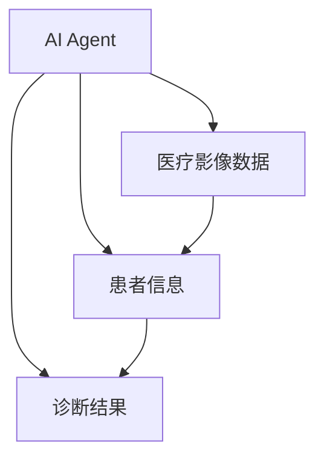

                 

# AI Agent在智能医疗影像分析中的角色

## 关键词：
AI Agent, 智能医疗, 影像分析, 人工智能, 医疗影像

## 摘要：
本文探讨了AI Agent在智能医疗影像分析中的角色，从背景、核心概念到算法原理、系统架构、项目实战等多方面进行详细分析，结合实际案例和代码示例，深入解析AI Agent在医疗影像分析中的应用潜力和未来发展方向。

---

# 第1章: AI Agent与智能医疗影像分析概述

## 1.1 AI Agent的基本概念
### 1.1.1 AI Agent的定义与特点
AI Agent（人工智能代理）是指能够感知环境、自主决策并执行任务的智能体。它具备以下特点：
- **自主性**：无需外部干预，自主完成任务。
- **反应性**：能够实时感知环境变化并做出反应。
- **目标导向**：基于目标驱动行为。
- **学习能力**：通过数据和经验不断优化性能。

### 1.1.2 AI Agent在医疗领域的应用潜力
医疗领域是AI Agent的重要应用场景，尤其是在影像分析方面，AI Agent能够辅助医生快速、准确地诊断疾病。

### 1.1.3 医疗影像分析的现状与挑战
- **现状**：传统医疗影像分析依赖人工操作，效率低且易受主观因素影响。
- **挑战**：影像数据量大、复杂度高，需要高效、智能的解决方案。

---

## 1.2 智能医疗影像分析的背景
### 1.2.1 医疗影像分析的重要性
医疗影像分析是诊断疾病的重要手段，能够帮助医生快速识别病变区域。

### 1.2.2 传统医疗影像分析的局限性
- **效率低**：人工分析耗时长，容易出错。
- **一致性差**：不同医生的诊断结果可能不一致。

### 1.2.3 AI技术在医疗影像分析中的优势
- **高效性**：AI能够快速处理大量影像数据。
- **准确性**：通过深度学习模型，AI能够提高诊断的准确性。

---

## 1.3 AI Agent在医疗影像分析中的角色
### 1.3.1 AI Agent的核心功能与作用
- **数据处理**：AI Agent能够高效处理医疗影像数据。
- **智能诊断**：基于深度学习模型，AI Agent能够辅助医生进行诊断。
- **结果解释**：AI Agent能够生成易于理解的诊断结果。

### 1.3.2 AI Agent与传统医疗影像分析的区别
- **效率**：AI Agent处理影像数据的速度远快于人工。
- **准确性**：AI Agent的诊断结果更加客观和准确。

### 1.3.3 AI Agent在医疗影像分析中的应用场景
- **疾病诊断**：如肺癌、乳腺癌的早期筛查。
- **影像分割**：AI Agent能够精确定位病变区域。
- **治疗方案推荐**：基于影像分析结果，AI Agent可以辅助制定个性化治疗方案。

---

## 1.4 本章小结
本章介绍了AI Agent的基本概念及其在医疗影像分析中的重要性。AI Agent通过高效、准确的影像分析，能够显著提升医疗诊断的效率和准确性。

---

# 第2章: AI Agent的核心概念与联系

## 2.1 AI Agent的核心原理
### 2.1.1 AI Agent的感知模块
AI Agent通过感知模块获取医疗影像数据，例如X光片、CT扫描等。

### 2.1.2 AI Agent的决策模块
基于感知到的数据，AI Agent利用深度学习模型进行分析和诊断。

### 2.1.3 AI Agent的执行模块
AI Agent根据诊断结果生成报告或向医生发出预警。

---

## 2.2 AI Agent与医疗影像分析的关系
### 2.2.1 医疗影像分析的流程与关键环节
1. **数据采集**：获取患者的影像数据。
2. **数据预处理**：对影像数据进行标准化处理。
3. **模型训练**：基于标注数据训练深度学习模型。
4. **模型推理**：利用训练好的模型进行影像分析。
5. **结果解释**：生成易于理解的诊断报告。

### 2.2.2 AI Agent在医疗影像分析中的具体应用
- **疾病检测**：如肺癌筛查、乳腺癌早期检测。
- **影像分割**：精确定位病变区域。
- **诊断报告生成**：AI Agent能够自动生成诊断报告。

### 2.2.3 AI Agent与医疗影像数据的交互方式
AI Agent通过API接口与医疗影像系统进行交互，获取数据并返回诊断结果。

---

## 2.3 AI Agent的核心概念对比表
| 概念 | 特性 | 传统方法 | AI Agent方法 |
|------|------|----------|--------------|
| 数据处理 | 效率 | 低效 | 高效 |
| 决策 | 准确性 | 低 | 高 |
| 学习能力 | 自适应性 | 无 | 有 |

---

## 2.4 AI Agent的实体关系图

---

## 2.5 本章小结
本章详细介绍了AI Agent的核心原理及其在医疗影像分析中的具体应用，通过对比表和实体关系图进一步明确了AI Agent的优势和作用。

---

接下来将按照目录继续撰写后续章节，涵盖算法原理、系统架构、项目实战等内容，确保文章结构完整、内容详实。

