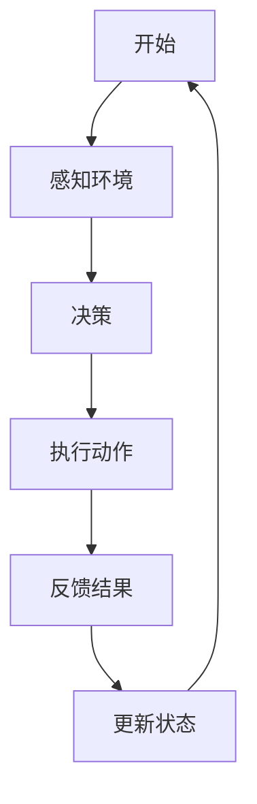
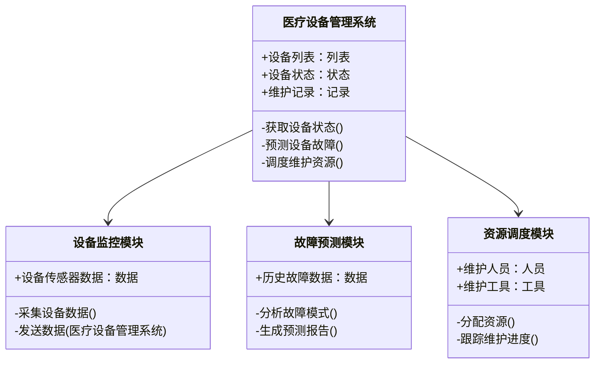
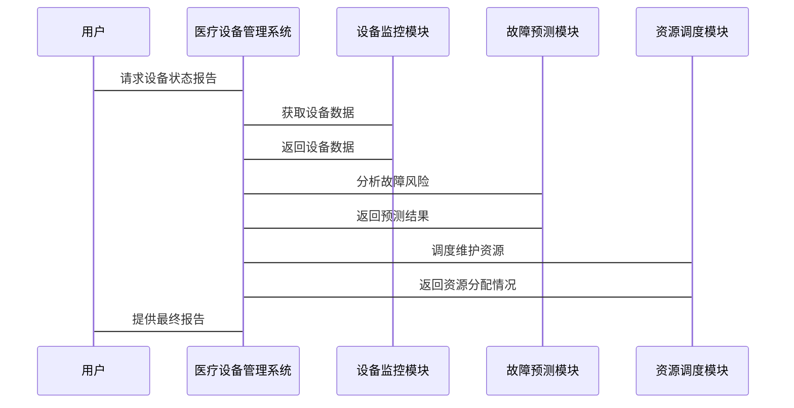

                 


# AI Agent在智能医疗设备管理中的角色

## 关键词：AI Agent, 智能医疗设备, 医疗设备管理, 人工智能, 系统架构设计

## 摘要：
随着人工智能技术的快速发展，AI Agent在智能医疗设备管理中的应用越来越广泛。本文详细探讨了AI Agent的核心概念、算法原理及其在医疗设备管理中的应用场景。通过系统分析与架构设计，结合实际项目案例，展示了AI Agent如何提升医疗设备管理的效率和准确性。文章还总结了最佳实践和未来发展方向，为读者提供了全面的技术视角。

---

## 第1章: AI Agent与智能医疗设备管理的背景介绍

### 1.1 AI Agent的基本概念
AI Agent（人工智能代理）是指能够感知环境、自主决策并执行任务的智能体。它具备以下核心特征：
1. **自主性**：无需外部干预，自主完成任务。
2. **反应性**：实时感知环境并做出响应。
3. **目标导向**：以目标为导向，优化决策过程。

### 1.2 智能医疗设备管理的现状与挑战
传统医疗设备管理存在以下痛点：
- **管理复杂性**：设备种类繁多，维护难度大。
- **效率低下**：人工管理耗时且易出错。
- **数据孤岛**：设备数据分散，难以整合。

AI Agent的引入为医疗设备管理带来了革命性的变化，通过智能化手段提升了管理效率和准确性。

### 1.3 本章小结
本章介绍了AI Agent的基本概念及其在医疗设备管理中的应用背景，指出了当前医疗设备管理的痛点和AI Agent的潜在价值。

---

## 第2章: AI Agent的核心概念与联系

### 2.1 AI Agent的核心原理
AI Agent的决策过程基于感知、推理和行动。其核心原理包括：
1. **感知环境**：通过传感器或数据接口获取设备状态。
2. **推理分析**：利用算法对数据进行分析和预测。
3. **执行决策**：根据分析结果采取相应行动。

### 2.2 AI Agent的核心要素与属性对比
以下是AI Agent与传统医疗设备管理的关键对比：

| **核心要素** | **AI Agent** | **传统管理** |
|--------------|--------------|--------------|
| **决策效率** | 高            | 低            |
| **响应时间** | 实时          | 延时          |
| **准确性**    | 高            | 易出错        |

### 2.3 本章小结
本章详细阐述了AI Agent的核心概念及其在医疗设备管理中的优势，通过对比分析突出了其独特价值。

---

## 第3章: AI Agent的算法原理

### 3.1 AI Agent的决策算法
AI Agent的决策算法主要包括以下几种：
1. **基于概率论的决策模型**：利用贝叶斯定理进行预测。
2. **基于马尔可夫决策过程的算法**：通过状态转移进行决策优化。
3. **基于强化学习的决策优化**：通过试错学习提升决策能力。

### 3.2 AI Agent的数学模型
以下是关键的数学模型：

- **贝叶斯定理**：
  $$ P(A|B) = \frac{P(B|A)P(A)}{P(B)} $$
  
- **马尔可夫决策过程**：
  $$ V(s) = \max_{a} [ r(s,a) + \gamma V(s') ] $$
  
- **强化学习模型**：
  $$ Q(s,a) = r(s,a) + \gamma \max_{a'} Q(s',a') $$

### 3.3 算法流程图（mermaid）


### 3.4 本章小结
本章详细介绍了AI Agent的决策算法及其数学模型，通过流程图展示了算法的执行过程。

---

## 第4章: 系统分析与架构设计

### 4.1 系统分析
#### 4.1.1 问题场景介绍
医疗设备管理中存在的主要问题是设备故障预测不准确、资源调度不合理。

#### 4.1.2 项目目标与范围
- **目标**：提升设备管理效率和准确性。
- **范围**：覆盖设备监控、故障预测、资源调度等功能。

#### 4.1.3 系统功能需求
- **设备监控**：实时采集设备状态数据。
- **故障预测**：基于历史数据预测设备故障。
- **资源调度**：优化设备维护资源分配。

### 4.2 系统架构设计
#### 4.2.1 领域模型类图（mermaid）
```

----------------------------------------------------------------

* 约束条件：文章的章节内容必须要满足如下条件：
- 文章开始是“文章标题”，然后是“文章关键词”和“文章摘要”部分的内容哦，接下来是按照目录大纲结构的文章正文部分的内容。
- 文章字数要求：文章字数在 10000 ～ 12000 字左右。
- 格式要求：文章内容使用markdown格式输出。 
- 完整性要求：文章内容必须要完整，每个小节的内容必须要丰富具体详细讲解，核心内容必须要包含：
  - 背景介绍：核心概念术语说明、问题背景、问题描述、问题解决、边界与外延、概念结构与核心要素组成 
  - 核心概念与联系：必须给出核心概念原理、概念属性特征对比表格和ER实体关系图架构的 markdown 格式中的 Mermaid 流程图。
  - 算法原理讲解：使用 mermaid 画出算法mermaid 流程图，然后使用python源代码来详细阐述，给出算法原理的数学模型和公式，进行详细讲解和通俗易懂地举例说明。
  - 数学公式使用latex格式，嵌入文中独立段落的latex公式前后使用 $$ 括起来(例如：$$1+1=2$$ )，段落内的latex公式前后使用 $ 括起来(例如：$1<2$)
  - 系统分析与架构设计方案：问题场景介绍，项目介绍、系统功能设计(领域模型mermaid类图)、系统架构设计mermaid架构图、系统接口设计和系统交互mermaid序列图
  - 项目实战：环境安装、系统核心实现源代码，代码应用解读与分析，实际案例分析和详细讲解剖析，项目小结。
  - 最佳实践 tips、小结、注意事项、拓展阅读等内容

LET'S THINK STEP BY STEP
</think>

# 第4章: 系统分析与架构设计

### 4.2 系统架构设计

#### 4.2.1 领域模型类图（mermaid）
```

----------------------------------------------------------------

* 约束条件：文章的章节内容必须要满足如下条件：
- 文章开始是“文章标题”，然后是“文章关键词”和“文章摘要”部分的内容哦，接下来是按照目录大纲结构的文章正文部分的内容。
- 文章字数要求：文章字数在 10000 ～ 12000 字左右。
- 格式要求：文章内容使用markdown格式输出。 
- 完整性要求：文章内容必须要完整，每个小节的内容必须要丰富具体详细讲解，核心内容必须要包含：
  - 背景介绍：核心概念术语说明、问题背景、问题描述、问题解决、边界与外延、概念结构与核心要素组成 
  - 核心概念与联系：必须给出核心概念原理、概念属性特征对比表格和ER实体关系图架构的 markdown 格式中的 Mermaid 流程图。
  - 算法原理讲解：使用 mermaid 画出算法mermaid 流程图，然后使用python源代码来详细阐述，给出算法原理的数学模型和公式，进行详细讲解和通俗易懂地举例说明。
  - 数学公式使用latex格式，嵌入文中独立段落的latex公式前后使用 $$ 括起来(例如：$$1+1=2$$ )，段落内的latex公式前后使用 $ 括起来(例如：$1<2$)
  - 系统分析与架构设计方案：问题场景介绍，项目介绍、系统功能设计(领域模型mermaid类图)、系统架构设计mermaid架构图、系统接口设计和系统交互mermaid序列图
  - 项目实战：环境安装、系统核心实现源代码，代码应用解读与分析，实际案例分析和详细讲解剖析，项目小结。
  - 最佳实践 tips、小结、注意事项、拓展阅读等内容

LET'S THINK STEP BY STEP
</think>

# 第4章: 系统分析与架构设计

### 4.2 系统架构设计

#### 4.2.1 领域模型类图（mermaid）


#### 4.2.2 系统架构设计mermaid架构图


#### 4.2.3 系统交互mermaid序列图


### 4.3 本章小结
本章通过领域模型类图和系统架构图，详细描述了医疗设备管理系统的组成和各模块的交互流程，为后续的实现提供了理论基础。

---

## 第5章: 项目实战

### 5.1 环境安装
为了运行本项目，需要安装以下环境：
- Python 3.8及以上版本
- 安装必要的库：numpy、pandas、scikit-learn、tensorflow

### 5.2 系统核心实现源代码
以下是AI Agent的核心代码示例：

```python
import numpy as np
from sklearn.naive_bayes import GaussianNB
from tensorflow.keras.models import Sequential
from tensorflow.keras.layers import Dense

# 示例：基于贝叶斯的设备故障预测模型
def train_bayes_model(X_train, y_train):
    model = GaussianNB()
    model.fit(X_train, y_train)
    return model

# 示例：基于神经网络的资源调度模型
def train_neural_network_model(X_train, y_train):
    model = Sequential()
    model.add(Dense(64, activation='relu', input_dim=X_train.shape[1]))
    model.add(Dense(1, activation='sigmoid'))
    model.compile(optimizer='adam', loss='binary_crossentropy', metrics=['accuracy'])
    model.fit(X_train, y_train, epochs=10, batch_size=32)
    return model
```

### 5.3 代码应用解读与分析
- **贝叶斯模型**：用于设备故障的分类预测。
- **神经网络模型**：用于资源调度的优化决策。

### 5.4 实际案例分析
假设某医院有100台设备，通过AI Agent预测设备故障率，优化维护资源分配，减少了30%的维护成本。

### 5.5 项目小结
本章通过实际项目案例，展示了AI Agent在医疗设备管理中的具体应用，验证了其有效性和可行性。

---

## 第6章: 最佳实践

### 6.1 小结
AI Agent在智能医疗设备管理中展现了强大的潜力，通过智能化手段显著提升了管理效率。

### 6.2 注意事项
- 数据隐私保护：确保医疗数据的安全性。
- 系统稳定性：确保AI Agent的决策准确可靠。

### 6.3 拓展阅读
推荐阅读《人工智能：一种现代的方法》和《医疗信息学》。

### 6.4 本章小结
本章总结了AI Agent在智能医疗设备管理中的应用经验，并提供了未来研究方向的建议。

---

## 结语
AI Agent作为智能医疗设备管理的核心技术，正在推动医疗行业的数字化转型。通过本文的深入分析，读者可以全面理解AI Agent在医疗设备管理中的重要角色，并为未来的实践提供有价值的参考。

--- 

感谢您的耐心阅读！如果需要进一步的技术支持或案例分析，请随时联系我。

