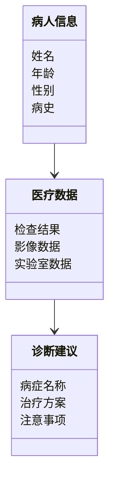
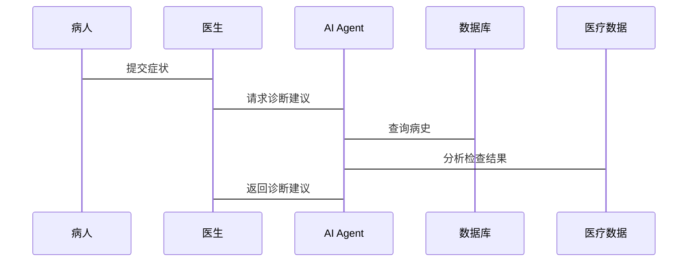

                 


# AI Agent在智能医疗诊断中的角色

> 关键词：AI Agent，智能医疗，医疗诊断，机器学习，自然语言处理

> 摘要：本文探讨AI Agent在智能医疗诊断中的角色，分析其技术基础、算法原理、系统架构设计及项目实战。通过详细讲解，展示AI Agent如何提升医疗诊断的效率和准确性，帮助医生做出更精准的诊断决策。

---

## 第一部分: AI Agent在智能医疗诊断中的背景与核心概念

### 第1章: AI Agent与智能医疗诊断的背景介绍

#### 1.1 AI Agent的基本概念

##### 1.1.1 AI Agent的定义
AI Agent（人工智能代理）是指能够感知环境、执行任务并做出决策的智能实体。它通过处理数据和信息，能够自主地完成特定目标。

##### 1.1.2 AI Agent的核心特征
- **自主性**：无需外部干预，自主决策。
- **反应性**：能实时感知环境变化并做出反应。
- **学习能力**：通过数据和经验不断优化自身性能。

##### 1.1.3 AI Agent与传统医疗诊断的区别
传统医疗诊断主要依赖医生的经验和知识，而AI Agent能够通过大数据分析和机器学习算法辅助诊断，提高效率和准确性。

#### 1.2 智能医疗诊断的发展历程

##### 1.2.1 医疗诊断的数字化转型
随着信息技术的发展，医疗数据从纸质记录逐渐转向电子化，为AI Agent的应用奠定了基础。

##### 1.2.2 AI技术在医疗诊断中的应用现状
AI技术在医学影像分析、疾病预测、药物研发等领域得到广泛应用，AI Agent在其中扮演着越来越重要的角色。

##### 1.2.3 AI Agent在医疗诊断中的角色定位
AI Agent作为辅助工具，帮助医生快速分析数据、提供诊断建议，并在某些情况下实现自动化诊断。

#### 1.3 医疗诊断中的问题与挑战

##### 1.3.1 医疗数据的复杂性
医疗数据包括影像、病历、基因信息等多种类型，数据量大且复杂，对AI Agent的数据处理能力提出更高要求。

##### 1.3.2 诊断过程中的不确定性
医学诊断涉及复杂的判断，AI Agent需要具备处理不确定性和模糊信息的能力。

##### 1.3.3 医疗AI系统的伦理与法律问题
AI Agent的决策可能涉及伦理和法律问题，如何确保其决策的透明性和可解释性是关键挑战。

#### 1.4 本章小结
本章介绍了AI Agent的基本概念及其在智能医疗诊断中的角色定位，分析了当前医疗诊断中的主要问题和挑战。

### 第2章: AI Agent的核心概念与原理

#### 2.1 AI Agent的定义与分类

##### 2.1.1 AI Agent的定义
AI Agent通过感知环境、处理信息并执行任务，帮助用户实现特定目标。

##### 2.1.2 AI Agent的分类
- **基于规则的AI Agent**：通过预定义的规则进行推理和决策。
- **基于模型的AI Agent**：利用机器学习模型进行数据驱动的决策。

##### 2.1.3 不同类型AI Agent的特点对比
| 类型          | 特点                          |
|---------------|-------------------------------|
| 基于规则的    | 易实现，但灵活性较低           |
| 基于模型的    | 更灵活，但需要大量数据训练     |

#### 2.2 AI Agent的工作原理

##### 2.2.1 数据输入与处理
AI Agent接收医疗数据，进行清洗、预处理和特征提取。

##### 2.2.2 知识表示与推理
通过知识图谱或机器学习模型，AI Agent进行推理和关联分析。

##### 2.2.3 决策与输出
根据推理结果生成诊断建议或行动计划，并输出给用户。

#### 2.3 AI Agent在医疗诊断中的应用原理

##### 2.3.1 医疗数据的处理与分析
AI Agent对医疗数据进行结构化处理，提取关键特征用于诊断。

##### 2.3.2 病症推理与诊断建议
基于机器学习模型，AI Agent分析症状、病史和检查结果，生成诊断建议。

##### 2.3.3 诊断结果的验证与优化
通过反馈机制不断优化AI Agent的诊断模型，提高准确性。

#### 2.4 本章小结
本章详细讲解了AI Agent的核心概念和工作原理，并分析了其在医疗诊断中的具体应用。

---

## 第二部分: 技术基础与算法原理

### 第3章: 机器学习与自然语言处理技术

#### 3.1 机器学习技术

##### 3.1.1 机器学习的基础知识
机器学习是AI Agent的重要技术基础，通过数据训练模型进行预测和分类。

##### 3.1.2 常用机器学习算法
- **决策树**：通过特征分裂进行分类。
- **随机森林**：集成多个决策树提高准确性。
- **支持向量机**：用于分类和回归任务。

##### 3.1.3 机器学习在医疗诊断中的应用
例如，使用随机森林算法分析病人的症状和检查结果，辅助诊断疾病。

#### 3.2 自然语言处理技术

##### 3.2.1 自然语言处理的基础知识
NLP技术用于处理和理解医疗文档中的文本信息。

##### 3.2.2 常用NLP算法
- **分词**：将文本分割成词语。
- **实体识别**：识别文本中的医学实体。
- **情感分析**：分析文本中的情感倾向。

##### 3.2.3 NLP在医疗诊断中的应用
例如，通过NLP技术分析病人的病历文本，提取关键信息辅助诊断。

#### 3.3 本章小结
本章介绍了机器学习和自然语言处理技术的基本原理及其在医疗诊断中的应用。

### 第4章: 常用算法原理与实现

#### 4.1 决策树算法

##### 4.1.1 决策树的定义
决策树是一种树状结构，用于分类和回归任务。

##### 4.1.2 决策树的构建过程
通过特征选择和分裂策略构建决策树。

##### 4.1.3 决策树的实现
使用Python的scikit-learn库实现决策树分类器。

```python
from sklearn.tree import DecisionTreeClassifier
from sklearn.model_selection import train_test_split
from sklearn.metrics import accuracy_score

# 数据预处理
X = df.drop('target', axis=1)
y = df['target']

# 划分训练集和测试集
X_train, X_test, y_train, y_test = train_test_split(X, y, test_size=0.3)

# 训练决策树模型
model = DecisionTreeClassifier()
model.fit(X_train, y_train)

# 预测和评估
y_pred = model.predict(X_test)
print("Accuracy:", accuracy_score(y_test, y_pred))
```

#### 4.2 支持向量机算法

##### 4.2.1 SVM的定义
支持向量机是一种监督学习算法，用于分类和回归任务。

##### 4.2.2 SVM的数学模型
$$\text{损失函数} = \sum_{i=1}^{n} (y_i - \hat{y_i})^2$$

##### 4.2.3 SVM的实现
使用scikit-learn库实现SVM分类器。

```python
from sklearn import svm

# 训练SVM模型
model = svm.SVC()
model.fit(X_train, y_train)

# 预测和评估
y_pred = model.predict(X_test)
print("Accuracy:", accuracy_score(y_test, y_pred))
```

#### 4.3 卷积神经网络

##### 4.3.1 CNN的定义
卷积神经网络是一种深度学习算法，常用于图像处理任务。

##### 4.3.2 CNN的数学模型
$$\text{卷积操作} = \sum_{i=1}^{k} w_i \cdot x_i$$

##### 4.3.3 CNN的实现
使用Keras框架实现CNN模型。

```python
from tensorflow.keras import layers
from tensorflow.keras import Model

# 定义CNN模型
def create_model():
    inputs = layers.Input(shape=(img_size, img_size, 3))
    x = layers.Conv2D(32, (3,3), activation='relu')(inputs)
    x = layers.MaxPooling2D((2,2))(x)
    x = layers.Conv2D(64, (3,3), activation='relu')(x)
    x = layers.MaxPooling2D((2,2))(x)
    x = layers.Flatten()(x)
    x = layers.Dense(128, activation='relu')(x)
    outputs = layers.Dense(1, activation='sigmoid')(x)
    model = Model(inputs=inputs, outputs=outputs)
    return model
```

#### 4.4 本章小结
本章详细讲解了常用的机器学习算法，包括决策树、支持向量机和卷积神经网络，并提供了相应的代码实现。

---

## 第三部分: 系统架构与设计

### 第5章: 系统架构设计

#### 5.1 问题场景介绍
医疗诊断系统需要处理大量医疗数据，实现快速、准确的诊断。

#### 5.2 系统功能设计

##### 5.2.1 领域模型


#### 5.3 系统架构设计

##### 5.3.1 系统架构图


#### 5.4 接口设计

##### 5.4.1 系统交互流程


#### 5.5 本章小结
本章通过mermaid图展示了系统架构设计和交互流程，为后续实现奠定了基础。

---

## 第四部分: 项目实战

### 第6章: 项目实战

#### 6.1 环境安装
安装必要的Python库，如scikit-learn、tensorflow、mermaid等。

#### 6.2 系统核心实现

##### 6.2.1 数据预处理
清洗和标注医疗数据，提取特征。

##### 6.2.2 模型训练
使用训练数据训练AI Agent的诊断模型。

##### 6.2.3 结果分析
评估模型性能，优化诊断算法。

#### 6.3 案例分析
通过具体案例展示AI Agent在医疗诊断中的实际应用。

#### 6.4 本章小结
本章通过实际项目展示了AI Agent在医疗诊断中的具体实现过程。

---

## 第五部分: 最佳实践与总结

### 第7章: 最佳实践与总结

#### 7.1 小结
总结本文的主要内容，强调AI Agent在智能医疗诊断中的重要作用。

#### 7.2 注意事项
在实际应用中，需要注意数据隐私、模型可解释性等问题。

#### 7.3 拓展阅读
推荐相关的技术书籍和论文，供读者深入学习。

#### 7.4 未来展望
展望AI Agent在医疗诊断中的未来发展方向。

---

# 结语
AI Agent作为智能医疗诊断的核心技术，正在推动医疗行业向更高效、更精准的方向发展。通过本文的详细讲解，希望读者能够更好地理解AI Agent的技术原理和应用价值。

