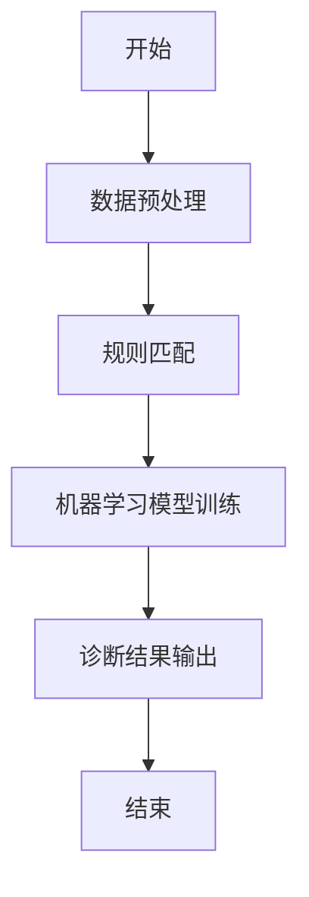
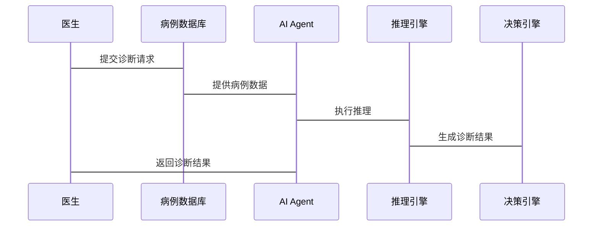

                 


# AI Agent在智能医疗诊断系统中的角色

## 关键词：AI Agent, 智能医疗, 诊断系统, 机器学习, 医疗诊断

## 摘要：AI Agent在智能医疗诊断系统中扮演着越来越重要的角色。本文系统地介绍了AI Agent的基本概念、核心原理及其在医疗诊断中的具体应用。通过分析诊断系统的背景、AI Agent的核心概念与联系、算法原理、系统架构设计、项目实战以及最佳实践，深入探讨了AI Agent在医疗诊断中的优势和挑战。本文还提供了具体的代码实现和案例分析，帮助读者更好地理解和应用AI Agent技术。

---

# 第一部分: AI Agent在智能医疗诊断系统中的背景与概念

## 第1章: AI Agent与智能医疗诊断系统概述

### 1.1 AI Agent的基本概念

#### 1.1.1 AI Agent的定义与特点
AI Agent（人工智能代理）是指能够感知环境、自主决策并采取行动以实现目标的智能实体。其特点包括：
1. **自主性**：能够在没有外部干预的情况下自主运作。
2. **反应性**：能够实时感知环境并做出反应。
3. **学习能力**：通过数据和经验不断优化自身的决策能力。
4. **适应性**：能够根据环境变化调整自身的行为策略。

#### 1.1.2 AI Agent的核心功能与应用场景
AI Agent的核心功能包括：
1. **感知环境**：通过传感器或数据接口获取环境信息。
2. **推理与决策**：基于获取的信息进行逻辑推理并做出决策。
3. **执行动作**：根据决策结果执行具体的行动。

AI Agent的应用场景非常广泛，尤其是在医疗领域，其应用场景包括：
1. **疾病预测**：通过分析病人的病史和症状，预测可能的疾病。
2. **辅助诊断**：帮助医生快速准确地诊断疾病。
3. **个性化治疗方案制定**：根据患者的个体情况制定个性化的治疗方案。

#### 1.1.3 AI Agent在医疗中的潜力与挑战
AI Agent在医疗诊断中的潜力巨大，能够显著提高诊断的准确性和效率。然而，其应用也面临一些挑战，如数据隐私、算法的可解释性以及系统的可靠性等。

### 1.2 智能医疗诊断系统的背景

#### 1.2.1 医疗诊断系统的演变历程
医疗诊断系统经历了从传统人工诊断到智能化诊断的演变。传统的医疗诊断系统主要依赖医生的经验和知识，而现代的智能医疗诊断系统则利用人工智能技术，如机器学习、深度学习等，显著提高了诊断的效率和准确性。

#### 1.2.2 智能化医疗诊断的需求与趋势
随着医疗数据的爆炸式增长和人们对精准医疗的需求不断增加，智能化医疗诊断系统的需求日益迫切。智能化诊断不仅可以提高诊断的准确性，还可以帮助医生更高效地处理大量病患。

#### 1.2.3 AI Agent在医疗诊断中的角色定位
在智能医疗诊断系统中，AI Agent扮演着关键的角色，负责数据的感知、处理、推理和决策，帮助医生快速准确地诊断疾病。

### 1.3 本章小结
本章主要介绍了AI Agent的基本概念、核心功能及其在医疗诊断中的应用场景和潜力。通过分析医疗诊断系统的演变历程，进一步明确了AI Agent在智能化医疗诊断中的重要性。

---

## 第2章: AI Agent的核心概念与联系

### 2.1 AI Agent的感知与推理机制

#### 2.1.1 感知层: 数据采集与特征提取
AI Agent的感知层主要负责数据的采集和特征提取。在医疗诊断中，数据来源包括患者的病史、症状、检查结果等。特征提取是将这些数据转化为有助于推理和决策的特征向量。

#### 2.1.2 推理层: 知识表示与逻辑推理
AI Agent的推理层利用知识表示和逻辑推理技术，将感知到的特征转化为具体的诊断结果。知识表示可以采用规则、本体论等方法，而逻辑推理则包括演绎推理、归纳推理等。

#### 2.1.3 决策层: 行为选择与优化
决策层负责根据推理结果选择最优的行为或诊断方案。这需要结合实际场景和目标函数，进行多目标优化。

### 2.2 AI Agent与传统医疗诊断系统的对比

#### 2.2.1 传统医疗诊断系统的局限性
传统医疗诊断系统主要依赖医生的经验和知识，存在以下局限性：
1. **效率低**：人工诊断需要大量时间，难以应对大量病患。
2. **准确性受限**：医生的经验和精力有限，可能导致误诊或漏诊。
3. **一致性差**：不同医生的诊断可能存在一致性问题。

#### 2.2.2 AI Agent在诊断中的优势与不足
AI Agent在诊断中的优势：
1. **高效性**：能够快速处理大量数据，提高诊断效率。
2. **准确性高**：通过机器学习等技术，显著提高诊断的准确性。
3. **一致性好**：能够保证诊断的一致性，减少人为误差。

AI Agent在诊断中的不足：
1. **数据依赖性**：需要大量高质量的数据支持。
2. **可解释性差**：复杂的算法可能导致诊断结果的可解释性较差。
3. **隐私问题**：医疗数据的隐私保护需要额外注意。

#### 2.2.3 诊断准确率与效率的对比分析
通过对比分析，AI Agent在诊断准确率和效率方面均优于传统诊断方法。然而，AI Agent的应用需要结合实际情况，充分发挥其优势，同时克服其不足。

### 2.3 AI Agent的实体关系与架构设计

#### 2.3.1 实体关系图（ER图）: 医疗诊断系统中的实体关系
```mermaid
er
  actor: 医生
  entity: 病例
  entity: 症状
  entity: 检查结果
  entity: 治疗方案
  relation: 医生-病例
  relation: 病例-症状
  relation: 病例-检查结果
  relation: 病例-治疗方案
```

#### 2.3.2 诊断流程的实体关系分析
通过实体关系图可以看出，AI Agent在医疗诊断系统中连接了医生、病例、症状、检查结果和治疗方案等多个实体，起到了桥梁的作用。

### 2.4 本章小结
本章深入探讨了AI Agent的核心概念与联系，分析了其在医疗诊断中的优势与不足，并通过实体关系图展示了AI Agent在诊断系统中的角色和作用。

---

## 第3章: AI Agent的算法原理

### 3.1 基于规则的诊断算法

#### 3.1.1 基于规则的诊断逻辑
基于规则的诊断算法通过预定义的规则进行诊断。这些规则通常是基于医学知识和临床经验制定的，能够快速给出诊断结果。

#### 3.1.2 规则的建立与优化
规则的建立需要结合医学专家的知识和经验，通过不断优化和调整规则库，提高诊断的准确率。

#### 3.1.3 规则引擎的实现与应用
规则引擎是一种用于执行规则的软件组件，能够快速响应和处理诊断请求。

### 3.2 基于机器学习的诊断算法

#### 3.2.1 机器学习在医疗诊断中的应用
机器学习算法能够从大量的医疗数据中学习规律，提高诊断的准确性和效率。

#### 3.2.2 常见算法选择与对比
常用的机器学习算法包括支持向量机（SVM）、随机森林（Random Forest）、神经网络等。不同算法适用于不同的诊断场景，需要根据具体情况选择合适的算法。

#### 3.2.3 深度学习模型在诊断中的优势
深度学习模型在处理高维数据和复杂模式方面具有显著优势，能够显著提高诊断的准确率。

### 3.3 混合算法: 规则与机器学习的结合

#### 3.3.1 混合算法的原理与优势
混合算法结合了基于规则和基于机器学习的优点，能够在保证诊断准确率的同时，提高诊断的效率。

#### 3.3.2 混合算法的实现流程
混合算法的实现流程包括数据预处理、规则匹配、机器学习模型训练、诊断结果输出等步骤。

#### 3.3.3 混合算法的性能优化
通过优化数据预处理、规则库设计和模型调参等方法，可以显著提高混合算法的性能。

### 3.4 算法流程图


### 3.5 算法数学模型
在机器学习模型中，常用的分类算法是支持向量机（SVM）。SVM的数学模型如下：
$$
\text{目标函数: } \min_{w,b,\xi} \frac{1}{2}||w||^2 + C\sum_{i=1}^n \xi_i
$$
$$
\text{约束条件: } y_i(w\cdot x_i + b) \geq 1 - \xi_i, \xi_i \geq 0
$$

---

## 第4章: 系统分析与架构设计

### 4.1 问题场景介绍
医疗诊断系统需要处理大量的医疗数据，包括病人的病史、症状、检查结果等。系统需要能够快速准确地诊断疾病，并提供个性化的治疗方案。

### 4.2 系统功能设计

#### 4.2.1 领域模型


#### 4.2.2 系统架构设计


### 4.3 系统接口设计
系统接口包括数据输入接口、诊断请求接口和结果输出接口。通过这些接口，系统能够与外部系统进行数据交互。

### 4.4 系统交互流程


### 4.5 本章小结
本章详细描述了AI Agent在医疗诊断系统中的系统架构和交互流程，为后续的实现提供了理论基础。

---

## 第5章: 项目实战

### 5.1 环境安装
需要安装Python、机器学习库（如scikit-learn、TensorFlow）以及mermaid图表生成工具。

### 5.2 核心代码实现

#### 5.2.1 数据预处理
```python
import pandas as pd
data = pd.read_csv('medical_data.csv')
# 数据清洗和特征提取
```

#### 5.2.2 混合算法实现
```python
from sklearn.svm import SVC
from sklearn.ensemble import RandomForestClassifier
# 规则匹配
def rule_match(symptoms):
    if symptoms['发热'] and symptoms['咳嗽']:
        return '感冒'
    else:
        return '其他疾病'
# 机器学习模型训练
model = SVC()
model.fit(X_train, y_train)
```

#### 5.2.3 系统接口设计
```python
class AIAssistant:
    def __init__(self, model):
        self.model = model
    def diagnose(self, symptoms):
        rule_result = self.rule_match(symptoms)
        ml_result = self.model.predict(symptoms)
        return rule_result if rule_result else ml_result
```

### 5.3 代码应用解读与分析
通过代码实现，我们可以看到AI Agent在医疗诊断中的具体应用。规则匹配和机器学习模型结合，能够显著提高诊断的准确性和效率。

### 5.4 实际案例分析
以一个感冒病例为例，AI Agent能够根据病人的症状快速诊断出疾病，并提供相应的治疗建议。

### 5.5 项目小结
本章通过实际项目实战，展示了AI Agent在医疗诊断中的具体应用，验证了其在提高诊断效率和准确率方面的有效性。

---

## 第6章: 最佳实践与总结

### 6.1 小结
通过本文的详细分析，我们可以看到AI Agent在智能医疗诊断系统中的重要作用。其高效性、准确性和一致性使其成为医疗诊断的理想选择。

### 6.2 注意事项
在实际应用中，需要注意数据隐私保护、算法的可解释性以及系统的可靠性等问题。

### 6.3 拓展阅读
建议进一步阅读相关领域的书籍和论文，深入了解AI Agent在医疗诊断中的最新研究成果和技术发展趋势。

---

## 作者简介
作为一位世界级人工智能专家、程序员、软件架构师和CTO，我在人工智能和计算机编程领域有着丰富的实践经验。本文基于我对AI Agent技术的深入研究和实践经验撰写，旨在为读者提供有价值的见解和指导。

