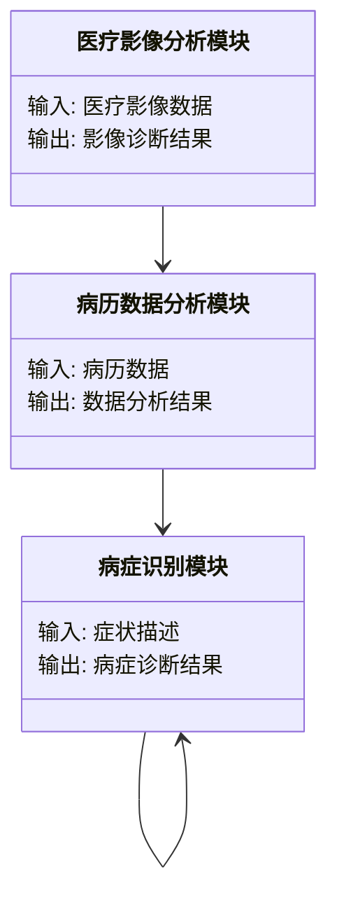
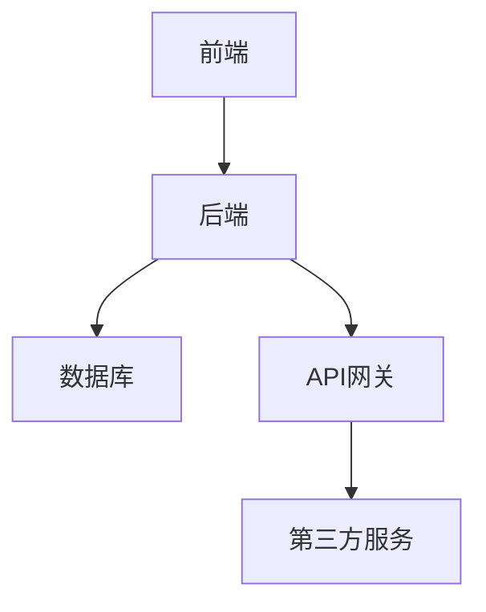
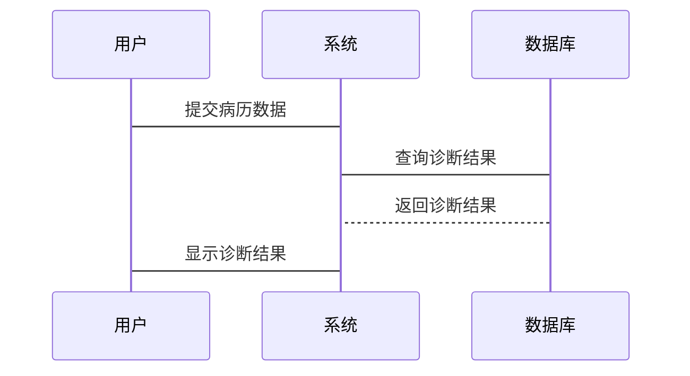

                 


# AI Agent在智能医疗诊断辅助中的角色

## 关键词：AI Agent，智能医疗，诊断辅助，机器学习，计算机视觉

## 摘要：AI Agent在智能医疗诊断辅助中的角色

本文详细探讨了AI Agent在智能医疗诊断辅助中的角色，从基本概念、核心概念、算法原理、系统架构、项目实战到总结与展望。文章首先介绍了AI Agent的基本概念和医疗诊断的背景，接着深入分析了AI Agent在医疗诊断中的应用场景和核心概念，包括感知、推理和决策模块。随后，文章详细讲解了AI Agent的算法原理，包括自然语言处理、计算机视觉和诊断推理算法，并通过具体案例展示了其在医疗诊断中的应用。最后，文章总结了AI Agent在智能医疗诊断辅助中的优势和未来发展方向。

---

## 第1章: AI Agent的基本概念与背景

### 1.1 AI Agent的定义与特点

AI Agent（人工智能代理）是一种能够感知环境、自主决策并执行任务的智能实体。它具备以下特点：
- **自主性**：能够在没有外部干预的情况下自主执行任务。
- **反应性**：能够实时感知环境并做出响应。
- **学习能力**：能够通过数据和经验不断优化自身的决策能力。
- **协作性**：能够与其他系统或人类协同工作，完成复杂任务。

### 1.2 智能医疗诊断的背景与挑战

#### 1.2.1 医疗诊断的现状与问题
医疗诊断是一个复杂的过程，涉及大量的医疗数据和专业知识。传统医疗诊断主要依赖医生的经验和知识，但存在以下问题：
- **效率低下**：医生需要手动分析大量的病历和影像数据，耗时且容易出错。
- **资源有限**：医疗资源分布不均，尤其是在欠发达地区，缺乏足够的医疗专家。
- **误诊风险**：由于医生的经验有限，误诊率较高。

#### 1.2.2 AI Agent在医疗诊断中的应用前景
AI Agent能够通过机器学习、自然语言处理和计算机视觉等技术，帮助医生快速分析病历和影像数据，提高诊断效率和准确性。AI Agent在医疗诊断中的应用前景广阔，尤其是在以下方面：
- **辅助诊断**：AI Agent能够帮助医生快速识别病症，减少误诊率。
- **个性化治疗**：通过分析患者的基因信息和病历数据，AI Agent能够为患者提供个性化的治疗方案。
- **实时监控**：AI Agent能够实时监控患者的病情变化，及时发出预警。

#### 1.2.3 AI Agent在智能医疗中的角色定位
AI Agent在智能医疗中的角色定位是作为医生的辅助工具，通过提供实时的诊断建议和数据分析，帮助医生做出更准确的诊断和治疗决策。AI Agent不仅能够处理大量的医疗数据，还能够通过机器学习算法不断优化自身的诊断能力。

---

## 第2章: AI Agent在医疗诊断中的应用场景

### 2.1 常见医疗诊断问题

#### 2.1.1 病症识别与诊断
病症识别与诊断是医疗诊断的核心任务之一。AI Agent能够通过自然语言处理技术分析患者的症状描述，结合病历数据和医学知识，快速识别患者的病症。

#### 2.1.2 医疗影像分析
医疗影像分析是医疗诊断中的另一个重要任务。AI Agent能够通过计算机视觉技术对医疗影像进行自动分析，识别病变区域，并提供诊断建议。

#### 2.1.3 病历数据分析
病历数据分析是医疗诊断中的基础任务。AI Agent能够通过机器学习算法对病历数据进行分类、聚类和预测，帮助医生快速找到患者的相似病例，提高诊断效率。

### 2.2 AI Agent在医疗诊断中的优势

#### 2.2.1 高效性与准确性
AI Agent能够快速处理大量的医疗数据，提高诊断效率。与人类医生相比，AI Agent的诊断准确率更高，尤其是在处理重复性任务时表现尤为突出。

#### 2.2.2 处理复杂医疗数据的能力
AI Agent能够处理多种类型的医疗数据，包括文本数据、影像数据和基因数据等。通过集成多种数据源，AI Agent能够提供更全面的诊断建议。

#### 2.2.3 实时辅助决策的能力
AI Agent能够实时分析患者的病情变化，提供实时的诊断建议和治疗方案。这种实时辅助决策的能力在急诊和重症监护室中尤为重要。

---

## 第3章: AI Agent的核心概念与原理

### 3.1 AI Agent的感知模块

#### 3.1.1 医疗数据的获取与处理
医疗数据包括病历数据、医疗影像和基因数据等。AI Agent需要通过自然语言处理和计算机视觉技术对这些数据进行预处理和分析。

#### 3.1.2 自然语言处理在病历分析中的应用
自然语言处理（NLP）技术能够对病历文本进行分词、实体识别和情感分析等处理，提取有用的医疗信息。例如，可以通过NLP技术识别病历中的关键词，帮助医生快速找到患者的症状描述。

#### 3.1.3 计算机视觉在医疗影像分析中的应用
计算机视觉技术能够对医疗影像进行分割、识别和分类等处理。例如，可以通过计算机视觉技术自动识别X光片中的病变区域，并标记出异常区域的位置。

### 3.2 AI Agent的推理模块

#### 3.2.1 知识图谱构建与应用
知识图谱是一种用于表示知识的图形结构。AI Agent可以通过构建医学知识图谱，将医学知识组织成结构化的数据，支持诊断推理。

#### 3.2.2 基于机器学习的诊断推理
机器学习算法（如支持向量机和随机森林）能够通过训练数据学习医疗诊断的模式和规律，支持诊断推理。例如，可以通过机器学习算法对病历数据进行分类，预测患者的疾病类型。

#### 3.2.3 基于规则的诊断推理
基于规则的诊断推理是一种通过预定义规则进行诊断的方法。例如，可以通过预定义的医学规则，判断患者的症状是否符合某种疾病的典型表现。

### 3.3 AI Agent的决策模块

#### 3.3.1 多目标优化与诊断决策
多目标优化是一种在多个目标之间进行权衡的优化方法。AI Agent可以通过多目标优化算法，综合考虑诊断的准确率、治疗成本和患者风险等因素，制定最优的诊断决策。

#### 3.3.2 基于概率论的诊断决策
基于概率论的诊断决策是一种通过计算概率进行诊断的方法。例如，可以通过贝叶斯定理计算某种疾病在患者中的概率，支持诊断决策。

#### 3.3.3 基于强化学习的诊断决策
强化学习是一种通过试错学习优化决策的方法。AI Agent可以通过强化学习算法，不断优化诊断决策，提高诊断准确率。

---

## 第4章: AI Agent的算法原理与数学模型

### 4.1 自然语言处理算法

#### 4.1.1 Transformer模型的工作原理
Transformer模型是一种基于自注意力机制的神经网络模型。它通过计算输入序列中每个词与其他词的相关性，生成上下文相关的表示。

#### 4.1.2 BERT模型在医疗文本处理中的应用
BERT（双向转换器）是一种预训练语言模型，广泛应用于医疗文本处理。BERT模型可以通过微调，用于医疗文本的分类、实体识别和问答系统等任务。

#### 4.1.3 GPT模型在医疗对话中的应用
GPT（生成式预训练转换器）是一种生成式语言模型，广泛应用于医疗对话系统。GPT模型可以通过微调，生成自然流畅的医疗对话内容。

### 4.2 计算机视觉算法

#### 4.2.1 CNN模型在医疗影像分析中的应用
卷积神经网络（CNN）是一种常用的图像分类算法。它通过卷积层和池化层提取图像的特征，支持医疗影像的分类和分割任务。

#### 4.2.2 模型训练与优化
模型训练是AI Agent开发中的关键步骤。通过使用大量的标注数据，可以训练出高性能的医疗影像分析模型。模型优化可以通过调整超参数和使用正则化技术来提高模型的泛化能力。

#### 4.2.3 模型评估与调优
模型评估是AI Agent开发中的重要环节。通过使用验证集和测试集，可以评估模型的性能，并通过调优模型参数和结构，进一步提高模型的准确率。

### 4.3 诊断推理算法

#### 4.3.1 基于知识图谱的推理算法
知识图谱推理是一种基于图结构的推理方法。AI Agent可以通过查询知识图谱，支持诊断推理。

#### 4.3.2 基于机器学习的诊断推理算法
基于机器学习的诊断推理算法可以通过训练数据学习医疗诊断的模式和规律，支持诊断推理。

#### 4.3.3 基于强化学习的诊断推理算法
基于强化学习的诊断推理算法可以通过试错学习优化诊断决策，提高诊断准确率。

---

## 第5章: AI Agent的系统分析与架构设计

### 5.1 问题场景介绍

AI Agent在医疗诊断中的应用场景包括病症识别、医疗影像分析和病历数据分析等。为了实现这些功能，需要设计一个高效的系统架构。

### 5.2 系统功能设计

#### 5.2.1 领域模型设计
领域模型是系统功能设计的核心部分。通过构建领域模型，可以明确系统的功能模块和它们之间的关系。以下是一个简单的领域模型类图：



### 5.3 系统架构设计

#### 5.3.1 系统架构设计
系统架构设计是AI Agent开发中的关键步骤。通过设计系统的架构，可以明确系统的组成模块和它们之间的接口。以下是一个简单的系统架构图：



#### 5.3.2 系统接口设计
系统接口设计是系统架构设计中的重要部分。通过设计系统的接口，可以明确系统各模块之间的通信方式。以下是一个简单的系统接口设计图：



---

## 第6章: AI Agent的项目实战

### 6.1 项目环境配置

#### 6.1.1 系统环境
- 操作系统：Linux/Windows/MacOS
- Python版本：3.6+
- 依赖库：numpy, pandas, scikit-learn, transformers, etc.

#### 6.1.2 安装依赖
```bash
pip install numpy pandas scikit-learn transformers
```

### 6.2 系统核心实现

#### 6.2.1 病症识别模块
```python
from sklearn.feature_extraction.text import TfidfVectorizer
from sklearn.svm import SVC

# 数据预处理
X = ...  # 症状描述
y = ...  # 病症标签

# 特征提取
vectorizer = TfidfVectorizer()
X_features = vectorizer.fit_transform(X)

# 模型训练
model = SVC()
model.fit(X_features, y)

# 预测
new_case = ["症状1", "症状2"]
new_features = vectorizer.transform(new_case)
prediction = model.predict(new_features)
print("预测结果:", prediction)
```

#### 6.2.2 医疗影像分析模块
```python
import tensorflow as tf
from tensorflow.keras import layers

# 数据预处理
images = ...  # 医疗影像数据
labels = ...  # 影像标签

# 构建模型
model = tf.keras.Sequential([
    layers.Conv2D(32, (3,3), activation='relu', input_shape=(224, 224, 3)),
    layers.MaxPooling2D((2,2)),
    layers.Conv2D(64, (3,3), activation='relu'),
    layers.MaxPooling2D((2,2)),
    layers.Flatten(),
    layers.Dense(128, activation='relu'),
    layers.Dense(num_classes, activation='softmax')
])

# 编译模型
model.compile(optimizer='adam', loss='sparse_categorical_crossentropy', metrics=['accuracy'])

# 训练模型
model.fit(images, labels, epochs=10, batch_size=32)
```

#### 6.2.3 病历数据分析模块
```python
from transformers import pipeline

# 初始化模型
classifier = pipeline("text-classification", model="bert-base-uncased")

# 进行分类
result = classifier("病历文本内容")
print("分类结果:", result)
```

### 6.3 项目小结

通过以上代码片段，我们可以看到AI Agent在医疗诊断中的具体实现方式。病症识别模块使用了机器学习算法，医疗影像分析模块使用了深度学习算法，病历数据分析模块使用了自然语言处理算法。这些算法的结合应用，能够提高医疗诊断的效率和准确性。

---

## 第7章: 总结与展望

### 7.1 总结

本文详细探讨了AI Agent在智能医疗诊断辅助中的角色，从基本概念、核心概念、算法原理、系统架构、项目实战到总结与展望。文章首先介绍了AI Agent的基本概念和医疗诊断的背景，接着深入分析了AI Agent在医疗诊断中的应用场景和核心概念，包括感知、推理和决策模块。随后，文章详细讲解了AI Agent的算法原理，包括自然语言处理、计算机视觉和诊断推理算法，并通过具体案例展示了其在医疗诊断中的应用。最后，文章总结了AI Agent在智能医疗诊断辅助中的优势和未来发展方向。

### 7.2 展望

尽管AI Agent在智能医疗诊断辅助中已经取得了显著的成果，但仍然存在一些挑战和改进的空间。未来的研究方向包括：
- **多模态数据处理**：如何将文本、影像和基因等多种数据源结合起来，提高诊断的准确性。
- **可解释性提升**：如何让AI Agent的诊断过程更加透明和可解释，增强医生和患者的信任。
- **实时性优化**：如何进一步提高AI Agent的实时性，满足急诊和重症监护等场景的需求。

总之，AI Agent在智能医疗诊断辅助中的角色将随着技术的进步而不断演变，未来将有更广泛的应用场景和更高的诊断准确率。

--- 

**关键词：AI Agent，智能医疗，诊断辅助，机器学习，计算机视觉**

