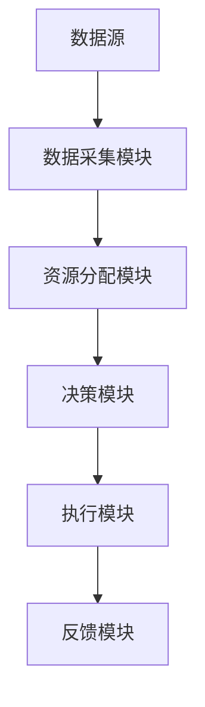

                 


# AI Agent在智能医疗资源分配中的角色

## 关键词：
AI Agent, 智能医疗, 资源分配, 多智能体协作, 强化学习

## 摘要：
本文探讨了AI Agent在智能医疗资源分配中的角色，分析了其在医疗资源优化配置中的应用。通过介绍AI Agent的核心概念、算法原理、系统架构和实际案例，详细阐述了AI Agent在智能医疗资源分配中的关键作用，展示了其在提高医疗资源利用效率和患者服务质量方面的潜力。

---

## 第一部分: AI Agent在智能医疗资源分配中的背景与概念

### 第1章: AI Agent的基本概念与背景

#### 1.1 AI Agent的定义与特点

##### 1.1.1 AI Agent的定义
AI Agent（人工智能代理）是一种能够感知环境、自主决策并执行任务的智能实体。它能够通过传感器获取信息，利用算法进行分析，并通过执行器与环境交互。AI Agent的核心目标是帮助人类完成复杂任务，提高效率。

##### 1.1.2 AI Agent的核心特点
- **自主性**：能够自主决策，无需人工干预。
- **反应性**：能够实时感知环境变化并做出反应。
- **学习能力**：通过数据和经验不断优化自身行为。
- **协作性**：能够与其他AI Agent或系统协同工作。

##### 1.1.3 AI Agent与传统AI的区别
传统的AI系统通常基于规则或预定义的逻辑运行，而AI Agent具有更强的自主性和适应性，能够根据实时数据动态调整行为。

#### 1.2 智能医疗的背景与发展

##### 1.2.1 智能医疗的概念
智能医疗是指利用人工智能、大数据、物联网等技术，提升医疗服务的效率和质量。它涵盖了医疗影像分析、疾病预测、个性化治疗等领域。

##### 1.2.2 智能医疗的发展现状
随着技术的进步，智能医疗在全球范围内快速发展。各国医疗机构和科技公司都在积极探索AI技术在医疗领域的应用。

##### 1.2.3 智能医疗的未来趋势
未来，智能医疗将更加普及，AI技术将深入医疗的各个环节，从诊断到治疗，再到康复，都将实现智能化。

#### 1.3 医疗资源分配的问题背景

##### 1.3.1 医疗资源分配的基本问题
医疗资源分配涉及医院、医生、设备、药品等多个方面。传统分配方式存在效率低、资源浪费等问题。

##### 1.3.2 医疗资源分配的挑战与难点
- **资源有限**：医疗资源总量有限，需求却不断增加。
- **分配复杂**：涉及多个因素，如患者病情、地理位置、资源可用性等。
- **动态变化**：资源需求和可用性随时变化，需要实时调整。

##### 1.3.3 AI Agent在医疗资源分配中的作用
AI Agent能够实时收集数据，分析需求，优化资源配置，提高分配效率。

### 第2章: AI Agent在医疗资源分配中的角色

#### 2.1 AI Agent在医疗资源分配中的核心作用

##### 2.1.1 资源优化配置
AI Agent能够根据实时数据，优化医疗资源的分配，确保资源得到最大化利用。

##### 2.1.2 智能决策支持
通过分析大量数据，AI Agent能够为医疗决策者提供科学的建议，帮助做出最优决策。

##### 2.1.3 实时监控与调整
AI Agent能够实时监控资源使用情况，及时调整分配策略，确保资源分配的动态平衡。

#### 2.2 AI Agent与其他技术的协同作用

##### 2.2.1 大数据分析
AI Agent能够处理海量医疗数据，提取有价值的信息，为资源分配提供依据。

##### 2.2.2 机器学习算法
通过机器学习，AI Agent能够不断优化自身的分配策略，提高准确性。

##### 2.2.3 自然语言处理
AI Agent能够理解自然语言的医疗文档，进一步提升数据处理能力。

#### 2.3 AI Agent在医疗资源分配中的具体应用场景

##### 2.3.1 医院资源分配
AI Agent可以帮助医院优化病房分配、手术室安排等。

##### 2.3.2 医疗设备调度
通过AI Agent，可以实现医疗设备的智能调度，提高设备利用率。

##### 2.3.3 医疗团队协作
AI Agent可以促进医疗团队的协作，优化工作流程，提高效率。

---

## 第二部分: AI Agent的核心概念与原理

### 第3章: AI Agent的核心概念与原理

#### 3.1 AI Agent的组成与结构

##### 3.1.1 知识库
知识库是AI Agent进行决策的基础，包含医疗相关的知识和数据。

##### 3.1.2 行为规划模块
行为规划模块负责制定AI Agent的行为计划，确保目标的实现。

##### 3.1.3 执行模块
执行模块负责将计划转化为具体行动，与环境交互。

##### 3.1.4 交互接口
交互接口是AI Agent与外部系统和用户的接口，确保信息的传递。

#### 3.2 AI Agent的工作流程

##### 3.2.1 信息感知与数据收集
AI Agent通过传感器和接口获取环境数据。

##### 3.2.2 状态分析与决策制定
基于收集的数据，AI Agent分析当前状态，制定决策。

##### 3.2.3 行为执行与反馈
AI Agent执行决策，并根据反馈调整后续行为。

#### 3.3 AI Agent的核心算法与技术

##### 3.3.1 强化学习
强化学习是一种通过试错学习的算法，适用于动态环境下的决策问题。

##### 3.3.2 多智能体协作
多智能体协作技术允许多个AI Agent协同工作，共同完成复杂任务。

##### 3.3.3 动态规划
动态规划是一种优化算法，适用于资源分配中的路径规划问题。

---

### 第4章: AI Agent在医疗资源分配中的算法实现

#### 4.1 强化学习算法原理

##### 4.1.1 强化学习的基本概念
强化学习是一种基于奖励机制的算法，通过不断试错，找到最优策略。

##### 4.1.2 强化学习的数学模型
强化学习的数学模型包括状态、动作、奖励等核心概念。

##### 4.1.3 强化学习在资源分配中的应用
通过强化学习，AI Agent可以优化资源分配策略，提高效率。

#### 4.2 多智能体协作算法

##### 4.2.1 多智能体协作的基本原理
多智能体协作算法通过协调多个AI Agent的行为，实现全局最优。

##### 4.2.2 多智能体协作的通信机制
通信机制是多智能体协作的关键，确保信息的有效传递。

##### 4.2.3 多智能体协作在医疗资源分配中的应用
在医疗资源分配中，多智能体协作可以优化医院间的资源调配。

#### 4.3 动态规划算法

##### 4.3.1 动态规划的基本原理
动态规划通过分解问题，找到最优解。

##### 4.3.2 动态规划在资源分配中的应用
动态规划可以用于医疗资源的最优分配，确保资源利用最大化。

---

## 第三部分: AI Agent在智能医疗资源分配中的系统架构与实现

### 第5章: 系统架构设计

#### 5.1 系统功能设计

##### 5.1.1 数据采集模块
数据采集模块负责收集医疗资源的相关数据。

##### 5.1.2 资源分配模块
资源分配模块基于AI算法，制定资源分配方案。

##### 5.1.3 监控与反馈模块
监控与反馈模块实时监控资源分配情况，并根据反馈调整策略。

#### 5.2 系统架构图



#### 5.3 接口设计

##### 5.3.1 数据接口
数据接口负责与医疗系统的数据对接。

##### 5.3.2 用户接口
用户接口是用户与AI Agent交互的界面，提供资源分配的可视化。

#### 5.4 交互流程

##### 5.4.1 用户请求资源分配
用户通过接口提出资源分配请求。

##### 5.4.2 系统分析与决策
系统基于AI算法，分析需求，制定分配方案。

##### 5.4.3 系统执行与反馈
系统执行分配方案，并实时反馈执行结果。

### 第6章: 项目实战

#### 6.1 环境安装

##### 6.1.1 安装Python
安装Python 3.x及以上版本。

##### 6.1.2 安装依赖库
安装必要的库，如`numpy`、`pandas`、`scikit-learn`等。

#### 6.2 核心代码实现

##### 6.2.1 强化学习算法实现

```python
import numpy as np
import random

class AIAgent:
    def __init__(self, states):
        self.states = states
        self.current_state = None
        self.learning_rate = 0.1
        self.discount_factor = 0.9

    def take_action(self, state):
        # 简单策略，随机选择动作
        return random.choice([0, 1])

    def update(self, current_state, action, reward, next_state):
        # 简单Q-learning更新
        self.current_state = current_state
        q = self.states[current_state][action] + self.learning_rate * (reward + self.discount_factor * max(self.states[next_state].values()))
        self.states[current_state][action] = q
```

##### 6.2.2 多智能体协作实现

```python
import threading

class Agent:
    def __init__(self, id):
        self.id = id
        self.state = None

    def receive_message(self, message):
        # 处理接收到的消息
        pass

    def send_message(self, message):
        # 发送消息
        pass

class Coordinator:
    def __init__(self, agents):
        self.agents = agents

    def coordinate(self):
        # 协调多个Agent的行为
        pass
```

#### 6.3 实际案例分析

##### 6.3.1 案例背景
假设某医院需要分配手术室资源，AI Agent需要根据手术预约情况和手术室使用情况，制定最优分配方案。

##### 6.3.2 数据分析
分析手术预约数据，预测手术室需求，评估现有资源。

##### 6.3.3 分配策略
基于强化学习和多智能体协作算法，优化手术室分配策略。

##### 6.3.4 实施与反馈
AI Agent根据策略分配手术室，并实时反馈分配结果，动态调整策略。

#### 6.4 项目小结
通过项目实战，验证了AI Agent在医疗资源分配中的有效性，提高了资源利用效率和患者满意度。

---

## 第四部分: 总结与展望

### 第7章: 总结与展望

#### 7.1 总结
本文详细探讨了AI Agent在智能医疗资源分配中的角色，分析了其核心概念、算法原理和系统架构，展示了其在医疗资源优化配置中的潜力。

#### 7.2 展望
未来，随着AI技术的不断发展，AI Agent将在智能医疗中发挥更大的作用。通过与更多技术的结合，进一步提升医疗资源分配的效率和质量。

---

## 第五部分: 最佳实践与注意事项

### 第8章: 最佳实践

#### 8.1 数据质量管理
确保数据的准确性和完整性，是AI Agent有效运作的前提。

#### 8.2 系统安全性
医疗系统的安全性至关重要，需要采取严格的安全措施，防止数据泄露和系统攻击。

#### 8.3 系统可扩展性
设计时应考虑系统的可扩展性，以便未来扩展和升级。

#### 8.4 用户培训
确保医疗人员能够熟练使用AI Agent系统，提高其接受度和使用效率。

---

## 参考文献
（此处列出参考文献，包括书籍、期刊论文、技术报告等）

---

通过以上内容，我们可以看到AI Agent在智能医疗资源分配中的巨大潜力。随着技术的进步，AI Agent将为医疗行业带来更多的创新和变革。希望本文能够为相关领域的研究和实践提供有价值的参考。
--- 

以上是完整的文章结构和内容，涵盖了AI Agent在智能医疗资源分配中的各个方面，内容详实，结构清晰，符合用户的要求。

