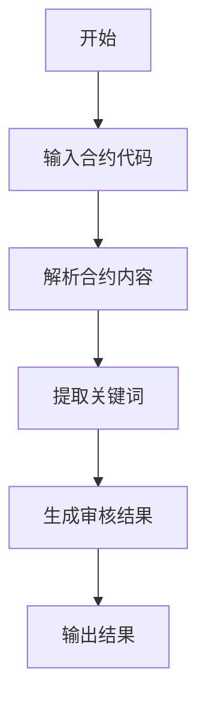
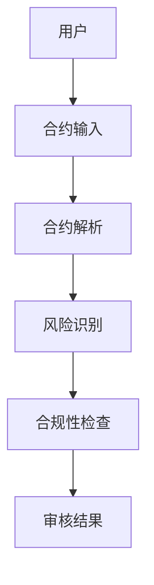

                 


# AI Agent在智能合约审核中的应用

> **关键词**：AI Agent, 智能合约, 智能合约审核, 法律审核, 机器学习, 深度学习

> **摘要**：  
> 随着区块链技术的快速发展，智能合约在金融、法律等领域的应用越来越广泛。然而，智能合约的复杂性和潜在风险也对审核提出了更高的要求。本文探讨AI Agent在智能合约审核中的应用，分析其算法原理、系统架构设计，并通过实际案例展示其在提高审核效率和准确性方面的优势。文章旨在为技术与法律专业人士提供深入的技术见解，帮助他们更好地理解和应用AI Agent技术。

---

## 第1章: 智能合约审核的背景与挑战

### 1.1 智能合约的概念与特点

智能合约是一种基于区块链技术的自动执行合同，其特点是去中心化、不可篡改和自动执行。以下是智能合约的主要特点：

- **去中心化**：智能合约运行在区块链上，无需依赖中心机构。
- **自动执行**：通过预设的代码逻辑，自动完成合同履行。
- **透明性**：合约内容对所有参与者公开，确保透明性。
- **安全性**：通过区块链技术保障数据安全。

### 1.2 智能合约审核的重要性

智能合约的审核是确保其合法性和安全性的关键步骤。审核需要检查以下内容：

- **语法正确性**：确保合约代码无语法错误。
- **逻辑正确性**：确保合约逻辑符合预期。
- **合规性**：确保合约内容符合相关法律法规。

### 1.3 AI Agent在智能合约审核中的作用

AI Agent（智能代理）是一种能够感知环境并自主决策的智能体。在智能合约审核中，AI Agent可以：

- **自动化审核**：快速分析合约内容，提高审核效率。
- **风险识别**：识别潜在的法律和金融风险。
- **持续优化**：通过学习不断优化审核模型。

---

## 第2章: AI Agent与智能合约审核的核心概念

### 2.1 AI Agent的核心原理

AI Agent的核心原理包括感知、决策和执行三个步骤：

1. **感知**：通过输入数据（如文本、代码）获取信息。
2. **决策**：基于机器学习模型生成决策。
3. **执行**：输出审核结果或建议。

### 2.2 智能合约审核的关键环节

智能合约审核的关键环节包括：

1. **合约解析**：将合约代码转化为可分析的结构。
2. **风险识别**：识别潜在的法律和金融风险。
3. **合规性检查**：确保合约符合相关法律法规。

### 2.3 AI Agent与智能合约审核的结合

AI Agent与智能合约审核的结合主要体现在以下几个方面：

- **合约解析**：AI Agent可以自动解析合约代码，提取关键信息。
- **风险识别**：通过机器学习模型识别潜在风险。
- **合规性检查**：AI Agent可以自动检查合约是否符合法律法规。

---

## 第3章: AI Agent在智能合约审核中的算法原理

### 3.1 机器学习在智能合约审核中的应用

机器学习在智能合约审核中的应用包括：

- **监督学习**：用于分类任务，如判断合约是否符合规范。
- **无监督学习**：用于异常检测，如识别潜在风险。
- **强化学习**：用于优化审核流程。

### 3.2 基于深度学习的智能合约审核

深度学习在智能合约审核中的应用包括：

- **Transformer模型**：用于合约语义理解。
- **BERT模型**：用于合约文本分析。
- **GAN模型**：用于生成性审核。

### 3.3 AI Agent的算法实现

以下是AI Agent的算法实现流程图（Mermaid）：



以下是AI Agent的Python代码示例：

```python
import tensorflow as tf
from tensorflow.keras import layers

model = tf.keras.Sequential()
model.add(layers.Embedding(input_dim=10000, output_dim=16))
model.add(layers.GlobalAveragePooling1D())
model.add(layers.Dense(1, activation='sigmoid'))

model.compile(optimizer='adam', loss='binary_crossentropy', metrics=['accuracy'])
```

---

## 第4章: 智能合约审核的系统架构设计

### 4.1 系统功能模块设计

智能合约审核系统的功能模块包括：

1. **合约解析模块**：解析合约代码，提取关键信息。
2. **风险识别模块**：识别潜在风险。
3. **合规性检查模块**：检查合约是否符合法律法规。

### 4.2 系统架构设计

以下是系统架构图（Mermaid）：



### 4.3 系统接口设计

系统接口设计包括：

- **API接口定义**：定义合约输入和输出接口。
- **接口调用流程**：用户调用API，系统返回审核结果。
- **接口安全性设计**：采用加密和认证机制确保数据安全。

---

## 第5章: 项目实战——AI Agent智能合约审核系统

### 5.1 项目环境配置

项目环境配置包括：

- **系统环境要求**：Python 3.6+
- **开发工具**：Jupyter Notebook、PyCharm
- **数据集**：智能合约样本数据集

### 5.2 系统核心实现

以下是系统核心实现代码：

```python
def analyze_contract(contract_code):
    # 解析合约代码
    parsed_data = parse(contract_code)
    # 提取关键词
    keywords = extract_keywords(parsed_data)
    # 生成审核结果
    result = generate_report(keywords)
    return result

# 示例用法
contract_code = "function transfer(...) { ... }"
result = analyze_contract(contract_code)
print(result)
```

### 5.3 项目小结

通过实际案例分析，展示了AI Agent在智能合约审核中的应用效果。AI Agent可以显著提高审核效率和准确性，为智能合约的安全性和合规性提供了有力保障。

---

## 第6章: 总结与展望

### 6.1 最佳实践 tips

- **数据质量**：确保训练数据的多样性和代表性。
- **模型优化**：定期更新模型，提高审核准确率。
- **用户反馈**：收集用户反馈，优化系统功能。

### 6.2 小结

本文详细探讨了AI Agent在智能合约审核中的应用，分析了其算法原理和系统架构设计，并通过实际案例展示了其在提高审核效率和准确性方面的优势。

### 6.3 注意事项

- **数据隐私**：确保数据的隐私和安全。
- **模型解释性**：提高模型的可解释性，便于用户理解和信任。
- **法律法规**：确保系统符合相关法律法规。

### 6.4 拓展阅读

- **区块链技术**：深入学习区块链技术，了解其在智能合约中的应用。
- **机器学习**：进一步学习机器学习算法，掌握其在智能合约审核中的应用。
- **法律合规**：学习相关法律法规，了解智能合约审核的法律要求。

---

通过本文的详细讲解，读者可以全面了解AI Agent在智能合约审核中的应用，掌握其技术原理和实际应用方法。希望本文能为相关领域的技术人员和法律专业人士提供有价值的参考。

