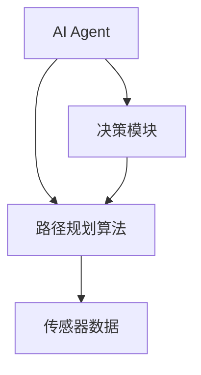
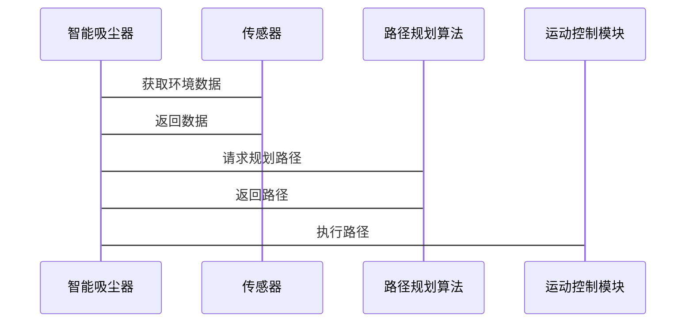

                 


# AI Agent在智能吸尘器中的路径规划

> 关键词：AI Agent，路径规划，智能吸尘器，算法，系统架构

> 摘要：本文深入探讨AI Agent在智能吸尘器路径规划中的应用，分析路径规划的核心算法及其优化，详细阐述系统架构设计，并通过实际案例展示AI Agent如何实现高效的路径规划。

---

## 第一部分：背景介绍

### 第1章：AI Agent与路径规划的背景

#### 1.1 问题背景

- **智能吸尘器的发展历程**  
  智能吸尘器从简单的随机碰撞模式发展到如今的AI驱动路径规划，经历了技术的不断升级。早期的产品依赖简单的红外传感器，能够避开障碍物，但路径效率低下。随着AI技术的进步，现代智能吸尘器能够通过复杂的路径规划算法，在各种环境中高效清洁。

- **路径规划的重要性**  
  路径规划是智能吸尘器完成任务的核心，直接影响清洁效率和用户体验。高效的路径规划能够显著减少清扫时间，避免重复清扫，同时确保覆盖所有区域。

- **AI Agent的应用场景**  
  AI Agent在智能吸尘器中主要用于处理动态环境下的路径规划问题。通过实时感知环境变化，AI Agent能够快速调整路径，避开动态障碍物，确保清扫任务顺利完成。

#### 1.2 问题描述

- **智能吸尘器的运动限制**  
  智能吸尘器通常具有较小的体型，这限制了其传感器的感知范围和运动灵活性。因此，路径规划算法需要考虑这些限制，确保路径的有效性和可执行性。

- **复杂环境中的路径规划挑战**  
  在家庭环境中，智能吸尘器可能面临复杂的布局，如狭窄的走廊、urniture的遮挡以及动态的人群。这些因素增加了路径规划的难度。

- **用户需求与期望**  
  用户期望智能吸尘器能够高效、安静、持久地完成清扫任务，并且在处理复杂环境时表现稳定。

#### 1.3 问题解决

- **AI Agent的核心作用**  
  AI Agent通过整合传感器数据，实时分析环境信息，生成最优路径，确保智能吸尘器高效完成任务。AI Agent能够处理动态障碍物，适应环境变化，提升清扫效率。

- **路径规划算法的选择**  
  常见的路径规划算法包括A*和RRT。A*算法适用于静态环境，而RRT则更适合动态环境。AI Agent能够根据环境动态选择合适的算法，优化路径规划。

- **多传感器融合的技术优势**  
  通过融合激光雷达、红外传感器和摄像头数据，AI Agent能够更准确地感知环境，提升路径规划的精度和可靠性。

#### 1.4 边界与外延

- **环境模型的简化假设**  
  为了提高计算效率，路径规划通常会对环境进行简化建模，例如将障碍物简化为几何形状，忽略一些复杂的细节。

- **动态障碍物的处理**  
  动态障碍物的处理是路径规划中的难点，AI Agent需要实时跟踪障碍物的运动轨迹，并动态调整路径。

- **系统性能的边界条件**  
  系统性能受限于硬件能力，如计算速度、传感器精度等。AI Agent需要在这些限制条件下，尽可能优化路径规划。

#### 1.5 概念结构与核心要素

- **AI Agent的组成要素**  
  AI Agent通常包括感知模块、决策模块和执行模块。感知模块负责收集环境信息，决策模块负责生成路径，执行模块负责驱动吸尘器运动。

- **路径规划的输入与输出**  
  输入包括环境地图、起点、终点和障碍物信息；输出是清扫路径和避障策略。

- **核心概念与联系**  
  AI Agent与路径规划密切相关，AI Agent通过路径规划算法优化清扫路径，而路径规划算法依赖AI Agent提供的环境信息和目标。

---

## 第二部分：核心概念与联系

### 第2章：AI Agent与路径规划的核心原理

#### 2.1 核心概念

- **AI Agent的定义与特点**  
  AI Agent是一种能够感知环境、自主决策并执行任务的智能实体。其特点包括自主性、反应性、目标导向和学习能力。

- **路径规划的定义与特点**  
  路径规划是指在复杂环境中，为智能体找到从起点到目标的最优路径。其特点包括实时性、动态性和鲁棒性。

#### 2.2 概念对比与联系

| 属性 | AI Agent | 路径规划 |
|------|----------|----------|
| 输入 | 环境信息、目标 | 起点、终点、障碍物 |
| 输出 | 行动指令 | 路径、避障策略 |
| 目标 | 完成任务 | 最优路径 |

- **AI Agent与路径规划的关系**  
  AI Agent通过路径规划算法优化清扫路径，路径规划算法依赖AI Agent提供的环境信息和目标。

#### 2.3 实体关系图



---

## 第三部分：算法原理

### 第3章：路径规划算法的实现

#### 3.1 A*算法

- **算法步骤**  
  1. 初始化开放列表和关闭列表。  
  2. 将起点加入开放列表。  
  3. 取开放列表中f值最小的节点，加入关闭列表。  
  4. 探索该节点的邻居，计算每个邻居的f值。  
  5. 将未访问的邻居加入开放列表。  
  6. 重复直到找到目标节点。

- **数学模型**  
  $$ f(n) = g(n) + h(n) $$  
  其中，$$ g(n) $$是起点到当前节点的已知成本，$$ h(n) $$是当前节点到目标节点的估算成本。

- **代码实现**  
  ```python
  def a_star(start, goal, grid):
      open_set = {start}
      closed_set = set()
      came_from = {}
      g_score = {start: 0}
      f_score = {start: heuristic(start, goal)}
      
      while open_set:
          current = min(open_set, key=lambda x: f_score[x])
          open_set.remove(current)
          closed_set.add(current)
          
          if current == goal:
              break
          
          for neighbor in neighbors(current):
              if neighbor in closed_set:
                  continue
              tentative_g = g_score[current] + distance(current, neighbor)
              if neighbor not in g_score or tentative_g < g_score[neighbor]:
                  came_from[neighbor] = current
                  g_score[neighbor] = tentative_g
                  f_score[neighbor] = g_score[neighbor] + heuristic(neighbor, goal)
                  open_set.add(neighbor)
      return came_from, g_score
  ```

#### 3.2 RRT算法

- **算法步骤**  
  1. 初始化树的根节点为目标节点。  
  2. 随机采样配置空间中的点。  
  3. 寻找最近的树节点，连接到采样点。  
  4. 检查碰撞，若无碰撞，添加新边。  
  5. 重复直到找到起点。

- **数学模型**  
  $$ \text{采样点} = \text{均匀随机采样}(\text{配置空间}) $$  
  $$ \text{最近点} = \arg\min_{p \in \text{树}} \|x - p\| $$

- **代码实现**  
  ```python
  def rrt(start, goal, obstacles):
      tree = {goal: []}
      while True:
          x_rand = random.uniform(0, 10)
          y_rand = random.uniform(0, 10)
          nearest = None
          min_dist = float('inf')
          for p in tree:
              dist = (p[0] - x_rand)**2 + (p[1] - y_rand)**2
              if dist < min_dist:
                  min_dist = dist
                  nearest = p
          if check_collision(nearest, (x_rand, y_rand), obstacles):
              tree[(x_rand, y_rand)] = [nearest]
              if (x_rand, y_rand) == start:
                  break
  ```

---

## 第四部分：系统分析与架构设计

### 第4章：系统架构设计

#### 4.1 问题场景介绍

- **智能吸尘器系统**  
  包括传感器模块、路径规划模块、运动控制模块和用户交互模块。

#### 4.2 项目介绍

- **项目目标**  
  实现一个高效的路径规划系统，能够适应动态环境，提升清扫效率。

#### 4.3 系统功能设计

- **领域模型类图**  
  ```mermaid
  classDiagram
      class Sensor {
          get_data()
      }
      class Path_Planner {
          plan_path()
      }
      class Motor {
          move()
      }
      Sensor --> Path_Planner
      Path_Planner --> Motor
  ```

#### 4.4 系统架构设计

- **架构图**  
  ```mermaid
  graph TD
      Controller --> Sensor
      Controller --> Path_Planner
      Path_Planner --> Motor
  ```

#### 4.5 系统接口设计

- **传感器接口**  
  提供环境数据接口，如红外传感器和激光雷达。

- **路径规划接口**  
  提供路径规划服务，接受起点、目标和障碍物信息。

#### 4.6 系统交互序列图



---

## 第五部分：项目实战

### 第5章：环境安装与核心代码实现

#### 5.1 环境安装

- **安装Python和相关库**  
  安装numpy、matplotlib和mermaid工具。

#### 5.2 核心代码实现

- **传感器数据处理**  
  ```python
  def process_sensor_data(data):
      # 处理传感器数据，提取障碍物信息
      pass
  ```

- **路径规划算法调用**  
  ```python
  def plan_path(start, goal, obstacles):
      # 调用A*或RRT算法，返回路径
      pass
  ```

- **运动控制**  
  ```python
  def move_robot(path):
      # 根据路径控制吸尘器运动
      pass
  ```

#### 5.3 代码应用解读

- **传感器数据处理**  
  传感器数据用于生成环境地图，帮助路径规划算法生成最优路径。

- **路径规划算法调用**  
  根据传感器数据，动态选择合适的路径规划算法，生成清扫路径。

#### 5.4 实际案例分析

- **案例1：静态环境**  
  使用A*算法，生成最优路径。

- **案例2：动态环境**  
  使用RRT算法，动态调整路径，避开移动障碍物。

#### 5.5 项目小结

- **项目总结**  
  通过项目实战，掌握了AI Agent在智能吸尘器中的应用，理解了路径规划算法的实现和优化。

---

## 第六部分：最佳实践与小结

### 第6章：总结与展望

#### 6.1 最佳实践

- **传感器选择**  
  根据环境选择合适的传感器组合，提升感知精度。

- **算法优化**  
  根据具体场景选择合适的路径规划算法，并进行参数优化。

#### 6.2 小结

- **文章总结**  
  AI Agent在智能吸尘器中的路径规划是一项复杂而有趣的技术挑战，通过本文的探讨，读者可以深入了解其实现原理和应用方法。

#### 6.3 展望

- **未来发展方向**  
  随着AI技术的进步，智能吸尘器的路径规划将更加智能化和个性化，结合云计算和边缘计算，实现更高效的清扫任务。

---

# 结语

AI Agent在智能吸尘器中的路径规划是一个多学科交叉的技术领域，涉及算法、系统架构和传感器技术等多个方面。通过本文的系统讲解和实际案例分析，读者可以全面掌握AI Agent在智能吸尘器中的应用，为未来的相关研究和开发提供有价值的参考。

