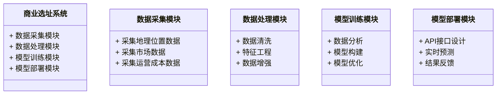

                 


# AI Agent在智能商业选址中的应用

> 关键词：AI Agent, 商业选址, 智能决策, 机器学习, 空间分析

> 摘要：本文探讨了AI Agent在智能商业选址中的应用，通过详细分析AI Agent的核心原理、算法模型、系统架构以及实际案例，展示了如何利用AI技术优化商业选址过程。文章从背景介绍、核心概念、算法实现、系统设计到项目实战，逐步展开，为读者提供了全面的技术解读。

---

## 第1章: AI Agent与商业选址概述

### 1.1 AI Agent的基本概念

#### 1.1.1 AI Agent的定义与特点
AI Agent（人工智能代理）是指能够感知环境、自主决策并执行任务的智能实体。它具有以下几个特点：
- **自主性**：能够在没有外部干预的情况下独立运作。
- **反应性**：能够实时感知环境变化并做出反应。
- **学习能力**：通过数据和经验不断优化自身的决策能力。
- **目标导向**：所有行为都以实现特定目标为导向。

#### 1.1.2 AI Agent的核心功能与类型
AI Agent的核心功能包括感知、推理、决策和执行。根据应用场景的不同，可以将AI Agent分为以下几种类型：
- **简单反射型**：基于预设规则执行任务。
- **基于模型的反应型**：利用内部模型感知环境并做出决策。
- **目标驱动型**：以实现特定目标为导向。
- **效用驱动型**：通过最大化效用函数来优化决策。

#### 1.1.3 AI Agent与传统商业选址的区别
传统的商业选址依赖于人工分析和经验判断，而AI Agent可以通过大数据分析、机器学习算法和实时数据反馈，实现更高效、更精准的选址决策。

---

### 1.2 商业选址的基本问题

#### 1.2.1 商业选址的核心要素
商业选址的核心要素包括：
- **地理位置**：包括区域经济发展水平、人口密度、交通便利性等。
- **市场需求**：包括目标客户群体、消费习惯、竞争对手情况等。
- **运营成本**：包括租金、人工成本、物流成本等。

#### 1.2.2 商业选址的挑战与痛点
商业选址面临的挑战包括：
- 数据获取难度大。
- 选址过程复杂且耗时。
- 需要考虑多目标优化问题。

#### 1.2.3 AI Agent在商业选址中的应用前景
AI Agent可以通过大数据分析和智能决策，帮助企业在复杂的商业环境中快速找到最优选址方案。

---

### 1.3 AI Agent与智能商业选址的结合

#### 1.3.1 AI Agent在商业选址中的作用
AI Agent可以通过以下方式优化商业选址过程：
- **数据采集与分析**：利用传感器、GPS、社交媒体等多源数据进行实时分析。
- **决策优化**：基于数据分析结果，提供最优选址建议。
- **动态调整**：根据市场变化实时调整选址策略。

#### 1.3.2 智能商业选址的定义与特点
智能商业选址是指通过AI技术实现商业选址的智能化和自动化，具有高效性、精准性和动态调整的特点。

#### 1.3.3 AI Agent如何优化商业选址过程
AI Agent可以通过以下步骤优化商业选址过程：
1. 数据采集与预处理。
2. 数据分析与建模。
3. 模型优化与决策。
4. 结果反馈与动态调整。

---

## 第2章: AI Agent的核心原理

### 2.1 AI Agent的基本原理

#### 2.1.1 AI Agent的感知与决策机制
AI Agent的感知机制包括数据采集、特征提取和数据融合。决策机制则基于感知结果进行推理和选择最优行动。

#### 2.1.2 AI Agent的推理与规划算法
常用的推理算法包括逻辑推理、概率推理和案例推理。规划算法则包括贪心算法、动态规划和强化学习。

#### 2.1.3 AI Agent的学习与优化方法
AI Agent可以通过监督学习、无监督学习和强化学习不断优化自身的决策能力。

---

### 2.2 AI Agent在商业选址中的应用原理

#### 2.2.1 数据采集与处理
商业选址的数据来源包括地理位置数据、人口统计数据、消费行为数据等。数据处理包括数据清洗、特征工程和数据增强。

#### 2.2.2 商业选址模型的构建
商业选址模型包括空间分析模型和机器学习模型。空间分析模型用于分析地理位置特征，机器学习模型用于预测选址的成功率。

#### 2.2.3 AI Agent的决策优化过程
AI Agent通过不断迭代优化模型参数，提高选址的准确性和效率。

---

## 第3章: AI Agent的算法原理与数学模型

### 3.1 空间分析模型与算法

#### 3.1.1 空间分析模型的基本原理
空间分析模型用于分析地理位置特征，包括空间距离计算、空间权重矩阵和空间聚类分析。

#### 3.1.2 基于空间分析的选址优化算法
常用的选址优化算法包括联合分析法、中心地理论模型和网络分析模型。

#### 3.1.3 算法实现与代码示例
以下是空间分析模型的Python实现示例：
```python
import numpy as np
import pandas as pd

# 示例数据
data = {'x': [1, 2, 3, 4, 5], 'y': [2, 3, 5, 7, 11]}
df = pd.DataFrame(data)

# 计算欧氏距离
distance = np.sqrt((df['x'] - df['x'].mean())**2 + (df['y'] - df['y'].mean())**2)
print(distance)
```

#### 3.1.4 算法数学模型与公式
空间分析模型的数学公式如下：
$$
distance = \sqrt{(x_i - x_j)^2 + (y_i - y_j)^2}
$$

---

## 第4章: 机器学习模型在商业选址中的应用

### 4.1 机器学习模型的基本原理

#### 4.1.1 监督学习与无监督学习
监督学习用于分类和回归问题，无监督学习用于聚类和异常检测。

#### 4.1.2 分类与回归算法
常用的分类算法包括逻辑回归、支持向量机和随机森林。常用的回归算法包括线性回归和Lasso回归。

#### 4.1.3 聚类分析与异常检测
聚类分析用于将相似的地理位置分组，异常检测用于识别异常的市场行为。

---

### 4.2 基于机器学习的商业选址模型

#### 4.2.1 机器学习模型的训练与优化
模型训练包括数据预处理、特征选择和模型调参。模型优化包括交叉验证和超参数优化。

#### 4.2.2 机器学习模型的部署与应用
模型部署包括API接口设计和实时预测。模型应用包括市场分析和风险评估。

---

## 第5章: 系统架构与设计

### 5.1 系统功能设计

#### 5.1.1 领域模型设计
以下是领域模型的Mermaid类图：


#### 5.1.2 系统架构设计
以下是系统架构的Mermaid架构图：
```mermaid
client
    <-->
server
    contains
        数据采集模块
        数据处理模块
        模型训练模块
        模型部署模块
```

---

## 第6章: 项目实战

### 6.1 环境安装与配置

#### 6.1.1 Python环境安装
安装Python和必要的库：
```bash
pip install numpy pandas scikit-learn
```

#### 6.1.2 数据集准备
准备商业选址相关的数据集，包括地理位置、人口统计数据和市场数据。

---

### 6.2 系统核心实现

#### 6.2.1 数据采集与处理
编写数据采集和处理的代码：
```python
import pandas as pd
import numpy as np

# 数据采集
data = {'x': [1, 2, 3, 4, 5], 'y': [2, 3, 5, 7, 11]}
df = pd.DataFrame(data)

# 数据处理
df['distance'] = np.sqrt((df['x'] - df['x'].mean())**2 + (df['y'] - df['y'].mean())**2)
print(df)
```

#### 6.2.2 模型训练与部署
编写模型训练和部署的代码：
```python
from sklearn.model_selection import train_test_split
from sklearn.linear_model import LinearRegression

# 数据分割
X = df[['x', 'y']]
y = df['distance']
X_train, X_test, y_train, y_test = train_test_split(X, y, test_size=0.2)

# 模型训练
model = LinearRegression()
model.fit(X_train, y_train)

# 模型预测
y_pred = model.predict(X_test)
print(y_pred)
```

---

## 第7章: 总结与展望

### 7.1 本文总结
本文详细探讨了AI Agent在智能商业选址中的应用，从核心原理到实际案例，全面分析了AI Agent在商业选址中的作用和优势。

### 7.2 未来展望
未来，随着AI技术的不断发展，AI Agent在商业选址中的应用将更加广泛，包括动态选址优化、多目标优化和实时市场响应等方面。

### 7.3 最佳实践Tips
- 数据质量是选址模型的核心，确保数据的准确性和完整性。
- 模型部署时，要注意系统的可扩展性和可维护性。
- 定期更新模型参数，以适应市场变化。

---

通过本文的分析，我们可以看到AI Agent在智能商业选址中的巨大潜力。希望本文能够为读者提供有价值的参考，帮助他们在实际应用中更好地利用AI技术优化商业选址过程。

