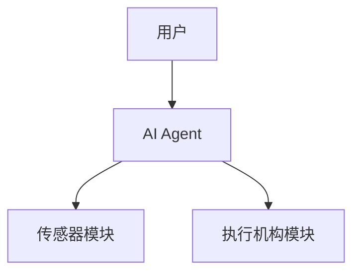
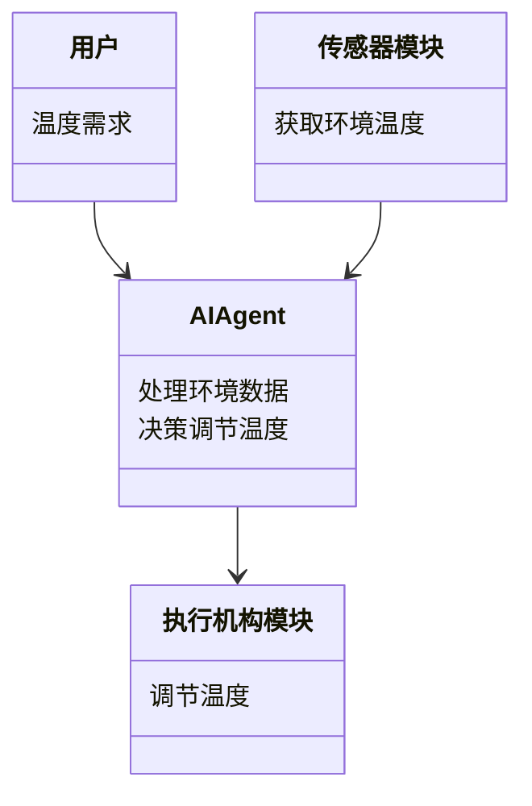
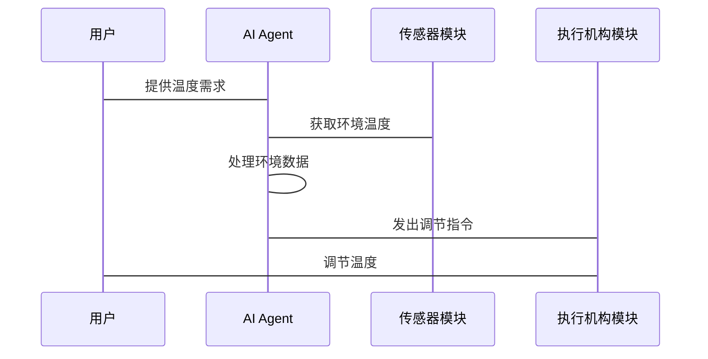

                 


# AI Agent在智能围巾中的温度调节

> **关键词**：AI Agent，智能围巾，温度调节，物联网，人工智能，智能服装

> **摘要**：本文探讨了AI Agent在智能围巾中的温度调节应用，分析了其工作原理、系统设计、算法实现及实际案例。通过详细的技术分析，展示了如何利用AI Agent实现智能、高效的温度调节，为智能服装的发展提供了新的思路。

---

## 第1章: 智能围巾与AI Agent概述

### 1.1 智能围巾的发展背景

#### 1.1.1 传统围巾的功能与局限性
传统围巾主要通过物理方式提供保暖，存在以下问题：
- **调节能力有限**：无法根据环境变化主动调节温度。
- **舒适性不足**：固定的设计难以满足不同用户的个性化需求。
- **智能化程度低**：无法与用户交互，也无法感知环境变化。

#### 1.1.2 智能化服装的发展趋势
随着物联网和人工智能技术的发展，智能服装逐渐成为研究热点。智能服装能够通过传感器、执行机构和智能算法实现对环境的感知和调节，提升用户体验。

#### 1.1.3 AI Agent在智能服装中的应用潜力
AI Agent（智能代理）是一种能够感知环境、自主决策并执行任务的智能系统。其在智能服装中的应用潜力包括：
- 实时感知环境温度。
- 自主决策调节服装温度。
- 与用户交互，提供个性化服务。

### 1.2 AI Agent的核心概念

#### 1.2.1 AI Agent的基本定义
AI Agent是一种能够感知环境、自主决策并执行任务的智能实体。它通过传感器获取信息，利用算法进行分析和推理，最终输出控制指令。

#### 1.2.2 AI Agent的分类与特点
AI Agent可以分为以下几类：
- **简单反射型**：基于当前状态直接执行预定义动作。
- **基于模型的反应型**：利用环境模型进行决策。
- **目标驱动型**：以目标为导向进行规划和执行。
- **实用驱动型**：通过效用函数优化决策。

#### 1.2.3 AI Agent在温度调节中的应用场景
在智能围巾中，AI Agent主要用于以下场景：
- 实时感知环境温度。
- 自主决策调节围巾的温度。
- 与用户交互，提供个性化温度调节服务。

### 1.3 智能围巾温度调节的背景与需求

#### 1.3.1 温度调节的必要性
温度调节是服装智能化的重要功能，能够帮助用户在不同环境中保持舒适。

#### 1.3.2 智能围巾的用户需求分析
用户对智能围巾的需求包括：
- 实时感知环境温度。
- 自动调节温度以保持舒适。
- 提供个性化温度调节服务。

#### 1.3.3 AI Agent在温度调节中的优势
AI Agent在温度调节中的优势包括：
- **实时感知**：通过传感器实时感知环境温度。
- **自主决策**：基于环境数据和用户需求，自主决策调节温度。
- **个性化服务**：根据用户的个性化需求提供定制化服务。

### 1.4 本章小结
本章介绍了智能围巾的发展背景、AI Agent的核心概念及其在温度调节中的应用场景。AI Agent通过感知环境、自主决策和执行任务，为智能围巾的温度调节提供了强大的技术支持。

---

## 第2章: AI Agent的原理与算法

### 2.1 AI Agent的基本原理

#### 2.1.1 AI Agent的感知机制
AI Agent通过传感器感知环境信息，例如温度、湿度等。

#### 2.1.2 AI Agent的决策机制
AI Agent根据感知到的环境信息和用户需求，通过算法进行决策。

#### 2.1.3 AI Agent的执行机制
AI Agent通过执行机构（如加热元件、风扇等）对环境进行调节。

### 2.2 AI Agent的算法实现

#### 2.2.1 温度感知算法
AI Agent通过传感器获取环境温度数据。

#### 2.2.2 温度调节决策算法
AI Agent根据环境温度和用户需求，通过算法进行决策。例如，基于模糊逻辑的温度调节算法。

#### 2.2.3 执行机构控制算法
AI Agent通过控制执行机构（如加热元件、风扇等）实现温度调节。

### 2.3 AI Agent的数学模型

#### 2.3.1 温度预测模型
$$ T_{\text{预测}} = a \cdot T_{\text{当前}} + b \cdot T_{\text{目标}} + c $$

#### 2.3.2 决策树模型
AI Agent通过构建决策树，根据环境数据和用户需求进行决策。

#### 2.3.3 执行机构控制模型
$$ \text{控制信号} = f(T_{\text{当前}}, T_{\text{目标}}) $$

### 2.4 本章小结
本章详细讲解了AI Agent的基本原理和算法实现。AI Agent通过感知环境、自主决策和执行任务，实现智能围巾的温度调节。

---

## 第3章: AI Agent在智能围巾中的系统设计

### 3.1 系统架构设计

#### 3.1.1 系统功能模块划分
智能围巾温度调节系统包括以下功能模块：
- 传感器模块：感知环境温度。
- AI Agent模块：处理环境数据并进行决策。
- 执行机构模块：根据决策信号进行温度调节。
- 用户交互模块：与用户进行交互。

#### 3.1.2 系统架构图


### 3.2 系统功能设计

#### 3.2.1 系统功能描述
智能围巾温度调节系统能够实时感知环境温度，根据用户需求自主决策并调节温度。

#### 3.2.2 领域模型类图


### 3.3 系统接口设计

#### 3.3.1 系统接口描述
智能围巾温度调节系统的主要接口包括：
- 用户与AI Agent的交互接口。
- 传感器模块与AI Agent的通信接口。
- AI Agent与执行机构模块的控制接口。

### 3.4 系统交互序列图



### 3.5 本章小结
本章详细讲解了智能围巾温度调节系统的架构设计和功能设计。通过类图和序列图展示了系统的组成和交互过程。

---

## 第4章: 项目实战

### 4.1 项目环境安装

#### 4.1.1 系统需求
- 操作系统：Windows/Mac/Linux
- 开发工具：Python、IDE（如PyCharm）
- 第三方库：numpy、scikit-learn、matplotlib

#### 4.1.2 安装步骤
```bash
pip install numpy scikit-learn matplotlib
```

### 4.2 系统核心实现

#### 4.2.1 AI Agent的实现
```python
class AI-Agent:
    def __init__(self):
        self.temperature_sensor = TemperatureSensor()
        self.control_actuator = ControlActuator()
    
    def get_environment_temperature(self):
        return self.temperature_sensor.get_temperature()
    
    def decide_regulation(self, target_temperature):
        current_temp = self.get_environment_temperature()
        # 简单的温度调节算法
        if current_temp < target_temperature:
            return '加热'
        elif current_temp > target_temperature:
            return '降温'
        else:
            return '保持不变'
    
    def regulate_temperature(self, decision):
        self.control_actuator.send_control_signal(decision)
```

#### 4.2.2 温度调节算法实现
```python
from sklearn.tree import DecisionTreeClassifier

# 假设我们已经收集了环境温度和用户需求的数据
X = [...]  # 环境温度数据
y = [...]  # 用户需求数据

# 训练决策树模型
model = DecisionTreeClassifier()
model.fit(X, y)

# 预测新的温度需求
new_X = [...]  # 新的环境温度数据
predicted_y = model.predict(new_X)
```

### 4.3 项目功能解读与分析

#### 4.3.1 功能实现
AI Agent通过传感器获取环境温度，根据用户需求决策调节方式，并通过执行机构进行调节。

#### 4.3.2 功能测试
- 测试AI Agent在不同环境温度下的调节效果。
- 测试用户需求与实际调节结果的一致性。

### 4.4 实际案例分析

#### 4.4.1 案例描述
假设用户需求为25°C，环境温度为20°C，AI Agent决策加热。

#### 4.4.2 调节过程
1. 传感器获取环境温度：20°C。
2. AI Agent根据用户需求（25°C）决策加热。
3. 执行机构启动加热功能，调节环境温度至25°C。

### 4.5 本章小结
本章通过具体的代码实现和案例分析，展示了AI Agent在智能围巾中的实际应用。通过项目实战，验证了系统的可行性和有效性。

---

## 第5章: 总结与展望

### 5.1 本章小结
本文详细探讨了AI Agent在智能围巾中的温度调节应用，分析了其工作原理、系统设计、算法实现及实际案例。通过详细的技术分析，展示了如何利用AI Agent实现智能、高效的温度调节。

### 5.2 未来展望
未来，随着人工智能和物联网技术的进一步发展，智能围巾的温度调节将更加智能化和个性化。可能的发展方向包括：
- 更加智能的传感器。
- 更复杂的决策模型。
- 更多样化的执行机构。

### 5.3 注意事项
在实际应用中，需要注意以下问题：
- 系统的实时性和稳定性。
- 用户隐私和数据安全。
- 系统的可扩展性和可维护性。

### 5.4 拓展阅读
建议读者进一步阅读以下内容：
- 人工智能在智能服装中的应用。
- 物联网技术在智能服装中的应用。
- 智能温度调节算法的研究。

---

通过以上章节的详细分析，本文为AI Agent在智能围巾中的温度调节提供了全面的技术解读和实现方案，为智能服装的发展提供了新的思路和方向。

