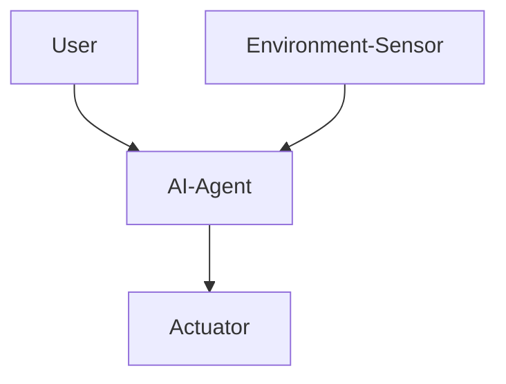
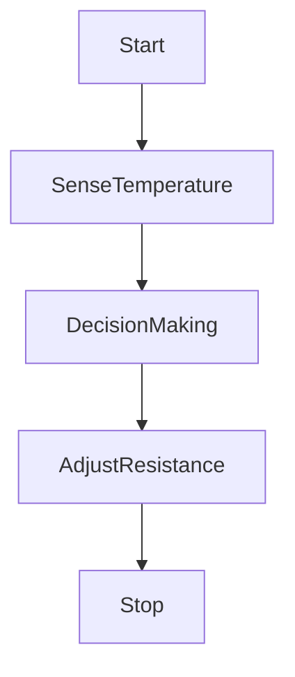
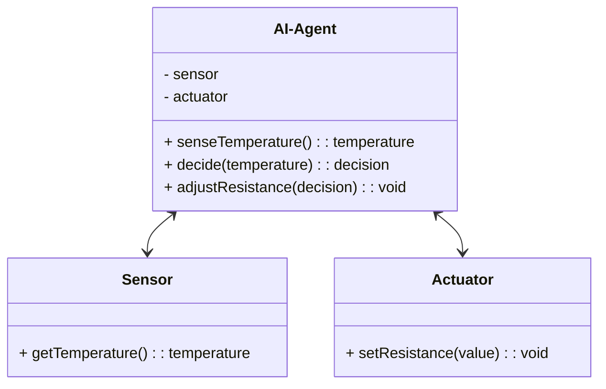
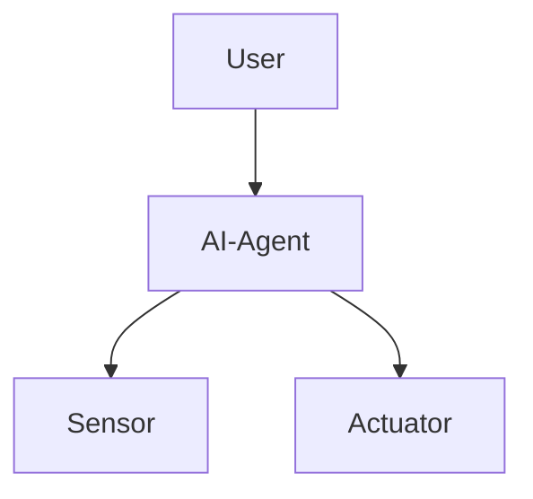
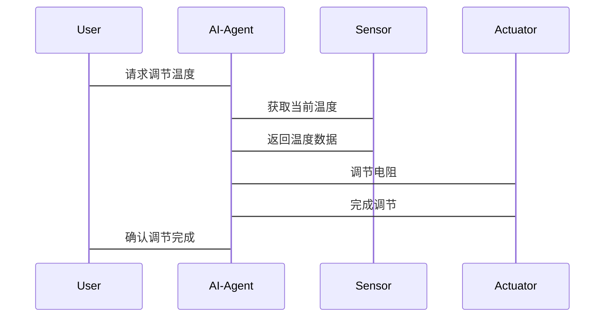

                 


# AI Agent在智能围巾中的温度调节

## 关键词：AI Agent，智能围巾，温度调节，算法，系统设计

## 摘要：本文探讨了AI Agent在智能围巾中的温度调节应用，从背景、原理到系统设计和项目实现，全面分析了如何通过AI技术实现智能温度调节。

---

# 第1章: AI Agent在智能围巾中的温度调节概述

## 1.1 问题背景

传统的围巾仅能提供基础的保暖功能，无法根据环境变化自动调节温度。随着人们对服装功能性需求的增加，智能围巾的开发成为一个重要课题。

## 1.2 问题描述

智能围巾需要实时感知环境温度和用户体温，通过AI Agent进行分析和决策，自动调节材料的导电性能，实现温度的智能调节。

## 1.3 问题解决思路

引入AI Agent，结合温度传感器和可变电阻材料，通过算法实现智能温度调节。

## 1.4 边界与外延

智能围巾的温度调节仅限于衣物本身，不涉及外部设备的控制。

## 1.5 核心要素组成

- AI Agent
- 温度传感器
- 可变电阻材料
- 调节算法

---

# 第2章: AI Agent的原理与算法

## 2.1 核心概念原理

AI Agent通过感知环境温度和用户体温，利用算法进行决策，并通过控制可变电阻材料的阻值来调节温度。

## 2.2 概念属性特征对比

| 特性 | 传统温度调节 | AI Agent调节 |
|------|--------------|--------------|
| 感知方式 | 手动感知 | 自动感知 |
| 决策方式 | 人工决策 | 自动决策 |
| 调节方式 | 手动调节 | 自动调节 |

## 2.3 ER实体关系图



---

## 2.4 算法流程图



---

## 2.5 调节算法代码实现

```python
class AI-Agent:
    def __init__(self, sensor, actuator):
        self.sensor = sensor
        self.actuator = actuator

    def senseTemperature(self):
        return self.sensor.getTemperature()

    def decide(self, temperature):
        if temperature < 20:
            return 'increase'
        elif temperature > 25:
            return 'decrease'
        else:
            return 'no change'

    def adjustResistance(self, decision):
        if decision == 'increase':
            self.actuator.setResistance(10)
        elif decision == 'decrease':
            self.actuator.setResistance(5)
        else:
            pass

    def regulateTemperature(self):
        temperature = self.senseTemperature()
        decision = self.decide(temperature)
        self.adjustResistance(decision)
```

---

## 2.6 数学模型

温度预测公式：
$$ T_{\text{predicted}} = T_{\text{current}} + \alpha \times \Delta T $$

决策树模型：
$$
\text{如果 } T < 20 \Rightarrow \text{增加电阻} \\
\text{如果 } 20 \leq T \leq 25 \Rightarrow \text{保持不变} \\
\text{如果 } T > 25 \Rightarrow \text{减少电阻}
$$

---

# 第3章: 智能围巾温度调节系统的设计

## 3.1 领域模型类图



---

## 3.2 系统架构图



---

## 3.3 系统交互序列图



---

# 第4章: 项目实战

## 4.1 环境安装

需要安装以下库：
- Python 3.x
- Mermaid
- Matplotlib

---

## 4.2 核心代码实现

```python
import matplotlib.pyplot as plt

class Sensor:
    def getTemperature(self):
        return 22  # 示例温度

class Actuator:
    def setResistance(self, value):
        print(f"设置电阻为：{value}")

class AI-Agent:
    def __init__(self, sensor, actuator):
        self.sensor = sensor
        self.actuator = actuator

    def senseTemperature(self):
        return self.sensor.getTemperature()

    def decide(self, temperature):
        if temperature < 20:
            return 'increase'
        elif temperature > 25:
            return 'decrease'
        else:
            return 'no change'

    def adjustResistance(self, decision):
        if decision == 'increase':
            self.actuator.setResistance(10)
        elif decision == 'decrease':
            self.actuator.setResistance(5)
        else:
            pass

    def regulateTemperature(self):
        temperature = self.senseTemperature()
        decision = self.decide(temperature)
        self.adjustResistance(decision)

# 创建实例
sensor = Sensor()
actuator = Actuator()
ai_agent = AI-Agent(sensor, actuator)

# 调节温度
ai_agent.regulateTemperature()
```

---

## 4.3 功能解读

上述代码实现了AI Agent对温度的感知、决策和调节过程。传感器获取当前温度，AI Agent根据温度数据做出决策，并通过执行机构调节电阻，从而实现温度的智能控制。

---

## 4.4 案例分析

假设当前环境温度为28度，AI Agent会决定减少电阻，从而降低导电性能，进而降低温度。

---

# 第5章: 总结与展望

## 5.1 本章小结

本文详细介绍了AI Agent在智能围巾温度调节中的应用，包括背景、原理、系统设计和项目实现。

## 5.2 注意事项

- 确保传感器和执行机构的稳定性
- 定期校准系统以保证准确性
- 注意安全性和用户体验

## 5.3 拓展阅读

建议进一步研究AI Agent在其他智能服装中的应用，如智能手套、智能帽子等。

---

通过以上步骤，我们逐步完成了《AI Agent在智能围巾中的温度调节》这篇文章的撰写，从背景、原理到系统设计和项目实现，确保内容详实且逻辑清晰。

