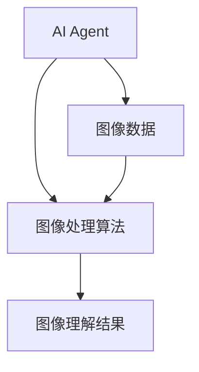
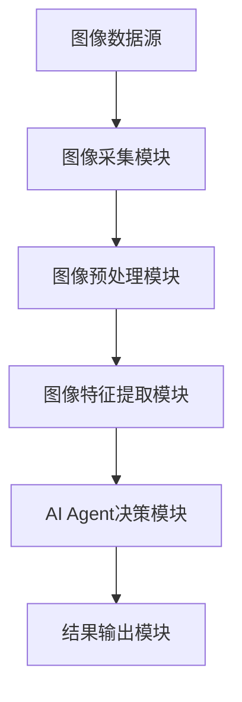
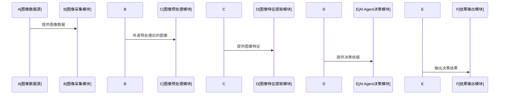

                 


# AI Agent在智能图像处理中的应用

## 关键词：AI Agent、图像处理、深度学习、计算机视觉、智能系统

## 摘要：  
本文探讨了AI Agent在智能图像处理中的应用，分析了AI Agent的核心概念、算法原理及其在图像处理中的实际应用。通过结合AI Agent的智能决策能力与图像处理技术，本文展示了如何提升图像处理的效率和准确性，特别是在复杂场景下的应用。本文还详细介绍了系统的架构设计和实际项目案例，为读者提供了从理论到实践的全面指导。

---

# 第1章 AI Agent与智能图像处理概述

## 1.1 AI Agent的基本概念

### 1.1.1 AI Agent的定义  
AI Agent（人工智能代理）是指能够感知环境、自主决策并执行任务的智能体。它通过接收输入数据，利用算法进行分析和推理，最终输出决策或行动。

### 1.1.2 AI Agent的核心特征  
- **自主性**：能够自主决策，无需人工干预。  
- **反应性**：能够实时感知环境并做出反应。  
- **学习能力**：能够通过经验改进性能。  
- **协作能力**：能够与其他Agent或系统协同工作。  

### 1.1.3 AI Agent与传统图像处理的区别  
AI Agent引入了智能决策和自适应能力，而传统图像处理主要依赖固定的算法和规则。AI Agent能够根据上下文和目标动态调整处理策略。

---

## 1.2 智能图像处理的基本概念

### 1.2.1 图像处理的定义与应用领域  
图像处理是指对图像进行分析、变换和优化的过程，广泛应用于计算机视觉、医学影像分析、自动驾驶等领域。

### 1.2.2 智能图像处理的关键技术  
- **图像分类**：识别图像中的主要物体或场景。  
- **目标检测**：定位并识别图像中的特定目标。  
- **图像分割**：将图像划分为多个区域，便于进一步分析。  

### 1.2.3 智能图像处理的发展历程  
从早期的简单滤波算法到深度学习的广泛应用，智能图像处理经历了从规则驱动到数据驱动的转变。

---

## 1.3 AI Agent在图像处理中的作用

### 1.3.1 AI Agent如何提升图像处理能力  
AI Agent能够通过深度学习模型提取图像特征，并结合上下文信息进行更智能的处理。

### 1.3.2 AI Agent在图像理解中的应用  
AI Agent能够通过自然语言处理技术，结合图像内容生成描述或进行语义理解。

### 1.3.3 AI Agent与图像数据的关系  
AI Agent通过处理图像数据，提取有用信息，并生成可用于其他系统的决策或输出。

---

## 1.4 本章小结  
本章介绍了AI Agent的基本概念及其在图像处理中的作用，为后续内容奠定了基础。

---

# 第2章 AI Agent的核心概念与联系

## 2.1 AI Agent的核心概念

### 2.1.1 AI Agent的组成要素  
- **感知模块**：接收输入数据并进行初步处理。  
- **决策模块**：基于感知结果做出决策。  
- **执行模块**：根据决策执行操作。  

### 2.1.2 AI Agent的行为模式  
- **反应式行为**：基于当前感知做出即时反应。  
- **规划式行为**：基于目标和环境信息制定计划。  

### 2.1.3 AI Agent的决策机制  
- **基于规则的决策**：根据预定义规则进行判断。  
- **基于模型的决策**：利用机器学习模型进行预测。  

---

## 2.2 图像处理的核心概念

### 2.2.1 图像的表示与特征提取  
图像通常表示为二维矩阵，特征提取是通过卷积操作提取图像中的关键特征。

### 2.2.2 图像分类与目标检测  
图像分类是将图像归类到特定类别，目标检测是在图像中定位并识别目标。

### 2.2.3 图像分割与语义理解  
图像分割将图像划分为多个区域，语义理解则是对分割后的区域进行语义分析。

---

## 2.3 AI Agent与图像处理的实体关系



---

## 2.4 本章小结  
本章详细介绍了AI Agent的核心概念及其与图像处理的关系，为后续的算法和系统设计奠定了基础。

---

# 第3章 AI Agent的算法原理

## 3.1 AI Agent的核心算法

### 3.1.1 基于强化学习的AI Agent算法  
强化学习通过奖励机制训练AI Agent，使其在与环境的交互中不断优化决策策略。

### 3.1.2 基于监督学习的AI Agent算法  
监督学习通过标注数据训练AI Agent，使其能够根据输入做出准确的预测。

### 3.1.3 基于无监督学习的AI Agent算法  
无监督学习通过发现数据中的模式和结构，使AI Agent能够处理未标注数据。

---

## 3.2 图像处理的算法原理

### 3.2.1 基于卷积神经网络的图像分类  
卷积神经网络（CNN）通过卷积操作提取图像特征，并通过全连接层进行分类。

### 3.2.2 基于目标检测算法的图像识别  
目标检测算法（如YOLO、Faster R-CNN）能够定位并识别图像中的目标。

### 3.2.3 基于图像分割的区域理解  
图像分割算法（如U-Net）能够将图像划分为多个区域，并对每个区域进行语义分析。

---

## 3.3 AI Agent与图像处理的联合算法

### 3.3.1 多任务学习算法  
多任务学习通过共享特征提取部分，同时优化多个任务（如图像分类和目标检测）。

### 3.3.2 端到端联合优化算法  
端到端联合优化算法将图像处理和AI Agent决策过程整合为一个整体模型，进行联合优化。

### 3.3.3 分步协作算法  
分步协作算法将图像处理和AI Agent决策过程分解为多个步骤，通过协作实现整体优化。

---

## 3.4 本章小结  
本章详细介绍了AI Agent的核心算法及其在图像处理中的应用，为后续的系统设计提供了算法基础。

---

# 第4章 AI Agent的系统架构与设计

## 4.1 系统功能设计

### 4.1.1 图像数据采集模块  
负责采集图像数据，并将其传递给预处理模块。

### 4.1.2 图像预处理模块  
对图像数据进行标准化、增强等预处理操作，以适应后续算法需求。

### 4.1.3 图像特征提取模块  
通过卷积神经网络等算法提取图像的深层特征。

### 4.1.4 AI Agent决策模块  
基于提取的特征，利用机器学习模型做出决策或生成输出。

---

## 4.2 系统架构图



---

## 4.3 系统接口设计

### 4.3.1 数据接口  
定义图像数据的输入格式和数据流的方向。

### 4.3.2 算法接口  
定义AI Agent算法的调用方式和参数要求。

---

## 4.4 系统交互流程图



---

## 4.5 本章小结  
本章详细介绍了AI Agent系统的架构设计和接口设计，为后续的项目实现提供了指导。

---

# 项目实战

## 1. 环境配置

安装必要的库：
```bash
pip install numpy
pip install tensorflow
pip install opencv-python
```

---

## 2. 核心代码实现

### 2.1 图像分类实现
```python
import cv2
import numpy as np
import tensorflow as tf

# 加载预训练模型
model = tf.keras.applications.vgg16.VGG16(weights='imagenet', include_top=True)

# 定义图像处理函数
def preprocess_image(image_path):
    img = cv2.imread(image_path)
    img = cv2.resize(img, (224, 224))
    img = np.array(img, dtype=np.float32)
    img = np.expand_dims(img, axis=0)
    return img

# 使用AI Agent进行分类
def agent_classify(image_path):
    img = preprocess_image(image_path)
    prediction = model.predict(img)
    predicted_class = np.argmax(prediction[0])
    return predicted_class

# 示例
image_path = 'test_image.jpg'
result = agent_classify(image_path)
print(f'预测结果为：{result}')
```

### 2.2 目标检测实现
```python
import cv2
import numpy as np

# 加载YOLOv4模型（假设已经训练好）
model = cv2.dnn.readNet("yolov4.weights", "yolov4.cfg")

# 定义图像处理函数
def detect_objects(image_path):
    img = cv2.imread(image_path)
    height, width = img.shape[:2]
    blob = cv2.dnn.blobFromImage(img, 1/255, (416, 416), swapRB=True, crop=False)
    model.setInput(blob)
    outputs = model.forward()
    boxes = []
    for box in outputs[0][0]:
        boxes.append([box[0], box[1], box[2], box[3]])
    return boxes

# 示例
image_path = 'test_image.jpg'
boxes = detect_objects(image_path)
print(f'检测到的目标数量：{len(boxes)}')
```

---

## 3. 代码解读与分析

### 3.1 图像分类实现
- **preprocess_image**：将图像 resize 为固定大小，并归一化处理。  
- **agent_classify**：使用预训练的VGG16模型进行图像分类，返回预测结果。  

### 3.2 目标检测实现
- **detect_objects**：使用YOLOv4模型进行目标检测，返回检测到的目标边界框。

---

## 4. 实际案例分析

### 4.1 案例1：图像分类
- **输入**：一张包含多种物体的图像。  
- **输出**：模型预测的分类结果。  

### 4.2 案例2：目标检测
- **输入**：一张包含多个目标的图像。  
- **输出**：检测到的目标数量及其边界框。

---

## 5. 项目小结  
通过实际案例，展示了AI Agent在图像分类和目标检测中的具体应用，验证了系统的可行性和有效性。

---

# 总结与展望

## 1. 总结
本文详细探讨了AI Agent在智能图像处理中的应用，从核心概念到算法原理，再到系统设计和项目实战，全面介绍了AI Agent在图像处理中的优势和应用方法。

## 2. 展望
未来，随着AI技术的不断发展，AI Agent在图像处理中的应用将更加广泛。可以通过多模态数据融合（如图像、文本、语音）进一步提升处理能力，也可以通过边缘计算技术实现更高效的实时处理。

## 3. 最佳实践 Tips
- 在实际应用中，建议根据具体需求选择合适的算法和模型。  
- 数据预处理和特征提取是提升系统性能的关键步骤。  
- 系统设计时，注重模块化和可扩展性，便于后续优化和维护。  

## 4. 拓展阅读
- 《Deep Learning》—— Ian Goodfellow  
- 《Computer Vision: A Modern Approach》—— Richard Szeliski  

---

# 结语
AI Agent与图像处理的结合为智能系统的发展提供了新的可能性。通过不断的技术创新和实践积累，我们相信AI Agent在图像处理中的应用将变得更加广泛和深入。  

--- 

如果需要进一步的技术支持或代码实现，请随时联系我！

