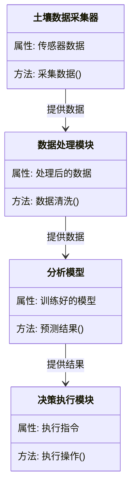
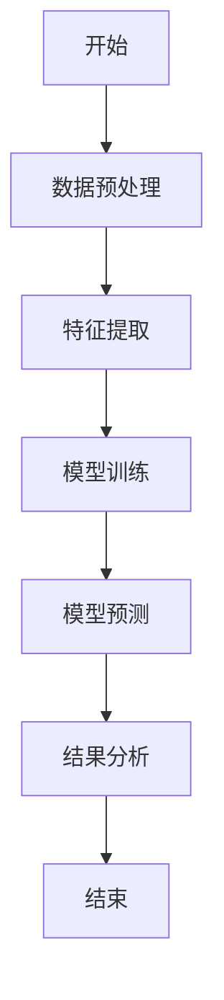
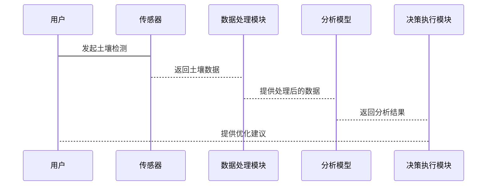

                 


---

# AI Agent在智能土壤分析中的实践

> 关键词：AI Agent，智能土壤分析，机器学习，深度学习，土壤健康，农业优化

> 摘要：本文探讨了AI Agent在智能土壤分析中的应用，从背景到实践，详细介绍了AI Agent的核心概念、算法原理、系统架构以及项目实战。通过实际案例分析，展示了AI Agent如何帮助优化土壤健康监测和农业管理，为读者提供了一套完整的解决方案。

---

# 第一部分: AI Agent在智能土壤分析中的背景与基础

## 第1章: 智能土壤分析的背景与挑战

### 1.1 土壤分析的重要性
#### 1.1.1 土壤在农业和环境科学中的作用
土壤是农业生产和生态系统的核心要素。健康的土壤能够支持植物生长，维持生态平衡，并为人类提供食物和资源。然而，随着工业化和城市化的快速发展，土壤污染、酸化和退化等问题日益严重，威胁着全球粮食安全和环境可持续性。

#### 1.1.2 传统土壤分析方法的局限性
传统土壤分析方法依赖于实验室检测，耗时长、成本高且效率低。此外，传统方法难以实时监测土壤动态变化，无法满足现代农业对高效、精准土壤管理的需求。

#### 1.1.3 智能土壤分析的必要性
AI Agent技术的引入，为土壤分析提供了新的解决方案。通过实时数据采集、智能决策和自动化执行，AI Agent能够显著提高土壤分析的效率和准确性，为农业优化和环境管理提供有力支持。

---

### 1.2 AI Agent的基本概念与特点
#### 1.2.1 AI Agent的定义与核心功能
AI Agent是一种智能体，能够感知环境、做出决策并执行动作。在土壤分析中，AI Agent可以通过传感器数据实时监测土壤状况，结合历史数据和专家知识，提供优化建议。

#### 1.2.2 AI Agent在土壤分析中的优势
AI Agent具有以下优势：
- **实时性**：能够实时采集和分析土壤数据。
- **准确性**：通过机器学习算法提高分析结果的准确性。
- **自适应性**：能够根据土壤变化动态调整分析策略。

#### 1.2.3 AI Agent与传统自动化的区别
传统自动化依赖预定义规则，而AI Agent能够学习和适应新的数据模式，具有更强的灵活性和适应性。

---

### 1.3 智能土壤分析的场景与应用
#### 1.3.1 智能土壤分析的典型场景
- **实时监测**：通过传感器实时采集土壤温度、湿度、pH值等数据。
- **精准施肥**：根据土壤养分状况推荐最优施肥方案。
- **病害预警**：通过数据分析预测土壤病害风险。

#### 1.3.2 AI Agent在土壤分析中的具体应用
- **数据采集**：利用传感器和无人机采集土壤数据。
- **特征提取**：从数据中提取关键特征，如有机质含量、氮磷钾含量等。
- **模型训练**：使用机器学习算法训练土壤分类模型。
- **结果分析**：根据模型输出结果制定优化措施。

#### 1.3.3 智能土壤分析的未来趋势
随着AI技术的进步，智能土壤分析将更加智能化和自动化，推动农业向精准化和可持续方向发展。

---

## 1.4 本章小结
本章介绍了智能土壤分析的背景和挑战，详细阐述了AI Agent的基本概念和特点，并探讨了其在土壤分析中的应用场景和未来发展趋势。通过本章，读者可以理解AI Agent在智能土壤分析中的重要性及其潜在价值。

---

# 第二部分: AI Agent的核心概念与技术原理

## 第2章: AI Agent的核心概念与系统架构

### 2.1 AI Agent的核心概念
#### 2.1.1 AI Agent的感知、决策与执行机制
AI Agent在土壤分析中的工作流程包括：
1. **感知**：通过传感器采集土壤数据。
2. **决策**：基于数据进行分析和预测，生成优化建议。
3. **执行**：根据决策结果采取相应行动，如调整灌溉或施肥。

#### 2.1.2 土壤分析中的关键特征提取
关键特征包括：
- 土壤pH值
- 土壤湿度
- 土壤有机质含量
- 土壤养分（氮、磷、钾）

#### 2.1.3 AI Agent与土壤数据的关系
AI Agent通过处理和分析土壤数据，提取有用信息并生成决策建议。

---

### 2.2 AI Agent的系统架构
#### 2.2.1 系统功能模块划分
- 数据采集模块：负责采集土壤数据。
- 数据处理模块：对数据进行清洗和预处理。
- 模型训练模块：训练土壤分析模型。
- 决策执行模块：根据模型输出执行相应操作。

#### 2.2.2 系统架构的ER实体关系图
```mermaid
er
    actor: 用户
    soil_data: 土壤数据
    agent: AI Agent
    analysis_result: 分析结果
    rules: 规则库
    actor --> soil_data: 提供土壤数据
    soil_data --> agent: 数据输入
    agent --> analysis_result: 输出分析结果
    analysis_result --> actor: 提供反馈
    agent --> rules: 应用规则
```

#### 2.2.3 系统架构的类图


---

### 2.3 AI Agent的算法原理
#### 2.3.1 基于机器学习的土壤分析算法
常用的算法包括：
- **决策树**：用于分类和回归任务。
- **随机森林**：用于特征重要性分析和高精度预测。
- **支持向量机（SVM）**：用于分类任务。

#### 2.3.2 深度学习在土壤分析中的应用
常用的深度学习模型包括：
- **卷积神经网络（CNN）**：用于图像处理和特征提取。
- **长短期记忆网络（LSTM）**：用于时间序列数据的预测。

#### 2.3.3 算法流程图


---

### 2.4 本章小结
本章详细介绍了AI Agent的核心概念和系统架构，探讨了其在土壤分析中的算法原理和系统设计。通过本章，读者可以理解AI Agent在智能土壤分析中的技术实现和系统结构。

---

# 第三部分: AI Agent在智能土壤分析中的项目实战

## 第3章: 项目实战

### 3.1 环境安装与数据准备
#### 3.1.1 环境安装
需要安装以下库：
- Python 3.8+
- scikit-learn
- TensorFlow
- Pandas
- NumPy

#### 3.1.2 数据准备
数据来源包括：
- 传感器数据
- 土壤样本数据
- 历史气象数据

---

### 3.2 系统核心实现
#### 3.2.1 数据预处理
```python
import pandas as pd
import numpy as np

# 读取数据
data = pd.read_csv('soil_data.csv')

# 删除缺失值
data.dropna(inplace=True)

# 标准化处理
from sklearn.preprocessing import StandardScaler
scaler = StandardScaler()
scaled_data = scaler.fit_transform(data)
```

#### 3.2.2 模型训练与预测
```python
from sklearn.ensemble import RandomForestClassifier
from sklearn.metrics import accuracy_score

# 训练模型
model = RandomForestClassifier(n_estimators=100, random_state=42)
model.fit(scaled_data, labels)

# 预测结果
predictions = model.predict(new_data)
print("Accuracy:", accuracy_score(labels, predictions))
```

#### 3.2.3 系统交互流程


---

### 3.3 实际案例分析
#### 3.3.1 案例背景
某农场的土壤出现酸化问题，影响作物产量。通过AI Agent分析，农场实现了精准施肥，土壤pH值恢复正常。

#### 3.3.2 数据分析与优化
通过模型分析，发现土壤pH值与氮肥用量密切相关。AI Agent建议减少氮肥用量，同时增加有机肥施用量。

---

### 3.4 项目小结
通过本章的实战，读者可以了解AI Agent在智能土壤分析中的具体实现过程，包括数据处理、模型训练和系统交互等方面。

---

# 第四部分: 最佳实践与总结

## 第4章: 最佳实践与总结

### 4.1 小结
AI Agent在智能土壤分析中的应用为农业和环境科学提供了新的解决方案。通过实时数据采集、智能分析和优化决策，AI Agent显著提高了土壤管理的效率和准确性。

### 4.2 注意事项
- 数据质量是模型性能的关键，需确保数据的准确性和完整性。
- 模型的选择需根据具体场景和数据特征进行调整。
- 系统设计需考虑可扩展性和可维护性。

### 4.3 拓展阅读
- 《机器学习实战》
- 《深度学习》
- 《土壤学原理》

---

# 附录: AI Agent在智能土壤分析中的数学公式

### 1. 决策树算法
决策树的构建过程可以用以下公式表示：
$$
Gini impurity = \sum_{i=1}^{n} p_i (1 - p_i)
$$

### 2. 随机森林算法
随机森林的预测结果是多个决策树投票的结果：
$$
y_{pred} = \text{多数投票}(y_1, y_2, ..., y_n)
$$

### 3. 支持向量机（SVM）
SVM的目标是最优化以下目标函数：
$$
\frac{1}{2}||\mathbf{w}||^2 + C \sum_{i=1}^{n} \xi_i
$$

### 4. 卷积神经网络（CNN）
CNN的卷积层计算公式为：
$$
f(x) = \max(0, x)
$$

---

# 结语
通过本文的详细讲解和实战案例，读者可以全面了解AI Agent在智能土壤分析中的应用及其技术实现。希望本文能够为农业和环境科学领域的人士提供有价值的参考和启发。

---

