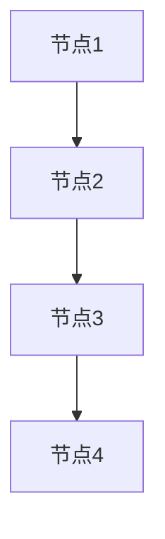
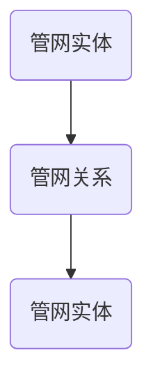
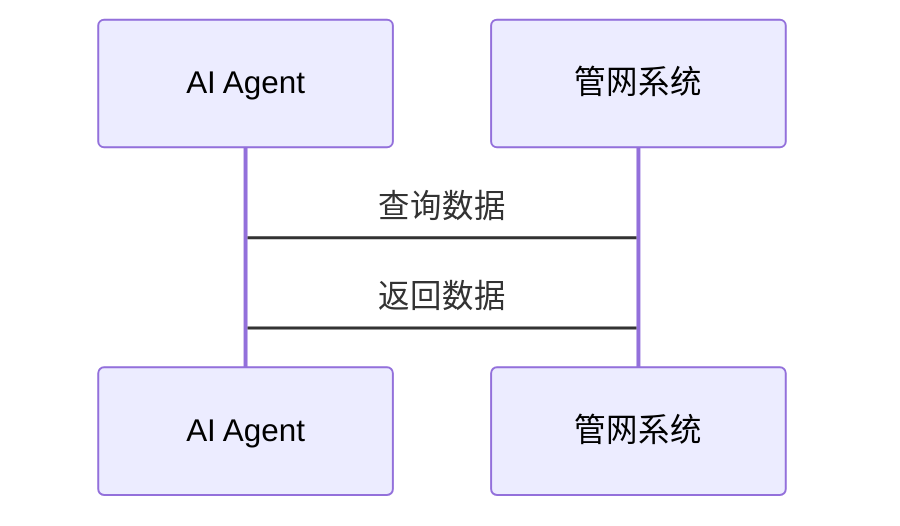
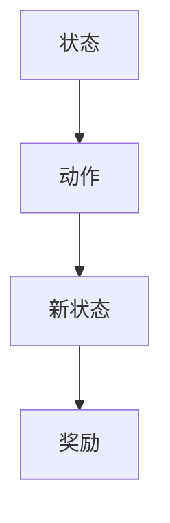
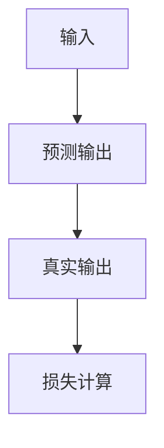
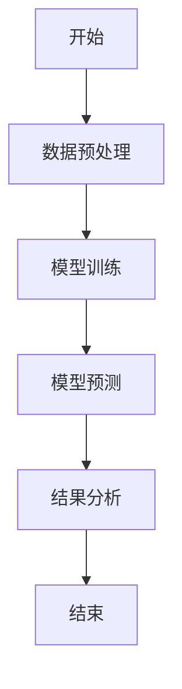
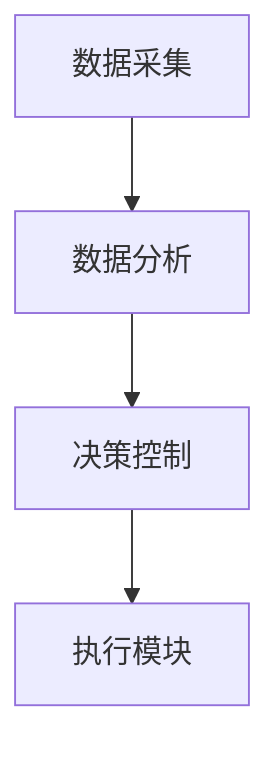
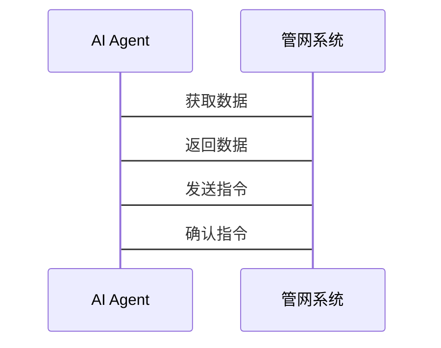

                 


# AI Agent在智能地下管网维护中的实践

## 关键词
AI Agent，智能地下管网，算法原理，系统架构，项目实战

## 摘要
随着城市化进程的加快，地下管网的复杂性和维护难度日益增加。AI Agent作为一种智能代理，通过机器学习和自动化技术，能够有效解决地下管网维护中的诸多难题。本文详细探讨AI Agent在地下管网维护中的应用场景、算法原理、系统架构设计以及实际案例，为读者提供全面的技术解读。

---

## 目录大纲

### 第一部分: AI Agent在智能地下管网维护中的背景与概念

#### 第1章: 背景介绍

##### 1.1 问题背景
###### 1.1.1 地下管网维护的重要性
地下管网是城市运行的“生命线”，包括供水、供气、供电、通信等基础设施。其复杂性和隐蔽性使得维护工作面临巨大挑战。

###### 1.1.2 当前地下管网维护的痛点
- 传统维护方式效率低、成本高
- 管网数据分散，难以实时监控
- 突发事故响应不及时

###### 1.1.3 AI Agent的应用价值
AI Agent能够实时感知管网状态，优化维护策略，显著提升维护效率和准确性。

##### 1.2 问题描述
###### 1.2.1 地下管网的复杂性
管网结构复杂，覆盖范围广，且埋设深度大，维护难度高。

###### 1.2.2 维护工作中的挑战
- 数据获取困难
- 维护决策依赖人工经验
- 应急响应能力不足

###### 1.2.3 AI Agent如何解决这些问题
通过智能感知、自主决策和执行操作，AI Agent能够实现管网的智能化维护。

#### 第2章: 核心概念与联系

##### 2.1 AI Agent的基本原理
###### 2.1.1 AI Agent的定义
AI Agent是一种智能实体，能够感知环境、自主决策并执行任务。

###### 2.1.2 AI Agent的核心特征
- 智能性
- 自主性
- 社会性
- 反应性

###### 2.1.3 AI Agent与传统自动化的区别
AI Agent具有学习和适应能力，能够处理复杂和动态的环境。

##### 2.2 地下管网结构的实体关系
###### 2.2.1 管网结构的ER图
```mermaid
erDiagram
    node 管网实体 {
        id
        类型
        位置
    }
    node 管网关系 {
        关联id
        关联类型
    }
    管网实体 --> 管网关系 : 包含
```

###### 2.2.2 管网节点与路径的关系


###### 2.2.3 实体关系的Mermaid图


##### 2.3 AI Agent与地下管网的关系
###### 2.3.1 AI Agent在管网维护中的角色
- 数据采集与分析
- 故障诊断与修复
- 维护计划优化

###### 2.3.2 AI Agent与管网数据的交互


###### 2.3.3 AI Agent在管网优化中的作用
通过优化算法，AI Agent能够实现管网资源的高效配置和能耗降低。

#### 第3章: 算法原理与数学模型

##### 3.1 算法原理
###### 3.1.1 强化学习算法


###### 3.1.2 监督学习算法


###### 3.1.3 算法流程的Mermaid图


##### 3.2 数学模型
###### 3.2.1 损失函数
$$ L = \frac{1}{2} (y_{\text{pred}} - y_{\text{true}})^2 $$

###### 3.2.2 优化目标
$$ \text{Minimize} \quad L \quad \text{with respect to} \quad \theta $$

###### 3.2.3 模型训练的数学推导
通过梯度下降优化模型参数，最小化损失函数，提高预测准确性。

### 第二部分: 系统分析与架构设计

#### 第4章: 系统分析与架构设计

##### 4.1 问题场景分析
###### 4.1.1 地下管网维护的场景
- 数据采集与处理
- 故障诊断与修复
- 维护计划优化

##### 4.2 系统架构设计
###### 4.2.1 系统功能模块
- 数据采集模块
- 数据分析模块
- 决策控制模块

###### 4.2.2 系统架构的Mermaid图


##### 4.3 接口设计与交互流程
###### 4.3.1 系统接口定义
- 数据接口：获取管网实时数据
- 控制接口：发送维护指令
- 状态接口：查询系统状态

###### 4.3.2 交互流程的Mermaid序列图


### 第三部分: 项目实战

#### 第5章: 项目实战

##### 5.1 环境安装
###### 5.1.1 系统环境要求
- 操作系统：Linux/Windows
- Python版本：3.6以上
- 依赖库：TensorFlow, Keras, Mermaid

##### 5.1.2 安装步骤
```bash
pip install tensorflow
pip install keras
pip install mermaid
```

##### 5.2 核心代码实现

###### 5.2.1 数据采集模块
```python
import tensorflow as tf
import numpy as np

# 数据预处理
def preprocess(data):
    # 数据清洗和特征提取
    return processed_data

# 数据采集
def fetch_data():
    # 从数据库或API获取数据
    return data

# 数据预处理
data = fetch_data()
processed_data = preprocess(data)
```

###### 5.2.2 模型训练与预测
```python
# 模型定义
model = tf.keras.Sequential([
    tf.keras.layers.Dense(64, activation='relu'),
    tf.keras.layers.Dense(1, activation='sigmoid')
])

# 编译模型
model.compile(optimizer='adam', loss='binary_crossentropy', metrics=['accuracy'])

# 训练模型
model.fit(processed_data, labels, epochs=10, batch_size=32)

# 模型预测
predictions = model.predict(new_data)
```

##### 5.3 代码解读与分析
- 数据预处理：清洗和特征提取，确保模型输入的准确性。
- 模型训练：使用深度学习模型进行训练，优化损失函数，提高预测精度。
- 模型预测：基于训练好的模型，进行实时预测，指导维护工作。

##### 5.4 案例分析与结果展示
###### 5.4.1 案例分析
- 某城市供水管网维护案例
- 管网漏损检测与修复
- 维护成本降低的具体数据

###### 5.4.2 结果展示
- 维护效率提升：从传统方式到AI Agent方式的对比
- 维护成本降低：具体数据和经济效益分析

##### 5.5 项目小结
通过实际案例验证，AI Agent在地下管网维护中的应用显著提升了维护效率和准确性，降低了维护成本。

### 第四部分: 最佳实践

#### 第6章: 最佳实践

##### 6.1 小结
AI Agent的应用为地下管网维护带来了革命性的变化，未来将更加智能化和自动化。

##### 6.2 注意事项
- 数据质量：确保数据的准确性和完整性
- 系统安全：保护管网数据的安全
- 人员培训：加强操作人员的技术培训

##### 6.3 拓展阅读
- 推荐书籍：《机器学习实战》、《深度学习入门》
- 推荐博客：技术博客和行业资讯

---

通过以上结构和内容，文章详细探讨了AI Agent在智能地下管网维护中的应用，从理论到实践，为读者提供了全面的技术解读和实践指导。

