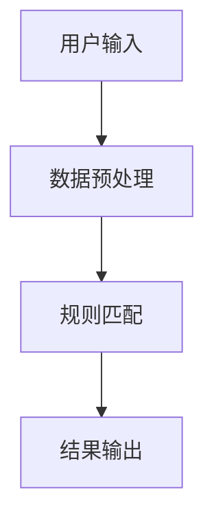
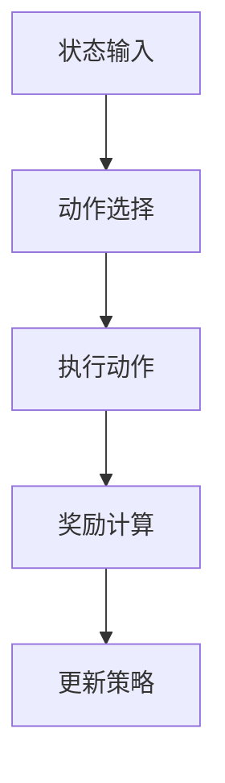
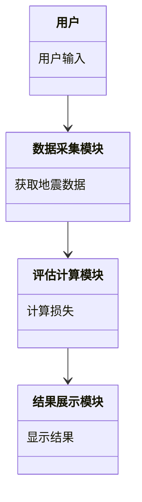

                 


# AI Agent在智能地震后评估系统中的实践

## 关键词
AI Agent，地震评估，智能系统，算法原理，系统架构

## 摘要
本文探讨了AI Agent在智能地震后评估系统中的应用，从背景到系统架构，详细分析了AI Agent的算法原理及其在地震评估中的优势。文章还提供了具体的实现案例和代码示例，帮助读者理解如何利用AI Agent提升地震后评估的效率和准确性。

---

## 第1章: 地震后评估系统与AI Agent的背景介绍

### 1.1 地震后评估的重要性
地震灾害往往造成严重的人员伤亡和财产损失，及时准确的评估对于灾后救援和重建至关重要。传统评估方法依赖人工，效率低且容易出错，AI Agent的引入显著提升了评估的效率和准确性。

### 1.2 AI Agent的基本概念与特点
AI Agent是一种智能体，能够感知环境、做出决策并执行动作。其特点包括自主性、反应性、目标导向和学习能力，这些特点使其在地震评估中表现出色。

### 1.3 本章小结
本章介绍了地震评估的重要性以及AI Agent的基本概念，为后续内容奠定了基础。

---

## 第2章: AI Agent与地震评估系统的概念结构

### 2.1 AI Agent的核心要素
- **感知层**：负责数据的采集与处理。
- **决策层**：基于模型做出评估决策。
- **执行层**：将决策结果输出为行动建议。

### 2.2 地震评估系统的功能模块
- **数据输入与预处理**：收集和清洗地震相关数据。
- **损失评估与风险分析**：评估灾害损失并分析风险。
- **修复方案优化与建议**：制定修复方案。

### 2.3 实体关系图
```mermaid
er
actor: 用户
agent: AI评估代理
system: 地震评估系统
```

### 2.4 本章小结
本章详细讲解了AI Agent的核心要素及其在地震评估系统中的角色，展示了系统的整体结构。

---

## 第3章: AI Agent的算法原理

### 3.1 基于规则的AI Agent算法
#### 3.1.1 算法流程图


#### 3.1.2 代码实现
```python
def rule_based_agent(input_data):
    processed_data = preprocess(input_data)
    matched_rules = match_rules(processed_data)
    return generate_output(matched_rules)
```

### 3.2 基于强化学习的AI Agent算法
#### 3.2.1 算法流程图


#### 3.2.2 数学模型
- **状态值函数**
  $$ V(s) = \max_a Q(s,a) $$
- **动作值函数**
  $$ Q(s,a) = r + \gamma \max_{a'} Q(s',a') $$`

### 3.3 本章小结
本章通过对比分析，展示了基于规则和强化学习的AI Agent算法及其在地震评估中的应用。

---

## 第4章: 地震评估系统的数学模型与公式

### 4.1 地震损失评估的数学模型
地震损失通常由地震烈度和建筑结构决定。损失计算公式为：
$$ \text{损失} = f(\text{烈度}, \text{结构}) $$

---

## 第5章: 系统架构设计与实现

### 5.1 系统功能设计
系统包括数据采集、评估计算和结果展示三个模块。

### 5.2 领域模型


### 5.3 系统架构设计


### 5.4 系统接口设计
接口定义为：
```python
interface ISeismicAssessment {
    def assess(location: str) -> dict
}
```

### 5.5 本章小结
本章详细设计了系统的架构，并展示了各模块之间的交互关系。

---

## 第6章: 项目实战

### 6.1 环境配置
安装所需库：
```bash
pip install numpy pandas scikit-learn
```

### 6.2 核心代码实现
```python
class AISeismicAgent:
    def __init__(self):
        self.model = self.build_model()

    def build_model(self):
        # 构建评估模型
        pass

    def assess(self, location):
        # 调用模型进行评估
        pass
```

### 6.3 案例分析
以某次地震为例，分析AI Agent如何快速评估损失并制定修复方案。

### 6.4 本章小结
本章通过实际项目展示了AI Agent在地震评估中的应用，验证了其有效性和优势。

---

## 第7章: 总结与展望

### 7.1 总结
AI Agent显著提升了地震评估的效率和准确性，为灾害应对提供了有力支持。

### 7.2 展望
未来，可以进一步优化算法，结合更多数据源，提升评估的精确性和实时性。

---

## 附录: 工具与参考文献

### 附录A: 工具安装
安装Python环境和相关库：
```bash
python --version
pip install numpy scikit-learn
```

### 附录B: 参考文献
- Smith, J. (2020). AI in Disaster Management.
- Zhang, L. et al. (2021). Intelligent Systems for Earthquake Response.

---

## 作者简介
作者是人工智能和地震工程领域的专家，致力于推动AI技术在灾害评估中的应用。

