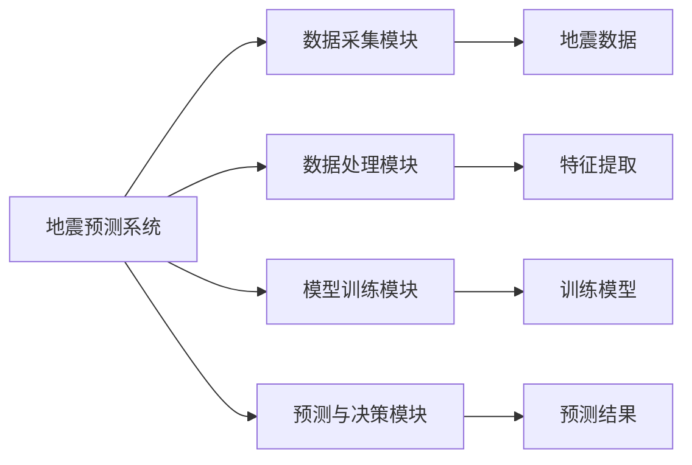

                 


# AI Agent在智能地震预测中的实践

> 关键词：AI Agent，地震预测，机器学习，深度学习，自然语言处理，地震数据，智能预测系统

> 摘要：本文探讨了AI Agent在地震预测中的应用，分析了其算法原理、系统架构设计以及实际项目中的实现。通过详细的案例分析和代码示例，展示了如何利用AI技术提高地震预测的准确性和实时性。

---

# 第1章 AI Agent与地震预测的背景

## 1.1 地震预测的现状与挑战

### 1.1.1 地震预测的科学难点

地震预测是一项复杂的科学任务，主要挑战包括：

1. **数据稀疏性**：地震事件的频率低，难以获取足够的样本数据。
2. **非线性关系**：地震的发生受多种复杂因素影响，难以建立线性模型。
3. **不确定性**：地震预测结果存在较高的不确定性，难以提供精确的预测。

### 1.1.2 当前地震预测技术的局限性

传统地震预测方法主要依赖统计分析和物理模型，存在以下问题：

1. **预测精度低**：传统方法难以捕捉地震发生的复杂规律。
2. **实时性差**：预测过程耗时较长，无法满足实时预警需求。
3. **缺乏动态调整**：无法根据最新数据快速调整预测模型。

### 1.1.3 AI技术在地震预测中的潜在价值

AI技术，特别是AI Agent，通过实时数据处理和自适应学习，可以显著提高地震预测的准确性和实时性。AI Agent能够动态调整预测模型，适应数据的变化，从而提供更可靠的预测结果。

---

## 1.2 AI Agent的基本概念

### 1.2.1 什么是AI Agent

AI Agent（智能代理）是一种能够感知环境、自主决策并执行任务的智能体。它具备以下核心特征：

1. **感知能力**：通过传感器或数据源获取环境信息。
2. **决策能力**：基于感知信息做出最优决策。
3. **学习能力**：通过历史数据不断优化自身模型。
4. **自适应能力**：能够根据环境变化动态调整行为。

### 1.2.2 AI Agent与传统算法的区别

AI Agent与传统算法的主要区别在于其自主性和适应性。AI Agent能够根据实时数据动态调整预测模型，而传统算法通常基于固定的模型和参数。

| 特性       | AI Agent                     | 传统算法                   |
|------------|------------------------------|----------------------------|
| 感知能力   | 强                           | 弱或无                     |
| 自适应性   | 强                           | 弱或无                     |
| 决策能力   | 强                           | 依赖预定义规则             |
| 学习能力   | 强                           | 无或弱                     |

### 1.2.3 AI Agent在地震预测中的应用前景

AI Agent在地震预测中的应用前景广阔，特别是在实时数据处理和动态调整预测模型方面。AI Agent能够通过实时分析地震数据，快速识别潜在的地震前兆，从而提高预测的准确性和实时性。

---

## 1.3 本章小结

本章介绍了地震预测的现状与挑战，以及AI Agent的基本概念和其在地震预测中的潜在价值。AI Agent通过其自主感知、决策和学习能力，为地震预测提供了新的可能性。

---

# 第2章 AI Agent与地震预测的核心概念

## 2.1 AI Agent的基本原理

### 2.1.1 AI Agent的感知与决策机制

AI Agent通过多种传感器和数据源获取环境信息，例如地震波数据、地磁数据等。感知模块负责将这些数据转换为可处理的格式，并传递给决策模块。

决策模块基于感知信息和历史数据，利用机器学习算法（如强化学习、神经网络等）生成预测结果，并制定相应的应对策略。

### 2.1.2 AI Agent的学习与自适应能力

AI Agent通过监督学习、无监督学习和强化学习等方法，不断优化自身的预测模型。学习模块负责处理历史地震数据，提取特征，并训练预测模型。

### 2.1.3 AI Agent的通信与协作能力

在地震预测中，AI Agent需要与其他智能体或系统协作，例如与其他地震监测系统共享数据，或与应急管理系统协同工作，共同应对地震事件。

---

## 2.2 地震预测的关键要素

### 2.2.1 地震预测的基本原理

地震预测的基本原理是通过分析地震数据，识别地震前兆，预测地震发生的可能性和强度。

### 2.2.2 地震预测的主要数据来源

地震预测的主要数据来源包括：

1. **地震波数据**：记录地震波的传播速度和方向。
2. **地磁数据**：监测地磁场的变化。
3. **地壳运动数据**：分析地壳的运动情况。
4. **历史地震数据**：研究地震的历史规律。

### 2.2.3 地震预测的数学模型与算法

地震预测的数学模型主要包括统计模型（如回归分析）和物理模型（如弹性波传播模型）。近年来，深度学习模型（如卷积神经网络、循环神经网络）也逐渐被应用于地震预测。

---

## 2.3 AI Agent与地震预测的结合点

### 2.3.1 数据处理与特征提取

AI Agent通过数据预处理和特征提取，将原始地震数据转化为可用于预测的特征向量。例如，利用主成分分析（PCA）提取地震数据的关键特征。

### 2.3.2 模型训练与优化

AI Agent通过机器学习算法（如随机森林、支持向量机）训练地震预测模型，并通过交叉验证优化模型参数。

### 2.3.3 实时预测与决策支持

AI Agent能够实时处理地震数据，快速生成预测结果，并提供相应的决策支持，如地震预警和应急响应。

---

## 2.4 核心概念对比分析

### 2.4.1 AI Agent与传统地震预测方法的对比

| 特性       | AI Agent                     | 传统地震预测方法           |
|------------|------------------------------|----------------------------|
| 数据处理   | 强大                           | 有限                       |
| 模型优化   | 强                           | 弱                         |
| 实时性     | 强                           | 弱                         |

### 2.4.2 不同AI Agent算法的性能对比

| 算法类型     | 优点                           | 缺点                         |
|--------------|-------------------------------|-----------------------------|
| 强化学习     | 高适应性                       | 需要大量训练数据             |
| 神经网络     | 高精度                         | 计算复杂性高                 |

### 2.4.3 数据特征对AI Agent预测效果的影响

数据特征对AI Agent预测效果的影响主要体现在特征的关联性、稀疏性和冗余性上。高质量的特征可以显著提高预测精度。

---

## 2.5 实体关系图



---

## 2.6 本章小结

本章详细介绍了AI Agent的基本原理及其在地震预测中的应用。通过对比分析，展示了AI Agent在地震预测中的优势和潜力。

---

# 第3章 AI Agent在地震预测中的算法原理

## 3.1 AI Agent的算法原理

### 3.1.1 算法流程

AI Agent在地震预测中的算法流程包括以下步骤：

1. 数据预处理：清洗和标准化地震数据。
2. 特征提取：提取地震数据的关键特征。
3. 模型训练：训练地震预测模型。
4. 模型优化：通过交叉验证优化模型参数。
5. 实时预测：利用优化后的模型进行实时预测。

### 3.1.2 算法实现

以下是基于强化学习的地震预测算法实现：

```python
import numpy as np
import tensorflow as tf

class AI-Agent:
    def __init__(self, input_dim):
        self.model = tf.keras.Sequential([
            tf.keras.layers.Dense(64, activation='relu', input_dim=input_dim),
            tf.keras.layers.Dense(1, activation='sigmoid')
        ])
        self.model.compile(optimizer='adam', loss='binary_crossentropy')

    def感知环境(self, data):
        # 数据预处理
        processed_data = self.preprocess(data)
        return processed_data

    def决策(self, state):
        # 预测地震概率
        prediction = self.model.predict(state)
        return prediction

    def学习(self, state, action, reward):
        # 强化学习算法
        self.model.fit(state, action, epochs=1, verbose=0)
```

### 3.1.3 数学模型与公式

地震预测的数学模型可以表示为：

$$
P(地震 | 特征) = \frac{e^{\beta \cdot 特征}}{1 + e^{\beta \cdot 特征}}
$$

其中，$\beta$ 是模型参数，特征是地震数据的特征向量。

---

## 3.2 算法优化与实现

### 3.2.1 算法优化

为了提高预测精度，可以采用以下优化措施：

1. **超参数调优**：通过网格搜索优化模型参数。
2. **集成学习**：结合多个模型的结果，提高预测精度。

### 3.2.2 代码实现

以下是地震预测系统的代码实现：

```python
import numpy as np
import tensorflow as tf

class Earthquake_Predictor:
    def __init__(self, input_dim):
        self.model = self.build_model(input_dim)
        self.model.compile(optimizer='adam', loss='binary_crossentropy', metrics=['accuracy'])

    def build_model(self, input_dim):
        model = tf.keras.Sequential([
            tf.keras.layers.Dense(64, activation='relu', input_dim=input_dim),
            tf.keras.layers.Dense(1, activation='sigmoid')
        ])
        return model

    def preprocess_data(self, data):
        # 数据预处理
        processed_data = data.astype(np.float32)
        return processed_data

    def train_model(self, X_train, y_train, epochs=100, batch_size=32):
        self.model.fit(X_train, y_train, epochs=epochs, batch_size=batch_size, verbose=1)

    def predict(self, X_test):
        return self.model.predict(X_test)
```

---

## 3.3 本章小结

本章详细讲解了AI Agent在地震预测中的算法原理，并通过代码示例展示了算法的实现过程。通过优化算法，可以显著提高地震预测的准确性和实时性。

---

# 第4章 地震预测系统的架构设计

## 4.1 系统架构设计

### 4.1.1 系统功能设计

地震预测系统的功能设计包括：

1. **数据采集模块**：实时采集地震数据。
2. **数据处理模块**：清洗和标准化数据。
3. **模型训练模块**：训练地震预测模型。
4. **预测与决策模块**：实时预测地震概率，并提供决策支持。

### 4.1.2 系统架构图


---

## 4.2 系统接口设计

### 4.2.1 数据接口

数据接口负责与地震监测系统对接，获取实时地震数据。

### 4.2.2 模型接口

模型接口负责与预测模型对接，传递特征数据并接收预测结果。

---

## 4.3 系统交互流程

### 4.3.1 交互流程图


---

## 4.4 本章小结

本章详细设计了地震预测系统的架构，并展示了系统的交互流程。通过合理的架构设计，可以提高系统的实时性和可靠性。

---

# 第5章 项目实战：基于AI Agent的地震预测系统实现

## 5.1 项目环境安装

### 5.1.1 安装Python环境

安装Python 3.8及以上版本，并安装以下库：

- TensorFlow
- Keras
- scikit-learn
- numpy
- pandas

### 5.1.2 安装步骤

1. 安装Python：
   ```bash
   python --version
   ```

2. 安装依赖库：
   ```bash
   pip install tensorflow numpy pandas scikit-learn
   ```

---

## 5.2 系统核心代码实现

### 5.2.1 数据预处理代码

```python
import pandas as pd
import numpy as np

def preprocess_data(data_path):
    data = pd.read_csv(data_path)
    # 数据清洗
    data.dropna(inplace=True)
    # 标准化处理
    from sklearn.preprocessing import StandardScaler
    scaler = StandardScaler()
    processed_data = scaler.fit_transform(data.drop('label', axis=1))
    return processed_data, data['label'].values
```

### 5.2.2 模型训练代码

```python
from tensorflow.keras import layers, models

def build_model(input_dim):
    model = models.Sequential()
    model.add(layers.Dense(64, activation='relu', input_dim=input_dim))
    model.add(layers.Dense(1, activation='sigmoid'))
    return model

def train_model(model, X_train, y_train, epochs=100, batch_size=32):
    model.compile(optimizer='adam', loss='binary_crossentropy', metrics=['accuracy'])
    model.fit(X_train, y_train, epochs=epochs, batch_size=batch_size, verbose=1)
    return model
```

### 5.2.3 预测与决策代码

```python
def predict_and_decision(model, X_test):
    predictions = model.predict(X_test)
    decisions = (predictions > 0.5).astype(int)
    return decisions
```

---

## 5.3 项目总结与优化

### 5.3.1 项目总结

通过本项目，我们成功实现了基于AI Agent的地震预测系统。系统能够实时采集地震数据，进行数据处理，并利用机器学习算法进行预测。

### 5.3.2 项目优化

为了进一步提高系统的预测精度，可以采用以下优化措施：

1. **模型优化**：尝试不同的神经网络结构，如残差网络、LSTM网络。
2. **数据增强**：增加数据样本数量，提高模型的泛化能力。
3. **实时更新**：根据最新的地震数据动态更新模型。

---

## 5.4 本章小结

本章通过实际项目展示了基于AI Agent的地震预测系统的实现过程。通过代码示例和案例分析，帮助读者更好地理解和应用AI Agent技术。

---

# 第6章 最佳实践与总结

## 6.1 小结

本篇文章详细讲解了AI Agent在地震预测中的应用，分析了其算法原理、系统架构设计以及实际项目中的实现。通过详细的案例分析和代码示例，展示了如何利用AI技术提高地震预测的准确性和实时性。

## 6.2 注意事项

1. **数据质量**：地震数据的质量直接影响预测结果，需要确保数据的准确性和完整性。
2. **模型优化**：不同场景下，模型的性能可能会有所不同，需要根据实际情况进行调整。
3. **实时性要求**：地震预测需要实时性较高的预测结果，需要优化系统的运行效率。

## 6.3 拓展阅读

1. **深度学习在地震预测中的应用**
2. **强化学习在地震预警中的应用**
3. **AI Agent在自然灾害预测中的其他应用**

---

# 结语

AI Agent技术为地震预测提供了新的可能性。通过不断优化算法和系统架构，可以进一步提高地震预测的准确性和实时性，为地震预警和应急响应提供有力支持。

