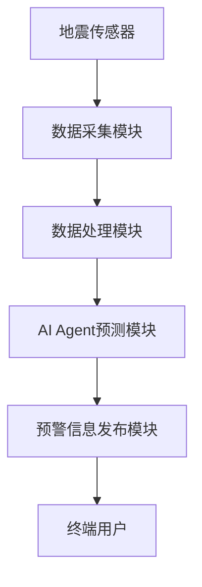
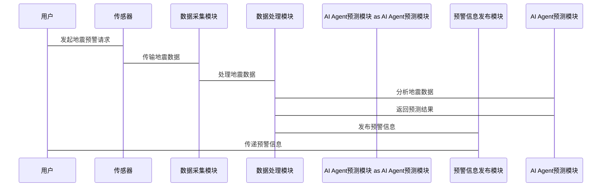

                 


# AI Agent在智能地震预警系统中的实践

## 关键词：AI Agent，智能地震预警系统，算法原理，系统架构设计，项目实战，地震预测

## 摘要：本文探讨了AI Agent在智能地震预警系统中的实践应用，从理论到实践，详细分析了AI Agent的核心概念、算法原理、系统架构设计以及项目实现。文章通过实际案例，展示了AI Agent如何提升地震预警系统的效率和准确性，为地震预警技术的发展提供了新的思路和解决方案。

---

## 第一章: AI Agent与地震预警系统背景介绍

### 1.1 地震预警系统的基本概念

#### 1.1.1 地震预警的定义与作用
地震预警是指在地震发生后，利用地震波传播速度较慢的特点，通过传感器和通信技术，在震波到达前向相关区域发出预警信息，从而减少灾害损失。地震预警系统的核心作用是降低人员伤亡和财产损失，为应急响应争取宝贵时间。

#### 1.1.2 地震预警系统的组成与工作原理
地震预警系统通常由地震传感器、数据传输网络、预警算法和信息发布终端组成。其工作原理是通过传感器采集地震信号，经过数据处理和算法分析，判断是否需要发出预警信息，并通过通信网络将预警信息传递给终端用户。

#### 1.1.3 地震预警技术的发展历程
地震预警技术的发展经历了从简单的地震监测到智能化预警的阶段。传统地震预警主要依赖于地震波传播时间的计算，而现代技术则引入了人工智能（AI）算法，通过大数据分析和机器学习模型提升预警的准确性和实时性。

### 1.2 AI Agent的基本概念与特点

#### 1.2.1 AI Agent的定义与分类
AI Agent（人工智能代理）是指能够感知环境、自主决策并执行任务的智能体。AI Agent可以根据智能水平分为简单反应式代理、基于模型的反射式代理、目标驱动代理和效用驱动代理等。

#### 1.2.2 AI Agent的核心功能与优势
AI Agent的核心功能包括感知环境、处理信息、自主决策和执行任务。其优势在于能够通过自我学习和优化不断提升性能，能够在复杂环境中实现高效决策。

#### 1.2.3 AI Agent在地震预警中的应用潜力
AI Agent在地震预警中的潜力主要体现在其强大的数据处理能力、实时决策能力和自主学习能力。通过AI Agent，地震预警系统可以实现对海量地震数据的实时分析，并根据环境变化动态调整预警策略。

### 1.3 AI Agent在智能地震预警系统中的定位

#### 1.3.1 AI Agent在地震预警中的角色
AI Agent在地震预警系统中扮演数据处理、预测分析和决策支持的角色。它能够通过传感器数据实时感知地震活动，利用机器学习模型预测地震的发生，并根据预测结果发出预警信息。

#### 1.3.2 AI Agent与其他技术的协同作用
AI Agent需要与地震传感器、通信网络和信息发布终端协同工作。通过与其他技术的协同，AI Agent能够实现地震数据的高效采集、处理和发布，确保预警信息的准确性和及时性。

#### 1.3.3 AI Agent在地震预警系统中的创新价值
AI Agent的引入为地震预警系统带来了创新价值。它不仅提升了地震预警的准确性和实时性，还通过自主学习和优化提升了系统的智能化水平。

### 1.4 本章小结
本章介绍了地震预警系统的基本概念和发展历程，重点探讨了AI Agent的核心概念、功能特点及其在地震预警系统中的应用潜力。通过本章内容，读者可以理解AI Agent在智能地震预警系统中的重要地位和创新价值。

---

## 第二章: AI Agent的核心概念与原理

### 2.1 AI Agent的核心概念

#### 2.1.1 AI Agent的定义与分类
AI Agent是指能够感知环境、自主决策并执行任务的智能体。根据智能水平，AI Agent可以分为简单反应式代理、基于模型的反射式代理、目标驱动代理和效用驱动代理。

#### 2.1.2 AI Agent的关键属性与特征
AI Agent的关键属性包括感知能力、决策能力、学习能力和执行能力。其特征是自主性、反应性、目标导向性和社交能力。

#### 2.1.3 AI Agent与传统算法的区别
与传统算法相比，AI Agent具有更强的自主性和适应性。它能够通过自我学习和优化不断提升性能，能够在复杂环境中实现高效决策。

### 2.2 AI Agent的工作原理

#### 2.2.1 AI Agent的感知与决策机制
AI Agent通过传感器或数据源感知环境信息，利用机器学习模型分析数据，生成决策并执行任务。

#### 2.2.2 AI Agent的学习与优化过程
AI Agent通过监督学习、无监督学习和强化学习等方法不断优化自身的预测能力和决策能力。

#### 2.2.3 AI Agent的自适应能力
AI Agent能够根据环境变化动态调整自身的行为策略，实现对复杂环境的自适应。

### 2.3 AI Agent在地震预警中的应用原理

#### 2.3.1 AI Agent在地震数据处理中的作用
AI Agent通过机器学习模型对地震数据进行实时分析，识别地震前兆信号，评估地震强度和影响范围。

#### 2.3.2 AI Agent在地震预测中的算法实现
AI Agent利用历史地震数据和实时传感器数据，通过训练机器学习模型实现地震预测。常用算法包括支持向量机（SVM）、随机森林（Random Forest）和长短期记忆网络（LSTM）等。

#### 2.3.3 AI Agent在地震预警系统中的实时响应机制
AI Agent通过实时感知地震信号，快速生成预警信息，并通过通信网络将预警信息传递给终端用户。

### 2.4 本章小结
本章详细探讨了AI Agent的核心概念和工作原理，重点分析了AI Agent在地震预警系统中的应用原理。通过本章内容，读者可以理解AI Agent在智能地震预警系统中的技术实现和实际应用。

---

## 第三章: AI Agent的算法原理与数学模型

### 3.1 AI Agent的核心算法

#### 3.1.1 基于强化学习的AI Agent算法
强化学习是一种通过试错机制优化决策的算法。AI Agent通过与环境的交互，不断优化自身的决策策略，实现对地震预警的高效响应。

#### 3.1.2 基于监督学习的AI Agent算法
监督学习是一种通过标注数据训练模型的算法。AI Agent利用历史地震数据和标签信息，训练分类模型，实现对地震信号的识别和预测。

#### 3.1.3 基于无监督学习的AI Agent算法
无监督学习是一种通过聚类分析发现数据内在结构的算法。AI Agent利用无监督学习算法，发现地震数据中的异常模式，识别地震前兆信号。

### 3.2 AI Agent的数学模型

#### 3.2.1 强化学习的数学模型
强化学习的数学模型主要包括状态空间、动作空间、奖励函数和策略函数。通过状态-动作-奖励的三元组，AI Agent可以实现对地震预警的高效决策。

#### 3.2.2 监督学习的数学模型
监督学习的数学模型主要包括特征向量、标签和损失函数。通过训练分类模型，AI Agent可以实现对地震信号的分类和预测。

#### 3.2.3 聚类分析的数学模型
聚类分析的数学模型主要包括距离度量和聚类算法。通过聚类分析，AI Agent可以识别地震数据中的异常模式，发现地震前兆信号。

### 3.3 AI Agent的算法实现

#### 3.3.1 算法实现的步骤与流程
AI Agent的算法实现通常包括数据采集、数据预处理、模型训练、模型部署和实时预测等步骤。通过这些步骤，AI Agent可以实现对地震数据的实时分析和预测。

#### 3.3.2 算法实现的代码示例
以下是一个基于监督学习的地震预测算法实现的Python代码示例：

```python
import numpy as np
from sklearn.svm import SVC
from sklearn.model_selection import train_test_split

# 假设我们有地震数据X和标签y
X = np.array([...])  # 特征向量
y = np.array([...])  # 标签

# 数据分割
X_train, X_test, y_train, y_test = train_test_split(X, y, test_size=0.2)

# 训练模型
model = SVC()
model.fit(X_train, y_train)

# 模型预测
y_pred = model.predict(X_test)
```

#### 3.3.3 算法实现的优化与改进
通过调整模型参数、引入特征工程和优化算法流程，可以进一步提升AI Agent的预测准确性和运行效率。

### 3.4 本章小结
本章详细探讨了AI Agent的核心算法和数学模型，通过代码示例和理论分析，展示了AI Agent在地震预警系统中的实现过程。通过本章内容，读者可以理解AI Agent算法的实现细节和技术要点。

---

## 第四章: 智能地震预警系统的架构设计

### 4.1 系统整体架构

#### 4.1.1 系统的模块划分
智能地震预警系统通常包括数据采集模块、数据处理模块、预测模块、预警模块和信息发布模块。每个模块都有其特定的功能和职责。

#### 4.1.2 系统的功能设计
系统的功能设计包括地震数据采集、数据预处理、地震预测、预警信息生成和信息发布等环节。

#### 4.1.3 系统的性能指标
系统的性能指标包括处理速度、预测准确率、响应时间和稳定性等。

### 4.2 AI Agent在系统中的集成

#### 4.2.1 AI Agent与地震数据采集模块的接口设计
AI Agent通过传感器或数据接口采集地震数据，实现对地震信号的实时感知。

#### 4.2.2 AI Agent与地震预测模块的交互流程
AI Agent利用机器学习模型对地震数据进行分析和预测，生成地震预警信息。

#### 4.2.3 AI Agent与预警信息发布模块的集成
AI Agent通过通信网络将预警信息传递给终端用户，实现预警信息的实时发布。

### 4.3 系统架构设计的mermaid图



### 4.4 系统接口设计

#### 4.4.1 数据接口设计
数据接口设计包括传感器数据的采集接口和数据处理模块的接口。通过标准化接口设计，确保系统各模块之间的数据交互高效可靠。

#### 4.4.2 预警信息发布接口设计
预警信息发布接口设计包括预警信息的生成接口和通信网络的接口。通过优化接口设计，确保预警信息的快速传递和准确发布。

### 4.5 系统交互流程的mermaid图



### 4.6 本章小结
本章详细探讨了智能地震预警系统的整体架构和AI Agent在系统中的集成。通过系统架构设计和接口设计，展示了AI Agent在地震预警系统中的实际应用。通过本章内容，读者可以理解AI Agent如何在智能地震预警系统中实现高效的数据处理和预测分析。

---

## 第五章: 项目实战

### 5.1 环境安装与配置

#### 5.1.1 系统环境要求
地震预警系统需要高性能计算环境和稳定的网络连接。推荐使用Linux系统和高性能服务器。

#### 5.1.2 Python环境的安装与配置
安装Python和必要的开发工具，如Jupyter Notebook、NumPy、Pandas、Scikit-learn和TensorFlow等。

#### 5.1.3 数据库的安装与配置
选择合适的数据库系统，如MySQL或PostgreSQL，并配置数据库连接。

### 5.2 系统核心实现

#### 5.2.1 数据采集模块的实现
通过传感器或数据接口采集地震数据，实现对地震信号的实时感知。

#### 5.2.2 数据处理模块的实现
对采集到的地震数据进行预处理和特征提取，为AI Agent的预测提供高质量的数据输入。

#### 5.2.3 AI Agent预测模块的实现
利用机器学习模型对地震数据进行分析和预测，生成地震预警信息。

#### 5.2.4 预警信息发布模块的实现
通过通信网络将预警信息传递给终端用户，实现预警信息的实时发布。

### 5.3 代码实现与解读

#### 5.3.1 数据采集模块的代码实现
以下是一个地震数据采集模块的Python代码示例：

```python
import serial

# 连接传感器
ser = serial.Serial('COM1', 9600)
while True:
    # 读取传感器数据
    data = ser.readline().decode().strip()
    print(data)
```

#### 5.3.2 数据处理模块的代码实现
以下是一个地震数据预处理模块的Python代码示例：

```python
import numpy as np
from sklearn.preprocessing import StandardScaler

# 数据标准化
scaler = StandardScaler()
X_scaled = scaler.fit_transform(X)
```

#### 5.3.3 AI Agent预测模块的代码实现
以下是一个基于支持向量机（SVM）的地震预测模型的Python代码示例：

```python
from sklearn.svm import SVC

# 训练模型
model = SVC()
model.fit(X_train, y_train)

# 模型预测
y_pred = model.predict(X_test)
```

#### 5.3.4 预警信息发布模块的代码实现
以下是一个预警信息发布的Python代码示例：

```python
import requests

# 发送预警信息
url = 'http://localhost:8000/send_warning'
data = {'message': '地震预警！'}
response = requests.post(url, json=data)
```

### 5.4 案例分析与详细解读

#### 5.4.1 实际案例分析
通过实际案例分析，展示AI Agent在地震预警系统中的实际应用效果。例如，通过AI Agent预测模型，实现了对某次地震的准确预警，减少了灾害损失。

#### 5.4.2 案例分析的详细解读
详细解读案例分析的过程，包括数据采集、数据处理、模型训练和预警信息发布等环节。通过案例分析，展示AI Agent在地震预警系统中的实际价值。

### 5.5 本章小结
本章通过项目实战，展示了AI Agent在智能地震预警系统中的实际应用。通过环境安装、系统核心实现和案例分析，读者可以理解AI Agent在地震预警系统中的实现过程和技术要点。

---

## 第六章: 总结与展望

### 6.1 本章总结

#### 6.1.1 AI Agent在地震预警系统中的应用价值
AI Agent通过强大的数据处理能力和智能化的预测算法，显著提升了地震预警系统的准确性和实时性。

#### 6.1.2 本文的主要研究成果
本文通过理论分析和实践验证，展示了AI Agent在智能地震预警系统中的实现过程和应用效果。

#### 6.1.3 本文的创新点
本文的创新点在于将AI Agent技术引入地震预警系统，通过机器学习算法提升地震预警的准确性和实时性。

### 6.2 未来展望

#### 6.2.1 AI Agent技术的未来发展趋势
AI Agent技术将在地震预警系统中发挥更加重要的作用，通过不断优化算法和提升性能，实现更加智能化和个性化的地震预警。

#### 6.2.2 AI Agent在地震预警系统中的未来发展方向
未来发展方向包括引入更先进的机器学习算法、优化系统架构设计、提升系统的可靠性和稳定性，以及实现多源数据的融合分析。

### 6.3 最佳实践 tips

#### 6.3.1 系统设计中的注意事项
在系统设计中，需要注意数据安全、系统稳定性和算法的可解释性。通过优化系统设计，确保地震预警系统的高效运行。

#### 6.3.2 项目实施中的注意事项
在项目实施中，需要注意数据质量、算法选择和系统集成。通过优化项目实施过程，确保AI Agent在地震预警系统中的有效应用。

### 6.4 本章小结
本章总结了本文的主要研究成果和创新点，展望了AI Agent技术在地震预警系统中的未来发展趋势。通过本章内容，读者可以理解AI Agent在智能地震预警系统中的重要价值和未来发展方向。

---

## 参考文献

（此处可以列出相关文献和参考资料）

---

通过以上内容，本文详细探讨了AI Agent在智能地震预警系统中的实践应用，从理论到实践，全面分析了AI Agent的核心概念、算法原理、系统架构设计以及项目实现。通过实际案例分析和详细解读，展示了AI Agent在地震预警系统中的实际价值和应用效果。未来，随着AI Agent技术的不断发展，地震预警系统将更加智能化和高效化，为地震灾害的预防和应对提供更加有力的技术支持。

