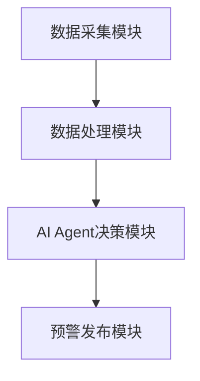
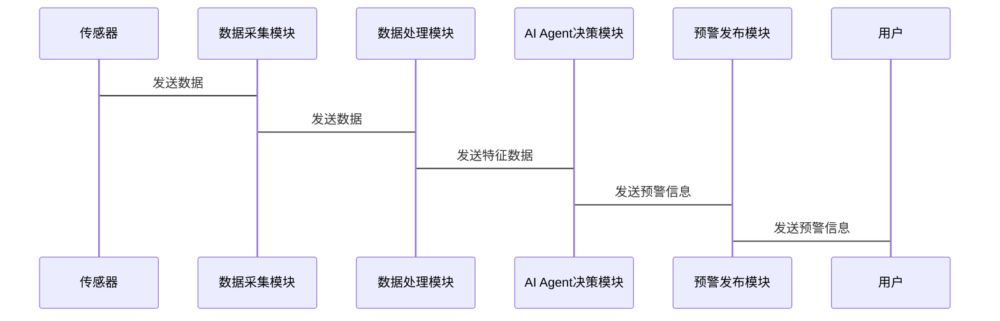

                 


# AI Agent在智能地震预警系统中的实践

**关键词**：AI Agent、地震预警系统、智能地震预警、信号处理、地震波传播、实时预警

**摘要**：  
本文探讨了AI Agent在智能地震预警系统中的应用，从地震预警的重要性、AI Agent的基本概念，到地震波传播模型与AI Agent的结合，详细介绍了AI Agent在地震预警系统中的技术基础、系统架构设计、项目实战以及实际案例分析。通过理论与实践相结合的方式，本文为地震预警系统的设计和优化提供了新的思路。

---

# 第1章: 地震预警系统背景与AI Agent概述

## 1.1 地震预警系统的重要性

### 1.1.1 地震灾害的严重性
地震是一种严重的自然灾害，通常造成大量的人员伤亡和财产损失。地震预警系统能够在地震发生后第一时间向相关区域发出预警信号，为人们争取宝贵的逃生时间。

### 1.1.2 地震预警系统的社会价值
- 可以减少地震造成的人员伤亡。
- 可以最大限度地减少财产损失。
- 可以为地震救援工作提供宝贵的时间窗口。

### 1.1.3 AI技术在地震预警中的作用
AI技术可以通过分析历史地震数据、实时传感器数据，预测地震的发生时间和震级，从而优化地震预警系统的响应速度和准确性。

## 1.2 AI Agent的基本概念

### 1.2.1 什么是AI Agent
AI Agent（智能体）是一种能够感知环境并采取行动以实现目标的实体。它可以是一个软件程序，也可以是一个物理设备。

### 1.2.2 AI Agent的类型与特点
- **简单反射型AI Agent**：基于固定的规则进行反应。
- **基于模型的反应型AI Agent**：利用内部模型来理解和预测环境。
- **目标驱动型AI Agent**：根据目标采取行动。
- **效用驱动型AI Agent**：通过最大化效用来做出决策。

### 1.2.3 AI Agent在地震预警中的应用潜力
- 实时数据处理与分析。
- 地震波传播预测。
- 预警信号的智能决策与发布。

---

# 第2章: 地震波传播模型与AI Agent的结合

## 2.1 地震波传播的基本原理

### 2.1.1 地震波的类型与传播速度
地震波主要分为两种类型：**P波**（压缩波）和**S波**（剪切波）。P波的传播速度比S波快，通常在固体岩石中传播速度为5到7公里/秒，而在软土中传播速度较慢。

### 2.1.2 地震波传播的数学模型
地震波传播的基本公式可以表示为：
$$
v = \sqrt{\frac{E}{\rho}}
$$
其中，\( v \) 是波速，\( E \) 是弹性模量，\( \rho \) 是密度。

### 2.1.3 地震波传播的物理特性
地震波的传播路径会受到地形、地质结构的影响，不同地区的地震波传播速度和路径也会有所不同。

## 2.2 AI Agent在地震波传播中的应用

### 2.2.1 AI Agent如何模拟地震波传播
AI Agent可以通过分析历史地震数据，建立地震波传播的模型，并模拟不同条件下的地震波传播路径。

### 2.2.2 AI Agent在地震波预测中的优势
- 可以快速分析大量历史数据。
- 可以实时更新模型参数。
- 可以预测不同震级下的地震波传播路径。

### 2.2.3 AI Agent与地震波传播模型的结合案例
通过AI Agent对历史地震数据进行分析，可以建立一个地震波传播的实时预测模型，并在地震发生时快速预测地震波的传播路径。

---

# 第3章: 地震传感器数据处理与AI Agent

## 3.1 地震传感器的基本原理

### 3.1.1 传感器类型与工作原理
地震传感器主要包括以下几种类型：
- **加速度计**：测量地震波引起的加速度变化。
- **速度计**：测量地震波引起的振动速度。
- **位移计**：测量地震波引起的地面位移。

### 3.1.2 传感器数据采集与处理
传感器数据的采集和处理需要考虑以下几点：
- 数据采集的频率。
- 数据的滤波与去噪。
- 数据的压缩与存储。

### 3.1.3 数据预处理技术
常用的数据预处理技术包括：
- 均值滤波。
- 差分滤波。
- 小波变换去噪。

## 3.2 AI Agent在传感器数据处理中的应用

### 3.2.1 数据流的实时处理
AI Agent可以实时处理地震传感器传来的数据流，快速识别异常信号。

### 3.2.2 数据特征提取与分析
通过AI Agent，可以提取地震信号的关键特征，如频率、幅值等，用于地震预警的决策。

### 3.2.3 数据驱动的地震预警模型
基于AI Agent的地震预警模型可以通过实时数据驱动，快速预测地震的发生时间和震级。

---

# 第4章: 地震信号分析与AI Agent算法

## 4.1 地震信号分析的基本方法

### 4.1.1 傅里叶变换在地震信号分析中的应用
傅里叶变换可以将地震信号从时域转换到频域，便于分析信号的频率成分。

### 4.1.2 小波分析在地震信号处理中的应用
小波分析可以用于地震信号的多分辨率分析，有助于发现信号中的突变点。

### 4.1.3 其他信号分析方法
- **经验模态分解（EMD）**：适用于非线性、非平稳信号的分析。
- **独立成分分析（ICA）**：用于分离混叠信号中的独立成分。

## 4.2 AI Agent算法在地震信号分析中的应用

### 4.2.1 基于AI Agent的信号分类算法
AI Agent可以通过机器学习算法对地震信号进行分类，识别正常信号和异常信号。

### 4.2.2 基于AI Agent的异常检测算法
AI Agent可以实时监控地震传感器的数据，发现异常信号并触发预警。

### 4.2.3 基于AI Agent的信号预测算法
AI Agent可以通过时间序列预测算法，预测未来时刻的地震信号变化。

---

# 第5章: 智能地震预警系统的架构设计

## 5.1 系统总体架构

### 5.1.1 系统模块划分
智能地震预警系统主要包括以下几个模块：
- 数据采集模块。
- 数据处理模块。
- AI Agent决策模块。
- 预警发布模块。

### 5.1.2 系统功能设计
- 数据采集模块：负责采集地震传感器的数据。
- 数据处理模块：对采集到的数据进行预处理和特征提取。
- AI Agent决策模块：基于处理后的数据，进行地震预警的决策。
- 预警发布模块：将预警信息发送给相关部门和人员。

### 5.1.3 系统架构图（Mermaid图）



## 5.2 系统功能模块实现

### 5.2.1 数据采集模块
数据采集模块需要与地震传感器进行通信，实时采集数据。

### 5.2.2 数据处理模块
数据处理模块需要对采集到的数据进行预处理，提取特征。

### 5.2.3 AI Agent决策模块
AI Agent决策模块基于特征数据，进行地震预警的决策。

### 5.2.4 预警发布模块
预警发布模块负责将预警信息发送给相关部门和人员。

## 5.3 系统接口设计

### 5.3.1 数据接口
- 数据采集模块与传感器之间的接口。
- 数据处理模块与AI Agent决策模块之间的接口。

### 5.3.2 用户接口
- 用户界面用于查看预警信息。
- 用户可以通过界面进行参数设置。

### 5.3.3 外部系统接口
- 与其他地震预警系统的接口。
- 与应急管理部门的接口。

## 5.4 系统交互流程图（Mermaid图）



---

# 第6章: 项目实战

## 6.1 环境安装

### 6.1.1 安装Python
```bash
# 安装Python
sudo apt-get install python3 python3-dev
```

### 6.1.2 安装依赖库
```bash
# 安装NumPy、Pandas、Scikit-learn等依赖库
pip install numpy pandas scikit-learn
```

## 6.2 系统核心实现源代码

### 6.2.1 数据处理代码
```python
import numpy as np
import pandas as pd

def preprocess_data(data):
    # 数据预处理
    data = data.dropna()
    data = data[~data['value'].isin([0])]
    return data
```

### 6.2.2 AI Agent决策模块代码
```python
from sklearn.ensemble import RandomForestClassifier

class AI_Agent:
    def __init__(self):
        self.model = RandomForestClassifier()

    def train(self, X, y):
        self.model.fit(X, y)

    def predict(self, X):
        return self.model.predict(X)
```

## 6.3 实际案例分析

### 6.3.1 案例背景
某地区地震传感器采集到异常数据，AI Agent需要分析数据并触发预警。

### 6.3.2 数据分析与处理
```python
# 加载数据
data = pd.read_csv('seismic_data.csv')

# 数据预处理
processed_data = preprocess_data(data)

# 提取特征
X = processed_data[['feature1', 'feature2', 'feature3']]
y = processed_data['label']

# 训练模型
agent = AI_Agent()
agent.train(X, y)

# 预测结果
test_data = processed_data[['feature1', 'feature2', 'feature3']].iloc[-1]
prediction = agent.predict(test_data.values.reshape(1, -1))
```

### 6.3.3 预警触发
如果AI Agent预测结果为地震，则触发预警。

---

# 第7章: 总结与展望

## 7.1 项目总结
本文详细介绍了AI Agent在智能地震预警系统中的应用，从理论到实践，系统地阐述了地震预警系统的设计与实现。

## 7.2 项目小结
通过本项目的实施，我们验证了AI Agent在地震预警系统中的有效性，同时也在实际应用中发现了需要进一步优化的地方。

## 7.3 注意事项
- 数据的实时性和准确性是地震预警系统的核心。
- AI Agent的决策模型需要不断优化和更新。
- 系统的可靠性和安全性必须得到保障。

## 7.4 拓展阅读
- 《地震工程学》
- 《人工智能在自然灾害预警中的应用》
- 《实时数据分析与处理》

---

# 结语

AI Agent在智能地震预警系统中的应用，不仅提高了地震预警的准确性，也为其他自然灾害的预警提供了新的思路。未来，随着AI技术的不断发展，地震预警系统将更加智能化和高效化。

