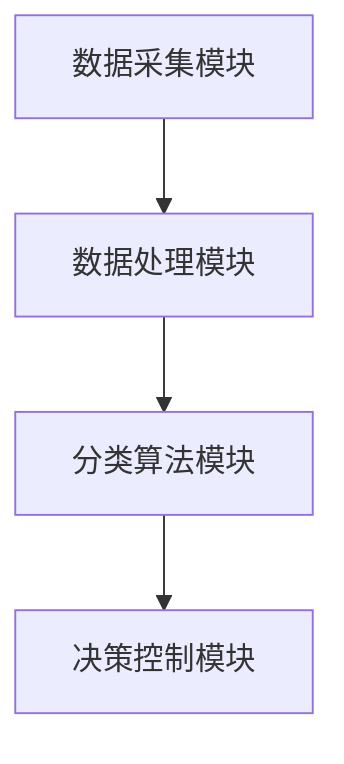
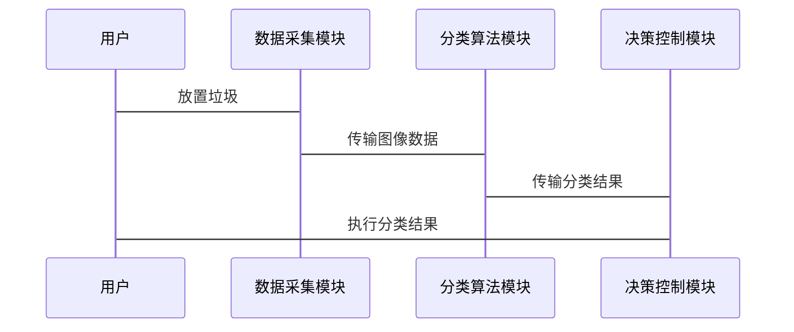

                 


# AI Agent在智能垃圾分类中的实践

## 关键词
AI Agent, 智能垃圾分类, 机器学习, 深度学习, 强化学习, 系统架构, 项目实战

## 摘要
本文深入探讨了AI Agent在智能垃圾分类中的应用，结合理论与实践，系统地介绍了AI Agent的核心原理、算法实现、系统架构设计以及项目实战。通过详细讲解垃圾分类的数学模型、深度学习算法、强化学习决策机制以及实际项目中的代码实现和优化，为读者提供了一套完整的AI Agent在智能垃圾分类中的实践方案。文章还展望了未来的发展趋势，为相关领域的研究和应用提供了重要参考。

---

# 第一章: AI Agent与智能垃圾分类的背景与概念

## 1.1 AI Agent的基本概念
### 1.1.1 AI Agent的定义与特点
- AI Agent的定义：智能体（AI Agent）是指能够感知环境并采取行动以实现目标的实体。
- AI Agent的特点：
  - 自主性：能够在没有外部干预的情况下自主运行。
  - 反应性：能够根据环境的变化实时调整行为。
  - 智能性：具备一定的推理和学习能力。

### 1.1.2 AI Agent的核心原理
- 知识表示：将问题转化为计算机可理解的形式，如符号逻辑或概率分布。
- 行为决策：基于当前状态和目标，选择最优行动。
- 状态感知与反馈：通过传感器或数据输入感知环境，并根据反馈调整行为。

### 1.1.3 AI Agent的应用场景
- 智能家居：控制设备、优化能源使用。
- 自动驾驶：实时感知环境并做出驾驶决策。
- 机器人控制：在工业或家庭环境中执行复杂任务。

## 1.2 智能垃圾分类的背景与问题
### 1.2.1 垃圾分类的重要性
- 环境保护：减少环境污染，促进资源循环利用。
- 公共卫生：减少疾病传播，改善生活环境。
- 政策要求：许多国家和地区都要求进行垃圾分类。

### 1.2.2 当前垃圾分类的痛点与挑战
- 人工成本高：需要大量人力进行分类。
- 分类效率低：人工分类速度慢，容易出错。
- 标准不统一：不同地区对垃圾分类标准不同，增加了复杂性。

### 1.2.3 AI Agent在垃圾分类中的优势
- 高效性：AI Agent可以快速识别和分类垃圾。
- 准确性：通过深度学习和图像识别技术，分类准确率高。
- 智能性：能够适应不同场景和规则变化。

## 1.3 本章小结
本章介绍了AI Agent的基本概念和核心原理，并分析了智能垃圾分类的重要性和挑战。通过对比传统方法和AI Agent的优势，为后续章节的深入讨论奠定了基础。

---

# 第二章: AI Agent与智能垃圾分类的核心概念与联系

## 2.1 AI Agent的核心原理
### 2.1.1 知识表示与推理
- 知识表示：使用符号逻辑、概率分布或图结构表示知识。
- 推理机制：基于知识库进行逻辑推理，得出结论。

### 2.1.2 行为决策机制
- 基于规则的决策：根据预定义的规则做出决策。
- 基于概率的决策：根据概率模型计算最优选择。
- 基于强化学习的决策：通过奖励机制优化决策策略。

### 2.1.3 状态感知与反馈
- 状态感知：通过传感器或摄像头获取环境信息。
- 反馈机制：根据执行结果调整后续行为。

## 2.2 智能垃圾分类的系统模型
### 2.2.1 系统输入与输出
- 输入：图像数据、传感器数据、用户输入。
- 输出：分类结果、行动指令、反馈信息。

### 2.2.2 系统功能模块划分
- 数据采集模块：收集垃圾图像和环境数据。
- 数据处理模块：对数据进行预处理和特征提取。
- 分类算法模块：使用深度学习模型进行分类。
- 决策控制模块：根据分类结果做出行动决策。

### 2.2.3 系统整体架构
- 数据流图分析：从输入到输出的流程图。
- 功能模块交互图：各模块之间的交互关系。
- 系统整体流程图：从数据采集到分类决策的完整流程。

## 2.3 AI Agent与智能垃圾分类的关系
### 2.3.1 AI Agent在垃圾分类中的角色
- 数据处理与分类：AI Agent负责图像识别和分类。
- 行为决策：AI Agent根据分类结果做出行动指令。
- 系统控制：AI Agent协调各模块完成任务。

### 2.3.2 垃圾分类对AI Agent的需求
- 高准确性：分类错误可能导致严重后果。
- 实时性：需要快速做出决策。
- 灵活性：能够适应不同的分类规则和场景。

### 2.3.3 两者结合的可行性分析
- 技术可行性：深度学习和强化学习技术已经成熟。
- 应用可行性：AI Agent可以在多种场景下实现垃圾分类。
- 经济可行性：相比人工分类，AI Agent成本更低。

## 2.4 本章小结
本章详细探讨了AI Agent的核心原理，并将其与智能垃圾分类系统结合起来，分析了系统的整体架构和各模块的功能。通过对比分析，明确了AI Agent在垃圾分类中的重要作用。

---

# 第三章: AI Agent在智能垃圾分类中的算法原理

## 3.1 垃圾分类算法的数学模型与实现
### 3.1.1 分类问题的数学表达
- 分类目标：将垃圾图像分为可回收物、湿垃圾、干垃圾、有害垃圾等类别。
- 数学模型：使用多分类问题的数学模型，如Softmax函数。

$$
\text{概率分布} = \text{Softmax}(Wx + b)
$$

其中，$W$是权重矩阵，$x$是输入特征向量，$b$是偏置向量。

### 3.1.2 常见的分类算法公式
- K-近邻算法（KNN）：基于距离的分类。
- 支持向量机（SVM）：基于超平面的分类。
- 随机森林：基于决策树的集成分类方法。

### 3.1.3 模型的优化与调整
- 参数调整：优化学习率、批量大小等超参数。
- 正则化：使用L1/L2正则化防止过拟合。
- 模型评估：使用准确率、召回率、F1分数等指标评估模型性能。

## 3.2 基于深度学习的垃圾分类算法
### 3.2.1 CNN网络的结构与原理
- 卷积层：提取图像的特征。
- 池化层：降低计算复杂度，提取目标区域。
- 全连接层：进行分类预测。

### 3.2.2 模型训练的流程与步骤
1. 数据预处理：归一化、裁剪、增强数据。
2. 构建模型：定义网络结构，选择优化器和损失函数。
3. 训练模型：使用训练数据进行反向传播和参数更新。
4. 模型评估：使用验证集评估模型性能。

### 3.2.3 模型评估与优化
- 准确率与损失函数：监控训练过程中的变化。
- 模型优化：调整网络结构、优化器参数等。
- 部署与测试：将模型部署到实际场景中进行测试。

## 3.3 AI Agent的决策算法
### 3.3.1 基于规则的决策算法
- 预定义规则：根据分类结果执行特定动作。
- 优点：简单易懂，适用于规则明确的场景。
- 缺点：灵活性差，难以应对复杂情况。

### 3.3.2 基于概率的决策算法
- 概率计算：基于分类结果的概率值做出决策。
- 示例：如果可回收物的概率大于0.9，执行回收操作。
- 优点：考虑了分类的不确定性，决策更稳健。
- 缺点：计算复杂，需要实时计算概率。

### 3.3.3 基于强化学习的决策算法
- 强化学习框架：使用奖励机制优化决策策略。
- 示例：机器人在分类正确时获得奖励，分类错误时受到惩罚。
- 优点：适应性强，能够在复杂环境中做出最优决策。
- 缺点：训练时间长，需要大量数据支持。

## 3.4 本章小结
本章详细介绍了AI Agent在智能垃圾分类中的算法原理，包括分类算法、深度学习模型和决策算法的实现。通过对比不同算法的优缺点，为后续的系统设计和项目实现提供了理论基础。

---

# 第四章: 智能垃圾分类系统的系统分析与架构设计

## 4.1 系统功能设计
### 4.1.1 数据采集模块
- 图像采集：使用摄像头采集垃圾图像。
- 传感器数据：获取垃圾的重量、形状等信息。

### 4.1.2 数据处理模块
- 图像预处理：调整亮度、对比度，去除噪声。
- 特征提取：提取图像的纹理、颜色等特征。

### 4.1.3 分类算法模块
- 使用预训练的深度学习模型进行分类。
- 输出分类结果并传递给决策模块。

### 4.1.4 决策控制模块
- 根据分类结果生成行动指令。
- 控制执行机构完成垃圾分类。

## 4.2 系统架构设计
### 4.2.1 项目场景介绍
- 场景描述：一个智能垃圾分类系统应用于家庭或公共场所。
- 用户需求：用户希望方便、快速地完成垃圾分类。

### 4.2.2 系统功能模块划分
- 数据采集模块：负责采集垃圾图像和传感器数据。
- 数据处理模块：对数据进行预处理和特征提取。
- 分类算法模块：使用深度学习模型进行分类。
- 决策控制模块：根据分类结果生成行动指令。

### 4.2.3 系统架构图


## 4.3 系统接口设计
### 4.3.1 数据接口
- 图像接口：摄像头输入的图像数据。
- 传感器接口：重量、形状等传感器数据。

### 4.3.2 模块间接口
- 数据处理模块向分类算法模块传递特征向量。
- 分类算法模块向决策控制模块传递分类结果。

## 4.4 系统交互设计
### 4.4.1 交互流程
- 用户将垃圾放入分类器中。
- 系统采集图像并进行分类。
- 根据分类结果将垃圾放入相应的收集箱。

### 4.4.2 交互序列图


## 4.5 本章小结
本章通过系统分析与架构设计，明确了智能垃圾分类系统的功能模块和交互流程。通过mermaid图展示了系统的整体架构和模块间的关系，为后续的项目实现奠定了基础。

---

# 第五章: 项目实战与实现

## 5.1 项目环境搭建
### 5.1.1 开发工具安装
- 安装Python、TensorFlow、Keras、OpenCV等库。
- 安装Jupyter Notebook用于开发和测试。

### 5.1.2 数据集准备
- 下载公开的垃圾分类数据集，如ImageNet中的子集。
- 数据增强：旋转、缩放、翻转等，增加训练数据。

### 5.1.3 环境配置与调试
- 配置Python环境和相关库。
- 安装GPU支持，优化深度学习模型的训练速度。

## 5.2 系统核心代码实现
### 5.2.1 数据预处理代码
```python
import cv2
import numpy as np

def preprocess_image(image_path, target_size=(224, 224)):
    image = cv2.imread(image_path)
    image = cv2.resize(image, target_size)
    image = image / 255.0  # 归一化处理
    return image
```

### 5.2.2 分类算法实现
```python
import tensorflow as tf
from tensorflow.keras.models import Model
from tensorflow.keras.layers import Input, Conv2D, MaxPooling2D, Flatten, Dense

def build_model(input_shape, num_classes):
    inputs = Input(shape=input_shape)
    x = Conv2D(32, (3, 3), activation='relu')(inputs)
    x = MaxPooling2D((2, 2))(x)
    x = Conv2D(64, (3, 3), activation='relu')(x)
    x = MaxPooling2D((2, 2))(x)
    x = Flatten()(x)
    x = Dense(128, activation='relu')(x)
    outputs = Dense(num_classes, activation='softmax')(x)
    return Model(inputs=inputs, outputs=outputs)
```

### 5.2.3 AI Agent决策模块代码
```python
def decision_making(classification_result):
    # classification_result是一个概率分布列表
    if classification_result[0] > 0.9:  # 可回收物
        return 'recycle'
    elif classification_result[1] > 0.8:  # 湿垃圾
        return 'wet'
    elif classification_result[2] > 0.8:  # 干垃圾
        return 'dry'
    else:  # 有害垃圾
        return 'hazardous'
```

## 5.3 项目测试与优化
### 5.3.1 系统功能测试
- 测试分类准确率：使用验证集评估模型性能。
- 测试决策模块：输入不同的分类结果，验证决策是否正确。

### 5.3.2 性能优化与调整
- 优化模型结构：增加或减少网络层数，调整卷积核数量。
- 调整超参数：学习率、批量大小、正则化系数等。
- 使用数据增强：增加训练数据，防止过拟合。

### 5.3.3 系统稳定性测试
- 测试系统在不同环境下的稳定性。
- 处理异常情况：如传感器故障、网络中断等。

## 5.4 本章小结
本章通过实际的项目实战，详细讲解了智能垃圾分类系统的实现过程。从环境搭建到代码实现，再到测试与优化，为读者提供了一套完整的实践方案。

---

# 第六章: 总结与未来展望

## 6.1 项目总结
### 6.1.1 项目成果与意义
- 成功实现了基于AI Agent的智能垃圾分类系统。
- 提高了垃圾分类的效率和准确性，减少了人工成本。

### 6.1.2 项目实施的经验与教训
- 数据质量对模型性能影响很大，需要高质量的标注数据。
- 模型优化需要结合实际场景，不能一味追求高准确率。

## 6.2 未来展望
### 6.2.1 技术发展与趋势
- 更先进的深度学习模型：如Transformer、图神经网络等。
- 更强大的计算能力：通过GPU和TPU加速模型训练。

### 6.2.2 应用场景的扩展
- 家庭垃圾分类：帮助用户实现智能分类。
- 工业垃圾处理：对工业废料进行智能分类和处理。
- 公共场所管理：在商场、公园等公共场所实现智能垃圾分类。

### 6.2.3 未来研究方向
- 提高模型的泛化能力：能够适应不同地区的分类标准。
- 实现实时分类：通过边缘计算实现快速响应。
- 多模态数据融合：结合图像、声音等多种数据进行分类。

## 6.3 本章小结
本章总结了项目的成果和经验，并展望了未来的技术发展趋势和应用前景。通过分析，明确了AI Agent在智能垃圾分类中的巨大潜力和广阔的应用空间。

---

# 参考文献
（此处列出相关的参考文献，如书籍、论文、技术文档等。）

---

# 附录
（此处可以列出项目的源代码、数据集链接、工具安装说明等补充材料。）

---

通过以上目录大纲和内容安排，我们可以系统地介绍AI Agent在智能垃圾分类中的实践应用。从理论到实践，从算法到系统设计，再到项目实现，全面覆盖了相关知识点，为读者提供了一个完整的解决方案。

