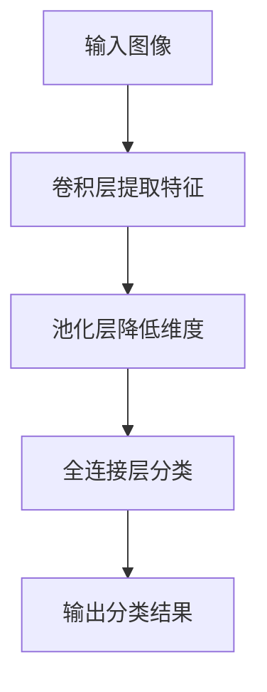
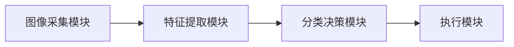
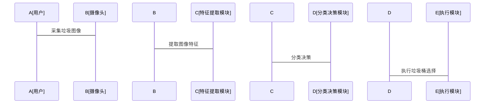

                 


# AI Agent在智能垃圾分类识别中的实践

## 关键词：AI Agent, 智能垃圾分类, 图像识别, 深度学习, 垃圾分类识别

## 摘要：  
随着人工智能技术的快速发展，AI Agent（人工智能代理）在智能垃圾分类识别中的应用逐渐成为研究热点。本文将从AI Agent的基本概念出发，探讨其在垃圾分类识别中的技术基础、算法实现、系统设计与项目实战，最后总结AI Agent在这一领域的优势与未来发展方向。

---

# 第一部分: AI Agent与智能垃圾分类识别基础

## 第1章: AI Agent的基本概念与背景

### 1.1 AI Agent的定义与特点

#### 1.1.1 AI Agent的定义  
AI Agent（人工智能代理）是指能够感知环境、自主决策并执行任务的智能实体。它通过传感器获取信息，利用算法进行分析，并通过执行器完成目标。AI Agent可以是软件程序、机器人或其他智能设备。

#### 1.1.2 AI Agent的核心特点  
- **自主性**：能够自主决策，无需外部干预。  
- **反应性**：能够实时感知环境并做出反应。  
- **目标导向性**：所有行为均以实现特定目标为导向。  
- **学习能力**：通过数据和经验不断优化性能。  

#### 1.1.3 AI Agent与传统AI的区别  
AI Agent不仅能够处理数据，还能与环境交互，具有更强的实时性和适应性。传统AI更多关注数据处理和模式识别，而AI Agent强调与环境的动态交互和目标实现。

### 1.2 智能垃圾分类识别的背景与意义

#### 1.2.1 垃圾分类的重要性  
垃圾分类是实现资源回收、减少环境污染的重要手段。通过智能垃圾分类，可以提高分类效率，降低人工成本，同时减少对环境的污染。

#### 1.2.2 智能化垃圾分类的优势  
- **高效性**：AI Agent能够快速识别和分类垃圾，减少人工操作时间。  
- **准确性**：通过深度学习算法，AI Agent的分类准确率远高于人工分类。  
- **可扩展性**：AI Agent可以轻松扩展到更多类型的垃圾分类任务。  

#### 1.2.3 当前垃圾分类的主要挑战  
- **数据多样性**：垃圾种类繁多，数据采集和标注成本高。  
- **算法鲁棒性**：需要算法能够适应不同光照、角度和背景的垃圾图像。  
- **实时性要求**：在实际应用场景中，垃圾分类需要实时处理。  

---

## 第2章: AI Agent在垃圾分类中的应用潜力

### 2.1 垃圾分类识别的主要技术手段  
- **图像识别**：通过摄像头采集垃圾图像，利用深度学习模型进行分类。  
- **目标检测**：精确定位垃圾的位置和类型，适用于复杂场景。  
- **图像分割**：分割出垃圾的具体区域，适用于多物体混杂的情况。  

### 2.2 AI Agent在垃圾分类中的优势  
- **智能化**：AI Agent能够自主完成垃圾识别和分类任务。  
- **高效性**：通过并行计算和优化算法，显著提高分类速度。  
- **可扩展性**：支持多种垃圾类型和分类标准的扩展。  

### 2.3 垃圾分类识别的典型应用场景  
- **智能垃圾桶**：居民可以通过AI Agent实现垃圾自动分类。  
- **工厂自动化**：在工业生产中，AI Agent可以用于废料分类和回收。  
- **公共场所**：如公园、广场等，AI Agent可以帮助进行垃圾分类和管理。  

---

# 第二部分: 垃圾分类识别的技术基础

## 第3章: 图像识别与深度学习基础

### 3.1 图像识别的基本概念  
图像识别是通过计算机视觉技术，对图像中的内容进行识别和理解。其核心是将图像转换为可计算的数字形式，并通过算法提取特征进行分类。

### 3.2 深度学习在图像识别中的应用  
深度学习通过多层神经网络提取图像特征，能够实现高精度的图像分类。常用的深度学习模型包括卷积神经网络（CNN）、区域卷积神经网络（R-CNN）等。

### 3.3 垃圾分类数据集的介绍  
常用的垃圾分类数据集包括：
- **公开数据集**：如ImageNet、COCO等。  
- **自定义数据集**：根据具体需求，收集和标注特定类型的垃圾图像。  

---

## 第4章: 垃圾分类识别的主流算法

### 4.1 基于CNN的图像分类算法  
#### 4.1.1 算法流程图（Mermaid）  


#### 4.1.2 算法实现代码示例  
```python
import torch
import torch.nn as nn

class GarbageClassifier(nn.Module):
    def __init__(self):
        super(GarbageClassifier, self).__init__()
        self.conv1 = nn.Conv2d(3, 6, 5)
        self.pool = nn.MaxPool2d(2, 2)
        self.conv2 = nn.Conv2d(6, 16, 5)
        self.fc1 = nn.Linear(16 * 5 * 5, 120)
        self.fc2 = nn.Linear(120, 10)
        self.softmax = nn.Softmax()

    def forward(self, x):
        x = self.pool(F.relu(self.conv1(x)))
        x = self.pool(F.relu(self.conv2(x)))
        x = x.view(-1, 16 * 5 * 5)
        x = F.relu(self.fc1(x))
        x = self.softmax(self.fc2(x))
        return x
```

### 4.2 目标检测算法  
#### 4.2.1 YOLO算法  
YOLO（You Only Look Once）是一种实时目标检测算法，适用于垃圾种类多且复杂的情况。  
- **优点**：速度快，适合实时检测。  
- **缺点**：对小物体的检测精度较低。  

#### 4.2.2 Faster R-CNN算法  
Faster R-CNN结合了区域建议网络（RPN）和Fast R-CNN，适合对垃圾进行精确定位。  
- **优点**：检测精度高。  
- **缺点**：速度较慢。  

### 4.3 图像分割算法  
#### 4.3.1 U-Net算法  
U-Net是一种经典的图像分割模型，适用于垃圾分类中的细粒度分类任务。  
- **优点**：分割精度高，适合医疗图像和工业检测。  
- **缺点**：对内存要求较高。  

---

# 第三部分: AI Agent的算法实现

## 第5章: 垃圾分类识别的算法实现

### 5.1 基于CNN的垃圾分类算法实现  
#### 5.1.1 算法流程图（Mermaid）  


#### 5.1.2 算法实现代码示例  
```python
import torch
import torch.nn as nn
import torch.optim as optim
import torch.utils.data as data_utils

# 数据集加载
train_dataset = data_utils.TensorDataset(train_features, train_labels)
train_loader = data_utils.DataLoader(train_dataset, batch_size=32, shuffle=True)

# 模型定义
model = GarbageClassifier()
criterion = nn.CrossEntropyLoss()
optimizer = optim.Adam(model.parameters(), lr=0.001)

# 训练过程
for epoch in range(num_epochs):
    for batch_features, batch_labels in train_loader:
        outputs = model(batch_features)
        loss = criterion(outputs, batch_labels)
        optimizer.zero_grad()
        loss.backward()
        optimizer.step()
```

#### 5.1.3 算法原理的数学模型和公式  
分类器的损失函数为交叉熵损失：  
$$ L = -\sum_{i=1}^{n} y_i \log(p_i) $$  
其中，$y_i$ 是真实标签，$p_i$ 是预测概率。  

优化目标是最小化损失函数，采用Adam优化器：  
$$ \theta = \theta - \eta \frac{\partial L}{\partial \theta} $$  

---

## 第6章: AI Agent的算法优化与改进

### 6.1 基于迁移学习的算法优化  
迁移学习通过预训练模型（如ResNet、VGG）提取特征，减少训练数据量和计算量。  
- **优点**：节省计算资源，提升模型鲁棒性。  
- **缺点**：部分场景下可能影响模型的适应性。  

### 6.2 基于数据增强的算法优化  
数据增强技术（如旋转、翻转、噪声添加）可以提高模型的泛化能力。  
- **常用技术**：随机裁剪、颜色抖动、旋转等。  

### 6.3 基于模型集成的算法优化  
模型集成（如Ensemble）通过多个模型的预测结果进行融合，提高分类准确率。  
- **优点**：降低过拟合风险，提升分类精度。  
- **缺点**：计算资源消耗较大。  

---

## 第7章: 系统设计与架构方案

### 7.1 系统架构设计  
#### 7.1.1 系统功能模块  
- **图像采集模块**：通过摄像头采集垃圾图像。  
- **特征提取模块**：利用CNN提取图像特征。  
- **分类决策模块**：基于深度学习模型进行分类决策。  
- **执行模块**：根据分类结果进行垃圾桶选择和投放。  

#### 7.1.2 系统架构图（Mermaid）  


### 7.2 系统接口设计  
- **输入接口**：摄像头输入垃圾图像。  
- **输出接口**：垃圾桶选择信号。  
- **数据接口**：与数据库或云端进行数据交互。  

### 7.3 系统交互流程（Mermaid）  


---

## 第8章: 项目实战与实现

### 8.1 环境搭建  
- **开发环境**：Python 3.8及以上版本。  
- **框架选择**：PyTorch或TensorFlow。  
- **硬件要求**：NVIDIA GPU（支持CUDA加速）。  

### 8.2 数据集准备  
- **数据收集**：收集各类垃圾图像，如纸张、塑料、玻璃等。  
- **数据标注**：使用LabelImg等工具对图像进行标注。  
- **数据预处理**：归一化、裁剪、旋转等。  

### 8.3 模型训练与优化  
- **训练参数**：学习率、批量大小、训练轮数。  
- **验证集测试**：评估模型性能，调整超参数。  
- **模型保存与加载**：保存最优模型，方便后续部署。  

### 8.4 模型部署与应用  
- **API接口开发**：提供RESTful API，供其他系统调用。  
- **前端界面设计**：开发Web界面，方便用户交互。  
- **实时监控**：监控模型性能，及时优化。  

---

## 第9章: 总结与展望

### 9.1 全文总结  
本文详细探讨了AI Agent在智能垃圾分类识别中的应用，从技术基础到算法实现，再到系统设计和项目实战，全面展示了AI Agent的优势和潜力。

### 9.2 未来展望  
- **算法优化**：探索更高效的算法，如轻量化模型和边缘计算。  
- **多模态融合**：结合图像、声音等多种模态信息，提升分类精度。  
- **智能垃圾桶**：开发更加智能化的垃圾桶，实现自动化分类和投放。  

### 9.3 最佳实践 Tips  
- 在实际应用中，建议使用迁移学习和数据增强技术优化模型性能。  
- 部署时，优先选择轻量级模型，减少计算资源消耗。  
- 定期更新模型，适应新的垃圾类型和分类标准。  

---

通过本文的系统介绍，读者可以全面了解AI Agent在智能垃圾分类识别中的实践应用，并为进一步研究和开发提供有益的参考。

