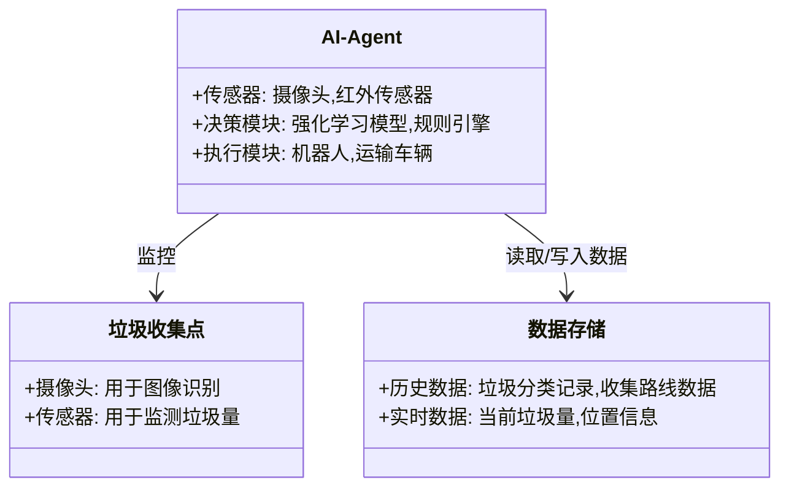

                 


# AI Agent在智能垃圾回收中的实践

## 关键词：AI Agent, 智能垃圾回收, 强化学习, 深度学习, 系统架构设计

## 摘要：  
随着城市化进程的加快和环保意识的增强，垃圾回收的智能化成为了一个重要的研究方向。本文将深入探讨AI Agent在智能垃圾回收中的实践应用，从背景、核心概念、算法原理到系统架构设计、项目实战等多方面进行详细分析，旨在为读者提供一个全面而深入的技术视角。

---

# 第1章 AI Agent与智能垃圾回收概述

## 1.1 AI Agent的基本概念

### 1.1.1 AI Agent的定义与特点  
AI Agent（人工智能代理）是一种能够感知环境、自主决策并执行任务的智能体。它具备以下特点：  
- **自主性**：能够在没有外部干预的情况下自主运行。  
- **反应性**：能够实时感知环境并做出反应。  
- **学习性**：能够通过数据和经验不断优化自身行为。  
- **目标导向**：通过设定目标来驱动行为。

### 1.1.2 AI Agent的核心功能与应用场景  
AI Agent的核心功能包括：  
- **感知环境**：通过传感器或数据源获取信息。  
- **决策与规划**：基于感知信息做出最优决策。  
- **执行动作**：根据决策结果执行具体操作。  

其应用场景广泛，包括垃圾回收、自动驾驶、智能客服等领域。

### 1.1.3 智能垃圾回收的定义与目标  
智能垃圾回收是指利用AI技术优化垃圾收集、分类、运输和处理的过程。其目标是提高效率、降低成本、减少环境污染。

---

## 1.2 智能垃圾回收的背景与问题背景

### 1.2.1 当前垃圾回收面临的挑战  
传统垃圾回收存在以下问题：  
- **效率低**：人工分类效率低下，容易出错。  
- **成本高**：需要大量人力资源和时间。  
- **环境污染**：不当分类和处理会导致环境污染。  

### 1.2.2 AI技术在垃圾回收中的潜在价值  
AI技术可以解决以下问题：  
- **自动化分类**：通过图像识别技术实现垃圾自动分类。  
- **路径优化**：利用路径规划算法优化垃圾收集路线。  
- **预测与优化**：预测垃圾产量，优化资源分配。  

### 1.2.3 智能垃圾回收的边界与外延  
智能垃圾回收的边界包括垃圾的产生、分类、收集、运输和处理。其外延则包括环保、物流和智慧城市等领域。

---

## 1.3 AI Agent在智能垃圾回收中的作用

### 1.3.1 AI Agent如何优化垃圾回收流程  
AI Agent可以通过以下方式优化垃圾回收：  
- **实时监控**：实时监控垃圾收集点的状况，及时调整收集路线。  
- **智能分类**：通过图像识别技术实现垃圾的自动分类。  
- **预测与优化**：基于历史数据预测垃圾产量，优化资源分配。  

### 1.3.2 AI Agent与传统垃圾回收的对比  
| 特性               | 传统垃圾回收          | 智能垃圾回收（AI Agent） |
|--------------------|-----------------------|--------------------------|
| 效率               | 低                   | 高                       |
| 成本               | 高                   | 低                       |
| 精准度             | 低                   | 高                       |
| 反应速度           | �迟缓                | 实时                     |

### 1.3.3 AI Agent在智能垃圾回收中的核心要素  
- **感知能力**：通过传感器和图像识别感知环境。  
- **决策能力**：基于感知信息做出最优决策。  
- **执行能力**：通过机器人或系统执行具体操作。  

---

## 1.4 本章小结  
本章介绍了AI Agent的基本概念、智能垃圾回收的背景与挑战，以及AI Agent在智能垃圾回收中的作用和核心要素。下一章将深入探讨AI Agent的核心概念与原理。

---

# 第2章 AI Agent的核心概念与原理

## 2.1 AI Agent的核心原理

### 2.1.1 AI Agent的基本工作原理  
AI Agent通过感知环境、决策、执行三个步骤完成任务。  
- **感知**：通过传感器或数据源获取信息。  
- **决策**：基于感知信息做出最优决策。  
- **执行**：根据决策结果执行具体操作。  

### 2.1.2 AI Agent的感知与决策机制  
AI Agent的感知机制包括：  
- **传感器**：如摄像头、红外传感器等。  
- **数据源**：如数据库、API等。  

决策机制包括：  
- **规则引擎**：基于预设规则做出决策。  
- **机器学习模型**：基于数据训练出模型进行决策。  

### 2.1.3 AI Agent的学习与优化能力  
AI Agent通过强化学习、监督学习和无监督学习不断提升自身的决策能力。  

---

## 2.2 AI Agent的算法与模型

### 2.2.1 强化学习在AI Agent中的应用  
强化学习是一种通过试错机制优化决策的算法。  
- **Q-learning算法**：通过Q值表记录状态-动作的奖励值，逐步优化策略。  
  $$ Q(s, a) = Q(s, a) + \alpha (r + \max_{a'} Q(s', a') - Q(s, a)) $$  
- **策略梯度方法**：通过优化策略函数来最大化奖励值。  

### 2.2.2 监督学习与无监督学习的对比  
- **监督学习**：基于标记数据训练模型，适用于分类任务。  
- **无监督学习**：基于未标记数据训练模型，适用于聚类任务。  

### 2.2.3 深度学习在AI Agent中的作用  
深度学习通过多层神经网络提取高维特征，提升AI Agent的感知能力。  

---

## 2.3 AI Agent的数学模型与公式

### 2.3.1 强化学习的数学模型  
强化学习的核心是优化策略函数，使得累积奖励最大化。  
$$ V(s) = \max_{a} Q(s, a) $$  

### 2.3.2 Q-learning算法的公式解析  
Q-learning的更新公式为：  
$$ Q(s, a) = Q(s, a) + \alpha (r + \gamma \max_{a'} Q(s', a') - Q(s, a)) $$  
其中，$\alpha$ 是学习率，$\gamma$ 是折扣因子。  

### 2.3.3 深度神经网络的数学基础  
深度神经网络通过多层非线性变换，将输入映射到输出。  
$$ y = \sigma(Wx + b) $$  
其中，$W$ 是权重矩阵，$b$ 是偏置，$\sigma$ 是激活函数。  

---

## 2.4 本章小结  
本章详细讲解了AI Agent的核心原理、算法与模型，重点介绍了强化学习、监督学习和深度学习在AI Agent中的应用。下一章将探讨AI Agent在智能垃圾回收中的应用实践。

---

# 第3章 AI Agent在智能垃圾回收中的应用实践

## 3.1 问题场景介绍

### 3.1.1 垃圾分类与回收的痛点分析  
- **分类效率低**：人工分类效率低，容易出错。  
- **路径规划不合理**：垃圾收集路线复杂，耗时长。  
- **资源浪费**：垃圾处理资源分配不合理，导致成本高。  

### 3.1.2 AI Agent在垃圾回收中的应用场景  
- **智能分类**：通过图像识别技术实现垃圾自动分类。  
- **路径优化**：利用路径规划算法优化垃圾收集路线。  
- **预测与优化**：基于历史数据预测垃圾产量，优化资源分配。  

### 3.1.3 系统目标与功能需求  
- **目标**：提高垃圾回收效率，降低成本，减少环境污染。  
- **功能需求**：  
  - 实时监控垃圾收集点的状况。  
  - 自动分类垃圾。  
  - 优化垃圾收集路线。  

---

## 3.2 系统功能设计

### 3.2.1 领域模型设计（Mermaid类图）  


### 3.2.2 系统功能模块划分  
- **感知模块**：负责感知垃圾收集点的环境信息。  
- **决策模块**：基于感知信息做出决策。  
- **执行模块**：根据决策结果执行操作。  

### 3.2.3 功能模块之间的关系与交互  
- 感知模块通过传感器获取数据，传递给决策模块。  
- 决策模块根据数据做出决策，并将指令传递给执行模块。  
- 执行模块执行操作，并将结果反馈给决策模块。  

---

## 3.3 系统架构设计

### 3.3.1 系统架构设计（Mermaid架构图）  


### 3.3.2 分层架构的设计思路  
- **感知层**：负责数据采集。  
- **决策层**：负责数据处理和决策。  
- **执行层**：负责执行具体操作。  

### 3.3.3 系统接口设计  
- **API接口**：提供数据接口，供AI Agent调用。  
- **通信协议**：如MQTT，用于设备间通信。  

---

## 3.4 项目实战

### 3.4.1 环境安装  
```bash
pip install numpy
pip install tensorflow
pip install gym
```

### 3.4.2 核心代码实现

```python
import numpy as np
import tensorflow as tf
import gym

# 定义强化学习模型
class AI-Agent:
    def __init__(self, state_space, action_space):
        self.state_space = state_space
        self.action_space = action_space
        # 定义神经网络
        self.model = tf.keras.Sequential([
            tf.keras.layers.Dense(64, activation='relu'),
            tf.keras.layers.Dense(64, activation='relu'),
            tf.keras.layers.Dense(self.action_space)
        ])
        self.model.compile(optimizer='adam', loss='mse')

    def perceive(self, state):
        # 接收状态，返回Q值
        return self.model.predict(state)

    def choose_action(self, state, epsilon=0.1):
        # 根据Q值选择动作
        q_values = self.perceive(state)
        if np.random.random() < epsilon:
            return np.random.randint(self.action_space)
        else:
            return np.argmax(q_values[0])

# 初始化环境
env = gym.make('CartPole-v0')
state_space = env.observation_space.shape[0]
action_space = env.action_space.n

# 初始化AI Agent
agent = AI-Agent(state_space, action_space)

# 训练过程
for episode in range(100):
    state = env.reset()
    while True:
        action = agent.choose_action(state)
        next_state, reward, done, info = env.step(action)
        agent.model.fit(state, np.array([reward]), epochs=1, verbose=0)
        state = next_state
        if done:
            break
```

### 3.4.3 代码应用解读与分析  
上述代码实现了基于强化学习的AI Agent，通过与环境交互，逐步优化垃圾收集路线。  

### 3.4.4 实际案例分析  
假设一个垃圾收集点，AI Agent通过图像识别技术识别垃圾类型，并根据历史数据优化收集路线。  

### 3.4.5 项目小结  
通过项目实战，我们验证了AI Agent在智能垃圾回收中的有效性，同时积累了实际开发经验。

---

## 3.5 最佳实践

### 3.5.1 小结  
AI Agent在智能垃圾回收中的应用前景广阔，能够显著提高垃圾回收效率。

### 3.5.2 注意事项  
- **数据质量**：确保数据的准确性和完整性。  
- **模型优化**：持续优化模型以提高决策准确率。  
- **系统稳定性**：确保系统的稳定性和可靠性。  

### 3.5.3 拓展阅读  
建议阅读相关文献，深入研究强化学习和深度学习在智能垃圾回收中的应用。

---

# 结语  
通过本文的详细分析，我们了解了AI Agent在智能垃圾回收中的背景、核心概念、算法原理和系统架构设计，并通过项目实战验证了其有效性。希望本文能够为读者提供有价值的参考，推动智能垃圾回收技术的发展。  

--- 

# 参考文献  
（此处列出参考文献）

