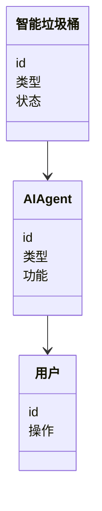
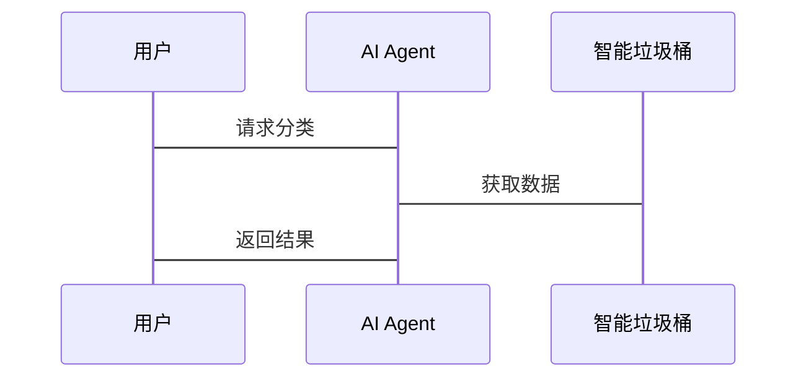

                 


# AI Agent在智能垃圾桶中的回收价值评估

## 关键词：
AI Agent, 智能垃圾桶, 回收价值评估, 图像识别, 机器学习, 价值最大化

## 摘要：
本文详细探讨了AI Agent在智能垃圾桶中的应用，特别是其在回收价值评估中的作用。通过分析AI Agent的核心原理、算法选择、系统架构设计以及实际案例，本文展示了如何利用AI技术优化垃圾分类和价值评估过程，从而提高回收效率和经济效益。

---

# 目录

## 第1章: 问题背景与描述
### 1.1 问题背景
#### 1.1.1 垃圾分类与回收的现状
#### 1.1.2 AI技术在环保领域的应用潜力
#### 1.1.3 智能垃圾桶的市场与技术需求

### 1.2 问题描述
#### 1.2.1 垃圾分类的复杂性与挑战
#### 1.2.2 传统垃圾桶的局限性
#### 1.2.3 AI Agent在智能垃圾桶中的作用

### 1.3 问题解决与边界
#### 1.3.1 AI Agent在智能垃圾桶中的解决方案
#### 1.3.2 解决方案的边界与适用范围
#### 1.3.3 解决方案的潜在扩展性

### 1.4 概念结构与核心要素
#### 1.4.1 AI Agent的核心要素
#### 1.4.2 智能垃圾桶的系统架构
#### 1.4.3 价值评估的关键指标

## 第2章: 核心概念与联系
### 2.1 AI Agent的定义与原理
#### 2.1.1 AI Agent的基本定义
#### 2.1.2 AI Agent的核心原理
#### 2.1.3 AI Agent的分类与特点

### 2.2 智能垃圾桶的系统构成
#### 2.2.1 智能垃圾桶的硬件组成
#### 2.2.2 智能垃圾桶的软件架构
#### 2.2.3 智能垃圾桶的功能模块

### 2.3 核心概念的对比分析
#### 2.3.1 AI Agent与传统垃圾桶的对比
#### 2.3.2 不同AI Agent算法的对比
#### 2.3.3 智能垃圾桶与传统垃圾桶的对比

### 2.4 实体关系与ER图
```mermaid
er
  entity 智能垃圾桶 {
    id 垃圾桶ID
    类型 垃圾类型
    状态 垃圾状态
  }
  entity AI Agent {
    id 代理ID
    类型 代理类型
    功能 代理功能
  }
  entity 用户 {
    id 用户ID
    操作 用户操作
  }
  智能垃圾桶 --> AI Agent
  AI Agent --> 用户
```

## 第3章: 算法原理与数学模型
### 3.1 算法原理
#### 3.1.1 图像识别算法的选择与优化
#### 3.1.2 垃圾分类的强化学习模型
#### 3.1.3 价值评估的回归模型

### 3.2 数学模型
#### 3.2.1 垃圾分类的损失函数
$$ \text{损失函数} = \frac{1}{n}\sum_{i=1}^{n} (y_i - \hat{y}_i)^2 $$
#### 3.2.2 价值预测的回归模型
$$ \text{预测价值} = \beta_0 + \beta_1x_1 + \beta_2x_2 + \ldots + \beta_kx_k $$

### 3.3 算法实现
#### 3.3.1 使用CNN进行图像识别
```python
model = Sequential()
model.add(Conv2D(32, (3,3), activation='relu', input_shape=(64,64,3)))
model.add(MaxPooling2D((2,2)))
model.add(Flatten())
model.add(Dense(128, activation='relu'))
model.add(Dense(10, activation='softmax'))
```

## 第4章: 系统分析与架构设计
### 4.1 问题场景介绍
#### 4.1.1 垃圾分类的典型场景
#### 4.1.2 用户操作流程
#### 4.1.3 系统运行环境

### 4.2 系统功能设计
#### 4.2.1 数据采集模块
#### 4.2.2 分类模块
#### 4.2.3 价值评估模块

### 4.3 系统架构设计


### 4.4 接口与交互设计
#### 4.4.1 系统接口定义
#### 4.4.2 交互流程


## 第5章: 项目实战与案例分析
### 5.1 项目环境安装
#### 5.1.1 开发工具安装
#### 5.1.2 数据集准备
#### 5.1.3 环境配置

### 5.2 核心代码实现
#### 5.2.1 图像识别代码
```python
import tensorflow as tf
from tensorflow.keras import layers

model = tf.keras.Sequential([
    layers.Conv2D(32, (3,3), activation='relu', input_shape=(64,64,3)),
    layers.MaxPooling2D((2,2)),
    layers.Flatten(),
    layers.Dense(128, activation='relu'),
    layers.Dense(10, activation='softmax')
])
```

### 5.3 代码解读与分析
#### 5.3.1 模型训练过程
#### 5.3.2 模型评估方法
#### 5.3.3 实际案例分析

### 5.4 案例分析与详细讲解
#### 5.4.1 案例背景
#### 5.4.2 数据分析
#### 5.4.3 实验结果

## 第6章: 最佳实践与小结
### 6.1 最佳实践
#### 6.1.1 系统优化建议
#### 6.1.2 开发注意事项
#### 6.1.3 拓展阅读建议

### 6.2 小结
#### 6.2.1 核心内容回顾
#### 6.2.2 未来研究方向
#### 6.2.3 结论与展望

---

## 附录
### 附录A: 代码与数据集
### 附录B: 模型训练日志
### 附录C: 参考文献与拓展阅读

