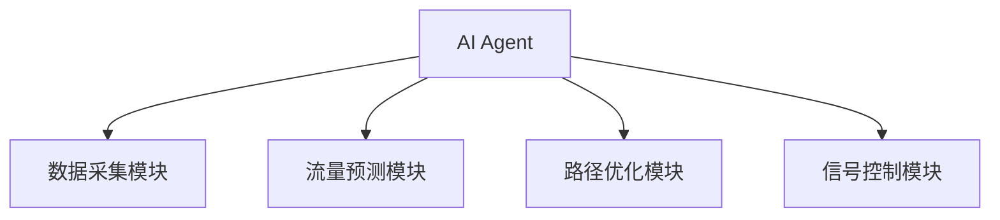

                 


# AI Agent在智能城市交通优化中的应用

> 关键词：AI Agent, 智能城市, 交通优化, 算法, 系统架构

> 摘要：本文详细探讨了AI Agent在智能城市交通优化中的应用，从核心概念、算法原理到系统架构和项目实战，全面解析了AI Agent如何帮助解决城市交通中的复杂问题。通过实际案例分析和系统设计，展示了AI Agent在交通流量预测、路径优化和信号控制中的潜力，为智能城市交通优化提供了新的思路。

---

## 第1章: AI Agent与智能城市交通优化概述

### 1.1 AI Agent的基本概念

#### 1.1.1 AI Agent的定义与特点
AI Agent（人工智能代理）是指在计算机系统中，能够感知环境、自主决策并执行任务的智能实体。AI Agent具有以下特点：
- **自主性**：能够在没有外部干预的情况下自主运行。
- **反应性**：能够实时感知环境变化并做出反应。
- **目标导向**：基于预设目标或学习目标进行决策。
- **协作性**：能够与其他Agent或系统协同工作。

#### 1.1.2 AI Agent的核心功能与类型
AI Agent的核心功能包括感知、推理、决策和执行。根据应用场景的不同，AI Agent可以分为以下类型：
- **反应式Agent**：基于当前感知做出即时反应，适用于实时任务。
- **规划式Agent**：通过规划行动步骤来实现目标，适用于复杂任务。
- **学习式Agent**：通过机器学习技术不断优化自身性能。

#### 1.1.3 AI Agent在智能城市中的应用潜力
AI Agent在智能城市中的应用潜力主要体现在以下几个方面：
- **实时数据处理**：能够快速处理城市交通中的实时数据，如车流量、交通信号等。
- **动态优化**：根据交通状况动态调整优化策略，提高交通效率。
- **多目标协调**：能够在多个目标之间进行协调，平衡交通效率、环境影响和用户需求。

### 1.2 智能城市交通优化的背景与挑战

#### 1.2.1 智能城市交通的定义与发展
智能城市交通是指利用先进的信息技术，如物联网、大数据和人工智能，来优化城市交通系统，提高交通效率和减少环境影响。随着城市化进程的加快，交通问题日益突出，传统的交通管理方法已经难以应对复杂的交通状况。

#### 1.2.2 传统交通优化的局限性
传统交通优化方法主要依赖于静态的交通模型和规则，存在以下局限性：
- **缺乏实时性**：无法快速响应交通状况的变化。
- **局部优化**：难以实现全局最优。
- **缺乏灵活性**：难以适应交通需求的多样化。

#### 1.2.3 AI Agent在交通优化中的优势
AI Agent在交通优化中的优势主要体现在以下几个方面：
- **实时感知与决策**：能够快速感知交通状况并做出最优决策。
- **动态优化**：能够根据实时数据动态调整优化策略。
- **多目标协调**：能够在多个目标之间进行协调，实现全局最优。

### 1.3 AI Agent在交通优化中的应用前景

#### 1.3.1 AI Agent与智能交通系统的结合
AI Agent可以通过与智能交通系统（ITS）的结合，实现交通数据的实时采集、分析和优化。例如，AI Agent可以与交通信号系统协同工作，优化信号灯的配时策略。

#### 1.3.2 AI Agent在实时交通管理中的作用
AI Agent在实时交通管理中的作用主要体现在以下几个方面：
- **实时流量预测**：基于历史数据和实时数据，预测未来的交通流量。
- **动态路径规划**：根据实时交通状况，为车辆提供最优路径。
- **交通信号控制**：根据交通流量动态调整信号灯的配时策略。

#### 1.3.3 未来发展趋势与研究方向
未来，AI Agent在交通优化中的应用将朝着以下几个方向发展：
- **强化学习的应用**：通过强化学习优化AI Agent的决策策略。
- **多智能体协作**：研究多个AI Agent之间的协作机制，实现更高效的交通优化。
- **边缘计算的应用**：将AI Agent部署在边缘设备上，实现更快速的实时响应。

---

## 第2章: AI Agent的核心概念与原理

### 2.1 AI Agent的基本原理

#### 2.1.1 AI Agent的感知与决策机制
AI Agent的感知机制包括数据采集、数据处理和状态识别。决策机制包括目标设定、决策推理和行动选择。

#### 2.1.2 AI Agent的自主性与适应性
AI Agent的自主性体现在其能够自主感知环境、做出决策并执行行动。适应性体现在其能够根据环境的变化调整自身的行为策略。

#### 2.1.3 AI Agent的通信与协作能力
AI Agent可以通过通信模块与其他Agent或系统进行信息交换，实现协作。协作能力体现在多个AI Agent之间的任务分配、信息共享和协同决策。

### 2.2 AI Agent的类型与特点

#### 2.2.1 反应式AI Agent
反应式AI Agent主要基于当前感知的信息做出即时反应，适用于需要快速响应的场景。

#### 2.2.2 规划式AI Agent
规划式AI Agent通过预先设定的目标和规划行动步骤来实现优化，适用于复杂任务。

#### 2.2.3 学习式AI Agent
学习式AI Agent通过机器学习技术不断优化自身性能，适用于需要不断学习和适应的场景。

### 2.3 AI Agent的核心算法与技术

#### 2.3.1 强化学习算法
强化学习是一种通过试错机制优化决策策略的算法。强化学习的核心是通过不断与环境互动，获得奖励或惩罚，从而优化自身的策略。

#### 2.3.2 深度学习算法
深度学习是一种基于人工神经网络的算法，能够从大量数据中学习特征，适用于复杂的模式识别任务。

#### 2.3.3 遗传算法与进化计算
遗传算法是一种模拟生物进化过程的优化算法，适用于全局优化问题。

---

## 第3章: AI Agent在智能城市交通优化中的应用

### 3.1 智能城市交通优化的核心问题

#### 3.1.1 交通流量预测
交通流量预测是智能城市交通优化的重要组成部分，能够为路径规划和信号控制提供依据。

#### 3.1.2 路径优化与分配
路径优化与分配是通过优化车辆的行驶路径，减少交通拥堵和提高交通效率。

#### 3.1.3 交通信号控制
交通信号控制是通过动态调整信号灯的配时策略，优化交通流量。

### 3.2 AI Agent在交通流量预测中的应用

#### 3.2.1 基于AI Agent的实时流量预测
基于AI Agent的实时流量预测通过实时采集交通数据，利用机器学习算法进行预测。

#### 3.2.2 基于历史数据的流量预测模型
基于历史数据的流量预测模型通过分析历史交通数据，建立预测模型。

#### 3.2.3 流量预测的准确性与实时性分析
流量预测的准确性取决于数据质量和算法性能，实时性取决于系统的响应速度。

### 3.3 AI Agent在路径优化与分配中的应用

#### 3.3.1 基于AI Agent的动态路径规划
动态路径规划是根据实时交通状况，为车辆提供最优路径。

#### 3.3.2 多目标优化算法在路径规划中的应用
多目标优化算法通过优化多个目标（如时间、距离、环保等），实现全局最优。

#### 3.3.3 路径优化的效率与公平性评估
路径优化的效率取决于算法的优化能力，公平性取决于对所有车辆的公平分配。

### 3.4 AI Agent在交通信号控制中的应用

#### 3.4.1 基于AI Agent的自适应信号控制
自适应信号控制是根据实时交通流量动态调整信号灯的配时策略。

#### 3.4.2 基于实时数据的信号优化策略
基于实时数据的信号优化策略通过分析实时交通数据，优化信号灯的配时策略。

#### 3.4.3 信号控制的效率与协调性分析
信号控制的效率取决于系统的响应速度和优化能力，协调性取决于多个信号灯之间的协调。

---

## 第4章: AI Agent在智能城市交通优化中的系统架构与实现

### 4.1 系统架构设计

#### 4.1.1 系统功能设计
系统功能包括数据采集、流量预测、路径优化、信号控制和结果输出。

#### 4.1.2 系统架构图


#### 4.1.3 系统接口设计
系统接口包括数据输入接口、算法接口和结果输出接口。

### 4.2 算法实现

#### 4.2.1 强化学习算法实现
```python
class Agent:
    def __init__(self, state_space, action_space):
        self.state_space = state_space
        self.action_space = action_space
        self.model = self.build_model()

    def build_model(self):
        # 构建神经网络模型
        pass

    def act(self, state):
        # 根据状态选择动作
        pass

    def learn(self, state, action, reward, next_state):
        # 强化学习算法更新模型
        pass
```

#### 4.2.2 深度学习算法实现
```python
import tensorflow as tf
from tensorflow.keras import layers

model = tf.keras.Sequential([
    layers.Dense(64, activation='relu'),
    layers.Dense(1)
])
```

#### 4.2.3 遗传算法实现
```python
def fitness(individual):
    # 适应度函数
    pass

def evolve(population):
    # 进化过程
    pass
```

### 4.3 系统实现与优化

#### 4.3.1 系统实现
系统实现包括数据采集、算法实现和结果输出。

#### 4.3.2 系统优化
系统优化包括算法优化和系统架构优化。

#### 4.3.3 系统测试
系统测试包括功能测试和性能测试。

---

## 第5章: AI Agent在智能城市交通优化中的应用案例

### 5.1 应用场景介绍

#### 5.1.1 案例背景
以某城市交通拥堵问题为例，介绍AI Agent的应用场景。

#### 5.1.2 案例目标
通过AI Agent优化交通信号灯配时策略，减少交通拥堵。

### 5.2 核心代码实现

#### 5.2.1 数据采集与处理
```python
import pandas as pd

data = pd.read_csv('traffic_data.csv')
```

#### 5.2.2 流量预测与路径优化
```python
from sklearn.model

