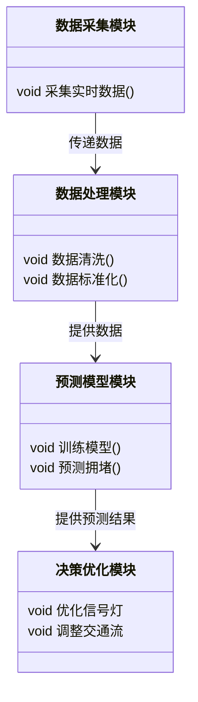
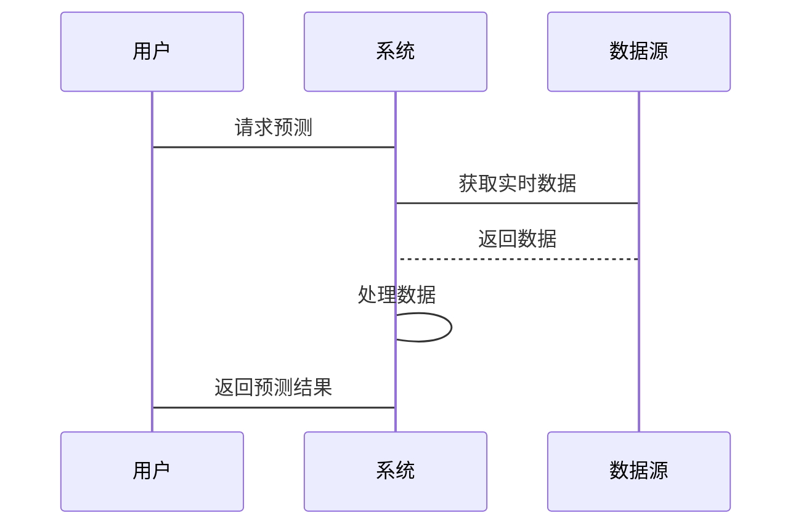

                 


# 第三部分: 项目实战与系统架构设计

## 第5章: 项目实战

### 5.1 环境配置
```bash
# 安装必要的Python库
pip install numpy pandas scikit-learn joblib
```

### 5.2 数据集准备
使用公开的交通数据集，例如：
- 数据来源：公开交通数据集（如Open Data Portals）
- 数据格式：CSV
- 数据字段：时间戳、路段ID、流量、车速、占有率

### 5.3 数据预处理与特征工程
```python
import pandas as pd
from sklearn.impute import KNNImputer
from sklearn.preprocessing import StandardScaler

# 读取数据
data = pd.read_csv('traffic_data.csv')

# 处理缺失值
imputer = KNNImputer(n_neighbors=5)
data_imputed = imputer.fit_transform(data)

# 标准化处理
scaler = StandardScaler()
data_scaled = scaler.fit_transform(data_imputed)
```

### 5.4 模型训练与预测
```python
from sklearn.ensemble import RandomForestRegressor
from sklearn.model_selection import train_test_split
from sklearn.metrics import mean_absolute_error

# 划分训练集和测试集
X_train, X_test, y_train, y_test = train_test_split(data_scaled, target_column, test_size=0.2, random_state=42)

# 初始化模型
model = RandomForestRegressor(n_estimators=100, max_depth=10, random_state=42)

# 训练模型
model.fit(X_train, y_train)

# 预测与评估
y_pred = model.predict(X_test)
mae = mean_absolute_error(y_test, y_pred)
print(f"Mean Absolute Error: {mae}")
```

### 5.5 实际案例分析
```python
# 示例案例
test_input = X_test[0].reshape(1, -1)
predicted = model.predict(test_input)
print(f"预测拥堵情况: {predicted[0]}")
print(f"实际拥堵情况: {y_test[0]}")
```

## 第6章: 系统架构设计

### 6.1 系统功能模块设计


### 6.2 系统架构设计


### 6.3 系统接口设计


## 第7章: 总结与展望

### 7.1 总结
AI Agent在智能城市交通拥堵预测中的应用展示了其强大的数据处理和预测能力。通过实时数据采集、智能分析和决策优化，AI Agent能够有效缓解交通拥堵问题，提升城市交通效率。

### 7.2 展望
未来，随着AI技术的不断发展，AI Agent在交通管理中的应用将更加广泛。结合边缘计算和物联网技术，AI Agent将实现更高效的实时预测和动态优化，进一步推动智能交通系统的建设。

---

### 最佳实践 Tips
1. 数据质量：确保数据的完整性和准确性，进行充分的数据清洗和预处理。
2. 模型选择：根据实际需求选择合适的算法，进行参数调优和模型评估。
3. 系统架构：设计灵活可扩展的系统架构，确保系统的稳定性和可维护性。
4. 实际应用：结合具体场景，进行模型部署和实时监控，及时调整优化策略。

### 小结
通过本文的详细讲解，读者可以全面了解AI Agent在智能城市交通拥堵预测中的应用，掌握其实现原理和系统架构设计方法。希望本文能够为相关领域的研究和实践提供有价值的参考。

### 注意事项
- 数据隐私保护：在处理交通数据时，需遵守相关法律法规，保护用户隐私。
- 系统稳定性：确保系统的高可用性，避免因系统故障导致服务中断。
- 模型更新：定期更新模型，适应交通状况的变化，保持预测的准确性。

### 拓展阅读
1. 《机器学习实战》
2. 《深度学习》
3. 《智能交通系统设计与实现》
4. 相关论文和研究报告

---

通过以上章节的详细讲解，希望读者能够深入理解AI Agent在智能城市交通拥堵预测中的应用，并能够在实际项目中灵活运用这些方法和技术，推动智能交通系统的发展。

