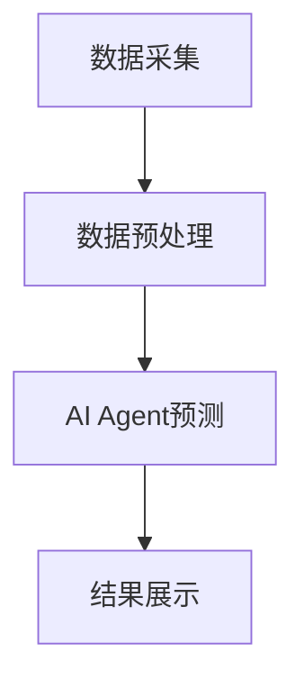

                 


# AI Agent在智能城市交通流预测中的角色

> 关键词：AI Agent, 智能城市, 交通流预测, LSTM, 强化学习, 系统架构设计

> 摘要：本文详细探讨了AI Agent在智能城市交通流预测中的应用角色。通过分析AI Agent的核心概念、算法原理、系统架构设计以及实际项目案例，展示了AI Agent如何通过先进的算法和系统设计，有效提升交通流预测的准确性和实时性。文章还结合具体代码实现和数学公式，深入剖析了AI Agent在交通流预测中的技术细节和实际应用场景，为读者提供了全面的技术解读。

---

## 第1章: AI Agent与智能城市交通流预测概述

### 1.1 AI Agent的基本概念

AI Agent（人工智能代理）是指能够感知环境、自主决策并采取行动的智能实体。在智能城市交通系统中，AI Agent通常被设计为能够实时处理交通数据、预测交通流量变化、优化交通信号控制等。

#### 1.1.1 AI Agent的定义与特点

- **定义**：AI Agent是一种能够通过感知环境信息，基于内部状态和目标，执行决策并采取行动的智能系统。
- **特点**：
  - **自主性**：能够在没有外部干预的情况下独立运行。
  - **反应性**：能够实时感知环境变化并做出相应反应。
  - **学习能力**：通过数据和经验不断优化自身的预测和决策能力。
  - **协作性**：能够与其他AI Agent或系统协同工作，共同完成复杂任务。

#### 1.1.2 AI Agent在智能城市中的应用背景

智能城市的核心目标是通过技术手段优化城市资源的分配和管理，提升城市运行效率。在交通领域，智能交通系统（ITS）的应用日益广泛，而AI Agent作为 ITS 的关键组成部分，能够通过实时数据处理和智能决策，显著提升交通管理的效率和效果。

#### 1.1.3 交通流预测的重要性

交通流预测是智能交通系统的重要组成部分，主要用于预测未来一段时间内道路上的交通流量、速度和密度等指标。准确的交通流预测可以帮助交通管理部门优化信号灯控制、调整交通疏导策略，从而缓解交通拥堵、减少交通事故的发生。

### 1.2 智能城市交通流预测的背景与挑战

#### 1.2.1 智能城市的发展现状

随着城市化进程的加快，城市交通问题日益突出，传统的交通管理方式已经难以应对日益增长的交通流量和复杂的交通环境。智能城市的建设为解决交通问题提供了新的思路。

#### 1.2.2 交通流预测的典型应用场景

- **交通信号灯控制**：通过预测交通流量，优化信号灯的切换策略，减少车辆等待时间。
- **交通流量监控**：实时监控道路上的交通流量，及时发现拥堵点并采取疏导措施。
- **交通路径规划**：为驾驶员提供实时的交通信息，帮助其选择最优行驶路径。

#### 1.2.3 传统交通流预测方法的局限性

传统的交通流预测方法主要包括统计分析法、时间序列预测法等，但这些方法存在以下局限性：
- **数据依赖性强**：需要大量的历史数据支持，且对数据的质量要求较高。
- **预测精度有限**：由于交通环境的复杂性和不确定性，传统方法的预测精度有限。
- **实时性不足**：传统方法通常需要较长时间的计算和处理，难以满足实时预测的需求。

### 1.3 AI Agent在交通流预测中的角色

#### 1.3.1 AI Agent在交通流预测中的优势

AI Agent通过结合机器学习、深度学习等技术，能够显著提升交通流预测的准确性和实时性。其主要优势包括：
- **自主学习能力**：AI Agent能够通过不断学习新的数据，优化自身的预测模型。
- **实时响应能力**：AI Agent能够快速处理实时数据，提供即时的预测结果。
- **多目标优化能力**：AI Agent可以通过多目标优化算法，在多个目标之间找到最佳平衡点，提升预测效果。

#### 1.3.2 AI Agent与传统交通流预测方法的区别

AI Agent与传统交通流预测方法的主要区别在于：
- **数据处理能力**：AI Agent能够处理更大规模、更复杂的数据，且能够实时更新模型。
- **预测精度**：AI Agent通过深度学习等技术，能够显著提升预测精度。
- **适应性**：AI Agent能够快速适应环境的变化，实时调整预测模型。

#### 1.3.3 本章小结

本章主要介绍了AI Agent的基本概念、智能城市交通流预测的背景与挑战，以及AI Agent在交通流预测中的角色和优势。通过对比传统方法，展示了AI Agent在交通流预测中的独特价值和潜力。

---

## 第2章: AI Agent的核心概念与原理

### 2.1 AI Agent的核心概念

AI Agent的核心概念包括感知、决策和行动三个主要部分。

#### 2.1.1 AI Agent的组成与功能

- **感知层**：通过传感器、摄像头等设备感知环境信息。
- **决策层**：基于感知信息和内部状态，通过算法进行决策。
- **行动层**：根据决策结果，采取相应的行动。

#### 2.1.2 AI Agent的分类与特点

- **按智能水平分类**：
  - **反应式AI Agent**：基于当前环境信息进行实时反应，适用于简单的任务。
  - **认知式AI Agent**：具有复杂推理和决策能力，适用于复杂的任务。
- **按应用领域分类**：
  - **服务型AI Agent**：提供特定服务，如交通流预测。
  - **控制型AI Agent**：用于系统控制，如交通信号灯控制。

### 2.2 AI Agent的决策机制

#### 2.2.1 基于强化学习的决策过程

强化学习是一种通过试错机制来优化决策的算法。AI Agent通过与环境交互，不断优化自己的决策策略，以获得最大的奖励。

#### 2.2.2 基于监督学习的决策过程

监督学习是一种通过学习已标注的数据，预测新的数据的算法。AI Agent可以通过监督学习的方法，学习历史交通数据，预测未来的交通流量。

#### 2.2.3 基于混合学习的决策过程

混合学习是一种结合强化学习和监督学习的算法。AI Agent可以通过混合学习的方法，同时利用历史数据和实时反馈，优化自己的决策策略。

### 2.3 AI Agent与交通流预测的结合原理

#### 2.3.1 交通流数据的输入与处理

AI Agent需要通过传感器、摄像头等设备获取交通流数据，并对数据进行预处理，如去噪、归一化等。

#### 2.3.2 AI Agent的预测与优化过程

AI Agent通过机器学习算法，对预处理后的数据进行训练，构建预测模型，并通过模型预测未来交通流量。

#### 2.3.3 预测结果的输出与应用

AI Agent将预测结果输出，并根据预测结果优化交通信号灯控制、调整交通疏导策略等。

### 2.4 本章小结

本章主要介绍了AI Agent的核心概念、决策机制以及与交通流预测的结合原理。通过分析AI Agent的组成、分类和决策机制，展示了AI Agent在交通流预测中的技术基础和实现原理。

---

## 第3章: 交通流预测的数学模型与算法原理

### 3.1 交通流预测的基本数学模型

#### 3.1.1 时间序列预测模型

时间序列预测模型主要用于预测未来的时间序列数据。常用的时间序列预测模型包括ARIMA、LSTM等。

#### 3.1.2 空间分布预测模型

空间分布预测模型主要用于预测交通流量在空间上的分布情况。常用的空间分布预测模型包括空间自回归模型、空间卷积神经网络等。

### 3.2 基于AI Agent的预测算法原理

#### 3.2.1 基于LSTM的时序预测算法

LSTM（长短期记忆网络）是一种基于循环神经网络的深度学习算法，能够有效地捕捉时间序列数据中的长-term依赖关系。

#### 3.2.2 基于强化学习的优化算法

强化学习是一种通过试错机制优化决策的算法，能够有效地应用于交通流预测的优化过程。

### 3.3 算法原理的数学模型与公式

#### 3.3.1 LSTM模型的数学公式

LSTM模型的主要公式包括输入门、遗忘门和输出门的计算公式：

$$
i = \sigma(W_i x + U_i h)
$$

$$
f = \sigma(W_f x + U_f h)
$$

$$
o = \sigma(W_o x + U_o h)
$$

$$
c = f \cdot c + i \cdot \tanh(W_c x + U_c h)
$$

$$
h = o \cdot \tanh(c)
$$

其中，$i$ 是输入门，$f$ 是遗忘门，$o$ 是输出门，$c$ 是细胞状态，$h$ 是隐藏层状态，$W$ 和 $U$ 是权重矩阵，$x$ 是输入，$h$ 是前一时刻的隐藏层状态，$\sigma$ 是sigmoid函数。

#### 3.3.2 强化学习的奖励函数

强化学习的奖励函数通常用于衡量AI Agent的决策效果：

$$
R(s, a) = r \times \text{max}(Q(s, a))
$$

其中，$R(s, a)$ 是奖励值，$s$ 是当前状态，$a$ 是采取的动作，$Q(s, a)$ 是Q值，$r$ 是奖励系数。

### 3.4 本章小结

本章主要介绍了交通流预测的基本数学模型和基于AI Agent的预测算法原理。通过分析LSTM和强化学习的数学公式，展示了AI Agent在交通流预测中的技术实现和优化过程。

---

## 第4章: AI Agent在交通流预测中的系统架构设计

### 4.1 系统整体架构

AI Agent在交通流预测中的系统架构通常包括数据采集与预处理、模型训练与预测、结果展示与应用三个主要模块。

#### 4.1.1 系统功能模块划分

- **数据采集与预处理模块**：负责采集交通流数据，并进行预处理。
- **模型训练与预测模块**：负责训练AI Agent的预测模型，并进行实时预测。
- **结果展示与应用模块**：负责展示预测结果，并根据预测结果优化交通管理策略。

#### 4.1.2 系统交互流程设计

系统交互流程通常包括数据采集、数据预处理、模型训练、模型预测、结果展示五个步骤。

### 4.2 系统功能设计

#### 4.2.1 数据采集与预处理模块

数据采集与预处理模块的主要功能包括：
- **数据采集**：通过传感器、摄像头等设备采集交通流数据。
- **数据预处理**：对采集到的数据进行去噪、归一化等处理，确保数据质量。

#### 4.2.2 AI Agent预测模块

AI Agent预测模块的主要功能包括：
- **模型训练**：通过训练数据训练AI Agent的预测模型。
- **实时预测**：根据实时数据，实时预测未来的交通流量。

#### 4.2.3 结果展示与反馈模块

结果展示与反馈模块的主要功能包括：
- **结果展示**：将预测结果展示在界面上，供交通管理部门参考。
- **反馈优化**：根据预测结果优化交通管理策略，并将优化结果反馈到系统中。

### 4.3 系统架构的Mermaid图

以下是一个简单的系统架构Mermaid图：



### 4.4 本章小结

本章主要介绍了AI Agent在交通流预测中的系统架构设计。通过分析系统功能模块和交互流程，展示了AI Agent在交通流预测中的技术实现和系统设计。

---

## 第5章: AI Agent在交通流预测中的项目实战

### 5.1 项目环境搭建

#### 5.1.1 开发工具

- **编程语言**：Python
- **深度学习框架**：TensorFlow、Keras
- **数据处理工具**：Pandas、NumPy
- **可视化工具**：Matplotlib、Seaborn

### 5.2 项目核心代码实现

#### 5.2.1 数据预处理代码

```python
import pandas as pd
import numpy as np

# 读取数据
data = pd.read_csv('traffic_data.csv')

# 数据清洗
data.dropna(inplace=True)

# 数据归一化
from sklearn.preprocessing import MinMaxScaler
scaler = MinMaxScaler()
data_scaled = scaler.fit_transform(data)
```

#### 5.2.2 LSTM模型实现代码

```python
from tensorflow.keras.models import Sequential
from tensorflow.keras.layers import LSTM, Dense, Dropout

# 定义LSTM模型
model = Sequential()
model.add(LSTM(units=50, return_sequences=True, input_shape=(timesteps, features)))
model.add(Dropout(0.2))
model.add(LSTM(units=50, return_sequences=False))
model.add(Dense(units=1))

# 编译模型
model.compile(optimizer='adam', loss='mean_squared_error')

# 训练模型
model.fit(X_train, y_train, epochs=100, batch_size=32)
```

#### 5.2.3 强化学习优化代码

```python
import numpy as np
import random

# 定义强化学习算法
class Agent:
    def __init__(self, state_space, action_space):
        self.state_space = state_space
        self.action_space = action_space
        self.Q = np.zeros((state_space, action_space))
    
    def act(self, state, epsilon=0.1):
        if random.random() < epsilon:
            return random.randint(0, self.action_space-1)
        else:
            return np.argmax(self.Q[state])
    
    def learn(self, state, action, reward, next_state):
        self.Q[state, action] = self.Q[state, action] + 0.1 * (reward + np.max(self.Q[next_state]) - self.Q[state, action])

# 初始化Agent
agent = Agent(state_space=10, action_space=5)

# 强化学习训练
for episode in range(100):
    state = get_state()
    action = agent.act(state)
    next_state = get_next_state(action)
    reward = get_reward(action, next_state)
    agent.learn(state, action, reward, next_state)
```

### 5.3 项目实战中的数学公式

#### 5.3.1 LSTM模型的训练过程

$$
\text{损失函数} = \frac{1}{N}\sum_{i=1}^{N}(y_i - \hat{y_i})^2
$$

其中，$y_i$ 是真实值，$\hat{y_i}$ 是预测值，$N$ 是样本数量。

#### 5.3.2 强化学习的奖励函数

$$
R(s, a) = r \times \text{max}(Q(s, a))
$$

其中，$r$ 是奖励系数，$Q(s, a)$ 是Q值。

### 5.4 项目实战小结

本章通过一个具体的项目实战，详细展示了AI Agent在交通流预测中的技术实现。通过数据预处理、模型训练和结果展示，展示了AI Agent在交通流预测中的实际应用和优化效果。

---

## 附录: 最佳实践与注意事项

1. **数据预处理**：在进行模型训练之前，务必备份数据并进行清洗，确保数据的准确性和完整性。
2. **模型优化**：在模型训练过程中，可以通过调整学习率、批量大小等超参数，优化模型的性能。
3. **结果验证**：在模型预测之后，需要通过实际数据验证模型的预测精度，确保模型的可靠性和准确性。
4. **系统维护**：在系统运行过程中，需要定期检查系统状态，及时发现并解决系统故障，确保系统的稳定运行。

---

## 结语

通过本文的详细讲解，我们全面探讨了AI Agent在智能城市交通流预测中的角色和应用。从核心概念到算法实现，从系统设计到项目实战，展示了AI Agent在交通流预测中的技术优势和实际价值。未来，随着AI技术的不断发展，AI Agent在智能交通系统中的应用将更加广泛，为智能城市的建设和发展提供更强大的技术支持。

