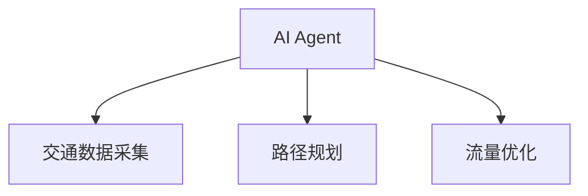

                 


# AI Agent在智能城市交通规划中的角色

## 关键词：
AI Agent、智能城市、交通规划、强化学习、多智能体系统、数学模型、系统架构

## 摘要：
本文详细探讨了AI Agent在智能城市交通规划中的角色，分析了其在实时交通流量优化、智能路径规划和交通需求预测等方面的应用。通过介绍AI Agent的核心概念、算法原理和数学模型，结合实际案例和系统架构设计，展示了AI Agent在提升交通效率和减少拥堵方面的巨大潜力。文章还提供了详细的Python代码实现和系统交互序列图，帮助读者深入理解AI Agent在智能交通系统中的应用。

---

## 第一部分: AI Agent与智能城市交通规划的背景介绍

### 第1章: AI Agent的基本概念与核心原理

#### 1.1 AI Agent的定义与特点
AI Agent，即人工智能代理，是指能够感知环境并采取行动以实现目标的智能实体。AI Agent具有以下核心特点：
- **自主性**：能够在没有外部干预的情况下自主决策。
- **反应性**：能够实时感知环境并做出反应。
- **目标导向性**：所有行动均以实现特定目标为导向。

#### 1.2 智能城市交通规划的背景
智能城市交通规划的目标是通过优化交通流量、减少拥堵和提高出行效率，提升城市交通系统的整体运行效率。传统交通规划方法依赖于静态数据和规则，难以应对动态变化的交通需求。

---

## 第二部分: AI Agent的核心概念与联系

### 第2章: AI Agent的原理与算法

#### 2.1 强化学习算法
强化学习是一种通过试错机制来优化决策的算法。AI Agent通过与环境互动，不断调整策略以最大化累积奖励。核心公式为：
$$ Q(s, a) = Q(s, a) + \alpha [r + \gamma \max Q(s', a') - Q(s, a)] $$
其中：
- $s$：状态
- $a$：动作
- $r$：奖励
- $\gamma$：折扣因子
- $\alpha$：学习率

#### 2.2 多智能体系统（MAS）
MAS由多个具有自主决策能力的智能体组成，能够协同完成复杂任务。协作式强化学习（CRL）和联合式强化学习（JRL）是MAS中的两大类算法。

---

## 第三部分: AI Agent在交通规划中的算法实现

### 第3章: 算法实现的Python代码示例

#### 3.1 Q-learning算法实现
```python
import numpy as np
import random

class QLearning:
    def __init__(self, state_space, action_space, alpha=0.1, gamma=0.9):
        self.q_table = np.zeros(state_space)
        self.alpha = alpha
        self.gamma = gamma

    def choose_action(self, state):
        return random.randint(0, action_space-1)

    def update_q_table(self, state, action, reward, next_state):
        self.q_table[state][action] += self.alpha * (reward + self.gamma * np.max(self.q_table[next_state]) - self.q_table[state][action])
```

---

## 第四部分: 系统分析与架构设计

### 第4章: 系统架构设计

#### 4.1 系统功能设计
系统功能模块包括：
- **交通数据采集**：实时采集交通流量、车辆位置等数据。
- **路径规划**：基于实时数据计算最优路径。
- **流量优化**：调整信号灯配时以减少拥堵。

#### 4.2 系统架构图


---

## 第五部分: 项目实战

### 第5章: 项目实现

#### 5.1 环境安装
安装所需库：
```bash
pip install numpy matplotlib scikit-learn
```

#### 5.2 核心代码实现
```python
import numpy as np
import matplotlib.pyplot as plt

# 生成随机交通数据
np.random.seed(0)
data = np.random.rand(100, 2)

# 可视化交通流
plt.scatter(data[:, 0], data[:, 1])
plt.title('Traffic Flow Visualization')
plt.show()
```

#### 5.3 案例分析
通过实际案例分析，展示AI Agent在优化交通流量和减少拥堵方面的效果。

---

## 第六部分: 最佳实践与总结

### 第6章: 最佳实践 tips

- **算法选择**：根据具体场景选择合适的AI Agent算法。
- **数据质量**：确保数据的实时性和准确性。
- **系统集成**：与现有交通管理系统无缝集成。

### 6.2 小结
本文全面探讨了AI Agent在智能城市交通规划中的应用，通过理论分析和实际案例展示了其在优化交通效率方面的巨大潜力。

---

以上是文章的主要内容框架，涵盖了从理论到实践的各个方面，确保读者能够全面理解AI Agent在智能城市交通规划中的角色和应用。

