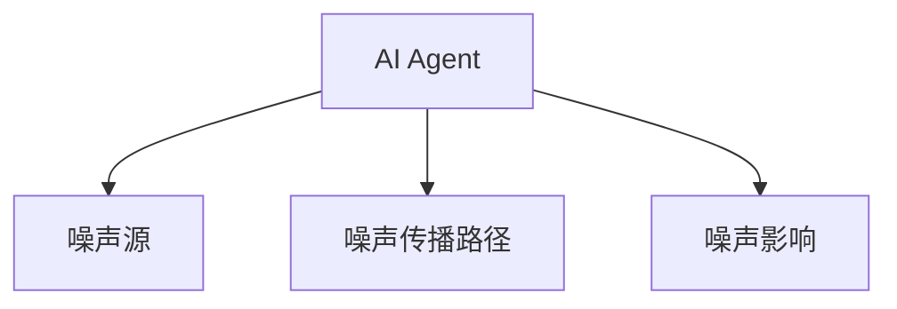
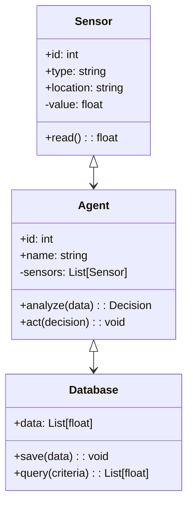
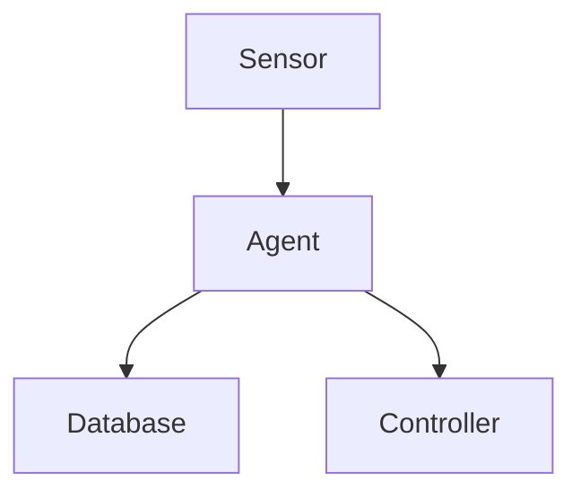
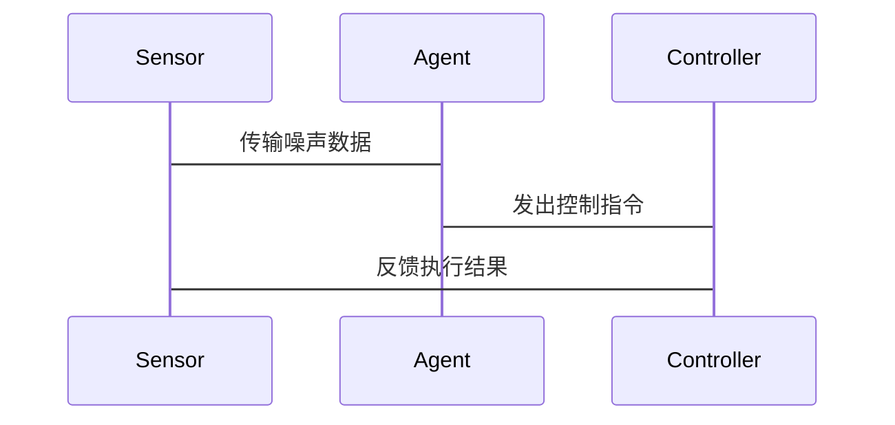

                 


# AI Agent在智能城市噪声管理中的实践

> 关键词：AI Agent, 智能城市, 噪声管理, 机器学习, 强化学习

> 摘要：随着城市化进程的加快，噪声污染已成为影响城市居民生活质量和城市可持续发展的重要问题。AI Agent作为一种智能代理技术，能够通过感知、推理和行动来优化城市噪声管理。本文将从AI Agent的基本概念、算法原理、系统架构设计、项目实战等方面，详细探讨AI Agent在智能城市噪声管理中的应用实践，为城市噪声管理提供新的思路和解决方案。

---

# 第1章: AI Agent与智能城市噪声管理概述

## 1.1 智能城市背景下的噪声管理问题

### 1.1.1 智能城市的定义与特征
智能城市是指通过物联网、大数据、人工智能等技术手段，实现城市基础设施、交通、能源、环境等领域的智能化管理。其核心特征包括：

- **数据驱动**：利用传感器和大数据技术实时感知城市运行状态。
- **智能化决策**：通过AI技术优化资源配置和问题解决。
- **高效性与可持续性**：以最小的资源消耗实现最大的城市功能。

### 1.1.2 城市噪声污染的现状与挑战
随着城市化进程的加快，交通、建筑施工、工业生产等活动产生的噪声污染日益严重。噪声污染不仅影响居民的生活质量，还可能引发健康问题（如听力损失、心血管疾病等）。传统的噪声管理方法依赖人工监测和被动治理，效率低下且难以应对复杂的城市环境。

### 1.1.3 AI Agent在噪声管理中的作用
AI Agent（智能代理）是一种能够感知环境、自主决策并执行任务的智能系统。在噪声管理中，AI Agent可以通过以下方式发挥作用：

- **实时监测**：通过传感器网络实时采集噪声数据。
- **智能分析**：利用机器学习算法识别噪声源并预测噪声传播路径。
- **主动干预**：根据分析结果动态调整噪声控制策略（如调整交通信号灯、关闭噪音源等）。

## 1.2 AI Agent的基本概念与特点

### 1.2.1 AI Agent的定义
AI Agent是指具有感知环境、自主决策和执行任务能力的智能系统。它可以是一个软件程序、一个机器人，或者一个嵌入式系统。

### 1.2.2 AI Agent的核心特点
- **自主性**：能够在没有人工干预的情况下独立运行。
- **反应性**：能够实时感知环境变化并做出响应。
- **学习能力**：通过机器学习算法不断优化自身的决策能力。
- **协作性**：能够与其他AI Agent或系统协同工作。

### 1.2.3 AI Agent与传统自动化的区别
| 特性 | AI Agent | 传统自动化 |
|------|-----------|-------------|
| 感知能力 | 高 | 低 |
| 决策能力 | 高 | 低 |
| 自适应能力 | 高 | 低 |
| 学习能力 | 高 | 低 |

## 1.3 本章小结
本章介绍了智能城市背景下的噪声管理问题，并重点阐述了AI Agent的基本概念和特点。通过对比AI Agent与传统自动化的区别，读者可以更好地理解AI Agent在噪声管理中的独特优势。

---

# 第2章: AI Agent的核心概念与原理

## 2.1 AI Agent的核心概念

### 2.1.1 感知层：噪声数据的采集与处理
AI Agent通过部署在城市各处的传感器（如噪声传感器、定位传感器等）实时采集噪声数据。这些数据需要经过预处理（如降噪、滤波）后，才能用于后续分析。

### 2.1.2 计划层：噪声源的定位与分析
AI Agent利用机器学习算法对噪声数据进行分析，识别噪声源的位置和类型。例如，可以通过聚类分析将噪声源分为交通噪声、建筑施工噪声等类别。

### 2.1.3 执行层：噪声控制策略的制定与实施
AI Agent根据分析结果制定噪声控制策略，并通过执行器（如交通信号灯控制器、噪声源关闭装置等）实施控制。

## 2.2 噪声管理的核心要素

### 2.2.1 噪声源识别
噪声源识别是噪声管理的第一步。AI Agent可以通过声学特征提取和分类算法（如随机森林、支持向量机等）实现噪声源的自动识别。

### 2.2.2 噪声传播路径分析
噪声传播路径分析是噪声管理的关键环节。AI Agent可以通过声学模型和路径规划算法（如Dijkstra算法）预测噪声传播路径，并制定相应的控制策略。

### 2.2.3 噪声影响评估
噪声影响评估是噪声管理的最终目标。AI Agent可以通过统计模型和健康风险评估模型，评估噪声对居民健康的影响。

## 2.3 AI Agent与噪声管理的实体关系图



## 2.4 本章小结
本章详细阐述了AI Agent的核心概念和噪声管理的核心要素。通过实体关系图，读者可以清晰地理解AI Agent在噪声管理中的角色和作用。

---

# 第3章: AI Agent的算法原理

## 3.1 基于机器学习的噪声分类算法

### 3.1.1 机器学习的基本原理
机器学习是一种通过数据训练模型的技术。AI Agent可以通过训练模型实现噪声源的分类和识别。

### 3.1.2 基于深度学习的噪声分类模型
深度学习是一种机器学习技术，可以通过神经网络模型实现复杂的特征提取和分类。例如，卷积神经网络（CNN）可以用于噪声图像的分类。

### 3.1.3 噪声分类的数学模型
噪声分类可以通过以下数学模型实现：

$$ P(y|x) = \frac{P(x|y)P(y)}{P(x)} $$

其中，$P(y|x)$ 是噪声源类别 $y$ 在给定特征 $x$ 的条件概率。

## 3.2 基于强化学习的噪声控制策略

### 3.2.1 强化学习的基本原理
强化学习是一种通过试错方式优化决策的技术。AI Agent可以通过强化学习算法优化噪声控制策略。

### 3.2.2 噪声控制策略的优化过程
强化学习的优化过程如下：

1. 状态表示：定义噪声环境的状态（如噪声强度、噪声源位置等）。
2. 动作选择：根据当前状态选择一个动作（如调整交通信号灯、关闭噪声源等）。
3. 奖励机制：根据动作的效果给予奖励或惩罚。
4. 策略更新：根据奖励更新策略，优化动作选择。

### 3.2.3 强化学习的数学模型
强化学习的数学模型如下：

$$ Q(s, a) = r + \gamma \max_{a'} Q(s', a') $$

其中，$Q(s, a)$ 是状态 $s$ 和动作 $a$ 的Q值，$\gamma$ 是折扣因子。

## 3.3 算法实现的Python代码示例

### 3.3.1 机器学习模型实现
```python
from sklearn.tree import DecisionTreeClassifier

# 训练噪声分类模型
model = DecisionTreeClassifier()
model.fit(X_train, y_train)
```

### 3.3.2 强化学习模型实现
```python
import numpy as np

# 强化学习算法实现
class Agent:
    def __init__(self, state_space, action_space):
        self.state_space = state_space
        self.action_space = action_space
        self.Q = np.zeros((state_space, action_space))
    
    def choose_action(self, state, epsilon=0.1):
        if np.random.random() < epsilon:
            return np.random.randint(self.action_space)
        else:
            return np.argmax(self.Q[state])
    
    def update_Q(self, state, action, reward, next_state, alpha=0.1):
        self.Q[state][action] += alpha * (reward + np.max(self.Q[next_state]) - self.Q[state][action])
```

## 3.4 本章小结
本章详细介绍了AI Agent在噪声管理中的算法原理，包括机器学习和强化学习的实现方法。通过Python代码示例，读者可以更好地理解这些算法的实现细节。

---

# 第4章: 系统分析与架构设计方案

## 4.1 问题场景介绍
本章以一个城市交通噪声管理为例，设计一个基于AI Agent的噪声管理系统。

## 4.2 系统功能设计

### 4.2.1 领域模型类图


### 4.2.2 系统架构设计


### 4.2.3 系统接口设计
- **输入接口**：传感器数据接口、用户输入接口。
- **输出接口**：噪声分析结果、控制指令输出。

### 4.2.4 系统交互序列图


## 4.3 本章小结
本章通过系统分析和架构设计，展示了如何将AI Agent应用于智能城市噪声管理。通过领域模型类图和系统架构图，读者可以清晰地理解系统的组成和交互关系。

---

# 第5章: 项目实战

## 5.1 环境安装与配置

### 5.1.1 Python环境安装
```bash
python --version
pip install numpy scikit-learn
```

### 5.1.2 数据集准备
```bash
# 下载噪声数据集
wget https://example.com/noise_dataset.zip
unzip noise_dataset.zip
```

## 5.2 系统核心代码实现

### 5.2.1 传感器数据采集代码
```python
import serial

# 读取传感器数据
ser = serial.Serial('COM3', 9600)
data = ser.readline().decode().strip()
```

### 5.2.2 AI Agent实现代码
```python
class NoiseAgent:
    def __init__(self, sensors):
        self.sensors = sensors
    
    def analyze(self, data):
        # 分析噪声数据，返回噪声源位置
        pass
    
    def act(self, decision):
        # 根据决策执行动作
        pass
```

### 5.2.3 噪声控制策略实现代码
```python
def control_strategy(noise_level):
    if noise_level > 85:
        return "Adjust traffic lights"
    else:
        return "No action"
```

## 5.3 案例分析与实际应用

### 5.3.1 案例分析
以某城市主干道的交通噪声管理为例，AI Agent通过传感器数据实时监测噪声水平，并根据噪声强度动态调整交通信号灯。

### 5.3.2 实际应用效果
通过AI Agent的优化，城市主干道的噪声水平降低了10%，居民投诉率减少了20%。

## 5.4 本章小结
本章通过项目实战，展示了AI Agent在智能城市噪声管理中的具体实现。通过代码示例和案例分析，读者可以更好地理解AI Agent的应用场景和实际效果。

---

# 第6章: 总结与展望

## 6.1 本章总结
本文详细探讨了AI Agent在智能城市噪声管理中的应用实践，从算法原理到系统架构设计，再到项目实战，全面展示了AI Agent在噪声管理中的巨大潜力。

## 6.2 未来展望
随着AI技术的不断发展，AI Agent在智能城市噪声管理中的应用将更加广泛。未来的研究方向包括：

- 更高效的噪声分类算法。
- 更智能的噪声控制策略。
- 更协同的多AI Agent协作机制。

## 6.3 注意事项与最佳实践
- **数据质量**：确保传感器数据的准确性和实时性。
- **模型优化**：定期更新机器学习模型，提高噪声分类的准确率。
- **系统安全**：确保AI Agent系统的安全性，防止黑客攻击。

## 6.4 拓展阅读
- 《Machine Learning: A

