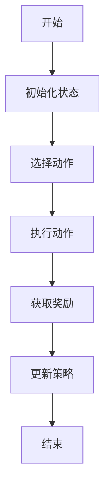
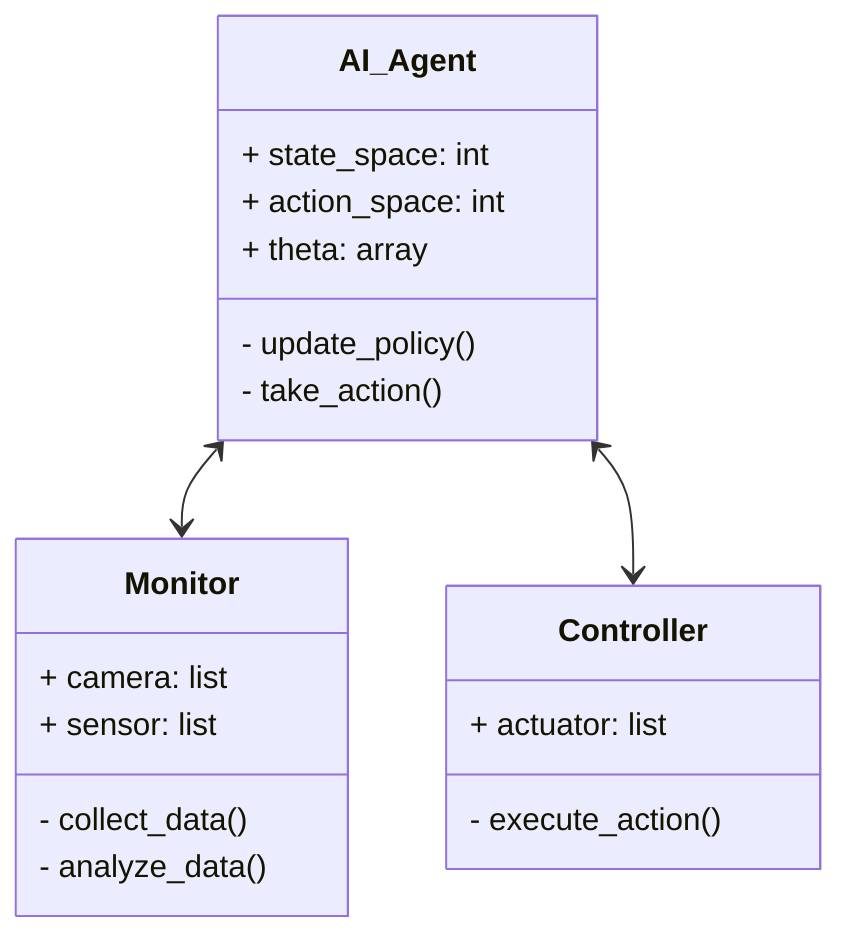
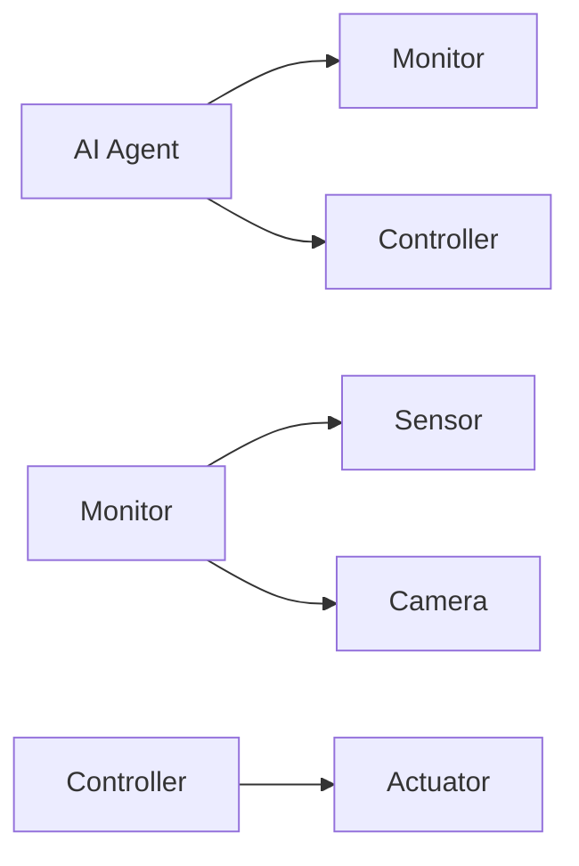
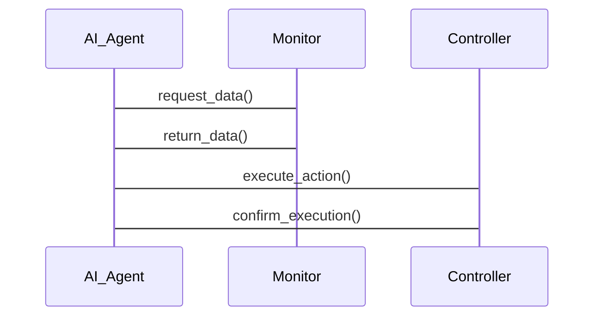

                 


# AI Agent在智能城市安全监控中的角色

## 关键词：AI Agent、智能城市、安全监控、机器学习、计算机视觉、强化学习、城市安全

## 摘要：  
随着城市化进程的加快，智能城市的安全监控需求日益迫切。AI Agent作为人工智能领域的核心技术，能够通过智能化的感知、分析和决策，显著提升城市安全监控的效率和准确性。本文将深入探讨AI Agent在智能城市安全监控中的角色，分析其核心技术、应用场景、系统架构及实际案例，为相关领域的研究和实践提供参考。

---

## 第1章: AI Agent与智能城市概述

### 1.1 AI Agent的基本概念  
AI Agent（人工智能代理）是指能够感知环境、自主决策并执行任务的智能实体。它具备以下特点：  
- **自主性**：能够在没有外部干预的情况下独立运行。  
- **反应性**：能够实时感知环境变化并做出响应。  
- **目标导向**：以特定目标为导向，优化决策过程。  
- **学习能力**：通过数据和经验不断优化自身性能。  

AI Agent在智能城市中的作用主要体现在以下几个方面：  
1. **实时监控**：通过传感器和摄像头等设备，实时采集城市环境中的数据。  
2. **智能分析**：利用机器学习和数据分析技术，识别潜在的安全隐患。  
3. **决策支持**：基于分析结果，提供最优的决策建议或自动执行特定操作。  

### 1.2 智能城市安全监控的背景与挑战  
智能城市安全监控是保障城市居民生命财产安全的重要组成部分，涵盖了公共安全、交通管理、环境监测等多个领域。然而，传统的安全监控系统存在以下问题：  
- **人工干预过多**：需要大量人员值守，效率低下。  
- **数据处理能力不足**：面对海量数据，难以实时分析和处理。  
- **智能化水平有限**：缺乏自主决策能力，无法应对复杂场景。  

AI Agent的引入能够有效解决这些问题，通过智能化的感知和决策，显著提升监控系统的效率和准确性。

### 1.3 AI Agent与智能城市安全监控的关系  
AI Agent在智能城市安全监控中的角色可以比喻为“智能大脑”，通过整合多种技术手段，实现对城市环境的全方位监控。其核心作用体现在以下方面：  
1. **数据采集与处理**：通过传感器、摄像头等设备，实时采集城市环境中的数据，并进行初步处理。  
2. **智能分析与决策**：利用机器学习算法，对数据进行深度分析，识别潜在的安全隐患，并制定相应的应对策略。  
3. **协同与通信**：与其他系统和设备进行实时通信，确保信息的高效传递和协同工作。  

通过AI Agent的应用，智能城市安全监控系统能够实现从“被动响应”到“主动预防”的转变，显著提升城市的安全性。

---

## 第2章: AI Agent的核心技术与实现原理

### 2.1 AI Agent的核心技术  
AI Agent的核心技术主要包括以下几方面：  
1. **机器学习**：通过监督学习、无监督学习和强化学习等方法，训练模型以识别和预测潜在的安全威胁。  
2. **计算机视觉**：利用图像处理和视频分析技术，识别和跟踪目标物体或人物。  
3. **自然语言处理**：通过文本分析技术，理解并处理与安全监控相关的文本信息。  

### 2.2 AI Agent的实现原理  
AI Agent的实现过程可以分为以下几个步骤：  
1. **数据采集**：通过传感器、摄像头等设备，实时采集城市环境中的数据。  
2. **数据预处理**：对采集到的数据进行清洗、归一化等预处理操作，确保数据的可用性。  
3. **模型训练**：利用机器学习算法，对预处理后的数据进行训练，生成能够识别安全威胁的模型。  
4. **实时推理**：将实时采集的数据输入训练好的模型中，进行实时分析和预测。  
5. **决策与执行**：根据分析结果，制定相应的决策并执行操作，例如发出警报或启动应急响应机制。  

### 2.3 AI Agent的算法实现  
以下是基于强化学习的AI Agent实现流程图：  


以下是一个简单的强化学习算法的Python实现示例：  
```python
class AI_Agent:
    def __init__(self, state_space, action_space):
        self.state_space = state_space
        self.action_space = action_space
        # 初始化策略参数
        self.theta = np.random.randn(1, state_space)
    
    def take_action(self, state):
        # 根据当前状态选择动作
        probabilities = softmax(self.theta * state)
        action = np.random.choice(self.action_space, p=probabilities)
        return action
    
    def update_policy(self, reward):
        # 根据奖励更新策略参数
        self.theta += reward * self.theta
```

---

## 第3章: AI Agent在智能城市安全监控中的应用场景

### 3.1 公共安全监控  
在公共安全监控中，AI Agent可以用于实时识别和跟踪潜在的安全威胁，例如：  
1. **异常行为检测**：通过计算机视觉技术，识别公共场所中的异常行为，如打架、非法闯入等。  
2. **人脸识别与追踪**：利用人脸识别技术，快速定位和追踪犯罪嫌疑人。  
3. **紧急事件处理**：在发生火灾、爆炸等紧急事件时，AI Agent能够快速响应，协调相关部门进行救援。  

### 3.2 交通管理  
在交通管理中，AI Agent可以用于优化交通流量，减少拥堵现象。例如：  
1. **实时交通监控**：通过摄像头和传感器，实时监测道路的交通状况。  
2. **智能信号灯控制**：根据交通流量动态调整信号灯的切换频率，优化交通流量。  
3. **交通事故预警**：通过分析交通数据，预测潜在的交通事故风险，并提前发出预警。  

### 3.3 环境监测  
在环境监测中，AI Agent可以用于实时监测城市环境中的空气质量、噪音污染等指标。例如：  
1. **空气质量监测**：通过传感器实时采集空气质量数据，并利用机器学习算法预测未来的空气质量变化。  
2. **噪音污染控制**：通过分析噪音数据，识别噪音源，并制定相应的控制策略。  

---

## 第4章: AI Agent的系统架构与设计

### 4.1 系统功能设计  
以下是系统功能设计的类图：  


### 4.2 系统架构设计  
以下是系统架构设计的架构图：  


### 4.3 系统接口设计  
以下是系统接口设计的序列图：  


---

## 第5章: 项目实战与案例分析

### 5.1 项目实战  
以下是一个简单的AI Agent实现的Python代码示例：  
```python
import numpy as np
from sklearn.datasets import make_classification
from sklearn.linear_model import LogisticRegression

# 生成合成数据
X, y = make_classification(n_samples=1000, n_features=2, n_classes=2)

# 训练逻辑回归模型
model = LogisticRegression()
model.fit(X, y)

# 定义AI Agent类
class AI_Agent:
    def __init__(self, model):
        self.model = model
    
    def predict(self, X):
        return self.model.predict(X)
    
    def predict_proba(self, X):
        return self.model.predict_proba(X)

# 使用AI Agent进行预测
agent = AI_Agent(model)
X_test = np.array([[0, 0], [1, 1]])
y_pred = agent.predict(X_test)
print(y_pred)
```

### 5.2 案例分析  
以下是一个AI Agent在公共安全监控中的实际案例分析：  
1. **场景描述**：某商场发生了一起盗窃事件，AI Agent通过摄像头实时监控商场内的人员行为。  
2. **数据采集**：AI Agent通过摄像头采集商场内的实时视频数据。  
3. **异常行为检测**：AI Agent利用计算机视觉技术，识别商场内的异常行为，如有人在商场内徘徊较长时间。  
4. **决策与执行**：AI Agent判断该行为可能是盗窃行为，并向安保人员发出警报。  

---

## 第6章: 最佳实践与小结

### 6.1 最佳实践  
在实际应用中，AI Agent的设计和部署需要注意以下几点：  
1. **数据隐私保护**：在采集和处理数据时，必须遵守相关法律法规，保护用户隐私。  
2. **系统可扩展性**：在设计系统架构时，应充分考虑系统的可扩展性，以便未来功能的扩展和升级。  
3. **多技术协同**：AI Agent的应用需要结合多种技术手段，如机器学习、计算机视觉等，才能达到最佳效果。  

### 6.2 小结  
AI Agent作为人工智能领域的核心技术，已经在智能城市安全监控中发挥了重要作用。通过智能化的感知、分析和决策，AI Agent能够显著提升城市安全监控的效率和准确性。然而，AI Agent的应用也面临着数据隐私、系统安全等挑战，需要我们在未来的研究和实践中不断探索和优化。

