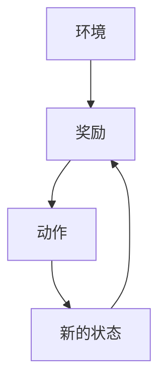
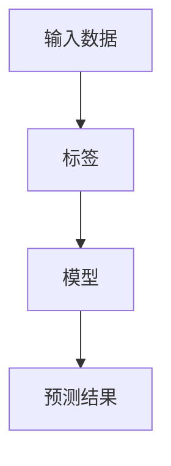
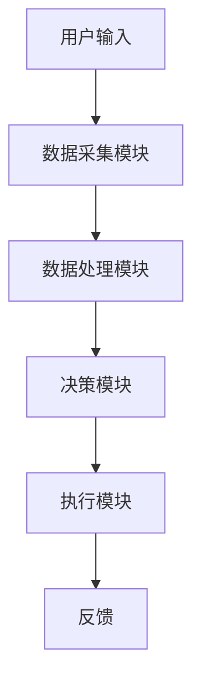

                 


# AI Agent在智能城市安全管理中的角色

> 关键词：AI Agent，智能城市，安全管理，算法原理，系统架构，项目实战

> 摘要：随着人工智能技术的快速发展，AI Agent（人工智能代理）在智能城市安全管理中的应用日益广泛。本文从AI Agent的基本概念出发，分析其在智能城市安全管理中的核心作用，探讨其算法原理、系统架构设计、实际应用案例及未来发展方向，为智能城市的安全管理提供新的思路和解决方案。

---

# 第一部分：AI Agent在智能城市安全管理中的背景与概念

## 第1章：AI Agent的基本概念与智能城市安全管理需求

### 1.1 AI Agent的定义与核心特征

#### 1.1.1 AI Agent的定义
AI Agent（人工智能代理）是一种智能体，能够感知环境、自主决策并执行任务。它通过传感器获取信息，利用算法进行分析和推理，并通过执行器与环境交互。AI Agent的核心目标是通过智能化的决策和行动，实现特定的目标。

#### 1.1.2 AI Agent的核心特征
- **自主性**：AI Agent能够在没有外部干预的情况下自主运行。
- **反应性**：能够实时感知环境变化并做出响应。
- **主动性**：主动采取行动以实现目标。
- **学习能力**：通过数据和经验不断优化自身的决策能力。

#### 1.1.3 AI Agent与传统自动化的区别
| 特性            | 传统自动化          | AI Agent            |
|-----------------|--------------------|---------------------|
| 决策方式        | 预定义规则          | 自主学习与推理      |
| 环境适应能力    | 固定场景            | 多变复杂场景        |
| 处理方式        | 单一任务            | 多任务与复杂任务    |

---

### 1.2 智能城市安全管理的需求与挑战

#### 1.2.1 智能城市安全管理的需求
智能城市的安全管理需求包括：
1. **实时监控**：对城市中的交通、能源、环境等系统进行实时监控。
2. **风险预警**：通过数据分析预测潜在的安全风险。
3. **快速响应**：在发生安全事件时，迅速采取行动进行处理。

#### 1.2.2 安全管理中的主要挑战
1. **数据多样性**：需要处理来自多种传感器和系统的异构数据。
2. **决策复杂性**：在复杂场景中需要快速做出最优决策。
3. **系统协同性**：需要与其他系统（如物联网、云计算）协同工作。

#### 1.2.3 AI Agent在安全管理中的角色
AI Agent在智能城市安全管理中的主要角色包括：
1. **数据采集与处理**：通过传感器获取实时数据。
2. **威胁检测与分析**：利用算法识别潜在的安全威胁。
3. **决策与执行**：根据分析结果采取相应的行动。

---

## 第2章：AI Agent的核心概念与智能城市安全管理的联系

### 2.1 AI Agent的核心概念

#### 2.1.1 AI Agent的感知机制
AI Agent通过传感器（如摄像头、温度计）获取环境数据，并通过数据处理技术（如特征提取、模式识别）进行分析。

#### 2.1.2 AI Agent的决策机制
AI Agent基于感知到的数据，利用机器学习算法（如强化学习、监督学习）进行决策。决策过程需要考虑目标、约束条件和可能的后果。

#### 2.1.3 AI Agent的执行机制
AI Agent根据决策结果，通过执行器（如智能设备、机器人）执行具体操作。

#### 2.1.4 AI Agent与其他系统的协同
AI Agent需要与物联网（IoT）、云计算、大数据等系统协同工作，共同完成智能城市的安全管理任务。

---

### 2.2 AI Agent在智能城市安全管理中的核心属性

| 属性            | 描述                              |
|-----------------|----------------------------------|
| 多模态数据处理  | 能够处理图像、文本、语音等多种数据类型 |
| 实时性          | 能够快速响应实时数据和事件          |
| 自适应性        | 能够根据环境变化动态调整策略        |
| 可扩展性        | 能够扩展到更大规模的城市管理系统    |

---

## 第3章：AI Agent在智能城市安全管理中的算法原理

### 3.1 常见的AI Agent算法

#### 3.1.1 强化学习（Reinforcement Learning）
强化学习是一种通过试错机制来优化决策的算法。AI Agent通过与环境的交互获得奖励或惩罚，逐步优化自身的策略。



#### 3.1.2 监督学习（Supervised Learning）
监督学习通过训练数据对AI Agent进行监督，使其能够预测未来的状态。



#### 3.1.3 聚类分析（Clustering）
聚类分析用于将相似的安全事件归类，帮助AI Agent识别潜在的威胁模式。

---

### 3.2 AI Agent算法的数学模型与公式

#### 3.2.1 强化学习的数学模型
强化学习的目标是通过最大化累计奖励来优化策略。其数学模型可以表示为：

$$
Q(s, a) = r + \gamma \max_{a'} Q(s', a')
$$

其中，\( Q(s, a) \) 表示在状态 \( s \) 下执行动作 \( a \) 的价值，\( r \) 是奖励，\( \gamma \) 是折扣因子。

#### 3.2.2 监督学习的数学模型
监督学习的目标是最小化预测值与真实值之间的误差。其数学模型可以表示为：

$$
\min_{\theta} \mathbb{E}_{(x, y)} [\mathcal{L}(y, f_\theta(x))]
$$

其中，\( \theta \) 是模型参数，\( f_\theta(x) \) 是模型的预测函数，\( \mathcal{L} \) 是损失函数。

---

## 第4章：AI Agent在智能城市安全管理中的系统架构设计

### 4.1 系统总体架构



---

### 4.2 模块功能设计

#### 4.2.1 数据采集模块
数据采集模块负责从传感器和其他系统中获取实时数据。

#### 4.2.2 数据处理模块
数据处理模块对采集到的数据进行预处理、特征提取和数据融合。

#### 4.2.3 决策模块
决策模块基于处理后的数据，利用AI算法进行威胁检测和决策。

#### 4.2.4 执行模块
执行模块根据决策结果，通过执行器（如智能设备）采取具体行动。

---

## 第5章：AI Agent在智能城市安全管理中的项目实战

### 5.1 环境安装与配置

```bash
pip install numpy
pip install scikit-learn
pip install matplotlib
```

---

### 5.2 核心代码实现

```python
import numpy as np
from sklearn import svm

# 数据预处理
X = np.array([[1, 2], [3, 4], [5, 6]])
y = np.array([0, 1, 0])

# 训练模型
model = svm.SVC()
model.fit(X, y)

# 预测
print(model.predict([[2, 3]]))
```

---

### 5.3 代码解读与分析

这段代码使用支持向量机（SVM）对数据进行分类。首先，数据被分为训练集和测试集，然后模型在训练集上进行训练，最后在测试数据上进行预测。

---

### 5.4 案例分析与详细解读

以智能交通系统为例，AI Agent可以实时监控交通流量，并根据数据预测拥堵情况，提前采取疏导措施。

---

## 第6章：AI Agent在智能城市安全管理中的总结与展望

### 6.1 总结

本文详细探讨了AI Agent在智能城市安全管理中的核心作用，分析了其算法原理和系统架构设计，并通过实际案例展示了其应用价值。

### 6.2 最佳实践

- **数据质量**：确保数据的准确性和完整性。
- **算法选择**：根据具体场景选择合适的算法。
- **系统集成**：与其他系统协同工作，确保整体效率。

### 6.3 未来展望

随着人工智能技术的不断发展，AI Agent在智能城市安全管理中的应用前景广阔。未来的研究方向包括更高效的算法、更强大的系统架构设计以及更广泛的实际应用。

---

通过以上章节的详细讲解，我们对AI Agent在智能城市安全管理中的角色和应用有了全面的理解。

