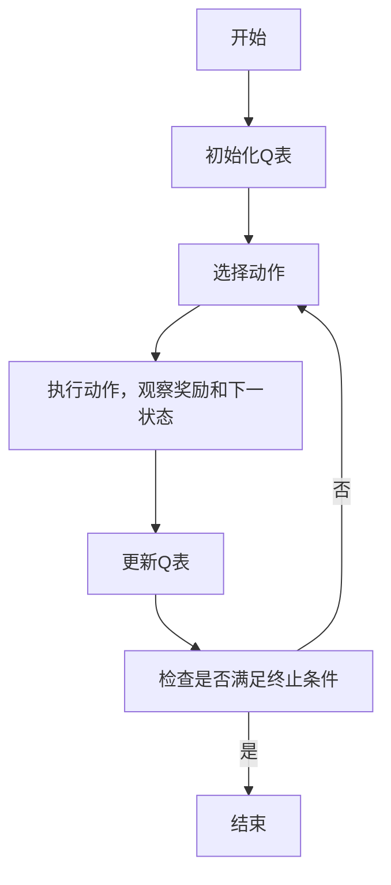
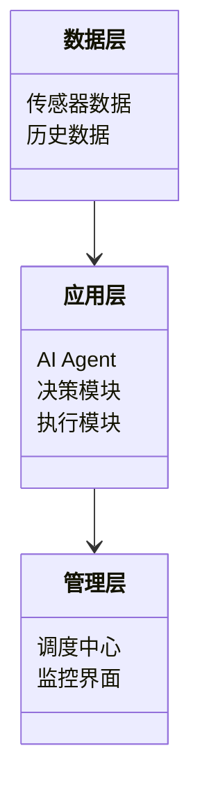
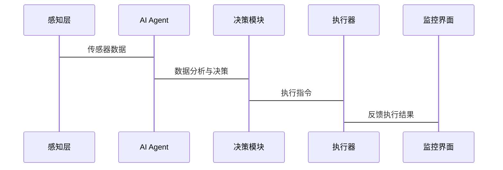

                 


---

# AI Agent在智能城市应急响应中的角色

## 关键词：AI Agent, 智能城市, 应急响应, 人工智能, 系统架构

## 摘要：  
本文探讨了AI Agent在智能城市应急响应中的角色与应用。通过分析AI Agent的核心概念、算法原理、系统架构以及实际项目案例，本文详细阐述了AI Agent如何在城市应急响应中实现智能化决策与高效执行。文章还提供了最佳实践建议，以帮助读者更好地理解和应用AI Agent技术。

---

# 第一部分: AI Agent在智能城市应急响应中的背景与概念

## 第1章: AI Agent与智能城市概述

### 1.1 AI Agent的基本概念

#### 1.1.1 AI Agent的定义  
AI Agent（人工智能代理）是指能够感知环境、自主决策并执行任务的智能实体。它通过传感器获取信息，利用算法进行推理，并通过执行器与环境互动。AI Agent可以在智能城市中承担多种角色，如交通管理、应急响应和资源分配等。

#### 1.1.2 AI Agent的核心特征  
- **自主性**：AI Agent能够自主决策，无需人工干预。  
- **反应性**：能够实时感知环境变化并做出响应。  
- **学习能力**：通过机器学习算法不断优化决策策略。  
- **协作性**：能够与其他AI Agent或系统协同工作。  

#### 1.1.3 智能城市的基本概念  
智能城市是指通过物联网、大数据和人工智能等技术，将城市中的各个系统（如交通、能源、医疗等）整合起来，实现高效、可持续发展的城市形态。智能城市的核心目标是提高居民生活质量、优化资源配置和提升城市管理效率。

---

### 1.2 智能城市应急响应的重要性

#### 1.2.1 应急响应的定义  
应急响应是指在突发事件（如自然灾害、交通事故、恐怖袭击等）发生时，城市管理部门迅速采取行动，以减少损失、保障居民安全的过程。

#### 1.2.2 智能城市中应急响应的特点  
- **实时性**：快速响应突发事件。  
- **协同性**：多个部门和系统协同工作。  
- **数据驱动**：依赖大数据分析和AI技术进行决策。  

#### 1.2.3 AI Agent在应急响应中的作用  
AI Agent在智能城市应急响应中扮演着关键角色，主要体现在以下几个方面：  
1. **实时监测**：通过传感器和摄像头等设备实时监测城市环境。  
2. **智能决策**：基于实时数据和历史信息，快速制定最优应对方案。  
3. **高效执行**：通过自动化系统快速执行决策，如调度救援资源、交通管制等。  

---

## 第2章: AI Agent在智能城市应急响应中的角色

### 2.1 应急响应中的问题背景

#### 2.1.1 城市应急响应的挑战  
城市应急响应面临以下主要挑战：  
- **信息分散**：突发事件发生时，各部门的数据分散，难以快速整合。  
- **决策复杂**：突发事件往往涉及多个领域（如交通、医疗、消防等），决策复杂且时间紧迫。  
- **资源有限**：在突发事件中，资源（如救援队伍、医疗设备等）往往有限，需高效分配。  

#### 2.1.2 AI Agent如何解决这些问题  
AI Agent通过以下方式帮助解决城市应急响应的挑战：  
1. **数据整合与分析**：AI Agent能够快速整合多源数据，生成实时的事件分析和预测。  
2. **智能决策支持**：基于机器学习模型，AI Agent能够提供最优的应对方案。  
3. **自动化执行**：通过与自动化系统的集成，AI Agent能够快速执行决策，提高响应效率。  

#### 2.1.3 AI Agent的应用场景  
AI Agent在城市应急响应中的应用场景包括：  
- **火灾应急**：AI Agent通过烟雾传感器和摄像头实时监测火情，制定灭火方案并调度消防资源。  
- **交通事故处理**：AI Agent通过交通传感器实时监测道路状况，快速定位事故位置并协调交警、救护车等部门进行处理。  
- **公共卫生事件应对**：AI Agent通过分析疫情数据，制定隔离、消毒等措施，并协调医疗资源进行应对。  

---

## 第2.2 AI Agent的核心功能

### 2.2.1 数据采集与处理

#### 2.2.1.1 数据采集  
AI Agent通过多种传感器和数据源（如摄像头、温度传感器、GPS等）实时采集城市环境中的数据。  

#### 2.2.1.2 数据处理  
AI Agent利用大数据处理技术对采集到的数据进行清洗、融合和分析，生成可用于决策的实时信息。  

### 2.2.2 智能决策与规划

#### 2.2.2.1 决策算法  
AI Agent采用强化学习、决策树等算法，基于实时数据和历史信息生成最优决策方案。  

#### 2.2.2.2 计划与调度  
AI Agent根据决策结果制定详细的行动计划，并通过与自动化系统的接口实现资源的最优调度。  

### 2.2.3 执行与反馈

#### 2.2.3.1 执行控制  
AI Agent通过与自动化系统的接口，执行决策方案，如启动应急设备、调度救援资源等。  

#### 2.2.3.2 反馈机制  
AI Agent实时收集执行结果的反馈信息，并根据反馈不断优化决策策略。  

---

## 第3章: AI Agent的核心概念与联系

### 3.1 AI Agent的核心原理

#### 3.1.1 知识表示与推理  
AI Agent通过知识表示技术将城市环境中的信息表示为符号或数据结构，并利用推理算法（如逻辑推理、概率推理）进行逻辑推理，生成决策方案。  

#### 3.1.2 感知与决策机制  
AI Agent通过感知环境（如视觉感知、听觉感知）获取实时信息，并利用决策算法（如强化学习、决策树）生成决策。  

#### 3.1.3 执行与反馈  
AI Agent通过执行器（如机器人、自动化系统）执行决策，并通过反馈机制不断优化决策策略。  

---

### 3.2 AI Agent与相关系统的关系

#### 3.2.1 对比表格  
以下表格展示了AI Agent与其他相关系统（如规则引擎、传统数据库）在功能、性能和灵活性方面的对比：  

| 特性                | AI Agent             | 规则引擎           | 传统数据库         |
|---------------------|----------------------|-------------------|-------------------|
| **功能**            | 智能决策与执行       | 基于规则的处理    | 数据存储与查询    |
| **性能**            | 高效处理复杂问题     | 快速执行规则       | 快速查询数据       |
| **灵活性**          | 高，支持自适应学习     | 中，规则需手动维护  | 低，结构相对固定    |

---

#### 3.2.2 ER实体关系图  

以下是一个简单的ER图，展示了AI Agent在智能城市应急响应系统中的实体关系：  

```mermaid
er
    %% ER图：AI Agent在智能城市应急响应系统中的实体关系
    %% 作者：your name
    %% 日期：2023-10-10

    %% 实体：AI Agent
    %% 实体：传感器
    %% 实体：执行器
    %% 实体：城市环境

    %% 关系：AI Agent与传感器
    %% 关系：AI Agent与执行器
    %% 关系：AI Agent与城市环境

    %% 属性：传感器（id，类型，位置）
    %% 属性：执行器（id，类型，位置）
    %% 属性：城市环境（id，状态，事件）

    %% 备注：此图展示了AI Agent在智能城市应急响应系统中的实体关系。

    %% 实体：AI Agent
    %% 实体：传感器
    %% 实体：执行器
    %% 实体：城市环境

    %% 关系：AI Agent与传感器
    %% 关系：AI Agent与执行器
    %% 关系：AI Agent与城市环境

    %% 属性：传感器（id，类型，位置）
    %% 属性：执行器（id，类型，位置）
    %% 属性：城市环境（id，状态，事件）

    %% 备注：此图展示了AI Agent在智能城市应急响应系统中的实体关系。
```

---

## 第4章: AI Agent的算法原理与数学模型

### 4.1 强化学习算法

#### 4.1.1 强化学习的基本原理  
强化学习是一种机器学习方法，通过智能体与环境的交互，学习最优策略。其核心是通过试错（trial-and-error）的方式，逐步优化决策策略。  

#### 4.1.2 Q-learning算法  
Q-learning是一种常用的强化学习算法，适用于离散动作空间的问题。其更新公式如下：  

$$ Q(s, a) = Q(s, a) + \alpha \left( r + \gamma \max Q(s', a') - Q(s, a) \right) $$  

其中，\( Q(s, a) \) 表示在状态 \( s \) 下执行动作 \( a \) 的价值，\( \alpha \) 是学习率，\( r \) 是奖励，\( \gamma \) 是折扣因子，\( s' \) 是下一状态，\( a' \) 是下一动作。  

#### 4.1.3 算法流程图  
以下是一个Q-learning算法的mermaid流程图：  



---

### 4.2 决策树算法

#### 4.2.1 决策树的基本原理  
决策树是一种基于树状结构的分类方法，通过特征选择和分割，逐步缩小可能的决策范围。  

#### 4.2.2 ID3算法  
ID3算法是一种经典的决策树算法，基于信息增益进行特征选择。其信息增益公式如下：  

$$ \text{信息增益}(D, A) = H(D) - H(D|A) $$  

其中，\( H(D) \) 是数据集 \( D \) 的熵，\( H(D|A) \) 是在特征 \( A \) 下数据集的条件熵。  

---

## 第5章: AI Agent的系统架构与设计

### 5.1 系统架构设计

#### 5.1.1 分层架构  
智能城市应急响应系统的架构通常采用分层架构，包括数据层、应用层和管理层。  



---

#### 5.1.2 系统交互流程  
以下是系统交互的mermaid序列图：  



---

## 第6章: AI Agent的项目实战

### 6.1 项目环境配置

#### 6.1.1 Python环境  
安装必要的Python库：  
```bash
pip install numpy pandas scikit-learn
```

#### 6.1.2 数据集准备  
准备一个简单的火灾应急响应数据集，包括传感器数据、地理位置信息等。  

---

### 6.2 核心代码实现

#### 6.2.1 强化学习实现  

```python
import numpy as np

class QLearningAgent:
    def __init__(self, state_space_size, action_space_size):
        self.q_table = np.zeros((state_space_size, action_space_size))
    
    def choose_action(self, state, epsilon=0.1):
        if np.random.random() < epsilon:
            return np.random.randint(0, action_space_size)
        return np.argmax(self.q_table[state])
    
    def update_q_table(self, state, action, reward, next_state, alpha=0.1, gamma=0.9):
        self.q_table[state, action] += alpha * (reward + gamma * np.max(self.q_table[next_state]) - self.q_table[state, action])
```

#### 6.2.2 决策树实现  

```python
from sklearn.tree import DecisionTreeClassifier

class DecisionTreeAgent:
    def __init__(self):
        self.tree = DecisionTreeClassifier()
    
    def train(self, X, y):
        self.tree.fit(X, y)
    
    def predict(self, X):
        return self.tree.predict(X)
```

---

### 6.3 案例分析

#### 6.3.1 应急响应案例  
假设某城市发生火灾，AI Agent通过传感器数据定位火源位置，并通过强化学习算法制定灭火方案。  

---

## 第7章: 最佳实践与未来展望

### 7.1 最佳实践

#### 7.1.1 数据质量  
确保数据的实时性和准确性，数据来源多样化。  

#### 7.1.2 系统安全  
加强系统的安全防护，防止数据泄露和网络攻击。  

#### 7.1.3 人机协作  
AI Agent应与人类专家协同工作，确保在复杂情况下的人类最终决策权。  

---

### 7.2 未来展望

随着AI技术的不断发展，AI Agent在智能城市应急响应中的应用将更加广泛和深入。未来的研究方向包括：  
- **多 Agent 协作**：研究多个AI Agent之间的协作机制，提高应对复杂事件的能力。  
- **实时推理**：开发更高效的推理算法，提升AI Agent的实时决策能力。  
- **边缘计算**：结合边缘计算技术，实现更快速的响应和更低的延迟。  

---

## 结语  
AI Agent在智能城市应急响应中的应用为城市的安全和高效管理提供了新的可能性。通过不断的技术创新和实践积累，AI Agent将在未来发挥更加重要的作用，帮助城市更好地应对各种突发事件，保障人民生命财产安全。

---

