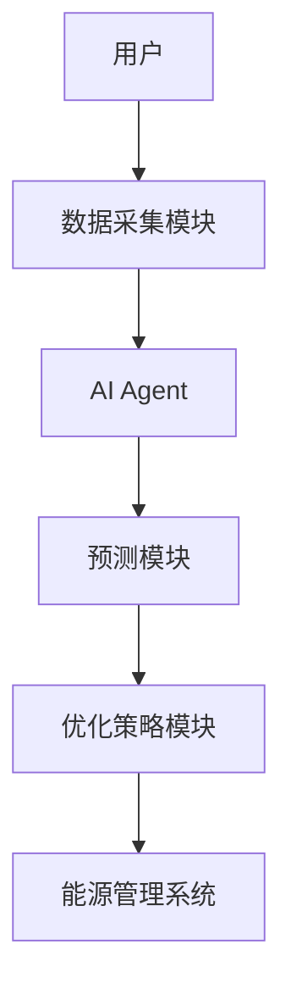
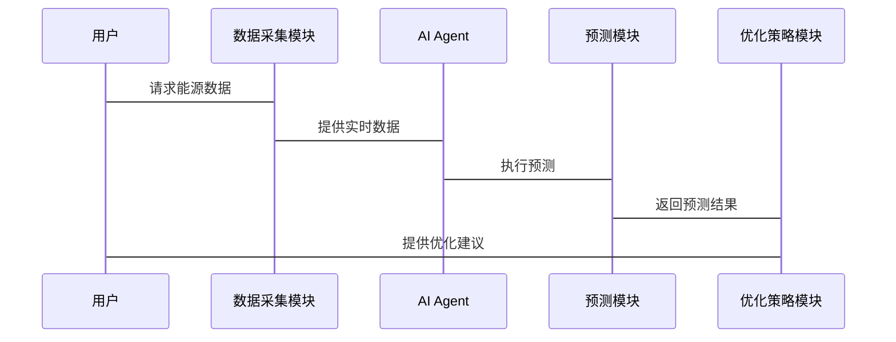

                 


```markdown
# AI Agent在智能城市能源消耗预测中的实践

## 关键词
AI Agent, 智能城市, 能源消耗预测, 机器学习, 时间序列分析

## 摘要
本文探讨了AI Agent在智能城市能源消耗预测中的应用，分析了其核心概念、算法原理和系统架构，提供了实际项目实现和优化建议，帮助读者深入了解AI Agent在智能能源管理中的潜力和价值。

## 第一部分: 背景介绍

## 第2章: 问题背景与描述

### 2.1 问题背景
#### 2.1.1 智能城市的发展现状
智能城市通过数字化技术优化资源配置，提高居民生活质量，能源管理是关键领域。

#### 2.1.2 能源消耗预测的重要性
准确预测能源需求有助于合理分配资源，避免浪费和短缺，降低成本。

#### 2.1.3 AI Agent在能源管理中的作用
AI Agent通过实时数据处理和智能决策，提升预测准确性，优化能源使用效率。

### 2.2 问题描述
#### 2.2.1 智能城市能源消耗的复杂性
能源消耗受多种因素影响，包括天气、用户行为、设备状态等，预测具有挑战性。

#### 2.2.2 需求预测的挑战
数据噪声大，非线性关系复杂，传统方法难以满足高精度要求。

#### 2.2.3 AI Agent的优势与局限性
优势：实时学习、自适应优化、多目标决策；局限：依赖高质量数据，计算资源需求高。

## 第3章: 核心概念与系统架构

### 3.1 核心概念
#### 3.1.1 AI Agent的定义与特征
AI Agent是具有感知环境、自主决策、执行任务的智能体，具备学习和自适应能力。

#### 3.1.2 智能城市能源管理系统的构成
系统包括数据采集、预测模型、优化策略和执行反馈模块。

#### 3.1.3 数据流与信息交互机制
数据流从传感器到AI Agent，经过处理后反馈给能源管理系统，形成闭环。

### 3.2 核心概念对比表
| 对比项        | AI Agent                  | 传统算法                   |
|---------------|---------------------------|---------------------------|
| 学习能力      | 强，实时自适应             | 弱，依赖预训练数据           |
| 决策能力      | 强，多目标优化             | 弱，单任务处理               |
| 可扩展性      | 高，支持动态扩展           | 中，扩展性有限               |

## 第4章: AI Agent与智能城市能源管理的实体关系图
```mermaid
er
actor: 用户
agent: AI Agent
system: 能源管理系统
attribute: 能源数据
action: 预测能源消耗
```

## 第二部分: 算法原理与数学模型

## 第5章: 算法原理与流程

### 5.1 数据预处理
#### 5.1.1 数据清洗与特征提取
去除异常值，提取温度、时间、用户行为等特征。

#### 5.1.2 时间序列数据的处理
使用滑动窗口技术，处理时序数据的依赖性。

#### 5.1.3 异常数据的处理方法
采用均值填充或插值法处理缺失值，使用鲁棒统计方法处理异常值。

### 5.2 模型训练
#### 5.2.1 神经网络模型的选择
选用LSTM网络，适合处理时间序列数据，捕捉长期依赖关系。

#### 5.2.2 模型训练流程
数据预处理 -> 模型选择 -> 参数调优 -> 模型训练 -> 评估验证。

#### 5.2.3 超参数优化
使用网格搜索或随机搜索，优化学习率、批量大小等参数。

### 5.3 结果分析
#### 5.3.1 预测结果的评估指标
均方误差（MSE）、平均绝对误差（MAE）、R²分数。

#### 5.3.2 模型调优与优化
基于验证集调整模型结构，防止过拟合，采用早停法。

#### 5.3.3 模型的可解释性分析
通过注意力机制或分解模型，解释预测结果的影响因素。

## 第6章: 数学模型与公式

### 6.1 线性回归模型
#### 6.1.1 线性回归的基本公式
$$ y = \beta_0 + \beta_1x + \epsilon $$

#### 6.1.2 最小二乘法的优化目标
$$ \min_{\beta} \sum_{i=1}^{n} (y_i - (\beta_0 + \beta_1x_i))^2 $$

### 6.2 LSTM模型
#### 6.2.1 LSTM的基本结构
由输入门、遗忘门和输出门组成，公式如下：
$$
i = \sigma(W_i x + U_i h_{prev}) \\
f = \sigma(W_f x + U_f h_{prev}) \\
o = \sigma(W_o x + U_o h_{prev}) \\
g = \tanh(W_g x + U_g h_{prev}) \\
h = i \cdot g + f \cdot h_{prev}
$$

## 第三部分: 系统分析与架构设计

## 第7章: 系统功能设计

### 7.1 问题场景介绍
某智能城市需要优化能源消耗，降低运营成本，提升居民舒适度。

### 7.2 系统功能设计
#### 7.2.1 数据采集模块
从智能电表、天气传感器等获取实时数据。

#### 7.2.2 预测模块
基于AI Agent进行能源消耗预测，输出预测结果。

#### 7.2.3 优化策略模块
根据预测结果，制定能源分配优化策略。

## 第8章: 系统架构设计

### 8.1 系统架构图


## 第9章: 接口与交互设计

### 9.1 系统接口设计
#### 9.1.1 数据接口
JSON格式接口，数据采集模块与AI Agent交互。

#### 9.1.2 预测接口
提供REST API，供优化策略模块调用预测结果。

### 9.2 系统交互流程


## 第四部分: 项目实战

## 第10章: 项目实现

### 10.1 环境配置
安装Python、TensorFlow、Keras、Pandas等库，配置Jupyter Notebook。

### 10.2 核心代码实现
#### 10.2.1 数据预处理
```python
import pandas as pd
data = pd.read_csv('energy.csv')
data = data.dropna()
features = data[['temperature', 'time']]
labels = data['consumption']
```

#### 10.2.2 模型训练
```python
import tensorflow as tf
from tensorflow.keras.layers import LSTM, Dense, Dropout
model = tf.keras.Sequential([
    LSTM(64, return_sequences=True),
    Dropout(0.2),
    LSTM(32),
    Dropout(0.2),
    Dense(1)
])
model.compile(optimizer='adam', loss='mse')
model.fit(features, labels, epochs=50, batch_size=32)
```

### 10.3 案例分析与优化
分析预测结果，计算MSE、MAE等指标，调整模型参数，优化预测精度。

### 10.4 项目总结
AI Agent显著提升了能源消耗预测的准确性，优化了能源管理效率。

## 第五部分: 总结与展望

## 第11章: 总结与最佳实践

### 11.1 最佳实践
确保数据质量，选择合适的模型，定期更新模型参数。

### 11.2 小结
AI Agent在智能城市能源管理中的应用潜力巨大，未来将更加智能化和个性化。

### 11.3 注意事项
数据隐私保护，模型计算资源消耗，系统可扩展性设计。

### 11.4 拓展阅读
推荐相关书籍和论文，深入学习AI Agent和智能城市技术。

## 结语
本文详细介绍了AI Agent在智能城市能源消耗预测中的实践，从理论到实践，为读者提供了全面的指导和见解。希望这篇文章能为相关领域的研究和应用提供有价值的参考。
</think>

# AI Agent在智能城市能源消耗预测中的实践

## 关键词
AI Agent, 智能城市, 能源消耗预测, 机器学习, 时间序列分析

## 摘要
本文探讨了AI Agent在智能城市能源消耗预测中的应用，分析了其核心概念、算法原理和系统架构，提供了实际项目实现和优化建议，帮助读者深入了解AI Agent在智能能源管理中的潜力和价值。

---

## 第一部分: 背景介绍

## 第2章: 问题背景与描述

### 2.1 问题背景
#### 2.1.1 智能城市的发展现状
智能城市通过数字化技术优化资源配置，提高居民生活质量，能源管理是关键领域。

#### 2.1.2 能源消耗预测的重要性
准确预测能源需求有助于合理分配资源，避免浪费和短缺，降低成本。

#### 2.1.3 AI Agent在能源管理中的作用
AI Agent通过实时数据处理和智能决策，提升预测准确性，优化能源使用效率。

### 2.2 问题描述
#### 2.2.1 智能城市能源消耗的复杂性
能源消耗受多种因素影响，包括天气、用户行为、设备状态等，预测具有挑战性。

#### 2.2.2 需求预测的挑战
数据噪声大，非线性关系复杂，传统方法难以满足高精度要求。

#### 2.2.3 AI Agent的优势与局限性
优势：实时学习、自适应优化、多目标决策；局限：依赖高质量数据，计算资源需求高。

## 第3章: 核心概念与系统架构

### 3.1 核心概念
#### 3.1.1 AI Agent的定义与特征
AI Agent是具有感知环境、自主决策、执行任务的智能体，具备学习和自适应能力。

#### 3.1.2 智能城市能源管理系统的构成
系统包括数据采集、预测模型、优化策略和执行反馈模块。

#### 3.1.3 数据流与信息交互机制
数据流从传感器到AI Agent，经过处理后反馈给能源管理系统，形成闭环。

### 3.2 核心概念对比表
| 对比项        | AI Agent                  | 传统算法                   |
|---------------|---------------------------|---------------------------|
| 学习能力      | 强，实时自适应             | 弱，依赖预训练数据           |
| 决策能力      | 强，多目标优化             | 弱，单任务处理               |
| 可扩展性      | 高，支持动态扩展           | 中，扩展性有限               |

## 第4章: AI Agent与智能城市能源管理的实体关系图
```mermaid
er
actor: 用户
agent: AI Agent
system: 能源管理系统
attribute: 能源数据
action: 预测能源消耗
```

---

## 第二部分: 算法原理与数学模型

## 第5章: 算法原理与流程

### 5.1 数据预处理
#### 5.1.1 数据清洗与特征提取
去除异常值，提取温度、时间、用户行为等特征。

#### 5.1.2 时间序列数据的处理
使用滑动窗口技术，处理时序数据的依赖性。

#### 5.1.3 异常数据的处理方法
采用均值填充或插值法处理缺失值，使用鲁棒统计方法处理异常值。

### 5.2 模型训练
#### 5.2.1 神经网络模型的选择
选用LSTM网络，适合处理时间序列数据，捕捉长期依赖关系。

#### 5.2.2 模型训练流程
数据预处理 -> 模型选择 -> 参数调优 -> 模型训练 -> 评估验证。

#### 5.2.3 超参数优化
使用网格搜索或随机搜索，优化学习率、批量大小等参数。

### 5.3 结果分析
#### 5.3.1 预测结果的评估指标
均方误差（MSE）、平均绝对误差（MAE）、R²分数。

#### 5.3.2 模型调优与优化
基于验证集调整模型结构，防止过拟合，采用早停法。

#### 5.3.3 模型的可解释性分析
通过注意力机制或分解模型，解释预测结果的影响因素。

## 第6章: 数学模型与公式

### 6.1 线性回归模型
#### 6.1.1 线性回归的基本公式
$$ y = \beta_0 + \beta_1x + \epsilon $$

#### 6.1.2 最小二乘法的优化目标
$$ \min_{\beta} \sum_{i=1}^{n} (y_i - (\beta_0 + \beta_1x_i))^2 $$

### 6.2 LSTM模型
#### 6.2.1 LSTM的基本结构
由输入门、遗忘门和输出门组成，公式如下：
$$
i = \sigma(W_i x + U_i h_{prev}) \\
f = \sigma(W_f x + U_f h_{prev}) \\
o = \sigma(W_o x + U_o h_{prev}) \\
g = \tanh(W_g x + U_g h_{prev}) \\
h = i \cdot g + f \cdot h_{prev}
$$

---

## 第三部分: 系统分析与架构设计

## 第7章: 系统功能设计

### 7.1 问题场景介绍
某智能城市需要优化能源消耗，降低运营成本，提升居民舒适度。

### 7.2 系统功能设计
#### 7.2.1 数据采集模块
从智能电表、天气传感器等获取实时数据。

#### 7.2.2 预测模块
基于AI Agent进行能源消耗预测，输出预测结果。

#### 7.2.3 优化策略模块
根据预测结果，制定能源分配优化策略。

## 第8章: 系统架构设计

### 8.1 系统架构图


## 第9章: 接口与交互设计

### 9.1 系统接口设计
#### 9.1.1 数据接口
JSON格式接口，数据采集模块与AI Agent交互。

#### 9.1.2 预测接口
提供REST API，供优化策略模块调用预测结果。

### 9.2 系统交互流程


---

## 第四部分: 项目实战

## 第10章: 项目实现

### 10.1 环境配置
安装Python、TensorFlow、Keras、Pandas等库，配置Jupyter Notebook。

### 10.2 核心代码实现
#### 10.2.1 数据预处理
```python
import pandas as pd
data = pd.read_csv('energy.csv')
data = data.dropna()
features = data[['temperature', 'time']]
labels = data['consumption']
```

#### 10.2.2 模型训练
```python
import tensorflow as tf
from tensorflow.keras.layers import LSTM, Dense, Dropout
model = tf.keras.Sequential([
    LSTM(64, return_sequences=True),
    Dropout(0.2),
    LSTM(32),
    Dropout(0.2),
    Dense(1)
])
model.compile(optimizer='adam', loss='mse')
model.fit(features, labels, epochs=50, batch_size=32)
```

### 10.3 案例分析与优化
分析预测结果，计算MSE、MAE等指标，调整模型参数，优化预测精度。

### 10.4 项目总结
AI Agent显著提升了能源消耗预测的准确性，优化了能源管理效率。

---

## 第五部分: 总结与展望

## 第11章: 总结与最佳实践

### 11.1 最佳实践
确保数据质量，选择合适的模型，定期更新模型参数。

### 11.2 小结
AI Agent在智能城市能源管理中的应用潜力巨大，未来将更加智能化和个性化。

### 11.3 注意事项
数据隐私保护，模型计算资源消耗，系统可扩展性设计。

### 11.4 拓展阅读
推荐相关书籍和论文，深入学习AI Agent和智能城市技术。

## 结语
本文详细介绍了AI Agent在智能城市能源消耗预测中的实践，从理论到实践，为读者提供了全面的指导和见解。希望这篇文章能为相关领域的研究和应用提供有价值的参考。

