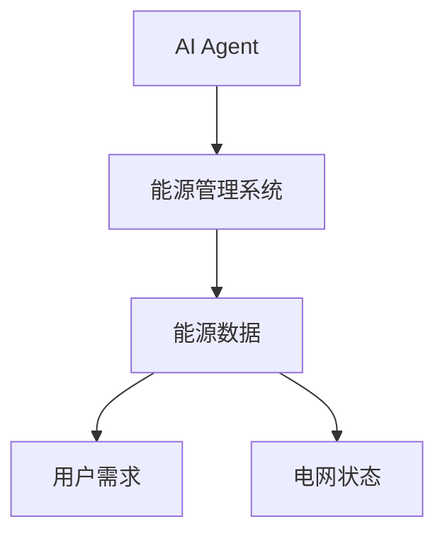
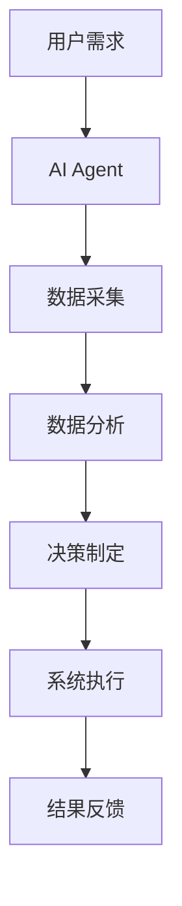
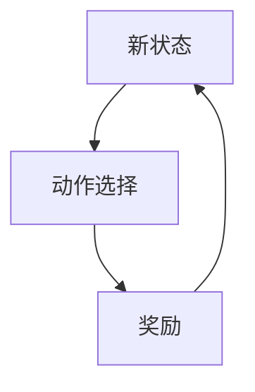
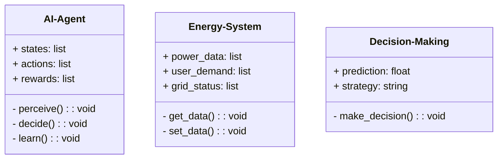
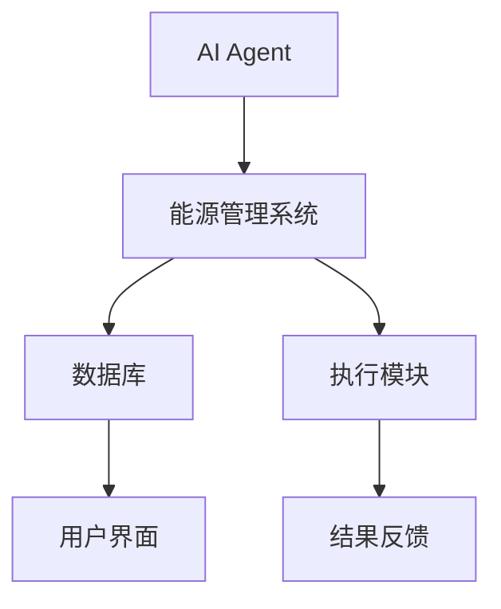
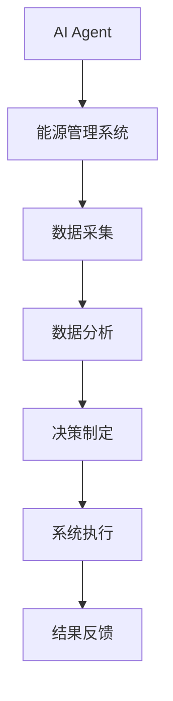

                 


# AI Agent在智能城市能源管理中的实践

> 关键词：AI Agent, 智能城市, 能源管理, 强化学习, 能源优化, 自动化

> 摘要：本文深入探讨了AI Agent在智能城市能源管理中的实践应用，从核心概念、算法原理到系统设计和项目实战，详细分析了AI Agent如何通过强化学习、自然语言处理等技术优化能源管理流程，提升能源利用效率，降低管理成本。文章结合实际案例，展示了AI Agent在智能城市能源管理中的巨大潜力和广泛应用前景。

---

# 第一部分: AI Agent与智能城市能源管理概述

## 第1章: AI Agent与智能城市能源管理的背景

### 1.1 AI Agent的基本概念

#### 1.1.1 AI Agent的定义
AI Agent（人工智能代理）是指能够感知环境、自主决策并执行任务的智能实体。它通过传感器获取信息，利用算法进行分析和推理，最终做出决策并执行操作。

#### 1.1.2 AI Agent的核心特征
- **自主性**：能够在没有外部干预的情况下自主运行。
- **反应性**：能够实时感知环境变化并做出反应。
- **目标导向**：以特定目标为导向，优化决策过程。
- **学习能力**：通过数据和经验不断优化自身的算法和决策模型。

#### 1.1.3 AI Agent与传统自动化的区别
传统自动化依赖于预设的规则和程序，而AI Agent具备学习和适应能力，能够在复杂和动态的环境中自主优化决策。

### 1.2 智能城市能源管理的背景

#### 1.2.1 智能城市的发展现状
智能城市通过数字化和智能化技术，整合城市资源，优化城市运行效率。能源管理作为智能城市的重要组成部分，涉及电力、燃气、热力等多种能源的协调管理。

#### 1.2.2 能源管理在智能城市中的重要性
能源管理直接关系到城市的能源利用效率、环境保护和经济成本。通过智能化管理，可以实现能源的高效分配和使用。

#### 1.2.3 当前能源管理面临的挑战
- **能源需求多样化**：城市中能源需求来自不同领域，如居民、商业、工业等。
- **能源供应不稳定**：可再生能源（如风能、太阳能）的波动性对能源管理提出了更高的要求。
- **能源浪费**：传统能源管理方式中，能源浪费现象普遍，效率低下。

### 1.3 AI Agent在能源管理中的应用前景

#### 1.3.1 AI Agent在能源管理中的优势
- **高效性**：AI Agent能够快速分析大量数据，优化能源分配和使用。
- **适应性**：能够根据环境变化实时调整能源管理策略。
- **降低成本**：通过优化能源使用，降低管理成本和能源浪费。

#### 1.3.2 AI Agent在智能城市中的潜在应用场景
- **负荷预测**：通过分析历史数据和实时信息，预测能源需求，优化能源供应。
- **需求响应**：根据能源需求和供应情况，动态调整能源分配策略。
- **故障诊断**：通过实时监测和数据分析，快速定位能源系统中的故障点。

#### 1.3.3 AI Agent技术的未来发展趋势
- **多智能体协同**：通过多个AI Agent协同工作，实现更复杂的能源管理任务。
- **边缘计算结合**：将AI Agent部署在能源管理的边缘节点，提升实时性和响应速度。
- **绿色能源优化**：结合可再生能源的特性，优化能源管理和分配。

## 第2章: AI Agent在能源管理中的核心概念与联系

### 2.1 AI Agent的核心原理

#### 2.1.1 知识表示与推理
AI Agent通过知识表示（如符号逻辑、语义网络）对环境进行建模，并利用推理算法（如逻辑推理、概率推理）进行决策。

#### 2.1.2 感知与决策
AI Agent通过传感器获取环境信息，利用感知算法（如计算机视觉、自然语言处理）进行信息处理，并基于这些信息进行决策。

#### 2.1.3 执行与反馈
AI Agent根据决策结果执行操作，并通过反馈机制不断优化自身的决策模型。

### 2.2 AI Agent与能源管理系统的实体关系

#### 2.2.1 实体关系图


#### 2.2.2 关系说明
- **AI Agent**：负责感知能源系统状态、分析数据并做出决策。
- **能源管理系统**：提供能源数据和系统接口，支持AI Agent的运行。
- **能源数据**：包括电力、燃气等能源的实时数据。
- **用户需求**：用户的能源需求和偏好。
- **电网状态**：电网的运行状态和负荷情况。

### 2.3 AI Agent与能源管理系统的流程图



---

## 第3章: AI Agent在能源管理中的算法原理

### 3.1 基于强化学习的AI Agent算法

#### 3.1.1 算法概述
强化学习是一种通过试错机制优化决策的算法，AI Agent通过与环境的交互，不断优化自身的决策策略。

#### 3.1.2 算法流程图



#### 3.1.3 算法实现的Python代码
```python
class AI-Agent:
    def __init__(self):
        self.states = []  # 状态列表
        self.actions = []  # 动作列表
        self.rewards = []  # 奖励列表

    def perceive(self):
        # 获取环境状态
        pass

    def decide(self):
        # 根据当前状态选择动作
        pass

    def learn(self):
        # 通过奖励更新策略
        pass
```

#### 3.1.4 算法的数学模型
强化学习的数学模型通常包括状态空间、动作空间、奖励函数等。例如，马尔可夫决策过程（MDP）可以描述为：

$$
\text{MDP} = \langle S, A, P, R, \gamma \rangle
$$

其中：
- $S$：状态空间
- $A$：动作空间
- $P$：转移概率矩阵
- $R$：奖励函数
- $\gamma$：折扣因子

---

## 第4章: AI Agent在能源管理中的系统设计

### 4.1 问题场景分析

#### 4.1.1 问题背景
以智能城市中的电力管理为例，考虑负荷预测和需求响应两个核心问题。

#### 4.1.2 问题描述
电力负荷预测需要根据历史用电数据和天气等因素，预测未来的电力需求。需求响应则需要根据预测结果和实时电力供应情况，动态调整电力分配策略。

### 4.2 系统功能设计

#### 4.2.1 系统功能模块


#### 4.2.2 功能模块之间的关系
AI Agent通过感知能源系统状态，分析数据并制定决策，最终通过能源管理系统执行决策并反馈结果。

### 4.3 系统架构设计

#### 4.3.1 系统架构图



#### 4.3.2 系统组件说明
- **AI Agent**：负责数据处理和决策制定。
- **能源管理系统**：提供能源数据和系统接口。
- **数据库**：存储能源数据和历史记录。
- **用户界面**：供用户查看能源管理状态和结果。
- **执行模块**：根据决策结果执行操作。

### 4.4 系统接口设计

#### 4.4.1 接口定义
- **数据接口**：AI Agent与能源管理系统之间的数据交互接口。
- **控制接口**：AI Agent对能源管理系统进行控制的接口。
- **反馈接口**：能源管理系统向AI Agent反馈执行结果的接口。

#### 4.4.2 接口交互流程图



---

## 第5章: AI Agent在能源管理中的项目实战

### 5.1 项目环境与安装

#### 5.1.1 环境配置
- **操作系统**：Linux/Windows/MacOS
- **编程语言**：Python 3.8+
- **框架与库**：TensorFlow、Keras、Scikit-learn、NumPy

#### 5.1.2 安装依赖
```bash
pip install tensorflow numpy scikit-learn matplotlib
```

### 5.2 系统核心实现

#### 5.2.1 数据采集与预处理
```python
import pandas as pd
import numpy as np

# 读取数据
data = pd.read_csv('energy_data.csv')

# 数据预处理
data = data.dropna()
data = (data - data.mean()) / data.std()  # 标准化
```

#### 5.2.2 模型训练与优化
```python
from sklearn.model_selection import train_test_split
from sklearn.ensemble import RandomForestRegressor
from sklearn.metrics import mean_absolute_error

# 划分训练集和测试集
X_train, X_test, y_train, y_test = train_test_split(data.drop('target', axis=1), data['target'], test_size=0.2)

# 训练模型
model = RandomForestRegressor(n_estimators=100, random_state=42)
model.fit(X_train, y_train)

# 模型评估
y_pred = model.predict(X_test)
print(mean_absolute_error(y_test, y_pred))
```

#### 5.2.3 系统集成与测试
```python
# 测试AI Agent
agent = AI-Agent()
agent.perceive()  # 获取数据
agent.decide()    # 制定决策
agent.learn()     # 更新模型
```

### 5.3 实际案例分析

#### 5.3.1 案例背景
以某智能城市中的电力负荷预测为例，分析AI Agent如何优化能源管理。

#### 5.3.2 数据分析与结果展示
```python
import matplotlib.pyplot as plt

# 绘制预测值与真实值对比图
plt.figure(figsize=(10, 6))
plt.plot(y_test, label='Actual')
plt.plot(y_pred, label='Predicted')
plt.xlabel('Sample Index')
plt.ylabel('Load')
plt.legend()
plt.show()
```

#### 5.3.3 优化效果评估
通过对比传统能源管理方法和AI Agent优化后的能源管理方法，评估AI Agent在能源管理中的实际效果。

---

## 第6章: 总结与展望

### 6.1 总结
本文深入探讨了AI Agent在智能城市能源管理中的应用，从核心概念、算法原理到系统设计和项目实战，全面分析了AI Agent在能源管理中的潜力和优势。

### 6.2 未来展望
随着AI技术的不断发展，AI Agent在能源管理中的应用将更加广泛和深入。未来的研究方向包括：
- **多智能体协同**：通过多个AI Agent协同工作，实现更复杂的能源管理任务。
- **边缘计算结合**：将AI Agent部署在能源管理的边缘节点，提升实时性和响应速度。
- **绿色能源优化**：结合可再生能源的特性，优化能源管理和分配。

---

## 结语
AI Agent作为智能城市能源管理的核心技术，将在未来的能源优化中发挥越来越重要的作用。通过不断的技术创新和实践探索，AI Agent有望彻底改变传统的能源管理方式，推动智能城市迈向更高的效率和可持续发展的目标。

---

# 推荐阅读
1.《强化学习：算法与应用》
2.《人工智能：一种现代方法》
3.《智能城市：技术与实践》

