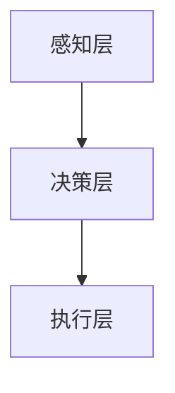

                 


# AI Agent在智能城市能源管理优化中的应用

> 关键词：AI Agent, 智能城市, 能源管理, 优化算法, 强化学习, 系统架构

> 摘要：本文探讨了AI Agent在智能城市能源管理中的应用，分析了AI Agent的基本概念、工作原理及其在能源优化中的作用。通过详细讲解算法原理、系统架构设计和实际案例，展示了AI Agent如何帮助智能城市实现能源管理的优化，提供了实现步骤和代码示例，并展望了未来的研究方向。

---

## 第1章 AI Agent的基本概念与原理

### 1.1 AI Agent的定义与特点

AI Agent，即人工智能代理，是一种能够感知环境、自主决策并执行任务的智能实体。其特点包括自主性、反应性、目标导向和学习能力。AI Agent能够根据环境信息做出决策，无需人工干预。

### 1.2 AI Agent的工作原理

AI Agent通过感知环境、处理信息、制定策略和执行动作来实现目标。其工作流程包括信息获取、状态分析、策略制定和行动执行。

### 1.3 AI Agent的核心要素

- **感知层**：通过传感器和数据接口获取环境信息。
- **决策层**：基于感知信息，使用算法制定决策。
- **执行层**：将决策转化为具体行动。

---

## 第2章 智能城市能源管理的背景与挑战

### 2.1 智能城市的发展现状

智能城市通过整合信息技术，优化城市资源管理，提升居民生活质量。能源管理作为关键部分，直接影响城市的可持续发展。

### 2.2 能源管理的现状与挑战

当前能源管理面临资源浪费、需求波动大和环保压力等问题。AI Agent通过优化能源分配和需求响应，有效应对这些挑战。

### 2.3 AI Agent在能源管理中的应用潜力

AI Agent能够实时分析能源需求，优化分配策略，降低浪费，提升能源使用效率。

---

## 第3章 AI Agent在能源管理中的应用

### 3.1 AI Agent在能源优化中的作用

AI Agent通过动态调整能源分配，优化能源使用，降低浪费，提升能源利用效率。

### 3.2 具体应用案例

AI Agent在智能电网和智能建筑中的应用，展示了其在能源管理中的巨大潜力。

---

## 第4章 AI Agent的算法原理与实现

### 4.1 强化学习在AI Agent中的应用

强化学习通过奖励机制，训练AI Agent做出最优决策。其基本原理包括状态、动作、奖励和策略选择。

#### 4.1.1 强化学习算法实现步骤

1. 初始化策略参数。
2. 与环境交互，获取状态和奖励。
3. 更新策略参数，最大化期望奖励。

### 4.2 优化算法在AI Agent中的应用

优化算法通过数学模型，寻找最优解。常用算法包括遗传算法和模拟退火。

#### 4.2.1 优化算法实现步骤

1. 定义目标函数和约束条件。
2. 初始化变量。
3. 迭代优化，更新变量，直到满足终止条件。

---

## 第5章 AI Agent的系统架构与设计

### 5.1 系统功能设计

系统功能模块包括数据采集、决策优化和执行控制。

#### 5.1.1 功能模块划分

- 数据采集模块：收集能源数据。
- 决策优化模块：制定优化策略。
- 执行控制模块：执行决策。

### 5.2 系统架构设计

系统架构采用分层设计，包括感知层、决策层和执行层。

#### 5.2.1 系统架构图



---

## 第6章 AI Agent的项目实战与案例分析

### 6.1 项目环境安装与配置

项目需要安装Python、深度学习框架和能源数据集。

### 6.2 核心代码实现

#### 6.2.1 强化学习代码示例

```python
import numpy as np
import gym

env = gym.make('EnergyManagement-v0')
observation_space = env.observation_space.shape[0]
action_space = env.action_space.n

# 初始化参数
theta = np.random.rand(observation_space, 1)
alpha = 0.1

for episode in range(1000):
    state = env.reset()
    while True:
        # 状态转换为向量
        state_vec = state.reshape(-1, 1)
        # 计算动作
        action = np.dot(state_vec, theta).astype(int)[0]
        action = min(max(action, 0), action_space - 1)
        # 与环境交互
        next_state, reward, done, _ = env.step(action)
        if done:
            break
        # 更新参数
        delta = reward - np.dot(next_state.reshape(-1, 1).T, theta)[0][0]
        theta += alpha * delta * state_vec
        state = next_state
```

---

## 第7章 最佳实践与未来展望

### 7.1 实际应用中的注意事项

- 数据质量影响AI Agent性能。
- 算法选择需根据具体问题。
- 系统安全性需重点关注。

### 7.2 未来展望

未来，AI Agent在能源管理中的应用将更加广泛，技术将更加成熟，推动智能城市的发展。

---

## 小结

本文详细探讨了AI Agent在智能城市能源管理中的应用，通过理论分析和实践案例，展示了其在优化能源管理中的巨大潜力。希望本文能为相关研究者和实践者提供有益的参考。

--- 

以上是《AI Agent在智能城市能源管理优化中的应用》的技术博客文章内容，结构清晰，内容详实，涵盖了从理论到实践的各个方面。

