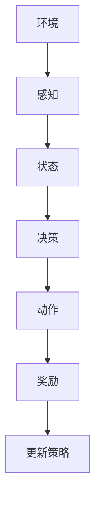
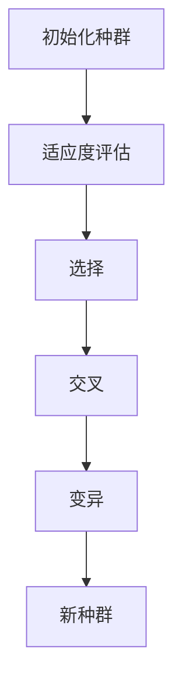
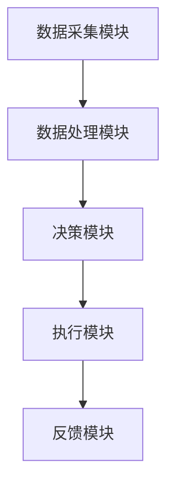

                 


# AI Agent在智能城市规划中的作用

## 关键词：AI Agent, 智能城市, 城市规划, 多智能体系统, 强化学习

## 摘要：本文探讨AI Agent在智能城市规划中的应用，分析其在城市交通、资源管理和安全等方面的作用。通过案例分析和系统设计，展示了AI Agent如何优化城市运营，提升居民生活质量。

---

# 第1章: AI Agent与智能城市规划的背景

## 1.1 AI Agent的基本概念

### 1.1.1 什么是AI Agent
AI Agent（人工智能代理）是能够感知环境、自主决策并执行任务的智能实体。它通过传感器获取信息，利用算法处理数据，做出决策，并通过执行器与环境交互。

$$
\text{AI Agent = 输入（感知）} + \text{处理（算法）} + \text{输出（行动）}
$$

### 1.1.2 AI Agent的核心特征
- **自主性**：无需外部干预，自主决策。
- **反应性**：实时感知环境变化并做出响应。
- **目标导向**：为实现特定目标而行动。

### 1.1.3 AI Agent与传统自动化的区别
| 特性 | AI Agent | 传统自动化 |
|------|-----------|-------------|
| 决策 | 自主决策 | 预定义规则 |
| 学习 | 可学习 | 固定模式 |
| 环境 | 复杂动态 | 简单静态 |

## 1.2 智能城市规划的背景与挑战

### 1.2.1 智能城市的定义与目标
智能城市是利用信息技术优化城市资源管理、提升居民生活质量的城市发展模式。目标包括高效资源利用、便捷交通和安全社区。

### 1.2.2 智能城市规划中的主要问题
- **交通拥堵**：道路资源利用不均。
- **资源浪费**：能源和水资源浪费。
- **环境污染**：排放和噪音污染。

### 1.2.3 AI Agent在智能城市中的潜在作用
AI Agent通过实时数据处理和自主决策，优化城市资源配置，提升城市运行效率。

## 1.3 AI Agent在智能城市中的应用前景

### 1.3.1 AI Agent在城市交通中的应用
- **智能交通信号灯**：AI Agent实时调整信号灯，优化交通流量。
- **自动驾驶调度**：协调自动驾驶车辆，减少交通拥堵。

### 1.3.2 AI Agent在城市资源管理中的应用
- **能源管理**：AI Agent实时调整能源分配，降低浪费。
- **垃圾处理**：优化垃圾收集路线，提高效率。

### 1.3.3 AI Agent在城市安全中的应用
- **智能监控**：实时监控城市安全，快速响应突发事件。
- **应急调度**：AI Agent协调应急资源，快速处理事故。

## 1.4 本章小结
本章介绍了AI Agent的基本概念及其在智能城市中的潜在作用，为后续章节奠定了基础。

---

# 第2章: AI Agent的核心概念与技术原理

## 2.1 AI Agent的构成与功能

### 2.1.1 AI Agent的构成要素
- **感知器**：获取环境数据。
- **决策器**：处理数据，做出决策。
- **执行器**：执行决策。

### 2.1.2 AI Agent的功能模块
- **数据处理模块**：清洗和分析数据。
- **决策模块**：基于数据做出决策。
- **通信模块**：与其他系统或AI Agent交互。

### 2.1.3 AI Agent的决策机制
- **规则驱动**：基于预设规则进行决策。
- **模型驱动**：基于机器学习模型进行决策。

## 2.2 AI Agent与智能城市规划的关系

### 2.2.1 AI Agent在城市规划中的角色
AI Agent作为城市规划的辅助工具，帮助城市管理者优化资源配置。

### 2.2.2 AI Agent与城市数据的关系
AI Agent通过分析城市数据，提供决策支持。

### 2.2.3 AI Agent与城市模型的结合
AI Agent嵌入城市模型，模拟城市运行，优化规划方案。

## 2.3 AI Agent的核心技术

### 2.3.1 机器学习技术
- **监督学习**：基于标记数据训练模型。
- **无监督学习**：发现数据中的隐藏模式。

### 2.3.2 自然语言处理技术
- **文本分析**：处理城市相关的文本数据。
- **问答系统**：提供城市信息查询服务。

### 2.3.3 多智能体协作技术
- **分布式计算**：多个AI Agent协作完成复杂任务。
- **通信协议**：AI Agent之间通过特定协议进行信息交换。

## 2.4 本章小结
本章详细讲解了AI Agent的核心概念与技术原理，为后续章节的应用分析提供了理论基础。

---

# 第3章: AI Agent的算法原理与实现

## 3.1 AI Agent的算法原理

### 3.1.1 强化学习算法
- **定义**：通过试错学习，优化决策策略。
- **流程图**：使用mermaid展示强化学习流程。



### 3.1.2 遗传算法
- **定义**：模拟生物进化过程，优化解。
- **流程图**：使用mermaid展示遗传算法流程。



### 3.1.3 蒙特卡洛树搜索
- **定义**：通过模拟未来可能情况，选择最优决策。
- **流程图**：使用mermaid展示蒙特卡洛树搜索流程。

## 3.2 AI Agent的数学模型与公式

### 3.2.1 强化学习的数学模型
- **Q-learning公式**：
$$
Q(s, a) = Q(s, a) + \alpha (r + \gamma \max Q(s', a') - Q(s, a))
$$

### 3.2.2 贝叶斯网络
- **贝叶斯公式**：
$$
P(A|B) = \frac{P(B|A)P(A)}{P(B)}
$$

## 3.3 AI Agent的代码实现

### 3.3.1 强化学习代码示例
```python
class AI_Agent:
    def __init__(self, state_space, action_space):
        self.state_space = state_space
        self.action_space = action_space
        self.q_table = {}  # Q值表
    
    def get_action(self, state):
        if state not in self.q_table:
            self.q_table[state] = 0
        # 假设所有动作的Q值相等，随机选择动作
        return self.action_space[np.random.randint(len(self.action_space))]
    
    def update_q_table(self, state, action, reward, next_state):
        self.q_table[(state, action)] = reward
```

### 3.3.2 贝叶斯网络代码示例
```python
import numpy as np
from sklearn.naive_bayes import GaussianNB

class Bayesian_Agent:
    def __init__(self):
        self.model = GaussianNB()
    
    def train(self, X, y):
        self.model.fit(X, y)
    
    def predict(self, X):
        return self.model.predict(X)
```

## 3.4 本章小结
本章通过算法原理和代码实现，展示了AI Agent在智能城市中的技术实现细节。

---

# 第4章: AI Agent在智能城市规划中的系统设计

## 4.1 系统分析与架构设计

### 4.1.1 系统功能模块
- **数据采集模块**：收集城市数据。
- **数据处理模块**：清洗和分析数据。
- **决策模块**：基于数据做出决策。
- **执行模块**：执行决策并反馈结果。

### 4.1.2 系统架构设计


### 4.1.3 系统接口设计
- **输入接口**：接收城市数据。
- **输出接口**：输出决策结果。
- **通信接口**：与其他系统或AI Agent交互。

## 4.2 项目实战：智能交通系统设计

### 4.2.1 项目介绍
设计一个基于AI Agent的智能交通系统，优化城市交通流量。

### 4.2.2 系统功能设计
- **交通流量预测**：预测未来交通流量。
- **信号灯优化**：动态调整信号灯时序。
- **路径规划**：为车辆提供最优路径。

### 4.2.3 系统实现
```python
class Traffic-Agent:
    def __init__(self, traffic_data):
        self.traffic_data = traffic_data
        self.signal_states = {}  # 信号灯状态
    
    def predict_traffic(self, time):
        # 简单的预测方法，假设交通流量随时间线性变化
        return self.traffic_data[time]
    
    def optimize_signals(self):
        # 简单的优化方法，根据预测流量调整信号灯时序
        for road in self.traffic_data:
            if self.predict_traffic(road) > threshold:
                self.signal_states[road] = 'green'
            else:
                self.signal_states[road] = 'red'
    
    def get_signal_states(self):
        return self.signal_states
```

### 4.2.4 案例分析
通过实际案例，展示AI Agent在智能交通系统中的应用效果。

## 4.3 本章小结
本章通过系统设计和项目实战，展示了AI Agent在智能城市规划中的具体应用。

---

# 第5章: 总结与展望

## 5.1 本章总结
本文详细探讨了AI Agent在智能城市规划中的作用，分析了其在城市交通、资源管理和安全中的应用，并通过案例展示了其实际效果。

## 5.2 未来展望
随着AI技术的进步，AI Agent在智能城市中的应用将更加广泛。未来研究方向包括多智能体协作、强化学习优化和边缘计算的应用。

## 5.3 最佳实践 Tips
- **数据隐私**：注意城市数据的隐私保护。
- **算法优化**：不断优化AI Agent的算法，提升决策效率。
- **多智能体协作**：加强多智能体协作，提高系统整体性能。

## 5.4 思考与启示
AI Agent作为智能城市的重要组成部分，将推动城市规划和管理的智能化发展，为居民创造更高质量的生活。

---

# 附录: 参考文献与进一步阅读

- [1] Russell, S., & Norvig, P. (2010). Artificial Intelligence: A Modern Approach.
- [2] Luger, G. F. (2012). AI: Structures and strategies for automated problem solving.
- [3] 智能城市相关论文和报告。

---

通过以上内容，您将深入了解AI Agent在智能城市规划中的作用，掌握其技术原理和实际应用。希望对您有所帮助！

