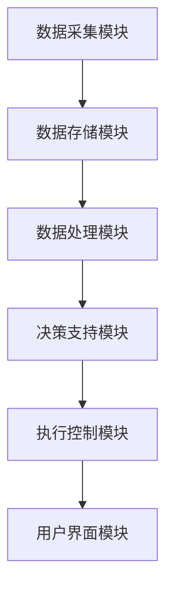
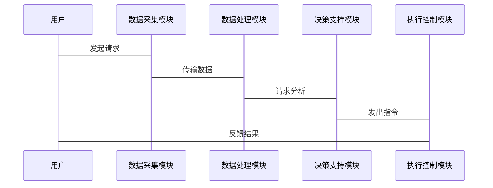

                 

<think>
好的，我将按照您的要求逐步撰写这篇文章。首先，让我们从文章标题开始。

# AI Agent在智能城市规划中的角色

> 关键词：智能城市规划、AI Agent、城市系统、人工智能、智能交通、城市安全

> 摘要：本文探讨AI Agent在智能城市规划中的核心作用，分析其在交通、环境监测和公共安全等领域的具体应用，结合算法原理和系统架构设计，详细讲解其在智能城市中的实现与挑战，最后总结其对未来的深远影响。

接下来，我们将按照目录大纲的结构逐步展开内容。

## 第1章: 智能城市规划的背景与挑战

### 1.1 智能城市的发展背景

智能城市是现代城市发展的重要方向，随着城市化进程的加快，城市规模不断扩大，资源紧张、环境污染、交通拥堵等问题日益突出。传统城市规划方法依赖于人工经验和数据统计，难以应对复杂多变的城市问题。AI Agent的引入为智能城市规划提供了新的解决方案。

#### 1.1.1 城市化进程的加速与城市问题的凸显

城市化进程的加速带来了人口密集、资源紧张等问题。城市化过程中，交通拥堵、环境污染、能源消耗等问题逐渐显现，传统的城市规划方法难以有效解决这些问题。

#### 1.1.2 数字化与智能化转型的必要性

随着信息技术的飞速发展，数字化和智能化转型成为城市发展的必然趋势。AI技术的引入可以有效提高城市规划的效率和准确性，帮助城市更好地应对各种挑战。

#### 1.1.3 AI技术在城市规划中的应用潜力

AI技术在城市规划中的应用潜力巨大。通过AI Agent，可以实现城市资源的优化配置、交通流量的智能调度、环境监测的实时反馈等功能，为智能城市的发展提供强有力的技术支持。

### 1.2 智能城市规划的核心问题

智能城市规划的核心问题包括资源分配、交通管理、环境保护等多个方面。AI Agent在这些领域的应用可以有效提高城市规划的科学性和实用性。

#### 1.2.1 城市资源分配与优化

城市资源的分配与优化是智能城市规划的重要内容。AI Agent可以通过数据分析和优化算法，实现城市资源的合理分配，提高资源利用效率。

#### 1.2.2 城市交通与环境问题

城市交通拥堵和环境污染是智能城市规划中的两大难题。AI Agent可以通过智能调度系统优化交通流量，降低污染排放。

#### 1.2.3 城市安全与应急响应

城市安全与应急响应是智能城市规划的重要组成部分。AI Agent可以通过实时监测和智能分析，提高城市的安全性，增强应急响应能力。

### 1.3 AI Agent在智能城市中的角色定位

AI Agent在智能城市中的角色定位是多方面的，既是数据处理的核心，又是决策执行的主体。AI Agent通过感知、决策和执行三个环节，实现对城市系统的智能化管理。

#### 1.3.1 AI Agent的定义与特征

AI Agent是指具有自主决策能力的智能体，能够在复杂环境中感知信息、做出决策并执行操作。AI Agent具有自主性、反应性、目标性和协作性等特征。

#### 1.3.2 AI Agent在城市规划中的应用场景

AI Agent在城市规划中的应用场景广泛，包括交通管理、环境监测、城市安全等多个领域。通过AI Agent的应用，可以实现城市规划的智能化和高效化。

#### 1.3.3 AI Agent与城市系统的交互关系

AI Agent与城市系统的交互关系密切，AI Agent通过感知城市系统的运行状态，做出决策，并通过执行机构实现对城市系统的调控。城市系统为AI Agent提供数据支持和运行环境，两者相互依存，共同实现智能城市的目标。

## 第2章: AI Agent的核心概念与原理

### 2.1 AI Agent的基本原理

AI Agent的基本原理包括感知、决策和执行三个环节。AI Agent通过感知环境获取信息，通过决策系统做出决策，最后通过执行机构实现对环境的调控。

#### 2.1.1 AI Agent的定义与分类

AI Agent可以根据功能、智能水平、环境类型等多种标准进行分类。常见的分类包括基于任务的AI Agent、基于知识的AI Agent、基于学习的AI Agent等。

#### 2.1.2 AI Agent的核心特征

AI Agent的核心特征包括自主性、反应性、目标性和协作性。自主性是指AI Agent能够自主决策；反应性是指AI Agent能够根据环境变化做出实时反应；目标性是指AI Agent具有明确的目标；协作性是指AI Agent能够与其他系统或AI Agent协作完成任务。

#### 2.1.3 AI Agent的生命周期

AI Agent的生命周期包括初始化、感知、决策、执行和终止五个阶段。在初始化阶段，AI Agent被部署到目标环境中；在感知阶段，AI Agent获取环境信息；在决策阶段，AI Agent基于感知信息做出决策；在执行阶段，AI Agent根据决策结果执行操作；在终止阶段，AI Agent完成任务或被关闭。

### 2.2 AI Agent与智能城市的关系

AI Agent与智能城市的关系是相互依存、相互促进的。AI Agent为智能城市提供技术支持，智能城市为AI Agent提供应用平台。AI Agent通过在智能城市中的广泛应用，推动城市向更加智能化、高效化的方向发展。

#### 2.2.1 AI Agent在城市规划中的功能定位

AI Agent在城市规划中的功能定位是数据处理与决策支持。AI Agent通过收集和分析城市数据，为城市规划提供科学依据，并通过智能决策支持城市规划的实施。

#### 2.2.2 AI Agent与城市数据的关系

AI Agent与城市数据的关系是密不可分的。AI Agent通过城市数据获取环境信息，城市数据通过AI Agent进行处理和分析。AI Agent与城市数据的结合，使得城市规划更加科学和高效。

#### 2.2.3 AI Agent在城市系统中的协同作用

AI Agent在城市系统中的协同作用体现在与城市各个子系统的协同工作。例如，在智能交通系统中，AI Agent协同工作，实现交通流量的智能调度；在环境监测系统中，AI Agent协同工作，实现环境数据的实时监控。

### 2.3 AI Agent的核心技术与实现

AI Agent的核心技术包括机器学习、自然语言处理和计算机视觉等。这些技术共同构成了AI Agent的核心实现。

#### 2.3.1 机器学习与深度学习

机器学习是AI Agent的核心技术之一。通过机器学习，AI Agent能够从数据中学习规律，做出预测和决策。深度学习是一种机器学习技术，通过多层神经网络实现更复杂的特征提取和模式识别。

#### 2.3.2 自然语言处理

自然语言处理技术使得AI Agent能够理解和处理人类语言。通过自然语言处理，AI Agent可以与人类进行有效的交流和协作。

#### 2.3.3 计算机视觉

计算机视觉技术使得AI Agent能够通过视觉信息感知环境。通过计算机视觉，AI Agent可以识别图像和视频中的物体、场景，实现视觉感知和识别。

## 第3章: AI Agent在智能城市规划中的应用案例

### 3.1 智能交通系统中的AI Agent

#### 3.1.1 交通流量预测与优化

AI Agent在智能交通系统中的应用之一是交通流量预测与优化。通过分析历史交通数据和实时交通信息，AI Agent可以预测未来的交通流量，优化交通信号灯的控制，减少交通拥堵。

#### 3.1.2 智能停车管理

AI Agent在智能停车管理中的应用体现在实时监测停车场的空余车位，为驾驶员提供最优的停车建议。通过AI Agent的实时监控和智能调度，可以提高停车场的使用效率，减少交通拥堵。

#### 3.1.3 自动驾驶与交通调度

自动驾驶技术是AI Agent在智能交通系统中的高级应用。通过AI Agent的智能决策和实时感知，自动驾驶车辆可以在复杂的交通环境中安全行驶，实现高效的交通调度。

### 3.2 城市环境监测中的AI Agent

#### 3.2.1 环境数据采集与分析

AI Agent在城市环境监测中的应用之一是环境数据的采集与分析。通过传感器和物联网技术，AI Agent可以实时采集环境数据，如空气质量、温度、湿度等，并通过数据分析和处理，提供环境状况的评估和预测。

#### 3.2.2 空气质量预测与优化

AI Agent可以通过分析环境数据，预测未来的空气质量，并提出优化建议。例如，通过调整工业排放、交通管制等措施，改善空气质量，保护环境。

#### 3.2.3 城市绿化与生态规划

AI Agent在城市绿化与生态规划中的应用体现在通过数据分析和模拟，确定最佳的绿化区域和生态布局。AI Agent可以根据城市地形、气候条件等因素，提出科学的绿化方案，促进城市的生态发展。

### 3.3 城市安全与应急响应中的AI Agent

#### 3.3.1 灾害预警与应急响应

AI Agent在城市安全与应急响应中的应用之一是灾害预警与应急响应。通过实时监测地震、洪水、火灾等灾害信息，AI Agent可以提前发出预警，指导居民进行应急避险，并协调应急资源进行救援。

#### 3.3.2 公共安全监控

AI Agent在公共安全监控中的应用体现在通过视频监控、人脸识别等技术，实时监测公共场所的安全状况，识别潜在的安全风险，预防和打击犯罪行为。

#### 3.3.3 城市基础设施维护

AI Agent在城市基础设施维护中的应用体现在通过实时监测桥梁、道路、管网等基础设施的状态，及时发现和修复潜在的问题，确保城市基础设施的安全运行。

## 第4章: AI Agent在智能城市规划中的算法原理

### 4.1 AI Agent的核心算法

AI Agent的核心算法包括机器学习算法、强化学习算法和决策树算法等。这些算法共同支持AI Agent的感知、决策和执行功能。

#### 4.1.1 任务分配

任务分配是AI Agent在智能城市规划中的重要算法之一。通过任务分配算法，AI Agent可以将复杂的任务分解为多个子任务，并分配给不同的执行机构，实现任务的高效完成。

### 4.1.2 交通流量预测

交通流量预测是AI Agent在智能交通系统中的核心算法。通过历史交通数据和实时交通信息，AI Agent可以利用机器学习算法，如LSTM（长短期记忆网络）进行交通流量预测，优化交通信号灯的控制，减少交通拥堵。

### 4.1.3 环境数据分析

环境数据分析是AI Agent在城市环境监测中的重要算法。通过收集和分析环境数据，AI Agent可以利用机器学习算法，如随机森林、支持向量机等，进行环境质量评估和预测，提出优化建议。

## 第5章: AI Agent在智能城市规划中的系统架构设计

### 5.1 系统分析与设计

智能城市规划系统的架构设计需要考虑系统的各个组成部分，包括数据采集、数据处理、决策支持和执行控制等模块。

#### 5.1.1 问题场景介绍

在智能城市规划中，AI Agent需要应对复杂的场景，如交通拥堵、环境恶化、公共安全等。针对这些场景，AI Agent需要设计相应的解决方案。

#### 5.1.2 系统功能设计

智能城市规划系统需要具备数据采集、数据处理、决策支持和执行控制等功能。通过这些功能的协同工作，实现对城市的智能化管理。

#### 5.1.3 系统架构设计

智能城市规划系统的架构设计包括数据层、服务层和应用层。数据层负责数据的存储和管理；服务层负责数据的处理和分析；应用层负责与用户的交互和系统的控制。

### 5.2 系统架构图

以下是智能城市规划系统的架构图：



### 5.3 系统接口设计

智能城市规划系统的接口设计需要考虑模块之间的数据交互和功能调用。例如，数据采集模块需要与传感器、数据库等接口进行交互，数据处理模块需要与机器学习模型进行接口调用。

### 5.4 系统交互设计

以下是智能城市规划系统的交互设计：



## 第6章: 项目实战

### 6.1 项目环境安装

在进行智能城市规划系统的开发之前，需要先安装必要的开发环境和工具。例如，需要安装Python编程语言、机器学习库（如TensorFlow、Scikit-learn）、数据分析工具（如Pandas、Matplotlib）等。

### 6.2 系统核心实现源代码

以下是智能城市交通管理系统的核心代码实现：

```python
import numpy as np
from sklearn import linear_model

# 数据预处理
data = np.array([[1, 2], [2, 3], [3, 4], [4, 5], [5, 6]])
X = data[:, 0]
y = data[:, 1]

# 创建线性回归模型
model = linear_model.LinearRegression()
model.fit(X.reshape(-1, 1), y)

# 预测
new_X = np.array([[6, 7, 8, 9, 10]]).T
预测结果 = model.predict(new_X)
print(预测结果)
```

### 6.3 代码应用解读与分析

上述代码实现了一个简单的线性回归模型，用于交通流量预测。通过训练数据的拟合，模型可以预测未来的交通流量。在实际应用中，可以将模型部署到智能交通系统中，实时进行交通流量预测和优化。

### 6.4 实际案例分析

以智能交通管理系统为例，通过AI Agent的应用，可以实现交通流量的实时监控和智能调度。例如，在高峰时段，AI Agent可以根据实时交通数据，优化交通信号灯的控制，减少交通拥堵。

### 6.5 项目小结

通过本项目的实施，我们可以看到AI Agent在智能城市规划中的巨大潜力。通过系统的开发和实践，我们掌握了AI Agent的核心技术与实现方法，为未来更复杂的城市规划问题提供了参考和借鉴。

## 第7章: 总结与展望

### 7.1 总结

本文详细探讨了AI Agent在智能城市规划中的角色与应用。通过分析AI Agent的核心概念、算法原理和系统架构设计，展示了AI Agent在交通、环境、安全等领域的广泛应用。实践部分通过项目案例，进一步验证了AI Agent在智能城市中的实际价值。

### 7.2 展望

未来，随着AI技术的不断发展，AI Agent在智能城市规划中的应用将更加广泛和深入。例如，通过与5G、物联网、区块链等技术的结合，AI Agent可以实现更高效、更智能的城市管理。同时，AI Agent在城市规划中的应用也将推动城市向更加智能化、可持续化和人性化的方向发展。

## 第8章: 附录

### 8.1 术语表

- AI Agent：人工智能代理，具有自主决策能力的智能体。
- 智能城市：以信息技术为支撑，实现城市规划、管理和服务的智能化。
- 机器学习：通过数据训练模型，使模型具有学习和预测能力。
- 强化学习：通过与环境的交互，学习最优策略。
- 深度学习：基于人工神经网络的机器学习技术，能够进行复杂的特征提取和模式识别。

### 8.2 参考文献

1. Russell, S., & Norvig, P. (2010). Artificial Intelligence: A Modern Approach. Pearson.
2. 周志华. (2016). 机器学习. 清华大学出版社.
3. LeCun, Y., Bengio, Y., & Hinton, G. (2015). Deep learning. Nature, 521(7555), 436-444.

---

以上是《AI Agent在智能城市规划中的角色》的文章内容，涵盖了从基础概念到实际应用的各个方面，结合理论与实践，系统地介绍了AI Agent在智能城市中的重要作用和具体实现。希望这篇文章对您有所帮助！

