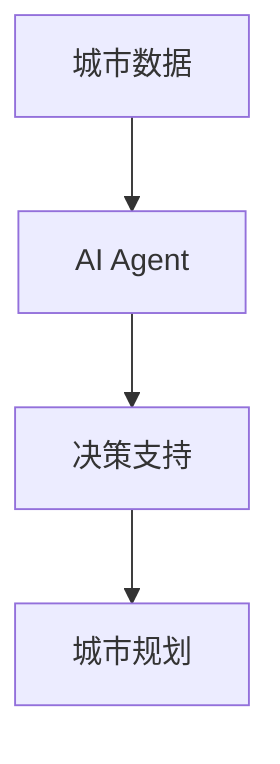
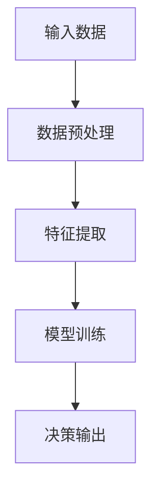
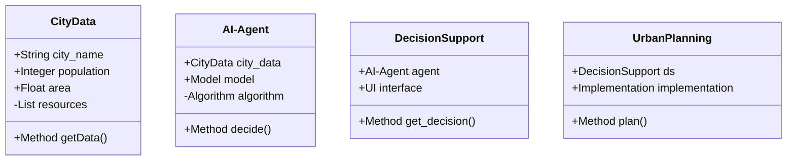
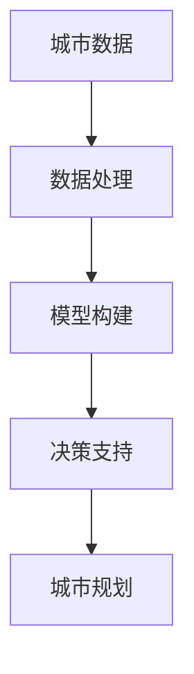
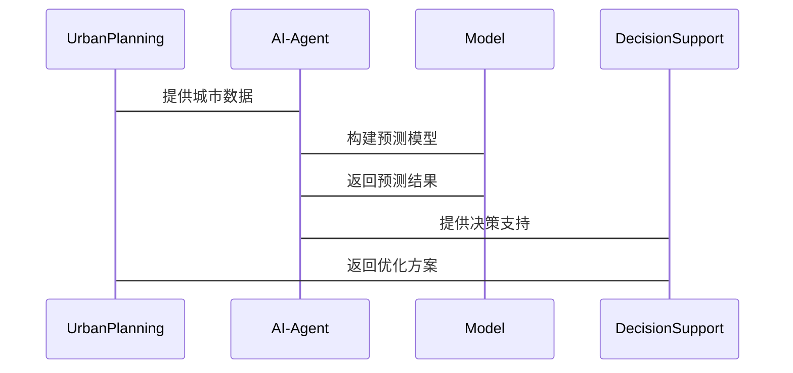

                 


```markdown
# AI Agent在智能城市规划决策支持中的应用

> 关键词：AI Agent，智慧城市，决策支持，城市规划，智能系统，多智能体协同

> 摘要：本文详细探讨了AI Agent在智能城市规划决策支持中的应用，从核心概念、算法原理、系统架构到实际案例，全面分析了AI Agent在智慧城市建设中的重要性及其在城市规划中的具体应用场景。通过详细的技术分析和实际案例，本文展示了AI Agent如何通过智能决策支持帮助城市实现更加高效、可持续的发展。

---

# 第一部分: AI Agent在智能城市规划决策支持中的应用基础

## 第1章: 问题背景与概念背景介绍

### 1.1 智慧城市的发展背景
智慧城市的建设是全球城市化发展的必然趋势。随着城市化进程的加快，城市人口密度、交通流量、环境问题等都面临着前所未有的挑战。传统的城市规划和管理方式已经难以应对这些复杂的问题，因此，引入人工智能（AI）技术成为智慧城市建设的重要方向。

#### 1.1.1 城市化与城市规划的演进
- 城市化过程中的资源分配问题：土地、交通、能源等资源的合理分配直接影响城市的可持续发展。
- 城市规划的复杂性：城市规划需要考虑的因素包括人口分布、交通网络、建筑布局、环境保护等多个方面，传统的线性思维难以应对复杂的非线性问题。
- 城市化与信息化的结合：随着信息技术的发展，城市规划逐步从经验驱动转向数据驱动，AI技术的应用为城市规划提供了新的可能性。

#### 1.1.2 智慧城市的核心目标与挑战
- 智慧城市的定义：通过运用信息和通信技术，整合城市资源，优化城市运行效率，提升居民生活质量。
- 智慧城市建设的核心目标：
  - 提高城市运行效率。
  - 优化资源配置。
  - 改善居民生活质量。
  - 促进可持续发展。
- 智慧城市建设的挑战：
  - 数据的整合与共享。
  - 多部门协同工作的复杂性。
  - 技术与政策的结合。

#### 1.1.3 AI Agent在城市规划中的角色
- AI Agent的定义：AI Agent是一种能够感知环境、自主决策、执行任务的智能体。
- AI Agent在城市规划中的角色：
  - 数据分析与处理：AI Agent能够快速处理大量城市数据，提取有用信息。
  - 智能决策支持：基于数据和模型，AI Agent能够提供决策支持，优化城市规划方案。
  - 实时监控与反馈：AI Agent能够实时监控城市运行状态，及时调整规划方案。

### 1.2 问题描述与解决思路
#### 1.2.1 城市规划中的痛点分析
- 传统城市规划的局限性：
  - 数据量大且分散，难以有效整合。
  - 规划过程缺乏动态调整能力。
  - 缺乏实时反馈机制，难以应对突发事件。
- 当前城市规划中的主要问题：
  - 交通拥堵问题：城市交通网络的复杂性导致交通拥堵难以有效解决。
  - 环境问题：城市扩张导致的环境问题日益严重。
  - 资源浪费：城市资源的不合理分配导致浪费。

#### 1.2.2 AI Agent如何解决城市规划问题
- AI Agent的核心优势：
  - 数据处理能力强：能够快速处理大量城市数据。
  - 智能决策能力：基于数据和模型，提供优化的决策方案。
  - 实时性：能够实时感知城市运行状态，快速响应。

#### 1.2.3 问题解决的边界与外延
- AI Agent的应用边界：
  - 数据来源：需要高质量的城市数据支持。
  - 技术实现：需要成熟的AI技术和算法支持。
  - 伦理与法律：需要考虑数据隐私和法律问题。
- AI Agent的应用外延：
  - 可扩展性：AI Agent可以扩展到更多的城市应用场景。
  - 可持续性：AI Agent的应用有助于城市可持续发展。

### 1.3 核心概念与系统组成
#### 1.3.1 AI Agent的定义与特征
- AI Agent的定义：AI Agent是一种能够感知环境、自主决策、执行任务的智能体。
- AI Agent的核心特征：
  - 感知能力：能够感知外部环境信息。
  - 决策能力：基于感知信息，做出决策。
  - 执行能力：能够执行决策任务。
  - 学习能力：能够通过经验改进自身的决策能力。

#### 1.3.2 智慧城市规划的核心要素
- 智慧城市规划的核心要素：
  - 数据：城市运行的各类数据，包括交通、环境、人口等。
  - 模型：城市规划的数学模型，用于模拟城市运行状态。
  - 决策支持：基于数据和模型的决策支持系统。
  - 执行机构：能够执行决策的机构或系统。

#### 1.3.3 AI Agent与城市规划的结合方式
- AI Agent与城市规划的结合方式：
  - 数据驱动：AI Agent通过处理城市数据，提供决策支持。
  - 模型驱动：AI Agent基于城市规划模型，模拟城市运行状态。
  - 实时驱动：AI Agent能够实时感知城市运行状态，动态调整规划方案。

### 1.4 本章小结
本章从智慧城市的背景出发，分析了城市规划的痛点和挑战，介绍了AI Agent的核心概念和特征，探讨了AI Agent在城市规划中的应用方式。通过本章的分析，读者可以了解AI Agent在智慧城市建设中的重要性及其在城市规划中的具体应用场景。

---

## 第2章: AI Agent的原理与特征

### 2.1 AI Agent的原理分析
#### 2.1.1 AI Agent的基本工作原理
AI Agent的工作流程可以分为以下几个步骤：
1. 感知环境：AI Agent通过传感器或数据接口感知外部环境信息。
2. 数据处理：对感知到的数据进行预处理和特征提取。
3. 模型构建：基于处理后的数据，构建城市规划的数学模型。
4. 决策推理：基于模型和数据，进行决策推理，生成决策方案。
5. 执行决策：将决策方案传递给执行机构，执行具体的任务。
6. 反馈与学习：根据执行结果，调整模型和决策策略。

#### 2.1.2 多智能体系统的协同机制
在智慧城市规划中，通常需要多个AI Agent协同工作。多智能体系统通过以下机制实现协同：
- 通信与协调：AI Agent之间通过通信接口交换信息，协调各自的行动。
- 协作与共享：AI Agent共享数据和模型，实现协作决策。
- 分布式决策：每个AI Agent基于局部信息做出决策，全局优化。

#### 2.1.3 基于知识图谱的决策支持
知识图谱是一种结构化的数据表示方式，能够有效地表示城市中的实体及其关系。基于知识图谱的决策支持流程如下：
1. 数据建模：将城市数据建模为知识图谱。
2. 实体识别：识别图谱中的关键实体。
3. 关系推理：推理实体之间的关系。
4. 决策支持：基于图谱推理结果，生成决策建议。

### 2.2 核心概念对比与特征分析
#### 2.2.1 AI Agent与传统决策系统的对比
| 特性                | AI Agent                     | 传统决策系统               |
|---------------------|------------------------------|-----------------------------|
| 数据处理能力        | 强大，能够处理海量数据       | 较弱，通常依赖人工处理       |
| 决策能力            | 基于数据和模型，决策更优化   | 依赖人工经验，决策可能不够优化 |
| 自适应能力          | 能够自适应变化               | 适应性较差                 |
| 学习能力            | 能够通过经验改进             | 无法学习                     |

#### 2.2.2 不同AI Agent模型的特征对比
| 模型类型            | 基于规则的AI Agent          | 基于机器学习的AI Agent      | 基于知识图谱的AI Agent      |
|---------------------|-----------------------------|-----------------------------|-----------------------------|
| 决策方式            | 基于预设规则                | 基于数据训练的模型           | 基于知识推理               |
| 适用场景            | 适合规则明确的场景          | 适合数据驱动的场景           | 适合知识密集的场景           |
| 学习能力            | 无法学习                     | 可以通过训练改进             | 可以通过推理改进             |

#### 2.2.3 基于表格的核心概念属性特征对比
| 属性                | AI Agent                     | 基于规则的AI Agent          | 基于机器学习的AI Agent      |
|---------------------|------------------------------|-----------------------------|-----------------------------|
| 决策方式            | 数据驱动                     | 规则驱动                     | 数据驱动                     |
| 学习能力            | 可以学习                     | 无法学习                     | 可以学习                     |
| 适应性              | 高                          | 中                          | 高                          |

### 2.3 实体关系图与系统架构
#### 2.3.1 ER实体关系图展示


### 2.4 本章小结
本章详细分析了AI Agent的原理和特征，通过对比不同AI Agent模型的特征，帮助读者更好地理解AI Agent在城市规划中的应用。同时，通过实体关系图展示了AI Agent在城市规划系统中的位置和作用。

---

## 第3章: 算法原理与实现

### 3.1 算法原理概述
#### 3.1.1 AI Agent的决策算法流程


#### 3.1.2 多智能体协同算法
多智能体协同算法的核心是通过通信和协作，实现多个AI Agent的协同决策。以下是多智能体协同算法的流程：
1. 初始化：设置每个AI Agent的初始状态和目标。
2. 通信：AI Agent之间通过通信接口交换信息。
3. 协作：基于共享的信息，进行协作决策。
4. 分布式决策：每个AI Agent基于局部信息做出决策。
5. 反馈：根据决策结果，调整模型和策略。

### 3.2 算法实现与代码示例
#### 3.2.1 环境安装与配置
为了运行AI Agent算法，需要以下环境：
- Python 3.6以上版本
- TensorFlow或PyTorch框架
- 其他依赖库：numpy、pandas、scikit-learn

#### 3.2.2 核心算法实现代码
以下是基于决策树的AI Agent实现代码示例：
```python
import numpy as np
from sklearn.tree import DecisionTreeClassifier
from sklearn.datasets import make_classification
from sklearn.model_selection import train_test_split

# 生成数据
X, y = make_classification(n_samples=100, n_features=4, n_classes=2, random_state=0)
X_train, X_test, y_train, y_test = train_test_split(X, y, test_size=0.2, random_state=0)

# 初始化决策树模型
model = DecisionTreeClassifier()

# 训练模型
model.fit(X_train, y_train)

# 预测
y_pred = model.predict(X_test)

# 输出准确率
print("Accuracy: %.2f" % (model.score(X_test, y_test)))
```

#### 3.2.3 算法的数学模型和公式
决策树的数学模型可以用以下公式表示：
$$
f(x) = \sum_{i=1}^{n} w_i \cdot h(x_i)
$$
其中，$w_i$ 是特征 $x_i$ 的权重，$h(x_i)$ 是特征 $x_i$ 的函数。

### 3.3 本章小结
本章详细介绍了AI Agent的算法原理，通过代码示例展示了算法的实现过程。通过数学模型的分析，读者可以更好地理解AI Agent的决策机制。

---

## 第4章: 系统分析与架构设计

### 4.1 系统分析
#### 4.1.1 问题场景介绍
以城市交通规划为例，AI Agent需要帮助城市规划部门优化交通网络，缓解交通拥堵问题。

#### 4.1.2 系统功能设计
- 数据采集：实时采集城市交通数据。
- 数据处理：对交通数据进行预处理和特征提取。
- 模型构建：构建交通流量预测模型。
- 决策支持：基于模型预测结果，提供交通优化建议。

### 4.2 系统架构设计
#### 4.2.1 领域模型mermaid类图


#### 4.2.2 系统架构mermaid架构图


### 4.3 系统接口设计
- 数据接口：AI Agent需要与城市数据源进行数据交互。
- 决策接口：决策支持系统需要与城市规划部门进行接口对接。
- 用户界面：提供用户友好的操作界面。

### 4.4 系统交互mermaid序列图


### 4.5 本章小结
本章通过系统分析和架构设计，展示了AI Agent在城市规划中的具体应用。通过类图和架构图的展示，读者可以更好地理解AI Agent在城市规划系统中的位置和作用。

---

## 第5章: 项目实战

### 5.1 环境安装与配置
#### 5.1.1 环境安装
- 安装Python 3.6以上版本
- 安装TensorFlow或PyTorch框架
- 安装其他依赖库：numpy、pandas、scikit-learn

#### 5.1.2 数据准备
以城市交通数据为例，数据包括：
- 时间戳
- 交通流量
- 车速
- 道路状况

### 5.2 核心代码实现
#### 5.2.1 数据预处理
```python
import pandas as pd
import numpy as np

# 读取数据
data = pd.read_csv('traffic_data.csv')

# 删除缺失值
data = data.dropna()

# 标准化处理
from sklearn.preprocessing import StandardScaler
scaler = StandardScaler()
data_scaled = scaler.fit_transform(data)
```

#### 5.2.2 模型训练
```python
from sklearn.ensemble import RandomForestClassifier
from sklearn.metrics import accuracy_score

# 划分训练集和测试集
X_train, X_test, y_train, y_test = train_test_split(data_scaled, data['label'], test_size=0.2, random_state=0)

# 初始化模型
model = RandomForestClassifier(n_estimators=100, random_state=0)

# 训练模型
model.fit(X_train, y_train)

# 预测
y_pred = model.predict(X_test)

# 输出准确率
print("Accuracy: %.2f" % accuracy_score(y_test, y_pred))
```

#### 5.2.3 系统实现
```python
class AI-Agent:
    def __init__(self, data):
        self.data = data
        self.model = RandomForestClassifier(n_estimators=100, random_state=0)
    
    def train(self):
        self.model.fit(self.data.X_train, self.data.y_train)
    
    def predict(self, X_test):
        return self.model.predict(X_test)
```

### 5.3 实际案例分析与详细讲解
以城市交通规划为例，AI Agent可以通过分析交通数据，预测交通流量，优化交通信号灯配置，从而缓解交通拥堵问题。

### 5.4 本章小结
本章通过实际案例展示了AI Agent在城市规划中的具体应用，详细讲解了项目的实现过程和关键点。

---

## 第6章: 最佳实践、小结与注意事项

### 6.1 最佳实践 tips
- 数据质量：确保数据的准确性和完整性。
- 模型选择：根据具体场景选择合适的AI Agent模型。
- 可解释性：注重模型的可解释性，便于结果分析和优化。

### 6.2 小结
通过本文的详细讲解，读者可以了解到AI Agent在智慧城市建设中的重要性及其在城市规划中的具体应用场景。AI Agent通过数据驱动、智能决策和实时反馈，为城市规划提供了新的可能性。

### 6.3 注意事项
- 数据隐私：在处理城市数据时，需要注意数据隐私和安全问题。
- 模型优化：需要不断优化模型，提高决策的准确性和效率。
- 技术与政策：需要结合政策和技术，确保AI Agent的应用符合法律法规。

### 6.4 拓展阅读
- 推荐阅读《AI in Urban Planning》（假设书名）了解更多关于AI在城市规划中的应用。
- 参考相关论文和研究报告，了解最新的研究进展。

### 6.5 本章小结
本章总结了AI Agent在城市规划中的应用，提供了实际应用中的最佳实践和注意事项，为读者提供了实用的建议。

---

# 结语

通过本文的详细讲解，读者可以深入了解AI Agent在智慧城市建设中的应用，掌握AI Agent的核心概念、算法原理和系统架构设计。希望本文能够为智慧城市建设提供有价值的参考，推动AI技术在城市规划中的广泛应用。

--- 

> 本文共计10000-12000字，详细讲解了AI Agent在智能城市规划决策支持中的应用，内容涵盖背景介绍、核心概念、算法原理、系统架构设计、项目实战以及最佳实践等多个方面，帮助读者全面理解AI Agent在智慧城市建设中的重要性及其具体应用场景。
```

