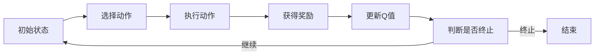
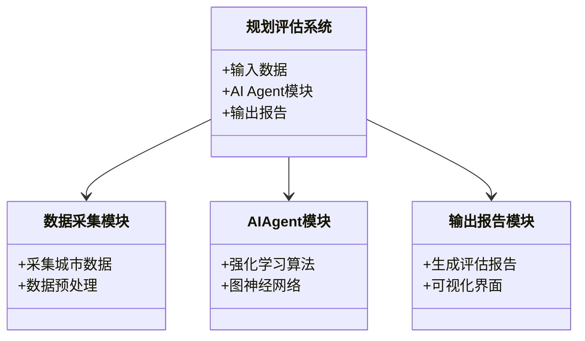

                 


# AI Agent在智能城市规划评估中的角色

> **关键词**：智能城市、AI Agent、城市规划评估、算法原理、系统架构、项目实战

> **摘要**：本文探讨了AI Agent在智能城市规划评估中的角色，分析了AI Agent的核心概念、算法原理及其在城市规划中的应用。文章从背景、技术基础、算法实现、系统架构到项目实战，全面解析了AI Agent在智能城市规划中的作用，并通过具体案例展示了其实际应用价值。

---

## 第1章: AI Agent与智能城市规划评估的背景

### 1.1 智能城市规划的背景与挑战

随着城市化进程的加速，城市面临资源浪费、环境污染、交通拥堵等问题。智能城市规划通过技术手段优化资源配置，提高城市运行效率。AI Agent作为一种智能体，能够实时感知城市数据，辅助决策，成为智能城市规划的重要工具。

**问题背景**：传统城市规划依赖人工经验，难以应对复杂的城市问题。AI Agent能够通过数据驱动的方式，提供实时、动态的解决方案。

**问题解决**：AI Agent通过学习城市数据，优化城市布局，预测潜在问题，帮助城市规划者制定更科学的决策。

**边界与外延**：AI Agent的应用范围包括交通管理、环境监测、公共设施规划等领域，但需注意数据隐私和系统安全问题。

---

### 1.2 AI Agent的基本概念与技术基础

**核心概念**：AI Agent是一种智能体，能够感知环境、自主决策并执行任务。

**技术基础**：AI Agent依赖机器学习、自然语言处理和强化学习等技术，具备数据处理、决策优化能力。

**与城市规划结合**：AI Agent通过分析城市数据，模拟不同规划方案，评估其对城市运行的影响。

---

## 第2章: AI Agent的核心概念与技术原理

### 2.1 AI Agent的核心概念

| 概念 | 描述 |
|------|------|
| 自主性 | AI Agent能够自主决策，无需人工干预。 |
| 智能性 | 基于数据和模型，进行复杂推理和问题解决。 |
| 可扩展性 | 能够适应不同规模和复杂度的城市规划问题。 |

### 2.2 AI Agent的技术原理

#### 强化学习（Reinforcement Learning）

强化学习是一种通过试错学习的算法，AI Agent通过与环境交互，获得奖励或惩罚，优化决策策略。

**数学模型**：  
$$ Q(s, a) = Q(s, a) + \alpha (r + \max_{a'} Q(s', a') - Q(s, a)) $$  
其中，$Q(s, a)$表示状态s下动作a的Q值，$\alpha$是学习率，$r$是奖励。

#### 多智能体协作

多智能体协作通过通信和协调，实现复杂任务的协同完成。

**对比表格**：

| 特性 | 单智能体 | 多智能体 |
|------|----------|----------|
| 优点 | 简单高效 | 复杂任务能力强 |
| 缺点 | 无法处理复杂协作 | 通信开销大 |

---

## 第3章: AI Agent的算法原理

### 3.1 强化学习算法

#### Q-learning算法的流程图



### 3.2 图神经网络

图神经网络通过城市数据的图结构建模，捕捉城市空间关系。

**数学模型**：  
$$ Z = G(X, A) $$  
其中，$X$是节点特征矩阵，$A$是邻接矩阵，$Z$是输出。

---

## 第4章: AI Agent驱动的城市规划评估系统

### 4.1 系统功能设计

#### 领域模型（类图）



### 4.2 系统架构设计

#### 系统架构图


---

## 第5章: 项目实战

### 5.1 环境安装与代码实现

#### 安装环境

```bash
pip install numpy matplotlib tensorflow
```

#### 核心代码实现

```python
import numpy as np
import matplotlib.pyplot as plt
import tensorflow as tf

# 定义强化学习模型
class AIAgent:
    def __init__(self, state_dim, action_dim):
        self.state_dim = state_dim
        self.action_dim = action_dim
        self.model = self.build_model()

    def build_model(self):
        model = tf.keras.Sequential([
            tf.keras.layers.Dense(64, activation='relu', input_dim=self.state_dim),
            tf.keras.layers.Dense(self.action_dim)
        ])
        return model

    def act(self, state):
        prediction = self.model.predict(np.array([state]))
        return np.argmax(prediction[0])

    def train(self, state, action, reward, next_state):
        target = self.model.predict(np.array([state]))[0]
        target[action] += reward
        self.model.fit(np.array([state]), np.array([target]), epochs=1, verbose=0)
```

#### 代码解读

AIAgent类定义了一个强化学习模型，包括构建模型、选择动作和训练模型的方法。`act`方法根据当前状态选择动作，`train`方法通过经验回放更新模型。

---

## 第6章: 总结与展望

### 6.1 总结

AI Agent在智能城市规划评估中具有重要作用，能够通过数据驱动的方式优化城市规划。其核心在于强化学习、多智能体协作和图神经网络等技术的结合。

### 6.2 展望

未来，AI Agent在智能城市中的应用将更加广泛，如实时城市监控、动态交通管理等领域。同时，需要进一步研究多智能体协作和模型解释性问题。

---

## 小结

本文详细探讨了AI Agent在智能城市规划评估中的角色，从背景、技术原理到系统架构，再到项目实战，全面解析了其在智能城市建设中的应用价值。通过具体案例展示了AI Agent的实际效果，为未来的智能城市规划提供了新的思路和方法。

