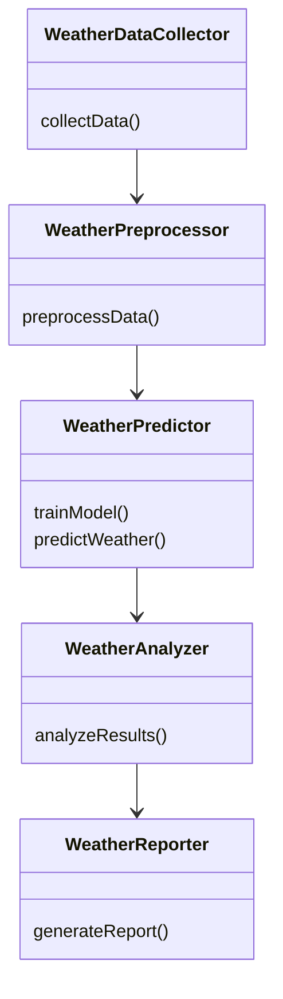
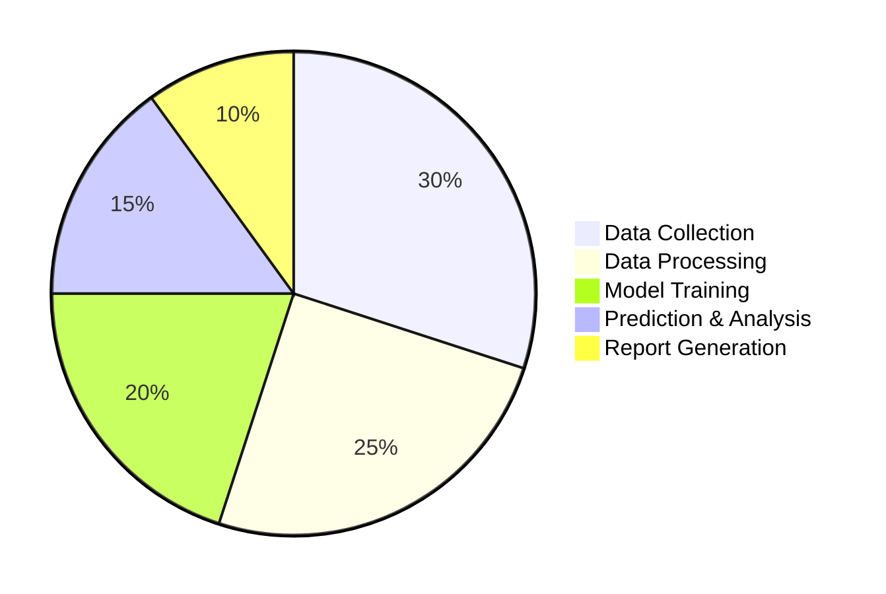
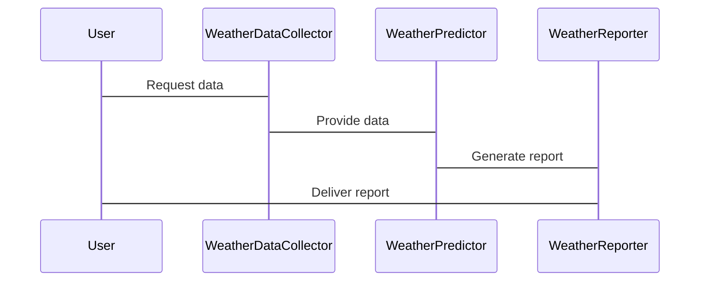

                 


# AI Agent在智能天气预报中的实践

## 关键词：AI Agent、智能天气预报、机器学习、天气预测、数据处理、系统架构

## 摘要：本文探讨AI Agent在智能天气预报中的实践，从背景介绍、核心概念、算法原理、系统架构到项目实战，全面分析AI Agent在天气预报中的应用，结合具体案例，深入解读其优势与挑战，并提供最佳实践和未来展望。

---

# 第一部分：AI Agent与智能天气预报的背景与基础

## 第1章：AI Agent与智能天气预报的背景

### 1.1 AI Agent的基本概念

#### 1.1.1 AI Agent的定义
AI Agent（人工智能代理）是指能够感知环境并采取行动以实现目标的智能实体。它可以是软件程序、机器人或其他智能系统，通过与环境交互来完成特定任务。

#### 1.1.2 AI Agent的核心特点
- **自主性**：能够在没有外部干预的情况下运行。
- **反应性**：能够实时感知环境并做出反应。
- **目标导向**：通过目标驱动行为，优化决策过程。
- **学习能力**：能够通过数据和经验不断优化自身的预测能力。

#### 1.1.3 AI Agent与传统天气预报的区别
传统天气预报主要依赖于数值天气预报模型和气象学家的经验，而AI Agent可以通过实时数据处理、机器学习算法和动态调整模型参数，实现更精准和个性化的天气预测。

### 1.2 智能天气预报的背景

#### 1.2.1 天气预报的发展历程
天气预报从早期的简单观察到现代的数值天气预报，经历了从经验预测到计算机模拟的转变。随着AI技术的发展，智能天气预报逐渐成为可能。

#### 1.2.2 智能天气预报的定义与目标
智能天气预报是指利用AI技术，通过实时数据处理和预测模型，提供更精准、更个性化的天气预测服务。其目标是提高预测的准确性和时效性，满足用户多样化的需求。

#### 1.2.3 当前天气预报的挑战与不足
- 数据量庞大且复杂。
- 模型的计算成本高。
- 预测的不确定性较大。
- 个性化需求难以满足。

### 1.3 AI Agent在天气预报中的应用前景

#### 1.3.1 AI Agent在天气预报中的优势
- 高效的数据处理能力。
- 精准的预测模型。
- 实时的反馈机制。

#### 1.3.2 智能天气预报的潜在应用场景
- **精准农业**：帮助农民优化种植决策。
- **交通管理**：优化交通流量，减少恶劣天气对交通的影响。
- **能源管理**：优化能源生产和消耗。

#### 1.3.3 当前技术的挑战与未来发展方向
- 数据隐私与安全问题。
- 模型的可解释性。
- 多模态数据的融合与处理。

---

## 第2章：AI Agent的核心概念与原理

### 2.1 AI Agent的核心概念

#### 2.1.1 AI Agent的构成要素
- **感知模块**：负责数据的采集和处理。
- **推理模块**：负责数据的分析和预测。
- **行动模块**：负责根据预测结果采取行动。

#### 2.1.2 AI Agent的分类与特点
- **反应式AI Agent**：基于当前环境信息做出反应。
- **认知式AI Agent**：具备推理和规划能力。

#### 2.1.3 AI Agent与智能天气预报的关系
AI Agent是智能天气预报的核心驱动力，通过数据处理、预测和反馈机制，实现天气预报的智能化。

### 2.2 AI Agent的原理与机制

#### 2.2.1 数据采集与处理
- **数据来源**：气象卫星、气象站、传感器等。
- **数据预处理**：清洗、标准化、特征提取。

#### 2.2.2 智能分析与预测
- **预测模型**：回归模型、神经网络模型。
- **预测机制**：基于历史数据和实时数据，预测未来天气状况。

#### 2.2.3 结果输出与反馈
- **结果输出**：将预测结果反馈给用户或系统。
- **反馈机制**：根据用户反馈优化预测模型。

### 2.3 AI Agent在天气预报中的具体应用

#### 2.3.1 数据来源与处理
- **气象卫星数据**：提供全球气象数据。
- **气象站数据**：提供局部气象数据。
- **传感器数据**：提供实时气象数据。

#### 2.3.2 AI Agent的预测模型
- **回归模型**：用于预测连续型变量，如温度、湿度。
- **神经网络模型**：用于复杂非线性关系的预测。

#### 2.3.3 结果的应用与优化
- **结果应用**：提供天气预报服务。
- **模型优化**：通过反馈机制不断优化预测模型。

---

## 第3章：AI Agent在天气预报中的算法原理

### 3.1 数据预处理与特征提取

#### 3.1.1 数据清洗与标准化
- **数据清洗**：去除噪声数据，填补缺失值。
- **数据标准化**：将数据归一化，便于模型处理。

#### 3.1.2 特征选择与提取
- **特征选择**：选择对预测影响最大的特征。
- **特征提取**：通过主成分分析等方法提取特征。

#### 3.1.3 时间序列数据的处理
- **时间序列分析**：使用ARIMA、LSTM等模型处理时间序列数据。

### 3.2 AI Agent的预测算法

#### 3.2.1 基于回归的预测模型
- **线性回归模型**：用于预测连续型变量。
- **逻辑回归模型**：用于分类任务。

#### 3.2.2 基于分类的预测模型
- **决策树模型**：用于分类和回归任务。
- **随机森林模型**：通过集成学习提高预测准确性。

#### 3.2.3 基于深度学习的预测模型
- **卷积神经网络（CNN）**：用于图像数据的处理。
- **循环神经网络（RNN）**：用于时间序列数据的处理。

---

## 第4章：AI Agent在天气预报中的系统架构设计

### 4.1 系统功能设计

#### 4.1.1 领域模型类图


#### 4.1.2 系统架构设计


#### 4.1.3 系统接口设计
- **数据接口**：与气象数据源对接。
- **预测接口**：提供天气预测服务。
- **报告接口**：生成天气预报报告。

#### 4.1.4 系统交互流程图


---

## 第5章：AI Agent在天气预报中的项目实战

### 5.1 环境安装

```bash
pip install numpy pandas scikit-learn tensorflow
```

### 5.2 系统核心实现源代码

#### 5.2.1 数据预处理代码
```python
import pandas as pd
import numpy as np

# 加载数据
data = pd.read_csv('weather.csv')

# 数据清洗
data.dropna(inplace=True)
data = data[~data.duplicated()]

# 数据标准化
from sklearn.preprocessing import StandardScaler
scaler = StandardScaler()
scaled_data = scaler.fit_transform(data[['temperature', 'humidity', 'wind_speed']])
```

#### 5.2.2 模型训练代码
```python
from sklearn.model_selection import train_test_split
from sklearn.linear_model import LinearRegression

# 划分训练集和测试集
X_train, X_test, y_train, y_test = train_test_split(scaled_data, data['temperature'], test_size=0.2, random_state=42)

# 训练模型
model = LinearRegression()
model.fit(X_train, y_train)

# 预测结果
y_pred = model.predict(X_test)
```

### 5.3 实际案例分析

#### 5.3.1 案例背景
某地区过去一周的气象数据，包括温度、湿度、风速等。

#### 5.3.2 模型预测
使用线性回归模型预测未来三天的温度变化。

#### 5.3.3 结果分析
模型预测结果与实际数据进行对比，评估模型的准确性。

### 5.4 项目小结

---

## 第6章：总结与展望

### 6.1 项目小结
通过本项目的实践，我们了解了AI Agent在天气预报中的应用，掌握了数据处理、模型训练和结果分析的全过程。

### 6.2 最佳实践
- 数据预处理是关键，确保数据的准确性和完整性。
- 选择合适的模型和算法，提高预测的准确性。
- 及时优化模型，根据反馈结果不断改进。

### 6.3 注意事项
- 数据隐私和安全问题需要高度重视。
- 模型的可解释性需要进一步研究。
- 多模态数据的融合与处理是未来发展方向。

### 6.4 拓展阅读
- 《机器学习实战》
- 《深度学习入门》
- 《时间序列分析与预测》

---

通过以上步骤，我们可以看到AI Agent在智能天气预报中的巨大潜力和广泛应用。未来，随着技术的不断发展，AI Agent将为天气预报带来更多的创新和突破。

