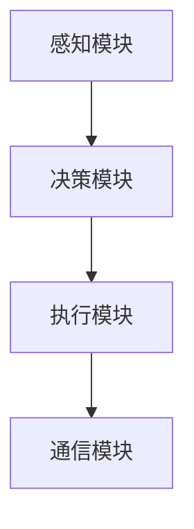

                 


# AI Agent在智能太空探索中的实践

> 关键词：AI Agent，智能太空探索，机器学习，自然语言处理，强化学习，太空机器人

> 摘要：随着科技的进步，人工智能（AI）在太空探索中的应用越来越广泛。本文探讨AI Agent在智能太空探索中的实践，分析其核心概念、算法原理、系统架构以及实际应用案例。通过详细的技术分析和实例解读，展示AI Agent在太空任务中的巨大潜力和实际价值。

---

# 第一部分: AI Agent 在智能太空探索中的背景与基础

## 第1章: AI Agent 与智能太空探索概述

### 1.1 AI Agent 的基本概念

#### 1.1.1 AI Agent 的定义与特点

AI Agent（人工智能代理）是一种能够感知环境、自主决策并执行任务的智能实体。它具备以下核心特点：

- **自主性**：AI Agent能够在没有外部干预的情况下独立运作。
- **反应性**：能够实时感知环境变化并做出响应。
- **目标导向**：通过设定目标来指导行为和决策。
- **学习能力**：能够通过数据和经验不断优化自身性能。

#### 1.1.2 智能太空探索的定义与目标

智能太空探索是指利用AI技术，通过智能化的设备、机器人和算法，实现对太空环境的自主探测、数据分析和任务执行。其主要目标包括：

- 探索未知的宇宙空间。
- 获取太空资源。
- 支持深空任务中的决策和操作。

#### 1.1.3 AI Agent 在太空探索中的作用

AI Agent在智能太空探索中的作用可以概括为：

1. **自主导航**：在复杂太空环境中实现自主导航和路径规划。
2. **数据处理**：对收集到的太空数据进行分析和处理。
3. **任务执行**：执行探测、采样、维修等复杂任务。
4. **协同合作**：与其他AI Agent或人类团队协同完成任务。

---

## 第2章: AI Agent 的核心概念与原理

### 2.1 AI Agent 的核心概念

#### 2.1.1 AI Agent 的基本构成

AI Agent由以下几个核心部分组成：

1. **感知层**：负责接收外部环境的信息，如图像、传感器数据等。
2. **决策层**：基于感知信息，通过算法做出决策。
3. **执行层**：将决策转化为具体的动作，执行任务。

#### 2.1.2 AI Agent 的行为模式

AI Agent的行为模式可以分为以下几种：

1. **反应式行为**：基于当前感知做出即时反应。
2. **目标导向行为**：以预设目标为导向，规划行为路径。
3. **学习型行为**：通过学习不断优化自身行为。

#### 2.1.3 AI Agent 的决策机制

AI Agent的决策机制通常包括以下步骤：

1. **感知环境**：通过传感器或数据源获取环境信息。
2. **状态识别**：对感知信息进行分析，识别当前状态。
3. **目标设定**：根据当前状态，设定新的目标或调整现有目标。
4. **行为规划**：根据目标，规划具体的行为路径。
5. **决策执行**：执行规划好的行为，并实时监控结果。
6. **反馈优化**：根据执行结果，优化后续决策。

---

## 第3章: AI Agent 的技术原理与数学模型

### 3.1 AI Agent 的核心算法

#### 3.1.1 基于概率论的决策模型

概率论是AI Agent决策的核心理论基础之一。常见的概率模型包括：

1. **贝叶斯网络**：通过概率推理，对未知事件进行预测和决策。
2. **马尔可夫决策过程（MDP）**：通过状态转移概率，优化决策路径。

#### 3.1.2 强化学习算法

强化学习是一种通过试错机制优化决策的算法。常见的强化学习算法包括：

1. **Q-Learning**：通过状态-动作奖励函数，学习最优策略。
2. **策略梯度方法**：通过优化策略参数，直接优化目标函数。

#### 3.1.3 知识图谱推理

知识图谱推理是通过构建和推理知识图谱，实现对复杂问题的决策。常见的推理方法包括：

1. **路径推理**：通过图中的路径关系，推理出隐含事实。
2. **规则推理**：基于预设规则，进行逻辑推理。

### 3.2 AI Agent 的数学模型

#### 3.2.1 贝叶斯网络的数学模型

贝叶斯网络是一种有向无环图，表示变量之间的概率关系。其核心公式为：

$$ P(A|B) = \frac{P(B|A) \cdot P(A)}{P(B)} $$

其中，$P(A|B)$ 表示在$B$发生的条件下，$A$发生的概率。

#### 3.2.2 强化学习的数学模型

强化学习的核心是通过最大化累计奖励来优化策略。其数学模型可以表示为：

$$ Q(s, a) = r + \gamma \max_{a'} Q(s', a') $$

其中，$Q(s, a)$ 表示状态$s$下动作$a$的值函数，$r$是即时奖励，$\gamma$是折扣因子，$s'$是下一状态。

---

## 第4章: AI Agent 的系统架构与设计

### 4.1 系统功能设计

#### 4.1.1 系统目标与功能模块划分

智能太空探索系统的目标是通过AI Agent实现对太空环境的自主探测和任务执行。其功能模块包括：

1. **感知模块**：负责接收和处理环境数据。
2. **决策模块**：负责制定行为策略。
3. **执行模块**：负责执行具体任务。
4. **通信模块**：负责与其他系统或人类团队进行信息交互。

#### 4.1.2 系统功能设计图

以下是一个简化的系统功能设计图：



### 4.2 系统架构设计

#### 4.2.1 分层架构设计

智能太空探索系统的分层架构包括：

1. **感知层**：负责数据采集和处理。
2. **决策层**：负责策略制定和行为规划。
3. **执行层**：负责具体任务的执行。

#### 4.2.2 微服务架构设计

微服务架构将系统功能分解为多个独立的服务模块，包括：

1. **图像识别服务**
2. **数据处理服务**
3. **决策服务**
4. **执行控制服务**

---

## 第5章: AI Agent 的实际应用与案例分析

### 5.1 太空机器人控制

#### 5.1.1 系统环境安装

为了实现太空机器人控制，我们需要以下环境：

- **Python 3.8+**
- **TensorFlow 2.0+**
- **OpenCV 4.5+**
- **ROS（机器人操作系统）**

#### 5.1.2 核心代码实现

以下是一个简单的强化学习控制代码示例：

```python
import gym
import numpy as np

env = gym.make('CartPole-v1')
env.seed(1)

# 初始化策略参数
theta = np.zeros(4)
learning_rate = 0.01

for episode in range(1000):
    state = env.reset()
    for t in range(1000):
        # 状态到动作的映射
        action = np.dot(state, theta) > 0
        action = int(action)
        
        # 执行动作
        next_state, reward, done, _ = env.step(action)
        
        # 更新策略参数
        delta = (reward - np.dot(next_state, theta)) * state
        theta += learning_rate * delta
        
        state = next_state
        if done:
            break
```

#### 5.1.3 案例分析与解读

通过上述代码，我们可以实现对太空机器人的基本控制。通过不断迭代和优化策略参数，机器人能够逐渐掌握平衡杆的任务。

---

## 第6章: AI Agent 的未来展望与挑战

### 6.1 未来展望

AI Agent在智能太空探索中的应用前景广阔，未来可能会实现更加复杂和智能的任务，如：

1. **自主导航与避障**：通过深度学习实现更复杂的环境识别和路径规划。
2. **多 Agent 协作**：实现多个AI Agent之间的协同合作，完成更复杂的任务。
3. **人机协作**：通过自然语言处理技术，实现与人类的高效协作。

### 6.2 当前挑战

尽管AI Agent在智能太空探索中展现了巨大潜力，但仍然面临以下挑战：

1. **环境不确定性**：太空环境复杂多变，AI Agent需要具备更强的适应能力。
2. **计算资源限制**：在资源受限的环境中，如何优化计算资源是一个重要问题。
3. **安全与可靠性**：确保AI Agent在极端环境下的安全性和可靠性。

---

## 第7章: 结语

AI Agent在智能太空探索中的实践，不仅推动了技术的进步，也为人类探索宇宙提供了新的可能性。通过不断的技术创新和实践积累，AI Agent有望在未来成为智能太空探索的核心力量。

---

## 参考文献

1. Russell, S., & Norvig, P. (2010). Artificial Intelligence: A Modern Approach.
2. Sutton, R. S., & Barto, A. G. (2018). Reinforcement Learning: Theory and Algorithms.
3. LeCun, Y., Bengio, Y., & Hinton, G. (2015). Deep Learning.

---

通过以上目录结构和技术内容，我们可以看到AI Agent在智能太空探索中的实践是一个涉及多领域技术的复杂课题。从算法原理到系统设计，再到实际应用，每一部分都需要深入研究和实践。希望本文能为相关领域的研究者和实践者提供有价值的参考。

