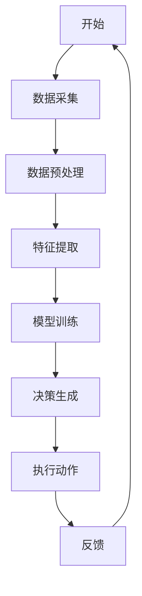
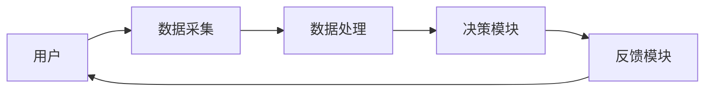
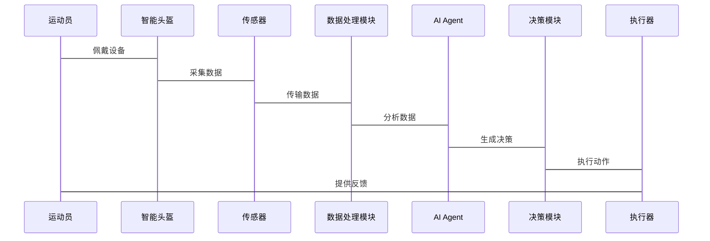

                 


# 目录大纲：《AI Agent在智能头盔中的运动安全监控》

## 第一部分：背景介绍

### 第1章：AI Agent与智能头盔概述

#### 1.1 问题背景
- 1.1.1 运动安全监控的重要性
- 1.1.2 AI Agent在运动安全中的应用价值

#### 1.2 问题描述
- 1.2.1 运动损伤的常见原因
- 1.2.2 智能头盔在运动安全中的角色

#### 1.3 问题解决
- 1.3.1 AI Agent如何预防运动损伤
- 1.3.2 实时监控的关键技术

#### 1.4 边界与外延
- 1.4.1 AI Agent的应用范围
- 1.4.2 智能头盔的局限性

#### 1.5 核心要素组成
- 1.5.1 传感器数据
- 1.5.2 AI算法
- 1.5.3 用户反馈机制

## 第二部分：核心概念与联系

### 第2章：AI Agent的基本原理

#### 2.1 核心概念原理
- 2.1.1 感知模块
- 2.1.2 决策模块
- 2.1.3 执行模块

#### 2.2 概念属性对比表格
| 概念 | 属性 | 描述 |
|------|-------|------|
| AI Agent | 感知 | 采集环境数据 |
|       | 决策 | 分析数据并制定策略 |
|       | 执行 | 执行决策 |

#### 2.3 ER实体关系图
```mermaid
er
  actor: 运动员
  smart_helmet: 智能头盔
  sensor_data: 传感器数据
  ai_agent: AI代理
  action: 动作
  relation: 关系
  运动员 --> 关系 --> 智能头盔
  智能头盔 --> 关系 --> 传感器数据
  传感器数据 --> 关系 --> AI代理
  AI代理 --> 关系 --> 动作
```

## 第三部分：算法原理讲解

### 第3章：AI Agent的算法流程

#### 3.1 算法流程图


#### 3.2 算法实现代码
```python
import numpy as np
from sklearn import svm

# 示例数据
X = np.array([[0, 0], [1, 1], [2, 2], [3, 3], [4, 4]])
y = np.array([0, 1, 2, 3, 4])

# 创建SVM模型
model = svm.SVC()

# 训练模型
model.fit(X, y)

# 预测新数据
new_data = np.array([[2.5, 2.5]])
print("预测结果:", model.predict(new_data))
```

#### 3.3 数学模型和公式
- 感知机模型：$f(x) = \text{sign}(w \cdot x + b)$
- 决策树的分类：使用ID3算法，信息增益公式为：$Gain(S, A) = H(S) - H(S|A)$
- 回归模型：线性回归的损失函数为：$\text{MSE} = \frac{1}{n}\sum_{i=1}^{n}(y_i - \hat{y}_i)^2$

## 第四部分：系统分析与架构设计方案

### 第4章：系统功能设计

#### 4.1 问题场景介绍
- 运动训练中的实时监控
- 智能头盔的数据采集和处理

#### 4.2 系统功能设计
- 数据采集模块：传感器数据采集
- 数据处理模块：数据预处理和特征提取
- 决策模块：实时分析和决策
- 反馈模块：指令输出和用户反馈

#### 4.3 系统架构设计


#### 4.4 接口设计和交互流程图


## 第五部分：项目实战

### 第5章：环境搭建与核心代码实现

#### 5.1 环境搭建
- 安装必要的库：numpy, scikit-learn, mermaid, matplotlib
- 配置开发环境：Jupyter Notebook或PyCharm

#### 5.2 核心代码实现
```python
import numpy as np
from sklearn.model_selection import train_test_split
from sklearn.metrics import accuracy_score

# 示例数据集
X = np.random.randn(100, 2)
y = np.random.randint(2, size=100)

# 划分训练集和测试集
X_train, X_test, y_train, y_test = train_test_split(X, y, test_size=0.2)

# 训练SVM模型
model = svm.SVC()
model.fit(X_train, y_train)

# 预测并评估准确率
y_pred = model.predict(X_test)
print("准确率:", accuracy_score(y_test, y_pred))
```

#### 5.3 案例分析
- 数据采集：从传感器获取加速度、角速度等数据
- 数据处理：预处理和特征提取
- 模型训练：使用SVM进行分类
- 结果分析：评估模型性能并优化参数

## 第六部分：最佳实践

### 第6章：小结与注意事项

#### 6.1 小结
- AI Agent在智能头盔中的应用前景广阔
- 系统设计需要综合考虑传感器、算法和用户反馈

#### 6.2 注意事项
- 数据隐私保护的重要性
- 系统的实时性和稳定性要求
- 算法的可解释性和鲁棒性

#### 6.3 拓展阅读
- 推荐书籍：《机器学习实战》、《深度学习》
- 关键词：运动安全监控、AI代理、智能头盔、传感器数据、实时分析

## 附录：术语表和参考文献

### 附录A：术语表
- AI Agent：人工智能代理
- 智能头盔：Intelligent Helmet
- 传感器数据：Sensor Data
- 决策模块：Decision Module
- 执行器：Actuator

### 附录B：参考文献
- [1] 《机器学习实战》, 周志华
- [2] 《深度学习》, Ian Goodfellow
- [3] 《人工智能: 一种现代的方法》, Stuart Russell

---

这个大纲确保了从背景到实际应用的全面覆盖，结合理论与实践，适合技术专家和开发者深入理解AI Agent在智能头盔中的应用。

