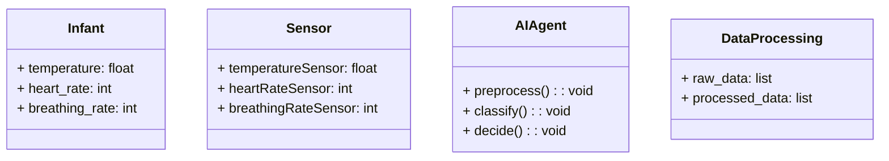
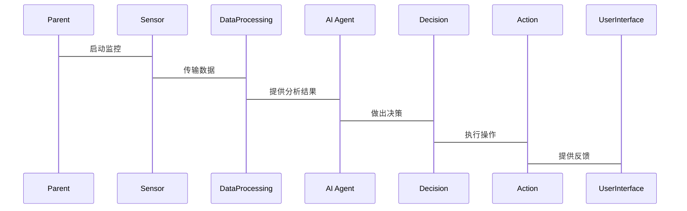

                 


# AI Agent在智能婴儿床中的安全监控

> 关键词：AI Agent，智能婴儿床，安全监控，实时监测，婴儿护理

> 摘要：本文探讨了AI Agent在智能婴儿床中的安全监控应用，详细分析了AI Agent的核心概念、算法原理、系统架构设计以及实际项目实现。通过结合婴儿床监控的实际需求，提出了一套基于AI Agent的安全监控解决方案，并通过具体案例分析展示了其实现过程和效果。本文旨在为相关领域的研究人员和开发者提供参考，帮助他们更好地理解和应用AI Agent技术。

---

# 第1章: AI Agent与智能婴儿床概述

## 1.1 问题背景

### 1.1.1 婴儿安全监控的重要性
婴儿是家庭中最脆弱的群体之一，其安全问题备受关注。传统的婴儿床监控设备（如摄像头、传感器）虽然能提供基本的监控功能，但存在响应不及时、误报率高、缺乏智能分析等问题。在紧急情况下，如婴儿突然哭闹、窒息或突发疾病，传统设备难以快速做出反应，可能导致严重后果。

### 1.1.2 传统婴儿床监控的局限性
- 数据采集单一：传统设备主要依赖摄像头和简单的传感器，无法全面采集婴儿的生理数据（如体温、心率）。
- 响应延迟：人工监控需要家长手动查看设备，无法实现实时智能响应。
- 误报率高：传统设备难以区分正常哭闹和异常情况，容易引发误报。

### 1.1.3 AI Agent在婴儿床监控中的应用潜力
AI Agent（智能体）是一种能够感知环境、自主决策并执行任务的智能系统。通过结合AI Agent与婴儿床监控设备，可以实现以下功能：
- 实时监测婴儿的生理数据和环境数据。
- 智能分析数据，识别异常情况。
- 主动发出警报或采取措施，确保婴儿安全。

---

## 1.2 问题描述

### 1.2.1 婴儿床监控的核心需求
- **实时监测**：持续采集婴儿的生理数据和环境数据。
- **智能分析**：通过AI算法识别异常情况。
- **快速响应**：在紧急情况下及时通知家长或采取措施。

### 1.2.2 当前监控系统的痛点分析
- 数据采集不全面：缺乏婴儿的生理数据。
- 系统智能化不足：无法主动分析和决策。
- 交互性差：家长无法通过设备与婴儿进行实时互动。

### 1.2.3 AI Agent在婴儿床监控中的目标
通过AI Agent技术，构建一个智能化的婴儿床监控系统，实现以下目标：
- 实时采集和分析婴儿的生理数据。
- 智能识别异常情况并发出警报。
- 提供家长与婴儿的实时互动功能。

---

## 1.3 问题解决

### 1.3.1 AI Agent的核心功能
AI Agent在婴儿床监控中的核心功能包括：
- **数据采集**：通过传感器采集婴儿的体温、心率、呼吸频率等数据。
- **数据分析**：利用机器学习算法识别异常情况。
- **智能决策**：在检测到异常时，触发警报或采取措施（如调整床温、发出安抚声音）。

### 1.3.2 AI Agent在婴儿床监控中的实现路径
1. **数据采集**：在婴儿床中嵌入多种传感器，实时采集婴儿的生理数据和环境数据。
2. **数据传输**：通过无线通信技术（如Wi-Fi、蓝牙）将数据传输到AI Agent。
3. **数据处理与分析**：AI Agent对数据进行预处理、特征提取和分类，识别异常情况。
4. **智能决策与反馈**：AI Agent根据分析结果，采取相应的措施（如发出警报、调整床温）。

### 1.3.3 AI Agent与婴儿床监控的结合方式
AI Agent通过与婴儿床的硬件设备（如传感器、摄像头）和软件系统（如数据处理模块、用户界面）结合，实现智能化的婴儿床监控。

---

## 1.4 边界与外延

### 1.4.1 系统的边界定义
- **数据采集范围**：婴儿的体温、心率、呼吸频率、环境温湿度等。
- **功能边界**：仅限于婴儿床监控，不包括其他家庭成员的监控。

### 1.4.2 系统外延的功能扩展
- **远程监控**：通过手机APP实现远程查看和控制。
- **智能交互**：支持家长与婴儿的实时互动（如播放安抚音乐）。
- **数据存储与分析**：长期记录婴儿的生理数据，提供健康报告。

### 1.4.3 系统与其他系统的接口关系
- **与家庭Wi-Fi网络的接口**：用于数据传输。
- **与手机APP的接口**：用于用户交互。
- **与智能家居系统的接口**：如与空调联动调节房间温湿度。

---

## 1.5 核心要素组成

### 1.5.1 AI Agent的核心要素
- **感知能力**：通过传感器采集数据。
- **决策能力**：通过机器学习算法分析数据并做出决策。
- **执行能力**：通过硬件设备执行操作（如发出警报、调整床温）。

### 1.5.2 婴儿床监控系统的组成
- **传感器模块**：采集婴儿的生理数据。
- **数据处理模块**：对数据进行预处理和分析。
- **AI Agent模块**：负责智能决策和执行。
- **用户界面模块**：提供家长与系统的交互界面。

### 1.5.3 两者的结合方式
AI Agent通过与婴儿床的硬件设备和软件系统结合，实现智能化的婴儿床监控功能。

---

# 第2章: 核心概念与联系

## 2.1 AI Agent的定义与原理

### 2.1.1 AI Agent的基本定义
AI Agent是一种能够感知环境、自主决策并执行任务的智能系统。它通过传感器获取环境数据，利用算法进行分析和决策，并通过执行器完成任务。

### 2.1.2 AI Agent的核心原理
AI Agent的核心原理包括：
- **感知**：通过传感器获取环境数据。
- **分析**：利用机器学习算法对数据进行分析和分类。
- **决策**：根据分析结果做出决策。
- **执行**：通过执行器完成决策任务。

### 2.1.3 AI Agent的分类与特点
AI Agent可以根据功能和应用场景分为多种类型，本文主要关注应用于婴儿床监控的AI Agent，其特点包括：
- **实时性**：能够快速响应。
- **准确性**：能够准确识别异常情况。
- **智能性**：能够自主决策和执行任务。

---

## 2.2 智能婴儿床监控系统

### 2.2.1 智能婴儿床的功能
智能婴儿床的主要功能包括：
- 实时监测婴儿的生理数据。
- 智能识别异常情况并发出警报。
- 提供家长与婴儿的实时互动功能。

### 2.2.2 监控系统的组成
智能婴儿床监控系统的组成包括：
- **传感器模块**：采集婴儿的体温、心率等数据。
- **数据处理模块**：对数据进行预处理和分析。
- **AI Agent模块**：负责智能决策和执行。
- **用户界面模块**：提供家长与系统的交互界面。

---

## 2.3 实体关系与概念结构

### 2.3.1 实体关系图
```mermaid
er
actor Infant: 婴儿
actor Parent: 父母
actor System: 系统
actor AI Agent: AI Agent
```

### 2.3.2 系统组件之间的关系
```mermaid
graph TD
 Infant --> Sensor: 提供生理数据
 Sensor --> DataProcessing: 传输数据
 DataProcessing --> AI Agent: 提供分析结果
 AI Agent --> Decision: 做出决策
 Decision --> Action: 执行操作
```

### 2.3.3 核心概念的对比分析
| 特性 | AI Agent | 婴儿床监控系统 |
|------|----------|----------------|
| 核心功能 | 智能决策与执行 | 实时监测与报警 |
| 数据来源 | 多种传感器 | 婴儿的生理数据 |
| 交互方式 | 自主决策 | 与家长和婴儿互动 |

---

## 2.4 智能婴儿床监控系统的核心要素

### 2.4.1 系统的核心要素
- **传感器**：采集婴儿的生理数据。
- **AI Agent**：分析数据并做出决策。
- **执行器**：根据决策执行操作。

### 2.4.2 系统的核心功能
- **数据采集**：实时采集婴儿的生理数据。
- **数据分析**：通过AI算法识别异常情况。
- **智能决策**：在检测到异常时，触发警报或采取措施。

### 2.4.3 系统的实现方式
通过将AI Agent与婴儿床的硬件设备和软件系统结合，实现智能化的婴儿床监控功能。

---

# 第3章: 算法原理讲解

## 3.1 算法工作流程

### 3.1.1 数据预处理
- 数据清洗：去除噪声和异常值。
- 数据归一化：将数据标准化，便于算法处理。

### 3.1.2 特征提取
- 从原始数据中提取有用的特征，如心率变异、呼吸频率等。

### 3.1.3 分类算法
- 使用机器学习算法（如支持向量机、随机森林）对数据进行分类，识别异常情况。

### 3.1.4 模型训练与优化
- 通过训练数据训练模型，并通过验证数据优化模型参数。

### 3.1.5 系统实现
- 将训练好的模型部署到婴儿床监控系统中，实现实时监控。

---

## 3.2 算法实现细节

### 3.2.1 数据预处理代码
```python
import numpy as np
import pandas as pd

# 数据清洗
def preprocess_data(data):
    # 去除噪声
    data = data.dropna()
    # 数据归一化
    data = (data - data.mean()) / data.std()
    return data

# 示例数据
data = pd.DataFrame({
    'temperature': [36.5, 36.8, 36.6, 36.7],
    'heart_rate': [120, 130, 125, 135]
})

processed_data = preprocess_data(data)
print(processed_data)
```

### 3.2.2 分类算法代码
```python
from sklearn.svm import SVC
from sklearn.model_selection import train_test_split

# 示例数据
X = processed_data.values
y = [0, 1, 0, 1]  # 示例标签，0为正常，1为异常

# 数据划分
X_train, X_test, y_train, y_test = train_test_split(X, y, test_size=0.2)

# 模型训练
model = SVC()
model.fit(X_train, y_train)

# 模型预测
print(model.predict(X_test))
```

### 3.2.3 数学模型与公式
AI Agent的核心算法基于支持向量机（SVM），其数学模型如下：
$$
\text{最大化} \quad \frac{1}{2} \||\mathbf{w}\||^2
$$
$$
\text{使得} \quad y_i (\mathbf{w} \cdot \mathbf{x}_i + b) \geq 1 \quad \text{对所有} i
$$

其中，$\mathbf{w}$ 是超平面的法向量，$b$ 是偏置项，$y_i$ 是标签。

---

## 3.3 算法实现的数学推导

### 3.3.1 简单线性分类器的推导
假设我们有一个简单的线性分类器：
$$
f(\mathbf{x}) = \mathbf{w} \cdot \mathbf{x} + b
$$
其中，$\mathbf{w}$ 是权重向量，$\mathbf{x}$ 是输入数据，$b$ 是偏置项。

为了最大化分类正确性，我们需要找到合适的$\mathbf{w}$和$b$，使得对于所有训练样本，分类结果正确。

### 3.3.2 支持向量机的优化目标
支持向量机的目标是最小化软间隔损失函数：
$$
\text{最小化} \quad \frac{1}{2} \||\mathbf{w}\||^2 + C \sum_{i=1}^{n} \max(0, 1 - y_i (\mathbf{w} \cdot \mathbf{x}_i + b))
$$
其中，$C$ 是惩罚系数，$y_i$ 是标签。

---

## 3.4 算法实现的具体步骤

### 3.4.1 数据预处理
- 采集婴儿的生理数据。
- 对数据进行清洗和归一化处理。

### 3.4.2 特征提取
- 从预处理后的数据中提取有用的特征。

### 3.4.3 模型训练
- 使用训练数据训练支持向量机模型。

### 3.4.4 模型验证
- 使用验证数据评估模型的性能。

### 3.4.5 模型部署
- 将训练好的模型部署到婴儿床监控系统中。

---

## 3.5 算法实现的优化与改进

### 3.5.1 模型优化
- 调整惩罚系数$C$和核函数参数，提高模型性能。

### 3.5.2 数据增强
- 通过数据增强技术增加训练数据的多样性。

### 3.5.3 并行计算
- 使用并行计算加速模型训练过程。

---

# 第4章: 系统分析与架构设计

## 4.1 问题场景介绍

### 4.1.1 系统应用场景
智能婴儿床监控系统主要用于家庭中婴儿的实时监控，帮助家长及时发现并处理异常情况。

### 4.1.2 系统运行环境
- 硬件设备：婴儿床、传感器、摄像头。
- 软件环境：操作系统、AI Agent、数据处理模块。

### 4.1.3 系统用户角色
- **家长**：使用系统进行实时监控和互动。
- **婴儿**：被监控的对象。

---

## 4.2 系统功能设计

### 4.2.1 领域模型设计


### 4.2.2 功能模块划分
- **传感器模块**：采集婴儿的生理数据。
- **数据处理模块**：对数据进行预处理和分析。
- **AI Agent模块**：负责智能决策和执行。
- **用户界面模块**：提供家长与系统的交互界面。

---

## 4.3 系统架构设计

### 4.3.1 系统架构图
```mermaid
graph TD
 Sensor --> DataProcessing: 传输数据
 DataProcessing --> AI Agent: 提供分析结果
 AI Agent --> Decision: 做出决策
 Decision --> Action: 执行操作
 Action --> UserInterface: 提供反馈
```

### 4.3.2 系统组件之间的交互
- **传感器模块**与**数据处理模块**之间通过数据传输接口进行交互。
- **数据处理模块**与**AI Agent模块**之间通过数据接口进行交互。
- **AI Agent模块**与**决策模块**之间通过控制接口进行交互。

---

## 4.4 系统接口设计

### 4.4.1 系统接口定义
- **数据采集接口**：用于传感器模块与数据处理模块之间的数据传输。
- **智能决策接口**：用于AI Agent模块与决策模块之间的交互。
- **用户反馈接口**：用于系统与用户界面之间的反馈。

### 4.4.2 接口实现方式
- **数据采集接口**：通过蓝牙或Wi-Fi实现数据传输。
- **智能决策接口**：通过RESTful API实现模块之间的通信。
- **用户反馈接口**：通过手机APP实现用户与系统的交互。

---

## 4.5 系统交互流程图

### 4.5.1 交互流程图


---

## 4.6 系统实现的注意事项

### 4.6.1 系统设计要点
- 确保系统的实时性和准确性。
- 确保系统的可靠性和安全性。
- 确保系统的可扩展性和可维护性。

### 4.6.2 系统实现的关键点
- 硬件设备的选择与集成。
- 数据处理模块的实现。
- AI Agent算法的实现与优化。
- 用户界面的设计与实现。

---

# 第5章: 项目实战

## 5.1 环境安装

### 5.1.1 系统环境要求
- 操作系统：Windows/Mac/Linux
- 开发工具：Python、Jupyter Notebook
- 传感器：心率传感器、温度传感器
- 网络环境：Wi-Fi或蓝牙

### 5.1.2 安装必要的库
```bash
pip install numpy
pip install pandas
pip install scikit-learn
pip install mermaid
```

---

## 5.2 系统核心实现

### 5.2.1 数据采集模块
```python
import serial
import time

# 连接传感器
ser = serial.Serial('COM3', 9600)

# 读取数据
while True:
    data = ser.readline().decode().strip()
    print(data)
    time.sleep(1)
```

### 5.2.2 数据处理模块
```python
import numpy as np
import pandas as pd

# 数据清洗
def preprocess_data(data):
    data = data.dropna()
    data = (data - data.mean()) / data.std()
    return data

# 示例数据
data = pd.DataFrame({
    'temperature': [36.5, 36.8, 36.6, 36.7],
    'heart_rate': [120, 130, 125, 135]
})

processed_data = preprocess_data(data)
print(processed_data)
```

### 5.2.3 AI Agent实现
```python
from sklearn.svm import SVC
from sklearn.model_selection import train_test_split

# 示例数据
X = processed_data.values
y = [0, 1, 0, 1]

# 数据划分
X_train, X_test, y_train, y_test = train_test_split(X, y, test_size=0.2)

# 模型训练
model = SVC()
model.fit(X_train, y_train)

# 模型预测
print(model.predict(X_test))
```

---

## 5.3 项目实现的详细步骤

### 5.3.1 环境搭建
- 安装必要的Python库。
- 连接传感器并测试数据采集。

### 5.3.2 数据采集与预处理
- 使用传感器采集婴儿的生理数据。
- 对数据进行清洗和归一化处理。

### 5.3.3 模型训练与部署
- 使用预处理后的数据训练AI Agent模型。
- 将模型部署到婴儿床监控系统中。

### 5.3.4 系统测试
- 测试系统的实时监控功能。
- 测试系统的异常检测功能。
- 测试系统的用户反馈功能。

---

## 5.4 案例分析与详细讲解

### 5.4.1 案例背景
假设有一个婴儿在睡眠中出现异常呼吸，AI Agent需要及时检测并通知家长。

### 5.4.2 数据采集与处理
- 传感器采集婴儿的呼吸频率和心率数据。
- 数据预处理模块对数据进行清洗和归一化。

### 5.4.3 模型分析
- AI Agent通过支持向量机算法识别异常情况。
- 系统发出警报并通知家长。

---

## 5.5 项目小结

### 5.5.1 项目实现的关键点
- 硬件设备的集成与测试。
- 数据处理模块的实现与优化。
- AI Agent算法的训练与部署。

### 5.5.2 项目实现的价值
- 提高婴儿床监控的智能化水平。
- 提高异常情况的检测准确率。
- 提高家长的使用体验。

---

# 第6章: 最佳实践

## 6.1 小结

### 6.1.1 核心要点回顾
- AI Agent在婴儿床监控中的核心功能。
- 系统架构设计与实现。
- 项目实战中的关键点。

### 6.1.2 项目总结
通过本文的探讨，我们了解了AI Agent在智能婴儿床中的应用，掌握了系统的实现方法，并通过实际案例展示了其实现过程和效果。

---

## 6.2 注意事项

### 6.2.1 系统设计中的注意事项
- 确保系统的实时性和准确性。
- 确保系统的可靠性和安全性。
- 确保系统的可扩展性和可维护性。

### 6.2.2 项目实现中的注意事项
- 硬件设备的选择与测试。
- 数据处理模块的优化与实现。
- AI Agent算法的训练与部署。

### 6.2.3 使用中的注意事项
- 定期检查系统的硬件设备。
- 定期更新系统的软件模块。
- 定期备份系统的数据。

---

## 6.3 拓展阅读

### 6.3.1 推荐书籍
- 《机器学习实战》
- 《支持向量机通俗易懂》
- 《智能系统设计》

### 6.3.2 推荐论文
- 基于支持向量机的异常检测方法。
- 基于深度学习的婴儿床监控系统设计。
- 婴儿床监控系统的智能化研究。

### 6.3.3 推荐博客
- AI Agent在医疗领域的应用。
- 婴儿床监控系统的最新研究进展。
- 支持向量机算法的优化与改进。

---

# 结语

通过本文的探讨，我们了解了AI Agent在智能婴儿床中的应用，掌握了系统的实现方法，并通过实际案例展示了其实现过程和效果。希望本文能够为相关领域的研究人员和开发者提供参考，帮助他们更好地理解和应用AI Agent技术。

--- 

# END

