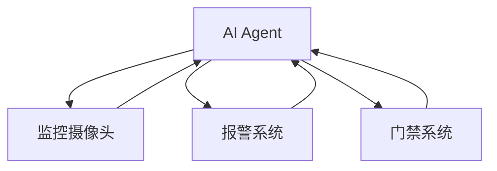
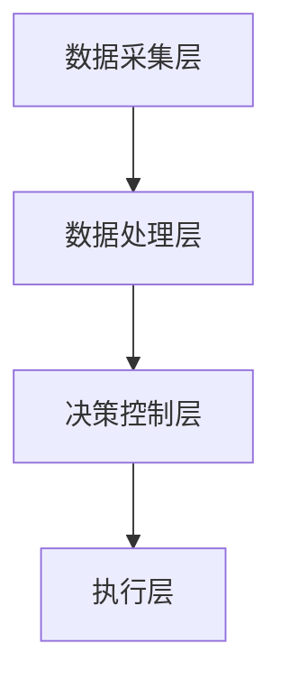
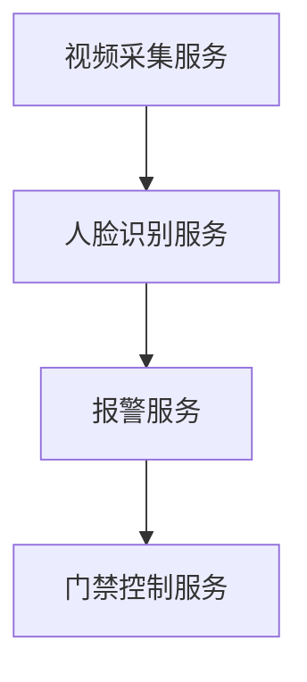
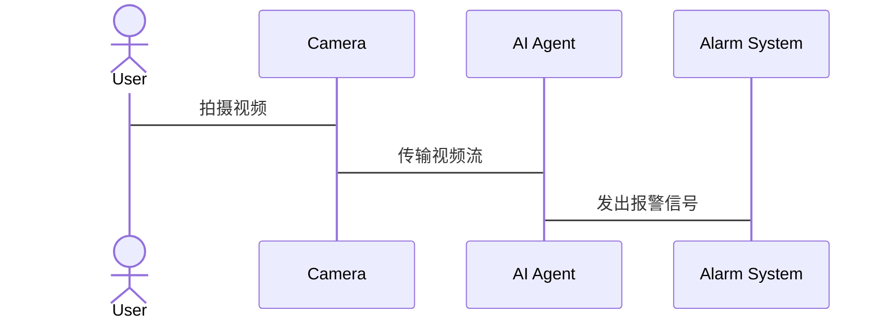

                 


# AI Agent在智能安防系统中的角色

> 关键词：AI Agent, 智能安防, 角色, 系统设计, 算法原理, 应用场景

> 摘要：本文详细探讨了AI Agent在智能安防系统中的核心角色，分析了其技术原理、系统架构和应用场景。通过实际案例和最佳实践，展示了如何利用AI Agent提升智能安防的效率和智能化水平。

---

## 第一部分: 背景介绍

### 第1章: AI Agent的定义与核心概念

#### 1.1 AI Agent的基本概念
AI Agent（人工智能代理）是指能够感知环境、自主决策并执行任务的智能实体。它通过传感器获取信息，利用算法进行分析，并通过执行器采取行动。AI Agent的核心目标是优化任务执行效率，提高系统的智能化水平。

#### 1.2 AI Agent在智能安防中的角色
智能安防系统依赖于AI Agent来实现智能化监控、异常检测和应急响应。AI Agent能够实时分析视频流、识别潜在威胁，并与其它系统协同工作，提升整体安全防护能力。

#### 1.3 相关技术背景
智能安防系统通常结合了物联网（IoT）、大数据分析和云计算等技术，而AI Agent作为核心组件，负责处理复杂的数据分析和决策过程。

---

### 第2章: AI Agent的核心概念与原理

#### 2.1 AI Agent的核心特征
- **自主性**：能够独立决策和行动。
- **反应性**：实时感知环境变化并调整行为。
- **学习能力**：通过数据反馈不断优化算法。

#### 2.2 AI Agent与传统算法的区别
| 特性          | AI Agent                | 传统算法              |
|---------------|-------------------------|-----------------------|
| 决策能力      | 高度自主                | 预定义规则            |
| 学习能力      | 强大                    | 无                    |
| 适应性        | 高                     | 低                    |

#### 2.3 实体关系图


---

## 第二部分: 算法原理与数学模型

### 第3章: 机器学习算法

#### 3.1 监督学习
监督学习通过标记数据训练模型，用于分类和回归任务。例如，使用CNN进行图像识别。

#### 3.2 无监督学习
无监督学习从未标记数据中发现模式，常用于聚类分析。

#### 3.3 强化学习
强化学习通过奖励机制优化决策策略，例如在游戏中的AI Agent训练。

### 第4章: 深度学习模型

#### 4.1 卷积神经网络（CNN）
CNN用于图像识别，通过卷积层提取特征。

#### 4.2 循环神经网络（RNN）
RNN用于处理序列数据，如时间序列分析。

#### 4.3 图神经网络（GNN）
GNN用于处理图结构数据，如网络拓扑分析。

### 第5章: 数学模型与公式

#### 5.1 概率论基础
$$P(A|B) = \frac{P(B|A)P(A)}{P(B)}$$

#### 5.2 优化算法
$$\theta = \theta - \eta \frac{\partial L}{\partial \theta}$$

---

## 第三部分: 系统分析与架构设计

### 第6章: 系统架构设计

#### 6.1 分层架构


#### 6.2 微服务架构


### 第7章: 接口设计与交互流程

#### 7.1 API接口设计
- RESTful API：`POST /api/face_detection`
- 返回格式：JSON

#### 7.2 交互流程图


---

## 第四部分: 项目实战

### 第8章: 环境安装与核心实现

#### 8.1 环境安装
- Python 3.8+
- 安装依赖：`pip install numpy tensorflow`

#### 8.2 核心代码实现
```python
import tensorflow as tf
from tensorflow.keras import layers

model = tf.keras.Sequential([
    layers.Conv2D(32, (3,3), activation='relu', input_shape=(224, 224, 3)),
    layers.MaxPooling2D((2,2)),
    layers.Flatten(),
    layers.Dense(128, activation='relu'),
    layers.Dense(1, activation='sigmoid')
])

model.compile(optimizer='adam', loss='binary_crossentropy', metrics=['accuracy'])
model.fit(x_train, y_train, epochs=10, batch_size=32)
```

---

## 第五部分: 最佳实践

### 第9章: 小结与注意事项

- **小结**：AI Agent在智能安防中的应用显著提升了系统的智能化水平和响应速度。
- **注意事项**：数据隐私、算法优化和系统稳定性需要重点关注。

### 第10章: 扩展阅读

- 推荐书籍：《机器学习实战》、《深度学习入门》
- 推荐博客：深入浅出AI Agent系列文章

---

通过以上结构，本文全面解析了AI Agent在智能安防中的角色和技术实现，为读者提供了从理论到实践的详细指导。

