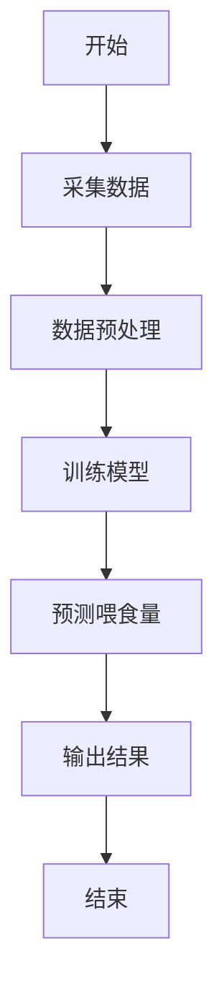
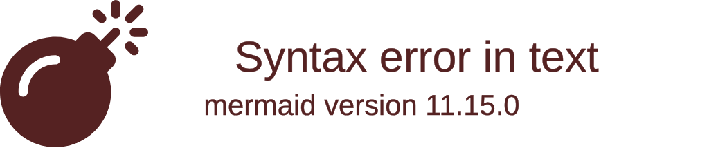

                 


# AI Agent在智能宠物喂食器中的定量控制

> 关键词：AI Agent，智能宠物喂食器，定量控制，算法实现，系统架构，项目实战

> 摘要：本文探讨了AI Agent在智能宠物喂食器中的定量控制应用，从问题背景、核心概念、算法原理到系统架构和项目实战，系统地分析了AI Agent如何实现精准、智能的宠物喂食控制。通过传感器数据采集、机器学习算法、系统架构设计等技术手段，本文详细展示了AI Agent在智能宠物喂食器中的实际应用，为相关领域的研究和实践提供了参考。

---

## 第一部分：问题背景与核心概念

### 第1章：问题背景

#### 1.1 问题背景
随着宠物数量的增加和人们生活水平的提高，宠物养护已成为一个重要的社会议题。传统的宠物喂食方式存在诸多问题，例如喂食量不精准、喂食时间不规律、无法远程监控等。这些问题可能导致宠物健康问题，如肥胖、营养不良等。因此，智能宠物喂食器的需求日益增长。

#### 1.2 问题描述
智能宠物喂食器的核心需求是实现精准的定量喂食。具体包括：
- 根据宠物的体重、活动量等因素调整喂食量。
- 实现定时喂食或按需喂食。
- 提供远程监控和调整功能。

#### 1.3 解决方案
AI Agent（人工智能代理）是一种能够感知环境、自主决策并执行任务的智能系统。将其应用于智能宠物喂食器中，可以通过传感器数据采集、机器学习算法和智能控制实现精准的定量喂食。

#### 1.4 边界与外延
- 系统边界：仅关注喂食器的定量控制功能，不涉及宠物健康监测的其他功能。
- 系统外延：未来可以扩展至宠物健康管理、远程医疗等更广泛的应用场景。

### 第2章：核心概念

#### 2.1 AI Agent的基本概念
AI Agent是一种能够感知环境、自主决策并执行任务的智能系统。它具备以下特点：
- **自主性**：无需人工干预，能够自主完成任务。
- **反应性**：能够实时感知环境并做出反应。
- **学习能力**：能够通过数据优化决策策略。

#### 2.2 智能宠物喂食器的功能与特点
智能宠物喂食器结合了物联网和人工智能技术，具备以下功能：
- **定时喂食**：根据设定的时间自动投放食物。
- **定量控制**：根据宠物的健康状况调整喂食量。
- **远程监控**：通过手机APP远程查看喂食状态并进行调整。

#### 2.3 定量控制的核心原理
定量控制的核心在于根据宠物的健康数据和行为数据，调整喂食量。具体包括：
- **健康数据**：体重、活动量、饮食习惯等。
- **行为数据**：宠物进食的时间、频率、量等。

---

## 第二部分：AI Agent的基本原理与技术基础

### 第3章：AI Agent的核心原理

#### 3.1 AI Agent的定义与分类
AI Agent可以根据任务类型和智能水平分为多种类别：
- **基于规则的AI Agent**：通过预设的规则进行决策，适用于简单任务。
- **基于机器学习的AI Agent**：通过学习数据进行决策，适用于复杂任务。
- **混合型AI Agent**：结合规则和机器学习的混合策略。

#### 3.2 AI Agent的核心技术
- **传感器技术**：用于采集宠物的行为数据和环境数据。
- **机器学习算法**：用于数据分析和决策优化。
- **通信技术**：实现远程控制和数据传输。

### 第4章：AI Agent在智能宠物喂食器中的应用

#### 4.1 应用场景
智能宠物喂食器的应用场景包括：
- **家庭宠物喂养**：为家养宠物提供精准的喂食服务。
- **宠物店管理**：用于宠物店中批量喂养宠物。
- **远程喂养**：适用于主人出差或无法在场的情况。

#### 4.2 系统架构
系统架构分为以下几个层次：
- **数据采集层**：负责采集宠物的行为数据和环境数据。
- **业务逻辑层**：负责数据分析和决策逻辑。
- **用户界面层**：提供人机交互界面，供用户远程控制。

---

## 第三部分：AI Agent的算法原理与实现

### 第5章：算法原理

#### 5.1 传感器数据采集与处理
传感器数据包括：
- **宠物体重**：通过压力传感器测量。
- **活动量**：通过运动传感器测量。
- **喂食时间**：通过时间戳记录。

#### 5.2 数据分析与决策算法
基于机器学习的决策算法：
- **输入数据**：宠物的健康数据和行为数据。
- **输出决策**：喂食量和喂食时间。

#### 5.3 优化策略
通过机器学习算法不断优化喂食策略，例如：
- **随机森林**：用于分类和回归任务。
- **支持向量机（SVM）**：用于分类任务。

### 第6章：算法实现

#### 6.1 Python代码实现
```python
# 示例代码：基于机器学习的喂食量决策
import numpy as np
from sklearn.ensemble import RandomForestRegressor

# 数据预处理
X = np.array([[weight, activity_level], ...])
y = np.array([target_feeding_amount, ...])

# 模型训练
model = RandomForestRegressor(n_estimators=100)
model.fit(X, y)

# 预测喂食量
new_weight = 5.0  # 新宠物体重
new_activity_level = 0.8  # 新活动量
predicted_amount = model.predict([[new_weight, new_activity_level]])[0]
print(f"预测喂食量为：{predicted_amount}克")
```

#### 6.2 算法流程图


---

## 第四部分：系统分析与架构设计

### 第7章：系统设计

#### 7.1 问题场景介绍
智能宠物喂食器的系统设计需要解决以下问题：
- 如何采集宠物的行为数据？
- 如何实现精准的定量喂食？
- 如何与用户进行交互？

#### 7.2 系统功能设计
系统功能模块包括：
- **喂食计划模块**：制定喂食计划。
- **传感器数据模块**：采集和处理数据。
- **远程控制模块**：通过手机APP进行远程控制。

#### 7.3 系统架构设计


---

## 第五部分：项目实战

### 第8章：环境安装与代码实现

#### 8.1 环境安装
- 安装Python和相关库：
  ```bash
  pip install numpy scikit-learn matplotlib
  ```

#### 8.2 核心代码实现
```python
# 示例代码：传感器数据处理
import numpy as np
import pandas as pd

# 读取数据
data = pd.read_csv('pet_data.csv')

# 数据预处理
from sklearn.preprocessing import StandardScaler
scaler = StandardScaler()
scaled_data = scaler.fit_transform(data)

# 模型训练
from sklearn.ensemble import RandomForestRegressor
model = RandomForestRegressor(n_estimators=100)
model.fit(scaled_data[:, :2], data['feeding_amount'])

# 预测喂食量
new_pet_data = np.array([[5.0, 0.8]])  # 新宠物的体重和活动量
predicted_amount = model.predict(scaler.transform(new_pet_data))
print(f"预测喂食量为：{predicted_amount[0]}克")
```

#### 8.3 项目小结
通过本项目的实践，我们了解了AI Agent在智能宠物喂食器中的应用，掌握了传感器数据处理、机器学习算法实现和系统架构设计的关键技术。

---

## 第六部分：最佳实践与总结

### 第9章：小结与注意事项

- **小结**：本文详细介绍了AI Agent在智能宠物喂食器中的应用，从理论到实践，系统地讲解了实现过程。
- **注意事项**：
  - 数据采集的准确性直接影响喂食的精准度。
  - 系统设计时需要考虑数据隐私和安全问题。
  - 系统的实时性和稳定性是实际应用中的关键。

### 第10章：拓展阅读

- **推荐书籍**：
  - 《机器学习实战》
  - 《人工智能：一种现代方法》
- **推荐资源**：
  - TensorFlow官方文档
  - Scikit-learn官方文档

---

通过本文的详细讲解，读者可以系统地了解AI Agent在智能宠物喂食器中的定量控制技术，掌握从理论到实践的完整实现过程。

