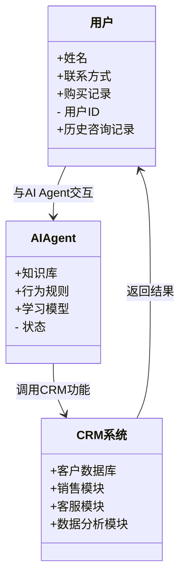
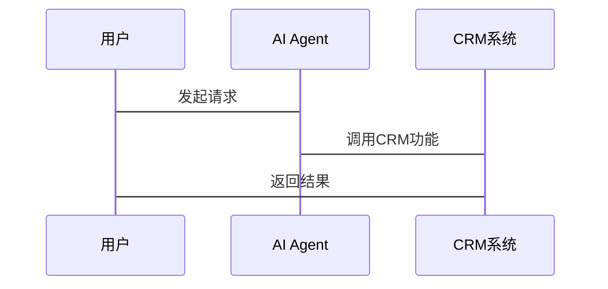

                 


# AI Agent在智能客户关系管理中的作用

---

## 关键词
AI Agent, 智能CRM, 人工智能, 客户关系管理, 机器学习, 自然语言处理, 系统架构

---

## 摘要
在现代商业环境中，客户关系管理（CRM）已成为企业成功的关键因素之一。随着人工智能（AI）技术的快速发展，AI Agent（智能代理）在CRM中的应用日益广泛。本文深入探讨了AI Agent在智能CRM中的核心作用，从基本概念、算法原理到系统设计和项目实战，全面解析了AI Agent如何提升CRM的效率和客户体验。通过详细的技术分析和实际案例，本文为读者提供了从理论到实践的完整指南。

---

# 第一部分: AI Agent与智能客户关系管理的背景与概念

## 第1章: AI Agent与智能客户关系管理概述

### 1.1 AI Agent的基本概念
#### 1.1.1 AI Agent的定义与特点
AI Agent是一种能够感知环境并采取行动以实现目标的智能实体。其核心特点包括自主性、反应性、目标导向和社会性。AI Agent能够通过传感器或数据接口获取信息，并通过算法做出决策，从而执行特定任务。

#### 1.1.2 AI Agent的核心功能与类型
AI Agent的功能包括信息处理、决策制定和行动执行。根据应用场景的不同，AI Agent可以分为多种类型，如基于规则的代理、基于模型的代理、学习型代理和人机协作代理。

#### 1.1.3 AI Agent与传统CRM的区别
传统CRM系统依赖人工操作，主要记录和管理客户信息。而AI Agent能够主动分析数据、预测客户需求并提供个性化服务，显著提升了CRM的智能化水平。

---

### 1.2 智能客户关系管理的定义与特点
#### 1.2.1 CRM的基本概念
CRM是一种以客户为中心的企业管理方法，旨在通过收集、分析和利用客户数据来提高客户满意度和忠诚度。

#### 1.2.2 智能CRM的核心特征
智能CRM结合了AI技术，能够实时分析客户行为、预测需求并提供个性化服务。其核心特征包括智能化、个性化和自动化。

#### 1.2.3 智能CRM与传统CRM的对比
智能CRM通过AI Agent实现了从被动管理到主动服务的转变，能够更高效地处理复杂业务场景。

---

### 1.3 AI Agent在智能CRM中的作用
#### 1.3.1 AI Agent在CRM中的应用场景
AI Agent在智能CRM中的应用场景包括客户画像构建、精准营销、客户行为预测和客户满意度提升。

#### 1.3.2 AI Agent如何提升CRM效率
AI Agent通过自动化处理和智能决策，显著提高了CRM系统的响应速度和处理效率。例如，在客户投诉处理中，AI Agent可以快速识别问题并提供解决方案，减少人工干预。

#### 1.3.3 AI Agent在CRM中的核心价值
AI Agent的核心价值在于通过智能化手段优化客户体验，提升企业竞争力。它能够帮助企业更好地理解客户需求，提供个性化服务，并提高客户忠诚度。

---

## 第2章: AI Agent的核心概念与联系

### 2.1 AI Agent的核心概念
#### 2.1.1 知识表示与推理
知识表示是AI Agent理解世界的基础，常见的表示方法包括语义网络和逻辑推理。推理是通过已知事实推导新结论的过程，支持AI Agent做出合理决策。

#### 2.1.2 行为决策与规划
行为决策是AI Agent根据当前状态和目标选择最优行动的过程。规划是制定实现目标的具体步骤，确保行动的有序性和高效性。

#### 2.1.3 交互与通信
AI Agent需要与用户、系统和其他代理进行有效交互，通过自然语言处理和多轮对话提升用户体验。

---

### 2.2 AI Agent的属性特征对比
#### 2.2.1 不同类型AI Agent的特征对比
以下是不同类型AI Agent的特征对比：

| 类型       | 自主性 | 反应性 | 学习能力 | 交互能力 |
|------------|--------|--------|----------|----------|
| 基于规则   | 低     | 高     | 无       | 低       |
| 基于模型   | 中     | 高     | 无       | 高       |
| 学习型     | 高     | 高     | 有       | 高       |
| 人机协作   | 中     | 高     | 有       | 高       |

#### 2.2.2 AI Agent与传统软件的区别
AI Agent的核心区别在于其具备自主决策和学习能力，能够适应复杂环境的变化。

#### 2.2.3 AI Agent与机器人流程自动化(RPA)的区别
RPA主要通过模拟人工操作完成任务，而AI Agent具备自主决策能力，能够根据环境变化调整行动。

---

### 2.3 AI Agent的ER实体关系图
以下是AI Agent在智能CRM中的ER实体关系图：

```mermaid
er
actor: 用户
agent: AI Agent
system: CRM系统
actor --> agent: 与AI Agent交互
agent --> system: 调用CRM功能
system --> actor: 返回结果
```

---

## 第3章: AI Agent的核心算法原理

### 3.1 监督学习算法
#### 3.1.1 线性回归
线性回归是一种用于预测连续型目标变量的算法，其数学模型如下：

$$y = \theta_0 + \theta_1x$$

其中，$y$是目标变量，$x$是输入变量，$\theta_0$和$\theta_1$是模型参数。

#### 3.1.2 支持向量机
支持向量机（SVM）是一种用于分类的算法，其数学模型如下：

$$\text{max} \frac{1}{2}\|w\|^2$$
$$\text{subject to} \ y_i(w \cdot x_i + b) \geq 1$$

其中，$w$是权重向量，$b$是偏置项，$y_i$是标签，$x_i$是输入数据。

---

### 3.2 强化学习算法
#### 3.2.1 Q-Learning
Q-Learning是一种基于值函数的强化学习算法，其更新规则如下：

$$Q(s, a) = r + \gamma \cdot \max Q(s', a')$$

其中，$Q(s, a)$是当前状态和动作的值，$r$是奖励，$\gamma$是折扣因子，$s'$是下一个状态。

---

## 第4章: AI Agent在智能CRM中的系统设计

### 4.1 系统功能设计
以下是智能CRM系统的功能设计图：



---

### 4.2 系统架构设计
以下是智能CRM系统的架构图：


---

### 4.3 系统接口设计
以下是系统接口设计的序列图：



---

## 第5章: AI Agent的项目实战

### 5.1 项目环境安装
要运行AI Agent，需要安装以下环境：

1. Python 3.8+
2. TensorFlow 2.0+
3. Scikit-learn 0.20+
4. Mermaid CLI

---

### 5.2 系统核心实现源代码
以下是AI Agent的核心实现代码：

```python
class AI_Agent:
    def __init__(self):
        self.knowledge_base = {}  # 知识库
        self.behavior_rules = {}  # 行为规则
        self.learning_model = None  # 学习模型

    def perceive(self, input_data):
        # 感知环境，返回当前状态
        return self.current_state

    def decide(self, state):
        # 根据状态做出决策
        return action

    def learn(self, state, action, reward):
        # 学习算法，更新模型
        pass
```

---

### 5.3 实际案例分析
以下是AI Agent在智能CRM中的实际案例：

1. **客户画像构建**：通过分析客户的购买记录和行为数据，AI Agent能够构建精准的客户画像，帮助企业更好地理解客户需求。
2. **精准营销**：AI Agent可以根据客户的历史行为和偏好，推荐个性化的产品和服务，提高营销效果。
3. **客户行为预测**：通过分析客户的历史数据，AI Agent可以预测客户的未来行为，帮助企业提前制定应对策略。

---

## 第6章: 总结与展望

### 6.1 本章小结
AI Agent在智能CRM中的应用显著提升了企业的客户管理能力。通过智能化的代理，企业能够更高效地处理复杂业务场景，提供更好的客户体验。

### 6.2 未来展望
未来，随着AI技术的不断发展，AI Agent在智能CRM中的应用将更加广泛。例如，通过结合区块链技术，可以实现更加安全的数据管理；通过增强现实技术，可以提供更加沉浸式的客户交互体验。

---

## 第7章: 最佳实践与注意事项

### 7.1 最佳实践
1. **数据隐私保护**：在使用AI Agent时，必须重视数据隐私保护，确保客户信息的安全。
2. **模型持续优化**：定期更新和优化AI Agent的学习模型，确保其性能不断提升。
3. **人机协作**：在实际应用中，应注重人机协作，充分发挥人类员工的创造力和灵活性。

### 7.2 注意事项
1. **避免过度依赖AI**：虽然AI Agent能够显著提升效率，但应避免过度依赖，保留人工干预的选项。
2. **选择合适的AI技术**：根据具体需求选择合适的AI技术，避免盲目追求最前沿的技术。
3. **用户体验优化**：在设计AI Agent时，应注重用户体验，确保其易于使用和交互。

---

## 第8章: 拓展阅读

### 8.1 相关书籍
1. 《机器学习实战》
2. 《自然语言处理入门》
3. 《CRM系统设计与实现》

### 8.2 在线资源
1. [TensorFlow官方文档](https://www.tensorflow.org)
2. [Mermaid图表工具](https://mermaid-js.github.io/mermaid-live-editor/)
3. [Scikit-learn官方文档](https://scikit-learn.org)

---

## 附录
### 附录A: AI Agent的数学公式汇总
1. 线性回归公式：
$$y = \theta_0 + \theta_1x$$
2. 支持向量机公式：
$$\text{max} \frac{1}{2}\|w\|^2$$
$$\text{subject to} \ y_i(w \cdot x_i + b) \geq 1$$
3. Q-Learning公式：
$$Q(s, a) = r + \gamma \cdot \max Q(s', a')$$

---

通过以上内容，我们可以全面了解AI Agent在智能客户关系管理中的作用，并通过实际案例和技术分析，掌握其核心算法和系统设计的要点。希望本文能够为读者在AI Agent和智能CRM领域的研究和实践提供有价值的参考。

