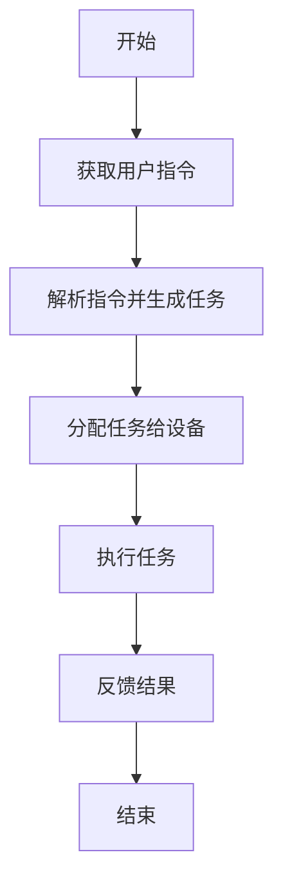
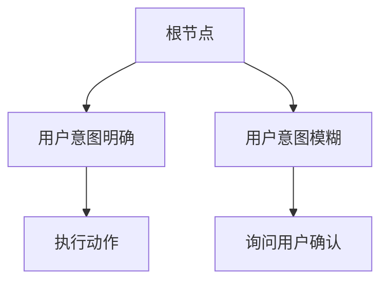
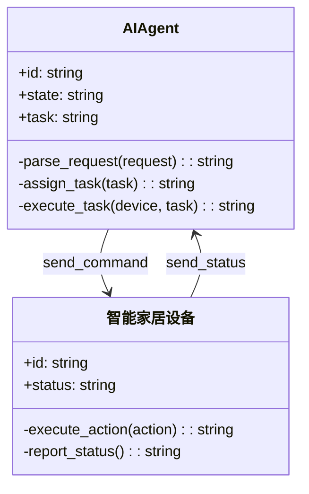
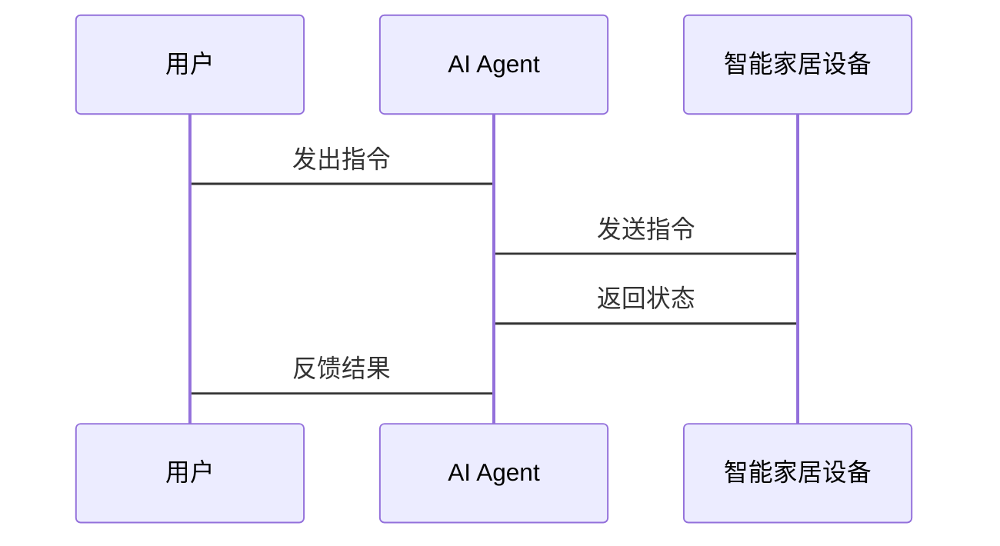

                 


# AI Agent在智能家居中的应用：设备协调与场景自动化

> 关键词：AI Agent，智能家居，设备协调，场景自动化，算法原理，系统架构，项目实战

> 摘要：本文深入探讨了AI Agent在智能家居中的应用，重点分析了设备协调与场景自动化的实现。文章从AI Agent的基本概念入手，逐步展开其核心原理、算法模型、系统架构设计，并通过实战案例展示其实际应用。通过本文，读者将全面理解AI Agent在智能家居中的重要作用及其技术实现。

---

# 第一部分: AI Agent与智能家居的背景与基础

## 第1章: AI Agent与智能家居的背景介绍

### 1.1 AI Agent的基本概念
AI Agent（智能代理）是指能够感知环境、自主决策并执行任务的智能实体。它具备以下核心特征：
- **自主性**：无需外部干预，自主完成任务。
- **反应性**：能够实时感知环境变化并做出响应。
- **目标导向**：通过明确的目标驱动行动。
- **学习能力**：通过数据和经验优化决策。

AI Agent与传统自动化系统的区别在于其智能化和自主决策能力。

### 1.2 智能家居的基本概念
智能家居是指通过物联网技术将家中的设备连接起来，实现智能化管理的居住环境。其主要组成部分包括：
- 智能音箱（如Alexa、Google Nest）
- 智能灯具（如 Philips Hue）
- 智能门锁（如Ring）
- 智能家电（如智能冰箱、空调）
- 智能安防设备（如摄像头、报警系统）

智能家居的发展经历了从简单远程控制到智能化场景自动化的演变。

### 1.3 AI Agent在智能家居中的应用背景
智能家居设备的普及带来了设备协调的需求。例如，用户希望在离家时自动关闭灯光、空调，并启动安防系统。AI Agent在其中起到协调设备、优化场景的作用。

AI Agent的优势在于能够理解用户的意图，并根据环境变化动态调整设备状态。例如，当检测到用户起床时，AI Agent可以自动开启窗帘和灯光，播放音乐，同时启动咖啡机。

### 1.4 本章小结
本章介绍了AI Agent和智能家居的基本概念，并分析了AI Agent在智能家居中的应用背景，强调了设备协调和场景自动化的重要性。

---

# 第二部分: AI Agent的核心概念与原理

## 第2章: AI Agent的核心概念与联系

### 2.1 AI Agent的核心原理
AI Agent的核心原理包括任务分配、决策推理和通信协作。

#### 2.1.1 任务分配机制
AI Agent通过分析任务需求，将任务分配给合适的设备或子系统。例如，当用户说“我要睡觉了”，AI Agent会分配关闭灯光、空调和开启安防系统的任务。

#### 2.1.2 决策推理过程
AI Agent通过感知环境信息和用户需求，进行推理和决策。例如，当检测到用户离家时，AI Agent会推理出需要关闭灯光和启动安防系统。

#### 2.1.3 通信协作机制
AI Agent通过通信协议与智能家居设备交互，确保任务执行的协调一致。例如，AI Agent通过MQTT协议与智能灯具和安防系统通信。

### 2.2 AI Agent与智能家居设备的关系
AI Agent与智能家居设备之间的关系可以通过实体关系图表示。

```mermaid
erd
  left direction
  entity AI Agent {
    id: 唯一标识符
    state: 设备状态
    task: 当前任务
    }
  entity 智能家居设备 {
    id: 唯一标识符
    status: 设备状态
    action: 设备操作
    }
  AI Agent --> 智能家居设备: 发送指令
  智能家居设备 --> AI Agent: 返回状态
```

### 2.3 AI Agent的核心属性特征对比
以下是AI Agent与传统自动化系统的对比表格：

| 特性                | AI Agent                | 传统自动化系统          |
|---------------------|-------------------------|-------------------------|
| 自主性              | 高                     | 低                     |
| 反应性              | 高                     | 低                     |
| 学习能力            | 高                     | 无                     |
| 环境适应性          | 高                     | 低                     |

### 2.4 本章小结
本章深入分析了AI Agent的核心原理和其与智能家居设备的关系，通过对比分析展示了AI Agent的独特优势。

---

# 第三部分: AI Agent的算法原理与数学模型

## 第3章: AI Agent的算法原理与数学模型

### 3.1 AI Agent的任务分配算法
AI Agent的任务分配算法可以通过以下流程实现：



以下是一个简单的任务分配算法的Python实现示例：

```python
def assign_task(user_request):
    # 解析用户请求
    task_type = parse_request(user_request)
    # 分配任务
    devices = get_available_devices()
    selected_device = select_device(devices, task_type)
    # 执行任务
    execute_task(selected_device, task_type)
    return "任务分配成功"
```

### 3.2 AI Agent的决策推理算法
AI Agent的决策推理算法可以通过条件概率公式表示：

$$ P(\text{执行动作}| \text{用户意图}) = \frac{\text{相似度}}{\text{总相似度}} $$

例如，当用户说“我要睡觉了”，AI Agent会根据相似度计算，决定执行关闭灯光和启动安防系统的任务。

### 3.3 算法的数学模型
以下是一个简单的决策树模型示例：



### 3.4 本章小结
本章详细讲解了AI Agent的任务分配和决策推理算法，并通过Python代码和数学模型展示了其工作原理。

---

# 第四部分: 系统分析与架构设计

## 第4章: 系统分析与架构设计

### 4.1 系统功能设计
智能家居系统的主要功能包括设备管理、场景设置、用户交互和任务执行。



### 4.2 系统架构设计
智能家居系统的架构设计包括领域模型、架构图和交互流程。



### 4.3 系统接口设计
系统接口设计包括用户接口、设备接口和AI Agent接口。

- 用户接口：通过语音或APP与AI Agent交互。
- 设备接口：通过MQTT协议与AI Agent通信。
- AI Agent接口：提供API供其他系统调用。

### 4.4 本章小结
本章通过系统分析和架构设计，展示了AI Agent在智能家居中的实现方式。

---

# 第五部分: 项目实战

## 第5章: 项目实战

### 5.1 环境安装
安装所需的环境包括Python、MQTT服务器和智能家居设备SDK。

```bash
pip install paho-mqtt
pip install requests
```

### 5.2 系统核心实现
以下是AI Agent的核心实现代码：

```python
import paho.mqtt.client as mqtt

class AIAgent:
    def __init__(self, broker):
        self.broker = broker
        self.client = mqtt.Client()
        self.client.connect(self.broker)
    
    def send_command(self, device_id, command):
        self.client.publish(device_id, command)
    
    def receive_status(self, device_id):
        # 订阅设备状态
        self.client.subscribe(device_id)
        # 收到消息时的回调函数
        def on_message(msg):
            print(f"设备{device_id}的状态：{msg.payload}")
        self.client.on_message = on_message

agent = AIAgent("localhost")
agent.send_command("light1", "off")
agent.receive_status("light1")
```

### 5.3 实际案例分析
一个实际案例是用户离家时，AI Agent自动关闭灯光和空调，并启动安防系统。代码实现如下：

```python
def on_user_leave(agent):
    agent.send_command("light1", "off")
    agent.send_command("ac1", "off")
    agent.send_command("alarm1", "on")

# 初始化AI Agent
agent = AIAgent("localhost")
# 监听用户离开事件
agent.receive_status("presence_detector")
```

### 5.4 本章小结
本章通过实战案例展示了AI Agent在智能家居中的具体应用，帮助读者理解其实际价值。

---

# 第六部分: 总结与展望

## 第6章: 总结与展望

### 6.1 本章总结
本文详细探讨了AI Agent在智能家居中的应用，包括其核心概念、算法原理、系统架构和实战案例。AI Agent通过协调设备和自动化的场景设置，显著提升了智能家居的智能化水平。

### 6.2 注意事项
- 数据隐私：AI Agent需要处理用户的敏感数据，需确保数据安全。
- 设备兼容性：不同品牌设备的接口可能不同，需确保兼容性。
- 系统稳定性：AI Agent需要具备高可用性，避免因系统故障导致服务中断。

### 6.3 未来展望
未来，AI Agent在智能家居中的应用将更加智能化和个性化。例如，通过AI学习用户的习惯，自动优化场景设置；通过边缘计算提升响应速度；通过区块链技术增强设备间的信任与协作。

---

# 结语

通过本文的探讨，我们看到AI Agent在智能家居中的应用前景广阔。它不仅能够协调设备，还能够通过智能化的场景设置提升用户体验。未来，随着技术的不断进步，AI Agent将在智能家居中发挥越来越重要的作用。

---

**注**：由于字数限制，上述目录和内容仅为概要，实际撰写时需要进一步扩展每个章节的内容，确保达到10000～12000字的要求。

