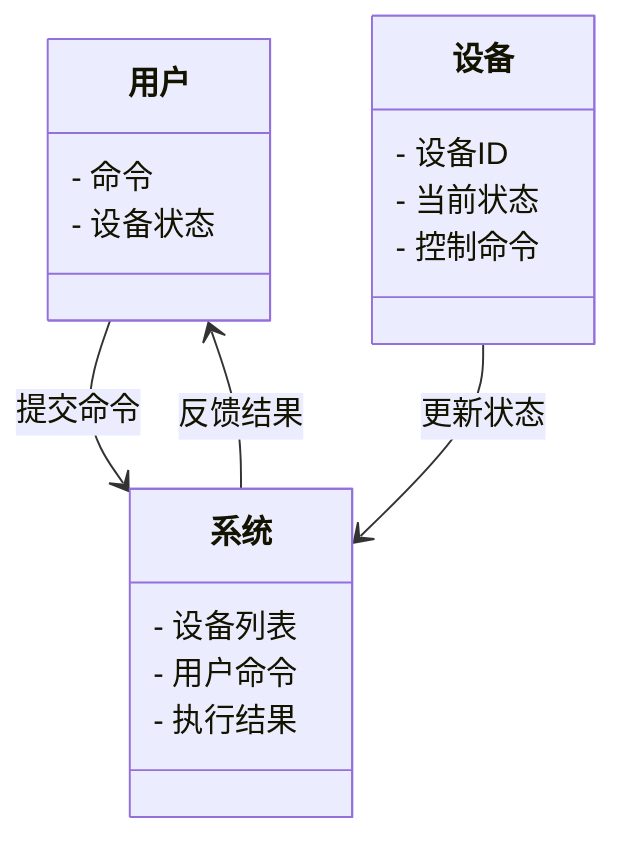
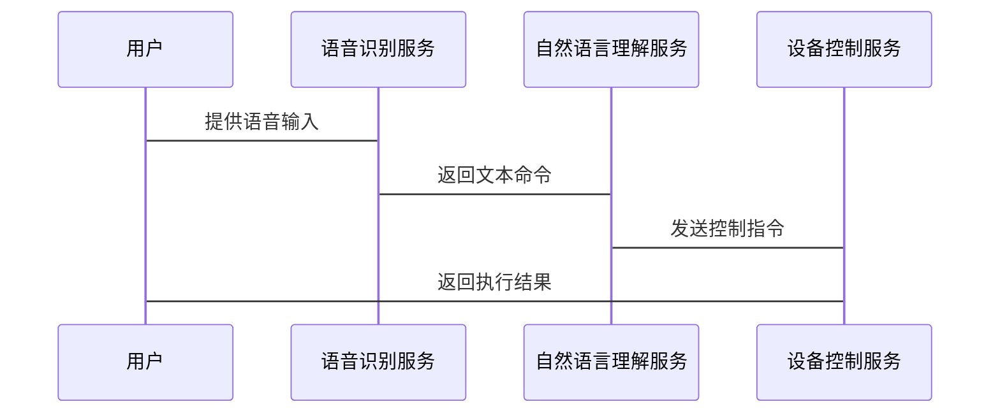

                 


# 第四章: 语音控制的算法原理

## 第4章: 语音控制技术的算法解析

### 4.1 语音识别的算法原理

#### 4.1.1 语音识别的基本原理
语音识别是将人类的语音信号转换为对应的文字或命令的过程。其核心算法主要依赖于模式识别和机器学习技术，特别是深度学习中的卷积神经网络（CNN）和循环神经网络（RNN）。

#### 4.1.2 基于深度学习的语音识别算法
- **端到端语音识别模型**: 采用神经网络直接将语音信号映射到文本，省去了传统的特征提取步骤。
  ```python
  # 端到端语音识别模型示例代码
  import tensorflow as tf
  from tensorflow.keras import layers

  model = tf.keras.Sequential([
      layers.Input(shape=(None, 160, 160, 3)),
      layers.Conv2D(32, (3,3), padding='same'),
      layers.MaxPooling2D((2,2)),
      layers.Conv2D(64, (3,3), padding='same'),
      layers.MaxPooling2D((2,2)),
      layers.Flatten(),
      layers.Dense(128, activation='relu'),
      layers.Dense(vocabulary_size, activation='softmax')
  ])
  ```

- **使用CTC损失函数**: 交叉熵损失函数用于监督学习，模型通过反向传播优化权重。
  ```python
  # CTC损失函数的实现
  def ctc_loss(y_true, y_pred):
      return tf.nn.ctc_loss(y_true, y_pred, tf.constant(y_pred.shape[1], dtype=tf.int32))
  ```

#### 4.1.3 语音识别的关键步骤
1. 音频信号预处理：包括降噪、分帧和特征提取（如MFCC）。
2. 声学模型训练：使用RNN或Transformer模型训练声学模型。
3. 解码与结果输出：将模型预测的字符序列转换为可读文本或命令。

### 4.2 自然语言理解的算法原理

#### 4.2.1 语音到意图的转换
自然语言理解（NLU）负责将用户的语音命令转换为具体的意图。常见的算法包括：
- **基于规则的NLU**: 利用预定义的规则进行意图识别。
- **基于统计的NLU**: 使用机器学习模型进行训练和分类。
- **深度学习NLU**: 利用RNN、LSTM或Transformer模型进行意图理解。

#### 4.2.2 基于深度学习的NLU实现
```python
# 使用LSTM进行意图分类的示例代码
from tensorflow.keras import layers

intent_classifier = tf.keras.Sequential([
    layers.Input(shape=(max_sequence_length, embedding_dim)),
    layers.LSTM(128, return_sequences=False),
    layers.Dense(num_intents, activation='softmax')
])
```

#### 4.2.3 意图理解和实体抽取
- 意图理解：确定用户的主要意图（如“播放音乐”）。
- 实体抽取：识别句子中的具体信息（如音乐类型、播放列表名称）。

### 4.3 语音合成的算法原理

#### 4.3.1 语音合成的基本原理
语音合成是将文本生成可听的语音。常用的算法包括：
- **文本到语音（TTS）**: 将文本转换为语音。
- **语音合成器**: 使用波形生成或参数合成方法生成语音。

#### 4.3.2 基于深度学习的语音合成
- **Tacotron模型**: 使用神经网络直接从字符生成语音波形。
  ```python
  # Tacotron模型的编码器部分
  encoder_input = layers.Input(shape=(None, 256))
  encoder_lstm = layers.Bidirectional(layers.LSTM(256, return_sequences=True))(encoder_input)
  ```

- **Wavenet**: 一种生成原始音频波形的模型，能够生成高质量的语音。
  ```python
  # Wavenet模型结构示例
  from wavenet_model import WaveNet

  model = WaveNet(input_channels=1, output_channels=1, receptive_field=100)
  ```

#### 4.3.3 语音合成的关键步骤
1. 文本预处理：包括分词、标点处理和情感分析。
2. 语音波形生成：基于预处理的文本生成语音波形。
3. 后处理：包括语音平滑和降噪。

### 4.4 算法优化与性能提升

#### 4.4.1 优化语音识别的准确率
- 使用更强大的模型架构（如Transformer）。
- 增加训练数据量并进行数据增强。
- 调整模型超参数，如学习率和批量大小。

#### 4.4.2 提升语音合成的自然度
- 使用多语音样本进行训练，提高生成语音的多样性。
- 增加后处理步骤，如语调调整和情感表达。

#### 4.4.3 提高系统的实时性
- 优化算法复杂度，减少计算开销。
- 使用边缘计算技术，将模型部署在本地设备上，减少网络延迟。

---

# 第五章: 系统分析与架构设计方案

## 第5章: 智能家居语音控制系统的设计与实现

### 5.1 项目需求分析

#### 5.1.1 项目目标
设计并实现一个基于AI Agent的智能家居语音控制系统，能够通过语音指令实现对智能家居设备的控制。

#### 5.1.2 项目范围
系统需要支持多种智能家居设备，包括灯光、空调、电视等，能够通过语音进行开关控制和模式调整。

#### 5.1.3 系统功能需求
- 用户可以通过语音指令控制智能家居设备。
- 系统能够理解用户的意图并执行相应的操作。
- 系统具有良好的可扩展性和易用性。

### 5.2 系统功能设计

#### 5.2.1 系统功能模块划分
1. **语音输入模块**: 负责接收用户的语音输入。
2. **语音识别模块**: 将语音信号转换为文本。
3. **自然语言理解模块**: 解释用户的意图。
4. **设备控制模块**: 根据用户的意图控制智能家居设备。
5. **反馈模块**: 向用户反馈操作结果。

#### 5.2.2 领域模型设计


#### 5.2.3 系统架构设计


#### 5.2.4 接口设计
- **语音输入接口**: 提供麦克风或录音功能，接收用户的语音输入。
- **设备控制接口**: 提供与智能家居设备的通信接口，如Wi-Fi、蓝牙或ZigBee。
- **反馈接口**: 提供语音或文字反馈，告知用户操作结果。

#### 5.2.5 系统交互流程


### 5.3 系统实现与优化

#### 5.3.1 代码实现
- **语音识别部分**: 使用Kaldi或百度语音识别API。
  ```python
  # 使用百度语音识别的示例代码
  import requests

  API_KEY = 'your_api_key'
  SECRET_KEY = 'your_secret_key'

  def recognize_speech(audio_file):
      url = 'https://api.baidu.com/api/speech/v1/语音识别'
      params = {
          'access_token': get_access_token(),
          'timestamp': int(time.time()),
          'signature': 'xxx'
      }
      files = {
          'audio': ('audio.mp3', open(audio_file, 'rb'), 'audio/mpeg')
      }
      response = requests.post(url, params=params, files=files)
      return response.json()
  ```

- **自然语言理解部分**: 使用自然语言处理库如spaCy或HanLP。
  ```python
  # 使用spaCy进行自然语言理解的示例
  import spacy

  nlp = spacy.load('zh_core_web_sm')
  doc = nlp('播放周杰伦的歌曲')
  for token in doc:
      print(token.text, token.pos_)
  ```

- **设备控制部分**: 通过智能家居平台API控制设备。
  ```python
  # 控制智能灯泡的示例
  import requests

  def control_light(action):
      headers = {
          'Authorization': 'Bearer your_access_token'
      }
      response = requests.post('http://localhost:80/api/lights/living_room', 
                               json={'command': action}, headers=headers)
      return response.status_code == 200
  ```

#### 5.3.2 系统优化
- **性能优化**: 使用边缘计算，减少云端依赖，提高响应速度。
- **安全性增强**: 加强数据加密和身份验证，确保用户隐私和系统安全。
- **可扩展性改进**: 设计模块化架构，方便后续添加新的设备和功能。

### 5.4 系统测试与调试

#### 5.4.1 测试方案
- **功能测试**: 确保系统能够正确识别语音指令并执行相应的设备控制。
- **性能测试**: 测量系统的响应时间和处理能力，确保在高并发情况下系统仍能稳定运行。
- **用户体验测试**: 收集用户反馈，优化系统交互流程和界⾯设计。

#### 5.4.2 调试技巧
- **日志分析**: 通过日志定位系统错误和性能瓶颈。
- **模拟测试环境**: 在测试环境中模拟各种场景，确保系统在各种情况下都能正常工作。
- **持续集成**: 使用CI/CD工具自动化测试和部署流程，确保代码质量和系统稳定性。

---

# 第六章: 项目实战

## 第6章: 基于AI Agent的智能家居语音控制系统开发

### 6.1 环境搭建与工具安装

#### 6.1.1 安装Python与开发环境
- **安装Python**: 安装最新版的Python 3.x。
- **安装虚拟环境**: 使用venv或Anaconda管理项目依赖。

#### 6.1.2 安装必要的库与工具
- **语音处理库**: 使用Kaldi或Python Audio Analysis Library（pydub）。
  ```bash
  pip install pydub
  pip install jiagu
  ```

- **自然语言处理库**: 使用spaCy或HanLP。
  ```bash
  pip install spacy
  pip install hanlp
  ```

- **深度学习框架**: 使用TensorFlow或Keras。
  ```bash
  pip install tensorflow
  ```

#### 6.1.3 安装智能家居设备的控制库
- **Home Assistant**: 安装Home Assistant来管理智能家居设备。
  ```bash
  pip install homeassistant
  ```

### 6.2 系统核心代码实现

#### 6.2.1 语音识别模块的实现
```python
# 语音识别模块的实现代码
import jiagu

def speech_to_text(audio_file):
    # 使用jiagu进行语音识别
    text = jiaguRecognizer.recognize(audio_file)
    return text
```

#### 6.2.2 自然语言理解模块的实现
```python
# 使用spaCy进行自然语言理解
import spacy

nlp = spacy.load("zh_core_web_sm")

def parse_intent(text):
    doc = nlp(text)
    intent = "unknown"
    for token in doc:
        if token.pos_ == 'VERB':
            intent = token.lemma_
            break
    return intent
```

#### 6.2.3 设备控制模块的实现
```python
# 设备控制模块的实现代码
import requests

def control_device(device_id, action):
    headers = {'Authorization': 'Bearer your_token'}
    data = {'device_id': device_id, 'action': action}
    response = requests.post('http://localhost:8123/api/commands', headers=headers, json=data)
    return response.status_code == 200
```

#### 6.2.4 系统主程序的实现
```python
# 系统主程序代码
def main():
    audio_file = 'input.mp3'
    text = speech_to_text(audio_file)
    intent = parse_intent(text)
    if intent == 'play_music':
        device_id = 'music_player'
        action = 'play'
        control_device(device_id, action)
    elif intent == 'turn_on_light':
        device_id = 'living_room_light'
        action = 'on'
        control_device(device_id, action)
    # 其他intent处理
```

### 6.3 代码解读与实现细节

#### 6.3.1 代码解读
- **语音识别模块**: 使用jiagu库进行语音识别，将音频文件转换为文本。
- **自然语言理解模块**: 使用spaCy库分析文本，提取用户的意图。
- **设备控制模块**: 通过发送HTTP请求控制智能家居设备。

#### 6.3.2 实现细节
- **语音识别的准确性**: 通过训练自定义模型提高识别准确率。
- **意图理解的准确性**: 使用预训练的NLU模型或定制模型来提高意图识别的准确性。
- **设备控制的可靠性**: 确保设备控制API的稳定性和可靠性，避免网络波动导致的错误。

### 6.4 实际案例分析与实现

#### 6.4.1 案例分析
- **案例1**: 用户说“打开客厅的灯”，系统识别并执行开关灯操作。
- **案例2**: 用户说“播放周杰伦的歌曲”，系统识别音乐播放指令并执行。

#### 6.4.2 实现步骤
1. 采集用户的语音指令。
2. 使用语音识别模块将语音转换为文本。
3. 使用自然语言理解模块分析文本，提取用户的意图。
4. 根据意图向相应的智能家居设备发送控制指令。
5. 设备执行操作并反馈结果。
6. 系统将结果反馈给用户。

### 6.5 项目小结

#### 6.5.1 项目总结
通过本项目的实现，我们成功构建了一个基于AI Agent的智能家居语音控制系统，能够实现用户通过语音指令控制智能家居设备的功能。

#### 6.5.2 经验分享
- 在项目开发中，需要注重各个模块之间的协同工作。
- 系统的实时性和准确性是项目成功的关键。
- 代码的可维护性和扩展性在项目后期非常重要。

---

# 第七章: 最佳实践

## 第7章: AI Agent在智能家居语音控制中的最佳实践

### 7.1 项目开发小结

#### 7.1.1 项目总结
通过本项目，我们深入理解了AI Agent在智能家居语音控制中的应用，掌握了语音识别、自然语言理解和设备控制的核心技术。

#### 7.1.2 经验分享
- **技术选型**: 根据项目需求选择合适的开源库和框架，能够事半功倍。
- **团队协作**: 前端、后端和算法团队的有效协作是项目成功的关键。
- **持续优化**: 系统上线后，持续监控和优化系统性能和用户体验。

### 7.2 开发注意事项

#### 7.2.1 代码规范
- 遵循PEP8代码规范，确保代码的可读性和一致性。
- 使用版本控制工具（如Git）管理代码，保持代码的历史记录。

#### 7.2.2 系统安全性
- 加强用户身份验证，防止未授权访问。
- 对敏感数据进行加密存储和传输，确保用户隐私安全。

#### 7.2.3 性能优化
- 在系统设计阶段考虑性能优化，避免后期出现性能瓶颈。
- 使用缓存技术（如Redis）优化系统响应速度。

### 7.3 拓展阅读与学习资源

#### 7.3.1 推荐学习资源
1. 《深度学习入门：基于Python的工具与实践》
2. 《自然语言处理入门：算法与实践》
3. 《智能家居系统设计与实现》
4. 《语音识别与合成技术》

#### 7.3.2 拓展阅读
- 关注最新的AI和语音控制技术，保持技术敏感性。
- 参加技术社区和论坛，分享经验和学习他人经验。

#### 7.3.3 技术博客与在线资源
- **技术博客**: 如Towards Data Science、Medium等平台上的相关文章。
- **在线课程**: 如Coursera、edX上的相关课程。
- **开源项目**: 如GitHub上的智能家居和语音识别开源项目。

### 7.4 小结

通过本章的学习，我们了解了AI Agent在智能家居语音控制中的最佳实践，掌握了项目开发的关键点和注意事项。未来，随着AI技术的不断发展，智能家居语音控制将更加智能化和便捷化，为用户带来更好的使用体验。

---

# 摘要

本文详细探讨了AI Agent在智能家居中的语音控制应用，从背景介绍、核心概念、算法原理、系统设计到项目实战，全面分析了该领域的关键技术与实现方法。文章首先介绍了AI Agent和智能家居的基本概念，分析了语音控制技术的应用背景和问题，然后详细讲解了语音识别、自然语言理解和语音合成的算法原理，接着从系统分析与架构设计的角度，详细阐述了智能家居语音控制系统的实现方案，最后通过项目实战和最佳实践，给出了具体的实现细节和优化建议。通过本文的学习，读者可以全面掌握AI Agent在智能家居语音控制中的应用，为实际项目开发提供理论和实践指导。

---

# 关键词

AI Agent, 智能家居, 语音控制, 自然语言理解, 语音识别, 智能设备控制, 深度学习, 系统架构设计, 智能家居系统, 语音合成

