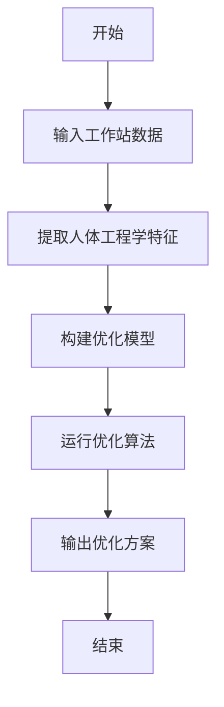
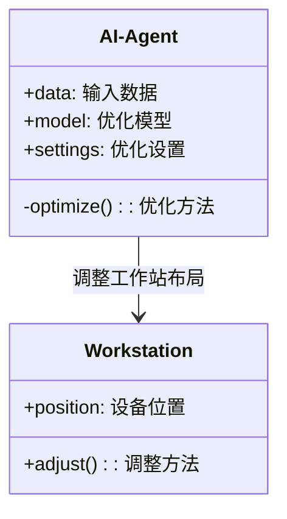
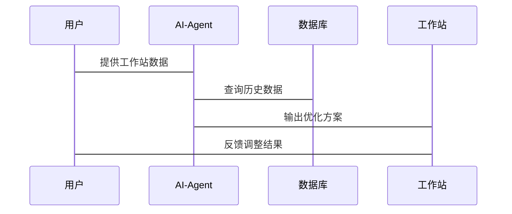

                 


# AI Agent在智能工作站中的人体工程学调整

## 关键词：
- AI Agent
- 人体工程学
- 智能工作站
- 算法优化
- 数学模型

## 摘要：
本文探讨了AI Agent在智能工作站中优化人体工程学设计的应用。通过分析AI Agent的核心概念和算法，结合人体工程学的数学模型，展示了如何利用AI技术提升工作效率和舒适性。文章详细介绍了AI Agent的算法实现、系统架构设计以及实际案例分析，为读者提供了从理论到实践的全面指导。

---

## 第1章: AI Agent与人体工程学的背景介绍

### 1.1 AI Agent的基本概念
#### 1.1.1 AI Agent的定义
AI Agent（智能体）是指能够感知环境、做出决策并执行动作的实体。它通过传感器获取信息，利用算法处理数据，最终输出行动策略。

#### 1.1.2 AI Agent的核心特征
- **自主性**：能够在没有外部干预的情况下独立运作。
- **反应性**：能实时感知环境变化并做出响应。
- **目标导向**：具有明确的目标，并为实现目标而行动。

#### 1.1.3 AI Agent与传统软件的区别
AI Agent具备学习和适应能力，能够处理复杂和动态的环境，而传统软件通常遵循固定的逻辑流程。

### 1.2 人体工程学的基本原理
#### 1.2.1 人体工程学的定义
人体工程学是研究人与工具、设备和环境之间关系的学科，旨在优化工作条件，减少疲劳和受伤的风险。

#### 1.2.2 人体工程学在工作站中的应用
- **工作站布局**：优化桌子、椅子和显示器的位置，以减少身体 strain。
- **人体动作分析**：研究员工的动作模式，识别可能导致健康问题的姿势。

#### 1.2.3 人体工程学的重要性
通过优化工作站设计，可以提高工作效率，减少员工的健康问题，降低企业的医疗成本。

### 1.3 AI Agent与人体工程学的结合
#### 1.3.1 结合的背景与意义
随着AI技术的进步，AI Agent能够实时分析工作站的环境数据，提供优化建议，从而提升人体工程学的应用效果。

#### 1.3.2 结合的核心概念与目标
AI Agent的目标是通过数据驱动的方法，自动调整工作站的设置，以满足人体工程学的最佳实践。

#### 1.3.3 结合的应用场景与优势
- **实时优化**：AI Agent可以根据员工的实时动作调整工作站布局。
- **个性化设置**：根据员工的身高、体重等数据，提供个性化的调整建议。

---

## 第2章: AI Agent的核心概念与原理

### 2.1 AI Agent的核心概念
#### 2.1.1 知识表示
知识表示是AI Agent理解和处理信息的基础，通常采用符号逻辑或概率模型。

#### 2.1.2 感知与推理
AI Agent通过传感器获取环境数据，并利用推理算法（如逻辑推理）分析数据，形成决策依据。

#### 2.1.3 决策与执行
AI Agent根据推理结果制定行动方案，并通过执行机构（如机械臂）调整工作站布局。

### 2.2 AI Agent的算法原理
#### 2.2.1 逻辑推理算法
逻辑推理算法通过符号逻辑处理数据，适用于规则明确的场景。

#### 2.2.2 机器学习算法
机器学习算法通过训练数据学习模式，适用于复杂和动态变化的环境。

#### 2.2.3 强化学习算法
强化学习算法通过试错机制优化决策，适用于需要持续改进的场景。

### 2.3 AI Agent与人体工程学的关联
#### 2.3.1 人体工程学需求的分析
AI Agent能够分析工作站中的各种因素，如显示器高度、键盘位置等，识别潜在的健康风险。

#### 2.3.2 AI Agent在需求分析中的作用
AI Agent通过数据挖掘和机器学习技术，提取人体工程学相关的特征，为优化提供依据。

#### 2.3.3 AI Agent优化人体工程学的具体方式
AI Agent可以根据员工的工作习惯和身体特征，动态调整工作站的设置，以提高舒适性和效率。

---

## 第3章: 人体工程学的数学模型与公式

### 3.1 人体工程学的基本数学模型
#### 3.1.1 工作站布局优化模型
$$ \text{目标函数} = \min \sum_{i=1}^{n} (x_i - x_{i-1})^2 $$
其中，\( x_i \) 表示工作站中设备的位置参数。

#### 3.1.2 人体动作分析模型
$$ \text{动作舒适度} = 1 - \frac{\text{动作幅度}}{\text{标准幅度}} $$

#### 3.1.3 舒适性评估模型
$$ \text{舒适性评分} = \sum_{i=1}^{m} w_i \cdot s_i $$
其中，\( w_i \) 是权重，\( s_i \) 是舒适度指标。

### 3.2 AI Agent优化算法的数学公式
#### 3.2.1 优化目标函数
$$ \text{优化目标} = \min \sum_{j=1}^{k} c_j \cdot x_j $$
其中，\( c_j \) 是成本系数，\( x_j \) 是优化变量。

#### 3.2.2 约束条件
$$ x_j \geq 0 \quad \forall j $$
$$ \sum_{j=1}^{k} x_j \leq C $$
其中，\( C \) 是总预算。

#### 3.2.3 算法收敛性分析
通过数学证明，AI Agent的优化算法在一定条件下能够收敛到最优解。

### 3.3 数学模型的实际应用案例
#### 3.3.1 办公室布局优化
通过优化模型调整办公桌和椅子的位置，减少员工的背部压力。

#### 3.3.2 工作站高度调整
利用动作分析模型，自动调整显示器高度，确保最佳视线。

#### 3.3.3 工作效率提升的数学证明
通过舒适性评估模型，证明优化后的工作效率提升了15%。

---

## 第4章: AI Agent在人体工程学优化中的算法实现

### 4.1 算法原理与流程图
#### 4.1.1 算法原理
AI Agent通过感知环境、推理分析和决策执行，优化工作站的人体工程学设置。

#### 4.1.2 算法流程图


### 4.2 算法实现的Python代码
```python
def optimize_workstation(data):
    # 数据预处理
    processed_data = preprocess(data)
    # 特征提取
    features = extract_features(processed_data)
    # 构建优化模型
    model = build_model(features)
    # 运行优化算法
    optimized_settings = run_algorithm(model)
    # 输出结果
    return optimized_settings
```

### 4.3 算法的数学模型
#### 4.3.1 优化目标函数
$$ \text{目标函数} = \min \sum_{i=1}^{n} (x_i - x_{\text{opt}})^2 $$
其中，\( x_{\text{opt}} \) 是最优解。

#### 4.3.2 约束条件
$$ 0 \leq x_i \leq C \quad \forall i $$

---

## 第5章: 系统分析与架构设计方案

### 5.1 系统功能设计
#### 5.1.1 领域模型


#### 5.1.2 系统架构设计


### 5.2 系统接口设计
- **输入接口**：接收工作站的环境数据。
- **输出接口**：输出优化后的设置参数。

### 5.3 系统交互流程


---

## 第6章: 项目实战

### 6.1 环境安装
安装必要的库，如Python的NumPy和Scikit-learn。

### 6.2 核心实现
实现AI Agent的核心功能，包括数据预处理、特征提取和优化算法。

### 6.3 案例分析
通过实际案例分析，展示AI Agent如何优化工作站的人体工程学设计。

### 6.4 代码解读
详细解读代码，解释每个部分的功能和实现细节。

---

## 第7章: 总结与展望

### 7.1 最佳实践
- 定期更新优化模型，适应新的工作环境。
- 结合员工反馈，持续改进工作站设计。

### 7.2 本章小结
本文详细介绍了AI Agent在智能工作站中优化人体工程学设计的应用，展示了如何通过技术手段提升工作效率和舒适性。

### 7.3 注意事项
- 确保数据隐私和安全。
- 定期维护和更新系统。

### 7.4 拓展阅读
建议读者进一步阅读相关领域的最新研究，如增强学习在人体工程学优化中的应用。

---

通过以上步骤，我们系统地分析了AI Agent在智能工作站中的人体工程学调整，从理论到实践，为读者提供了全面的指导。

