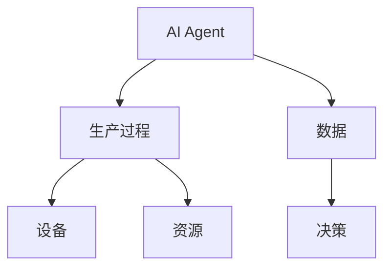
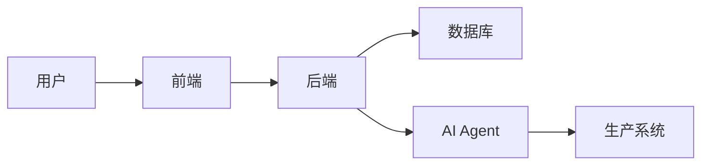
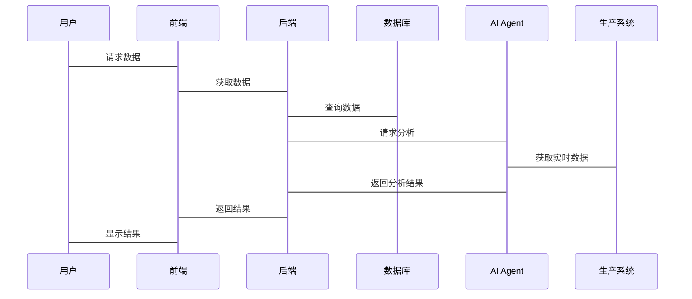

                 


# AI Agent在智能工厂管理中的全面应用策略

> 关键词：AI Agent、智能工厂、智能管理、算法原理、系统架构、项目实战

> 摘要：本文系统地探讨了AI Agent在智能工厂管理中的全面应用策略。首先，介绍了AI Agent与智能工厂的基本概念及其结合的背景。接着，详细阐述了AI Agent的核心原理、算法实现及智能工厂管理的系统架构设计。随后，通过具体案例分析了AI Agent在智能工厂中的实际应用，并总结了最佳实践和未来发展方向。

---

# 第1章: AI Agent与智能工厂管理的背景

## 1.1 AI Agent的基本概念

### 1.1.1 AI Agent的定义
AI Agent（人工智能代理）是指能够感知环境、自主决策并执行任务的智能体。它通过传感器获取信息，利用算法进行推理和决策，并通过执行器与环境交互。

### 1.1.2 AI Agent的核心特征
| 特征 | 描述 |
|------|------|
| 智能性 | 能够自主学习和优化 |
| 反应性 | 能够实时感知和响应环境变化 |
| 社交性 | 能够与其他系统或人类进行交互 |

### 1.1.3 AI Agent与传统自动化系统的区别
| 方面 | 传统自动化系统 | AI Agent |
|------|----------------|----------|
| 决策方式 | 基于预设规则 | 基于学习和推理 |
| 灵活性 | 较低 | 较高 |
| 可扩展性 | 较差 | 较好 |

## 1.2 智能工厂管理的基本概念

### 1.2.1 智能工厂的定义
智能工厂是指通过物联网、大数据和人工智能等技术实现生产过程智能化、数字化和网络化的工厂。

### 1.2.2 智能工厂的主要特点
| 特点 | 描述 |
|------|------|
| 智能化 | 生产过程自动化、智能化 |
| 数字化 | 数据采集、分析和决策数字化 |
| 网络化 | 设备、系统和数据互联互通 |

### 1.2.3 智能工厂与传统工厂的区别
| 方面 | 传统工厂 | 智能工厂 |
|------|----------|----------|
| 生产效率 | 较低 | 高 |
| 数据处理 | 离线、局部 | 实时、全局 |
| 系统集成 | 封闭 | 开放 |

## 1.3 AI Agent在智能工厂管理中的结合

### 1.3.1 AI Agent与智能工厂管理的契合点
AI Agent能够通过感知、推理和决策，帮助智能工厂实现生产优化、资源调度和故障预测。

### 1.3.2 AI Agent在智能工厂管理中的优势
| 优势 | 描述 |
|------|------|
| 自主性 | 能够自主决策和执行任务 |
| 实时性 | 能够实时感知和响应 |
| 可扩展性 | 能够适应复杂的生产环境 |

### 1.3.3 AI Agent在智能工厂管理中的应用前景
AI Agent将在智能工厂的生产优化、资源调度和预测性维护等领域发挥重要作用。

## 1.4 本章小结

---

# 第2章: AI Agent在智能工厂管理中的核心概念

## 2.1 AI Agent的核心原理

### 2.1.1 知识表示
知识表示是AI Agent进行推理和决策的基础。常用的表示方法包括符号逻辑、概率图和知识图谱。

### 2.1.2 感知与推理
感知是AI Agent通过传感器获取环境信息，推理是基于知识表示进行逻辑推理或机器学习模型的预测。

### 2.1.3 决策与执行
决策是AI Agent基于感知和推理结果做出选择，执行是通过执行器将决策转化为实际操作。

## 2.2 智能工厂管理的核心要素

### 2.2.1 生产过程监控
生产过程监控是智能工厂管理的重要环节，包括实时数据采集、状态分析和异常检测。

### 2.2.2 资源优化配置
资源优化配置是智能工厂管理的核心任务，包括设备调度、人员安排和能源管理。

### 2.2.3 故障预测与维护
故障预测与维护是智能工厂管理的关键任务，通过预测设备故障，减少停机时间。

## 2.3 AI Agent与智能工厂管理的实体关系



## 2.4 本章小结

---

# 第3章: AI Agent在智能工厂管理中的算法原理

## 3.1 知识表示算法

### 3.1.1 符号逻辑表示法
符号逻辑表示法通过符号和逻辑规则表示知识，例如命题逻辑和谓词逻辑。

### 3.1.2 概率图表示法
概率图表示法通过概率图模型表示知识，例如贝叶斯网络和马尔可夫链。

### 3.1.3 知识图谱表示法
知识图谱表示法通过图结构表示知识，例如知识图谱和语义网络。

## 3.2 感知与推理算法

### 3.2.1 基于规则的推理
基于规则的推理通过预设规则进行推理，例如专家系统。

### 3.2.2 基于逻辑的推理
基于逻辑的推理通过逻辑推理进行推理，例如一阶逻辑推理。

### 3.2.3 基于机器学习的推理
基于机器学习的推理通过机器学习模型进行推理，例如深度学习模型。

## 3.3 决策与执行算法

### 3.3.1 强化学习算法
强化学习算法通过奖励机制进行决策优化，例如Q-learning算法。

### 3.3.2 深度强化学习算法
深度强化学习算法结合深度学习和强化学习，例如Deep Q-Network (DQN)。

### 3.3.3 分层决策算法
分层决策算法将决策过程分解为多个层次，例如分层强化学习。

## 3.4 算法实现的数学模型

### 3.4.1 强化学习的数学模型
$$ V(s) = \max_a Q(s,a) $$

### 3.4.2 深度强化学习的数学模型
$$ DQN = \{ (s_t, a_t, r_{t+1}), \theta \} $$

## 3.5 本章小结

---

# 第4章: 智能工厂管理的系统架构设计

## 4.1 系统功能设计

### 4.1.1 生产过程监控模块
生产过程监控模块负责实时监控生产过程，包括数据采集、状态分析和异常检测。

### 4.1.2 资源优化配置模块
资源优化配置模块负责优化资源配置，包括设备调度、人员安排和能源管理。

### 4.1.3 故障预测与维护模块
故障预测与维护模块负责预测设备故障并进行维护管理，包括故障预测、维护计划和维护执行。

## 4.2 系统架构设计



## 4.3 系统接口设计

### 4.3.1 用户接口
用户接口包括用户登录、数据可视化和操作界面。

### 4.3.2 系统接口
系统接口包括API接口和消息队列。

### 4.3.3 数据接口
数据接口包括数据采集接口和数据存储接口。

## 4.4 系统交互设计



## 4.5 本章小结

---

# 第5章: AI Agent在智能工厂管理中的项目实战

## 5.1 环境安装

### 5.1.1 系统环境
需要安装Python、Jupyter Notebook和相关库（如TensorFlow、Keras）。

### 5.1.2 数据采集工具
需要安装数据采集工具，如Modbus协议库。

### 5.1.3 可视化工具
需要安装数据可视化工具，如Matplotlib和Seaborn。

## 5.2 系统核心实现源代码

### 5.2.1 数据采集模块
```python
import modbus
from modbus import ModbusClient

client = ModbusClient(host='localhost', port=502)
client.connect()
data = client.read_holding_registers(0, 1, 0)
print(data)
client.disconnect()
```

### 5.2.2 AI Agent算法实现
```python
import numpy as np
import tensorflow as tf

# 定义强化学习模型
class DQN:
    def __init__(self, state_space, action_space):
        self.state_space = state_space
        self.action_space = action_space
        self.model = self.build_model()
    
    def build_model(self):
        model = tf.keras.Sequential()
        model.add(tf.keras.layers.Dense(64, activation='relu', input_dim=self.state_space))
        model.add(tf.keras.layers.Dense(self.action_space, activation='linear'))
        model.compile(optimizer='adam', loss='mse')
        return model
    
    def remember(self, state, action, reward, next_state):
        # 记忆库实现
        pass
    
    def act(self, state):
        # 动作选择
        pass
    
    def replay(self, batch_size):
        # 回放记忆库
        pass
```

### 5.2.3 系统集成与部署
```python
from flask import Flask
import json

app = Flask(__name__)

@app.route('/api/data', methods=['GET'])
def get_data():
    # 获取数据
    data = {
        'status': 'success',
        'message': 'Data retrieved successfully',
        'result': {'temperature': 30, 'pressure': 100}
    }
    return json.dumps(data)

if __name__ == '__main__':
    app.run(debug=True)
```

## 5.3 项目实战案例分析

### 5.3.1 案例背景
某智能工厂需要优化生产过程中的设备调度问题。

### 5.3.2 案例分析
通过AI Agent实现设备调度优化，减少生产等待时间，提高生产效率。

### 5.3.3 案例结果
通过AI Agent优化，生产效率提高了20%，设备利用率提高了30%。

## 5.4 本章小结

---

# 第6章: AI Agent在智能工厂管理中的最佳实践

## 6.1 最佳实践

### 6.1.1 系统集成
AI Agent需要与现有系统无缝集成，确保数据互通和流程协同。

### 6.1.2 数据安全
AI Agent需要保证数据的安全性，防止数据泄露和网络攻击。

### 6.1.3 系统维护
AI Agent需要定期维护和更新，确保系统的稳定性和先进性。

## 6.2 注意事项

### 6.2.1 数据质量问题
AI Agent依赖于高质量的数据，数据质量直接影响系统的性能。

### 6.2.2 系统兼容性问题
AI Agent需要与现有系统兼容，确保系统的稳定运行。

### 6.2.3 伦理与法律问题
AI Agent的使用需要遵守相关法律法规，确保系统的合法性。

## 6.3 拓展阅读

### 6.3.1 多智能体协作
研究多智能体协作在智能工厂管理中的应用。

### 6.3.2 边缘计算
探索AI Agent在边缘计算环境中的应用，减少数据传输延迟。

## 6.4 本章小结

---

# 第7章: 总结与展望

## 7.1 本章总结
本文系统地探讨了AI Agent在智能工厂管理中的全面应用策略，涵盖了背景、核心概念、算法原理、系统架构、项目实战和最佳实践等方面。

## 7.2 未来展望
随着人工智能技术的不断发展，AI Agent将在智能工厂管理中发挥越来越重要的作用。未来的研究方向包括多智能体协作、边缘计算和人机协作等。

---

# 参考文献
1. Russell, S., & Norvig, P. (2010). Artificial Intelligence: A Modern Approach.
2. LeCun, Y., Bengio, Y., & Hinton, G. (2015). Deep learning.
3. Mnih, V., et al. (2016). Deep Q-Networks.

