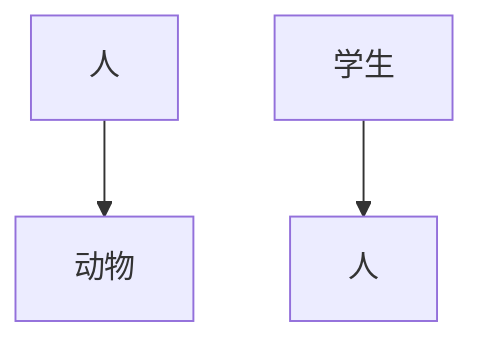
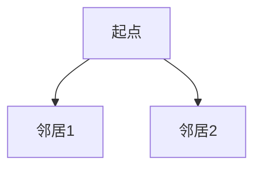
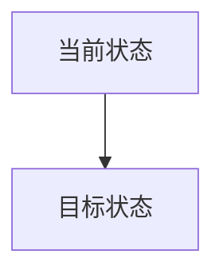
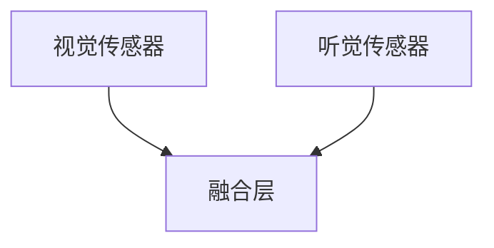
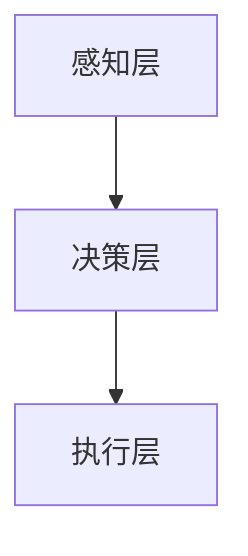
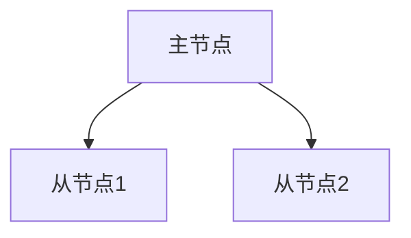
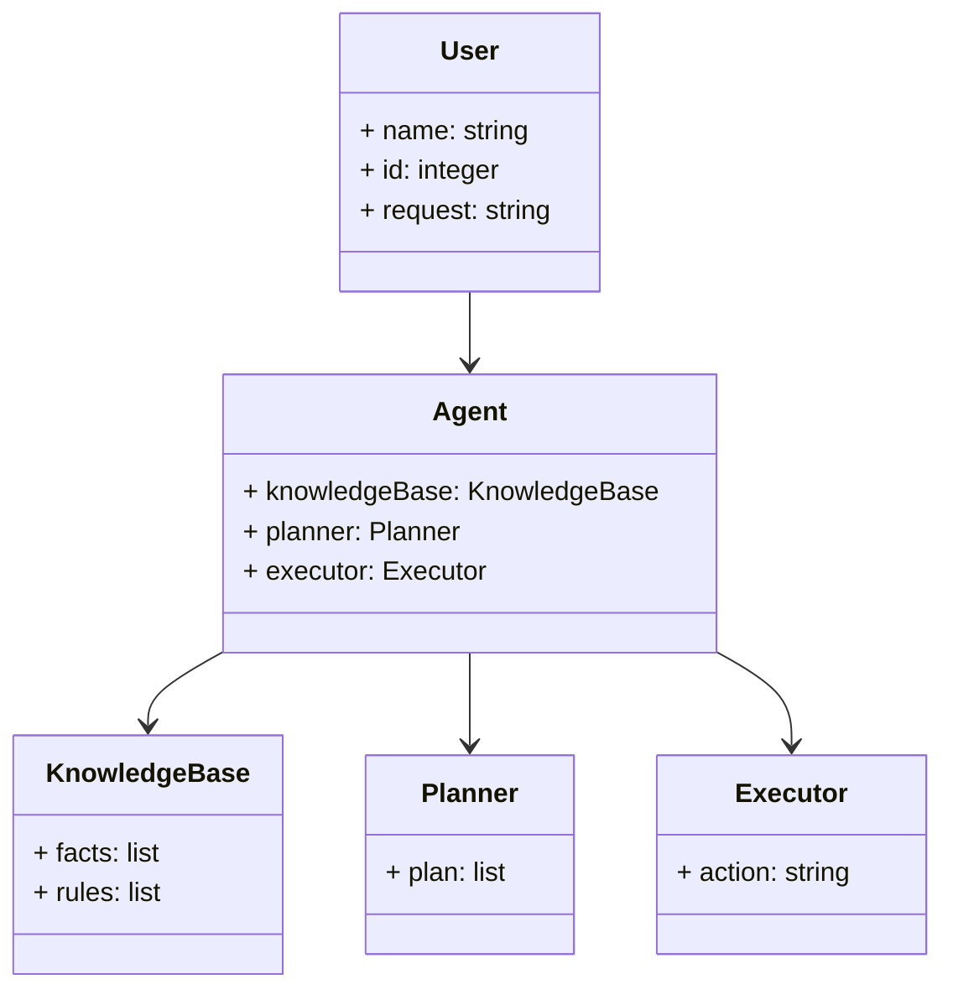
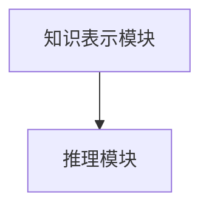
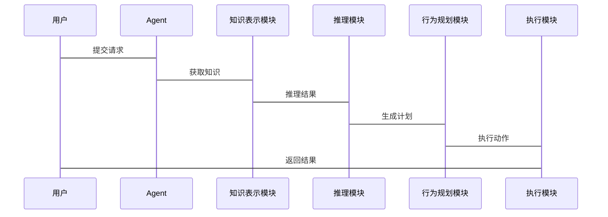

                 


```markdown
# AI Agent在智能工程设计中的应用

> 关键词：AI Agent，智能工程，知识表示，行为规划，环境感知，系统架构

> 摘要：本文深入探讨了AI Agent在智能工程设计中的应用，从基本概念到技术原理，再到系统架构和项目实战，全面解析了AI Agent在智能工程中的作用和实现方法。通过详细的技术分析和实际案例，展示了AI Agent如何助力智能工程的设计与优化。

---

## 第1章: AI Agent 的基本概念与背景

### 1.1 AI Agent 的定义与特点

AI Agent（人工智能代理）是指在智能系统中，能够感知环境、自主决策并执行任务的实体。它通过传感器获取信息，利用推理能力进行决策，并通过执行器与环境互动。AI Agent的核心特点包括：

- **自主性**：能够独立完成任务，无需外部干预。
- **反应性**：能实时感知环境并做出响应。
- **主动性**：主动采取行动以实现目标。
- **社会性**：能够与其他Agent或人类进行协作或竞争。

AI Agent与传统自动化系统的区别在于，前者具有更强的自主决策能力和学习能力，能够适应复杂多变的环境。

### 1.2 智能工程设计中的 AI Agent

智能工程设计是指通过智能化技术提升工程设计的效率和质量。AI Agent在其中扮演着关键角色，主要应用于以下几个方面：

- **知识管理**：通过知识表示和推理，优化设计过程中的知识共享与利用。
- **决策支持**：在设计决策中提供基于数据的建议和优化方案。
- **自动化设计**：通过自动化的设计流程，减少人工干预，提高设计效率。

### 1.3 AI Agent 的发展背景

随着人工智能技术的快速发展，AI Agent逐渐成为智能工程设计的核心技术之一。其发展背景主要包括：

- **技术进步**：机器学习、自然语言处理等技术的成熟，为AI Agent提供了强大的技术支持。
- **市场需求**： industries对智能化设计的需求不断增加，推动了AI Agent的应用。
- **研究热点**：学术界对AI Agent的研究不断深入，特别是在多智能体系统和人机协作领域。

---

## 第2章: AI Agent 的核心概念与技术原理

### 2.1 AI Agent 的核心概念

AI Agent的核心概念包括知识表示、行为规划和环境感知。这些概念相互关联，共同构成了AI Agent的能力基础。

#### 知识表示
知识表示是AI Agent理解世界的基础。常用的表示方法包括：
- **逻辑表示**：使用一阶逻辑描述知识，如`∀x 学生(x) → 学习(x)`。
- **知识图谱**：通过图结构表示实体及其关系，如图中的节点代表实体，边代表关系。

#### 行为规划
行为规划是AI Agent根据目标生成行动序列的过程。常见的规划方法包括：
- **启发式搜索**：如A*算法，通过启发函数优化搜索路径。
- **动态规划**：通过分阶段决策，优化整体行动方案。

#### 环境感知
环境感知使AI Agent能够从环境中获取信息。主要技术包括：
- **传感器数据处理**：如图像识别、语音识别等技术。
- **多模态数据融合**：将来自不同传感器的数据进行融合，提高感知准确性。

### 2.2 AI Agent 的技术原理

AI Agent的技术原理主要涉及知识表示、行为规划和环境感知的实现。

#### 知识表示的数学模型
知识表示可以通过逻辑推理来实现。例如，使用一阶逻辑表示知识：

$$
\forall x \text{（如果 } x \text{ 是学生，则 } x \text{ 学习）}
$$

通过推理引擎，AI Agent可以推导出新的知识。

#### 行为规划的算法流程
行为规划通常采用分层架构。例如，使用A*算法进行路径规划：

1. 确定目标位置。
2. 生成可能的路径。
3. 评估路径的代价。
4. 选择最优路径。

#### 环境感知的技术实现
环境感知依赖于多模态数据的融合。例如，使用卷积神经网络（CNN）进行图像识别：

$$
\text{输入图像} \rightarrow \text{CNN} \rightarrow \text{输出类别}
$$

---

## 第3章: AI Agent 的算法原理与实现

### 3.1 知识表示与推理算法

知识表示与推理是AI Agent的核心技术之一。

#### 逻辑推理的基本原理
逻辑推理通过谓词逻辑进行。例如：

$$
\text{前提：} \forall x \text{（如果 } x \text{ 是人，则 } x \text{ 需要睡觉）}
$$
$$
\text{结论：} \text{张三需要睡觉，因为他是人。}
$$

#### 知识图谱的构建与应用
知识图谱通过图结构表示知识。例如，构建一个简单的知识图谱：



#### 基于规则的推理方法
基于规则的推理方法通过预定义的规则进行推理。例如：

$$
\text{规则：如果 } x \text{ 是学生，则 } x \text{ 学习。}
$$

### 3.2 行为规划与决策算法

行为规划与决策是AI Agent实现目标的关键步骤。

#### 基于状态空间的搜索算法
基于状态空间的搜索算法包括广度优先搜索（BFS）和深度优先搜索（DFS）。例如，使用BFS进行路径规划：



#### 基于概率的决策方法
基于概率的决策方法通常使用马尔可夫决策过程（MDP）。例如：

$$
\text{状态转移概率：} P(s' | s, a)
$$

#### 增量式规划技术
增量式规划技术在动态环境中实时调整规划。例如，使用动态规划进行路径优化：



### 3.3 环境感知与交互算法

环境感知与交互是AI Agent与环境互动的基础。

#### 基于传感器的数据处理
基于传感器的数据处理技术包括图像处理和语音识别。例如，使用CNN进行图像识别：

$$
\text{输入图像} \rightarrow \text{CNN} \rightarrow \text{输出类别}
$$

#### 多模态数据融合技术
多模态数据融合技术结合多种传感器数据，提高感知准确性。例如，融合视觉和听觉信息：



#### 自然语言处理在交互中的应用
自然语言处理（NLP）技术使AI Agent能够理解和生成人类语言。例如，使用Transformer模型进行文本生成：

$$
\text{输入：} "请解释AI Agent的概念。"
$$
$$
\text{输出：} "AI Agent是指能够感知环境、自主决策并执行任务的智能实体。"
$$

---

## 第4章: AI Agent 的系统架构与设计

### 4.1 系统架构设计

AI Agent的系统架构设计需要考虑模块化和高可用性。

#### 分层架构的设计原则
分层架构将系统划分为多个层次，如感知层、决策层和执行层。例如：



#### 模块化设计的实现方法
模块化设计通过明确的功能划分，提高系统的可维护性。例如，设计独立的知识表示模块和行为规划模块。

#### 高可用性架构的优化策略
高可用性架构通过冗余设计和负载均衡，确保系统的稳定性。例如，使用分布式架构：



### 4.2 系统功能设计

系统功能设计需要结合实际应用场景，进行详细的功能划分。

#### 领域模型设计
领域模型通过类图展示系统的功能模块。例如，设计一个简单的智能助手系统：



#### 系统架构设计
系统架构设计需要考虑模块之间的交互关系。例如，使用分层架构：


#### 系统接口设计
系统接口设计需要定义模块之间的通信协议。例如，定义知识表示模块的接口：



#### 系统交互设计
系统交互设计通过序列图展示模块之间的协作过程。例如，设计一个用户请求处理的流程：



---

## 第5章: AI Agent 的项目实战

### 5.1 项目背景与需求分析

项目背景：设计一个智能工厂的设备维护优化系统。

需求分析：
1. 实时监测设备状态。
2. 自动诊断故障。
3. 优化维护计划。

### 5.2 系统设计与实现

系统设计包括功能模块划分、系统架构设计和接口设计。

#### 系统核心实现
系统核心实现包括：
- 设备状态监测模块：使用传感器采集数据。
- 故障诊断模块：基于知识表示和推理进行诊断。
- 维护计划优化模块：使用行为规划生成最优计划。

### 5.3 项目实现与测试

项目实现与测试包括：
- 环境搭建：安装必要的库和工具。
- 代码实现：编写各功能模块的代码。
- 测试与优化：通过测试用例验证系统功能。

### 5.4 项目总结与优化

项目总结：
- 成功实现了设备维护优化系统。
- 提高了设备维护的效率和准确性。

优化建议：
- 增加自适应学习功能，提高系统的智能性。
- 优化通信机制，提高系统的实时性。

---

## 第6章: 总结与展望

### 6.1 总结

本文系统地探讨了AI Agent在智能工程设计中的应用，从基本概念到技术原理，再到系统架构和项目实战，全面解析了AI Agent的能力与实现方法。

### 6.2 未来展望

未来，AI Agent将在智能工程设计中发挥更大的作用。主要方向包括：
- **多智能体协作**：研究多智能体系统中的协作与竞争。
- **自适应学习**：提高AI Agent的自适应能力，使其能够更好地应对复杂环境。
- **人机协作**：增强人与AI Agent之间的协作能力，使其更符合人类需求。

---

## 最佳实践 Tips

- **模块化设计**：在系统架构设计中，采用模块化设计，提高系统的可维护性。
- **数据融合**：在环境感知中，采用多模态数据融合技术，提高感知准确性。
- **自适应学习**：在知识表示与推理中，引入自适应学习机制，增强系统的智能性。

---

## 参考文献

（此处列出相关参考文献）

---

## 关于作者

（此处介绍作者信息）

---

通过本文的详细讲解，读者可以全面了解AI Agent在智能工程设计中的应用，并能够将相关技术应用于实际项目中。
```

