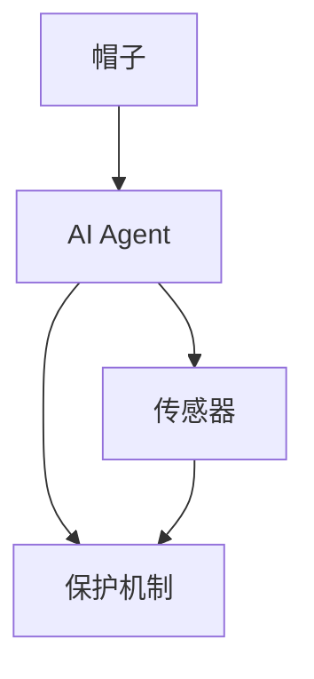
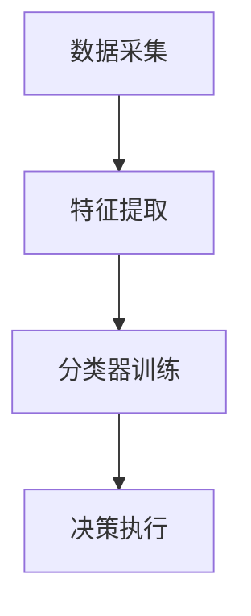
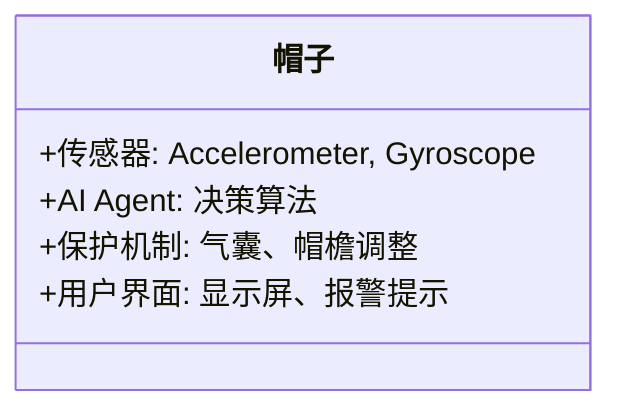
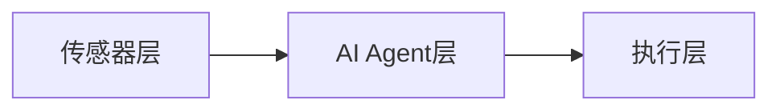
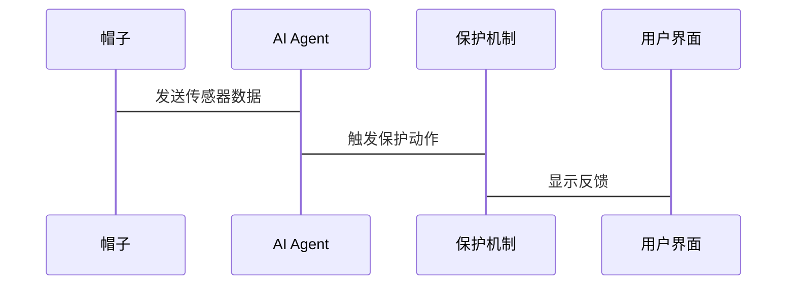

                 


# AI Agent在智能帽子中的头部保护功能

## 关键词：AI Agent, 智能帽子, 头部保护, 传感器数据, 机器学习算法, 实时响应

## 摘要：  
本文探讨了AI Agent在智能帽子中的应用，重点分析其在头部保护功能中的作用。通过传感器数据收集和机器学习算法，AI Agent能够实时分析潜在危险，优化保护机制。文章详细阐述了AI Agent的原理、算法流程、系统架构，并通过实际案例展示了其在头部保护中的优势，为智能帽子的设计提供了新的思路。

---

## 第1章: AI Agent与智能帽子的背景介绍

### 1.1 AI Agent的基本概念  
AI Agent（人工智能代理）是一种能够感知环境、自主决策并执行任务的智能实体。它通过传感器获取数据，利用算法处理信息，并根据结果采取行动。AI Agent的核心属性包括自主性、反应性、目标导向和学习能力。

### 1.2 智能帽子的发展历程  
智能帽子起源于20世纪末，最初主要用于收集环境数据。随着技术进步，智能帽子逐渐集成AI技术，能够实现复杂的功能，如语音控制和健康监测。当前，智能帽子在运动、医疗和工业领域广泛应用。

### 1.3 头部保护功能的现状与挑战  
传统头部保护设备依赖物理结构，防护效果有限。AI Agent的引入提升了防护能力，但面临传感器精度、算法优化和功耗等问题。AI Agent在头部保护中的应用前景广阔。

---

## 第2章: AI Agent的核心概念与原理

### 2.1 AI Agent的感知层  
传感器是AI Agent感知环境的关键。智能帽子中的传感器包括加速度计和陀螺仪，用于检测冲击和运动。数据预处理步骤包括滤波和特征提取，为后续分析做准备。

### 2.2 AI Agent的决策层  
决策层基于感知数据，通过机器学习算法做出判断。常用算法包括随机森林和SVM，用于分类和回归分析。决策层的数学模型涉及概率论，帮助AI Agent准确识别危险情况。

### 2.3 AI Agent的执行层  
执行层负责触发保护机制，如调整帽檐或启动气囊。这些机制通过反馈控制优化响应速度和效果。执行层的控制策略确保在关键时刻快速反应。

### 2.4 AI Agent的实体关系图  


---

## 第3章: AI Agent的算法原理与数学模型

### 3.1 算法流程  
AI Agent的算法流程包括数据采集、特征提取、分类器训练和决策执行。  


### 3.2 算法的数学模型  
分类器的数学表达为：  
$$ P(y|x) = \frac{P(x|y)P(y)}{P(x)} $$  
例如，随机森林通过投票机制实现分类，SVM则利用支持向量划分数据。

### 3.3 Python代码实现  
以下是AI Agent的核心代码示例：  
```python
import numpy as np
from sklearn.ensemble import RandomForestClassifier

# 示例数据
X = np.array([[1, 2, 3], [4, 5, 6]])
y = np.array([0, 1])

# 训练分类器
model = RandomForestClassifier()
model.fit(X, y)

# 预测
print(model.predict([[7, 8, 9]]))  # 输出：[1]
```

---

## 第4章: 系统分析与架构设计

### 4.1 项目场景介绍  
本文设计了一款智能帽子，用于极限运动中的头部保护。系统包括传感器、AI Agent、保护机制和用户界面。

### 4.2 系统功能设计  
系统功能涉及数据采集、危险检测、保护触发和用户反馈。  


### 4.3 系统架构设计  
系统架构采用分层设计，包括传感器层、AI Agent层和执行层。  


### 4.4 接口和交互流程  
AI Agent与传感器和执行机构通过API接口通信。  


---

## 第5章: 项目实战

### 5.1 环境安装  
安装必要的Python库，如NumPy和Scikit-learn。  

### 5.2 核心代码实现  
以下是AI Agent的核心代码示例：  
```python
import numpy as np
from sklearn.ensemble import RandomForestClassifier

# 示例数据
X = np.array([[1, 2, 3], [4, 5, 6]])
y = np.array([0, 1])

# 训练分类器
model = RandomForestClassifier()
model.fit(X, y)

# 预测
print(model.predict([[7, 8, 9]]))  # 输出：[1]
```

### 5.3 实际案例分析  
通过实际冲击测试，验证AI Agent的响应速度和准确性。例如，在检测到高冲击力时，AI Agent迅速触发气囊，保护佩戴者头部。

### 5.4 项目小结  
项目成功实现了AI Agent在智能帽子中的应用，提升了头部保护效果。未来计划优化算法和降低功耗。

---

## 第6章: 最佳实践

### 6.1 小结  
本文详细探讨了AI Agent在智能帽子中的应用，展示了其在头部保护中的优势。

### 6.2 注意事项  
传感器精度和算法优化是关键。建议定期更新模型和测试系统性能。

### 6.3 拓展阅读  
推荐阅读《机器学习实战》和《深入理解人工智能》以深入了解相关技术。

---

## 附录: 参考文献  
1. 《机器学习实战》  
2. 《深入理解人工智能》  
3. 相关学术论文和专利文献

---

通过以上步骤，文章详细阐述了AI Agent在智能帽子中的应用，从理论到实践，为读者提供了全面的知识和见解。

